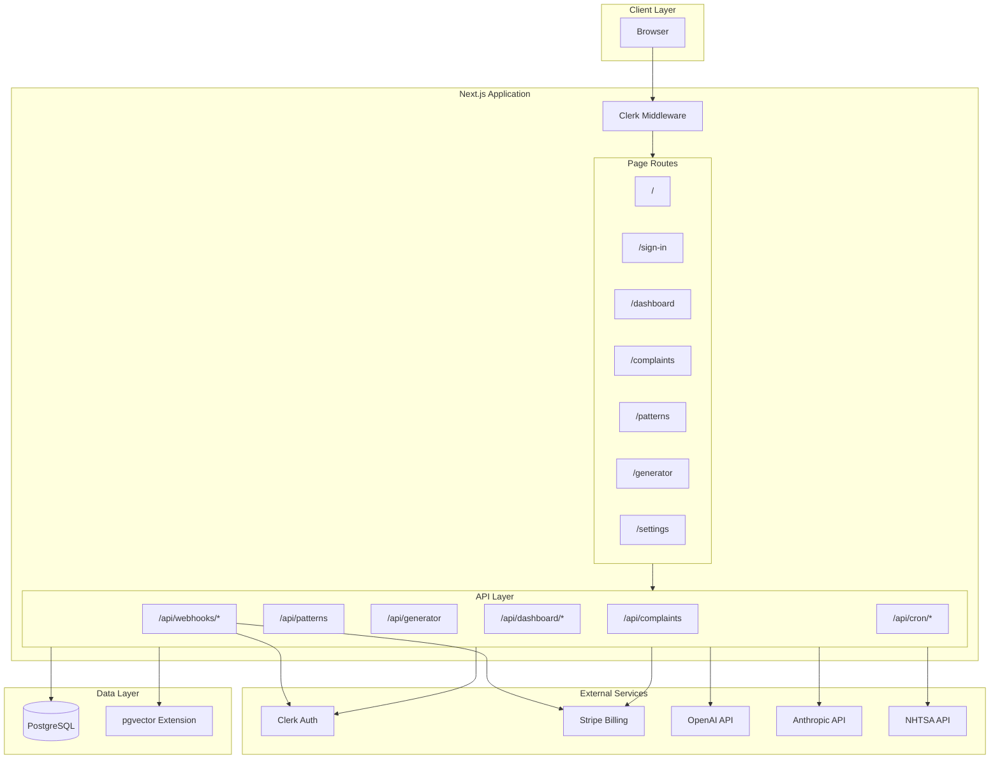
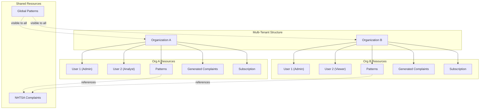
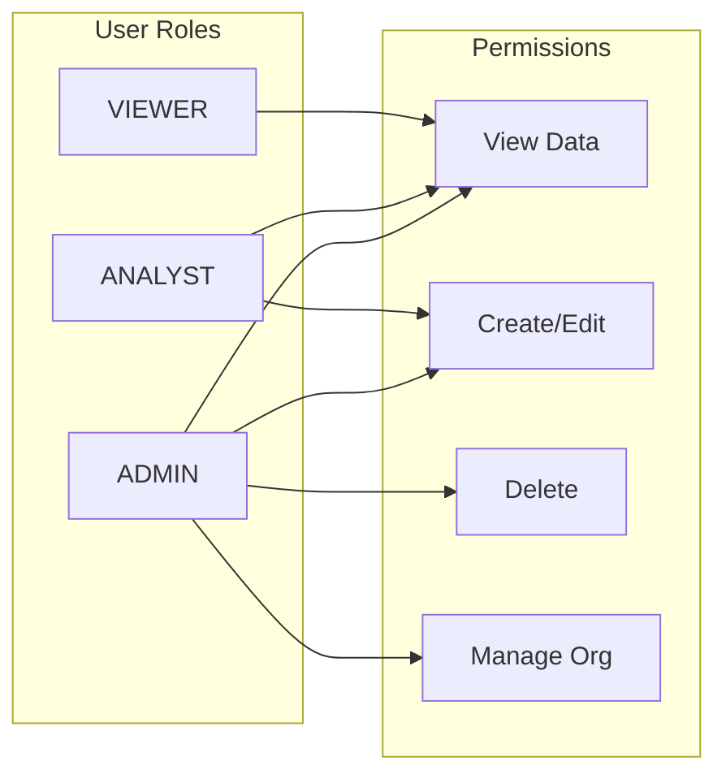
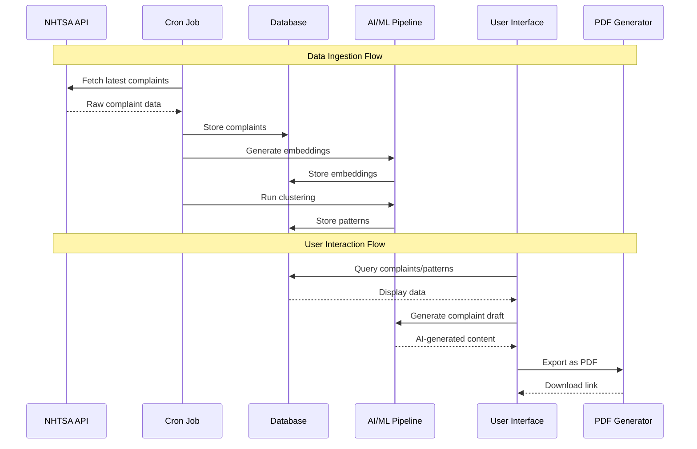
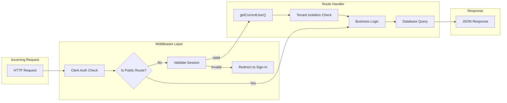

# CaseRadar System Overview

## Purpose

CaseRadar is a multi-tenant SaaS platform designed for law firms to:
1. **Monitor NHTSA vehicle complaints** - Import and analyze complaint data from the National Highway Traffic Safety Administration
2. **Detect patterns** - Use AI/ML clustering to identify patterns in vehicle defect complaints
3. **Generate legal complaints** - AI-assisted drafting of class action lawsuit documents
4. **Track severity trends** - Prioritize high-impact patterns with injury/death statistics

## Tech Stack Summary

| Layer | Technology | Purpose |
|-------|------------|---------|
| **Frontend** | Next.js 16.1.1, React 19, TypeScript | App router, server components, client components |
| **Styling** | Tailwind CSS 4, Radix UI, Lucide Icons | Design system with accessible primitives |
| **Authentication** | Clerk | Multi-tenant auth with organizations |
| **Database** | PostgreSQL + Prisma ORM | Data persistence with vector extensions |
| **AI/ML** | OpenAI Embeddings, Anthropic Claude | Semantic search & complaint generation |
| **Billing** | Stripe | Subscription management |
| **PDF Export** | jsPDF | Legal document generation |
| **Monitoring** | Sentry | Error tracking |

## High-Level System Architecture



## Multi-Tenant Architecture



## Role-Based Access Control



## Data Flow Overview



## Request Flow



## Key Design Decisions

### 1. Multi-Tenant Isolation
- All organization-specific data includes `organizationId` foreign key
- API routes verify `user.organizationId` matches resource ownership
- Global patterns (NHTSA-derived) have `organizationId = null`

### 2. Vector Search Architecture
- Complaint descriptions are embedded using OpenAI `text-embedding-3-small`
- 1536-dimensional vectors stored in PostgreSQL with pgvector extension
- Enables semantic search for similar complaints

### 3. Demo Data Pattern
- When database is empty, API routes return demo data
- Demo IDs use `demo-` prefix for identification
- Allows product demonstration without real data

### 4. Authentication Strategy
- Clerk handles all auth flows (sign-in, sign-up, organizations)
- User/Org data synced to local DB via webhooks
- Middleware protects routes based on authentication state

### 5. Subscription Tiers

| Plan | Complaint Searches | Pattern Alerts | Generated Complaints | Team Members |
|------|-------------------|----------------|---------------------|--------------|
| FREE | 50/month | 3 | 1/month | 1 |
| BASIC | 500/month | 10 | 10/month | 3 |
| PRO | 5000/month | Unlimited | 50/month | 10 |
| ENTERPRISE | Unlimited | Unlimited | Unlimited | Unlimited |

## Environment Configuration

```
# Database
DATABASE_URL          # PostgreSQL connection string
DIRECT_URL            # Direct database connection (bypasses pooler)

# Authentication (Clerk)
NEXT_PUBLIC_CLERK_PUBLISHABLE_KEY
CLERK_SECRET_KEY
CLERK_WEBHOOK_SECRET

# AI Services
OPENAI_API_KEY        # For embeddings
ANTHROPIC_API_KEY     # For complaint generation

# Billing (Stripe)
STRIPE_SECRET_KEY
STRIPE_WEBHOOK_SECRET
NEXT_PUBLIC_STRIPE_PUBLISHABLE_KEY

# Monitoring
SENTRY_DSN
```

## Directory Structure Summary

```
caseradar/
├── src/
│   ├── app/                    # Next.js App Router
│   │   ├── (dashboard)/        # Protected dashboard routes
│   │   ├── api/                # API route handlers
│   │   ├── sign-in/            # Clerk sign-in
│   │   └── sign-up/            # Clerk sign-up
│   ├── components/             # React components
│   │   ├── ui/                 # Shadcn/ui primitives
│   │   ├── complaints/         # Complaint-specific
│   │   ├── patterns/           # Pattern-specific
│   │   ├── generator/          # Generator-specific
│   │   └── dashboard/          # Dashboard-specific
│   └── lib/                    # Business logic
│       ├── auth/               # Auth utilities
│       ├── billing/            # Stripe integration
│       ├── nhtsa/              # NHTSA API client
│       ├── analysis/           # ML/clustering
│       ├── embeddings/         # OpenAI embeddings
│       ├── complaint/          # Complaint generation
│       ├── security/           # Security utilities
│       └── repositories/       # Data access layer
├── prisma/
│   └── schema.prisma           # Database schema
└── docs/
    └── architecture/           # This documentation
```

---

**Next Documents:**
- [01-database-schema.md](./01-database-schema.md) - Complete database ERD
- [02-api-routes.md](./02-api-routes.md) - API endpoint documentation
