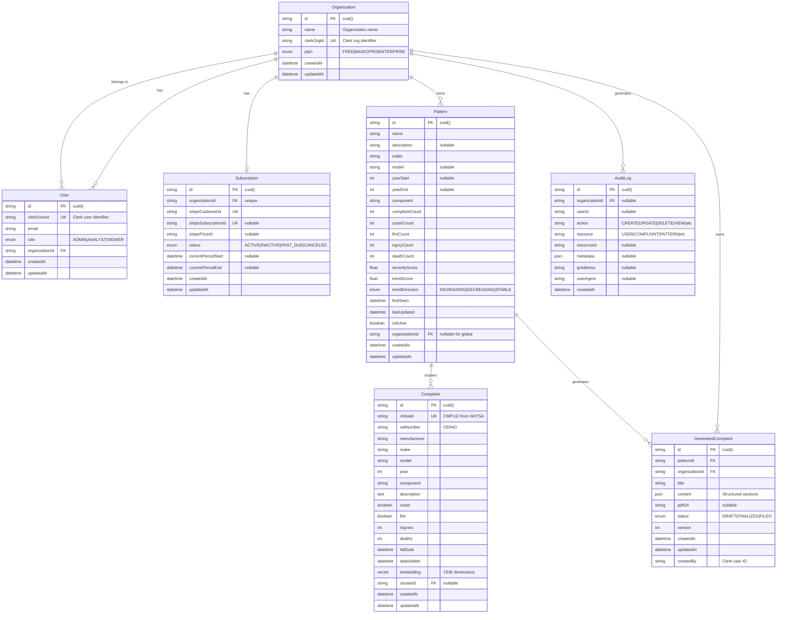
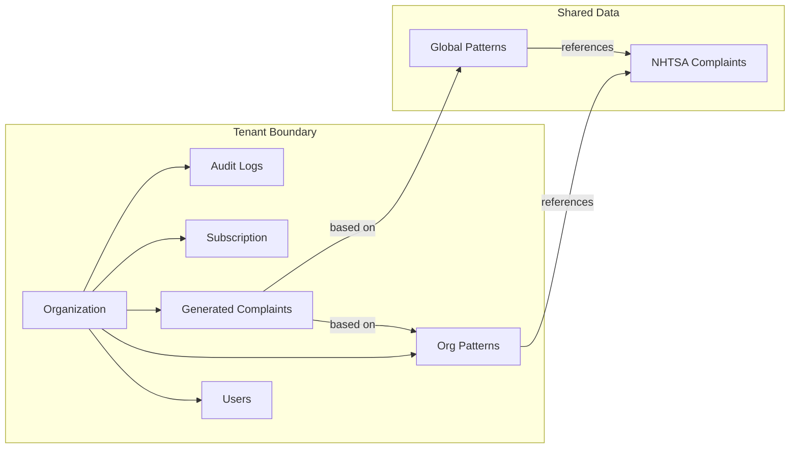
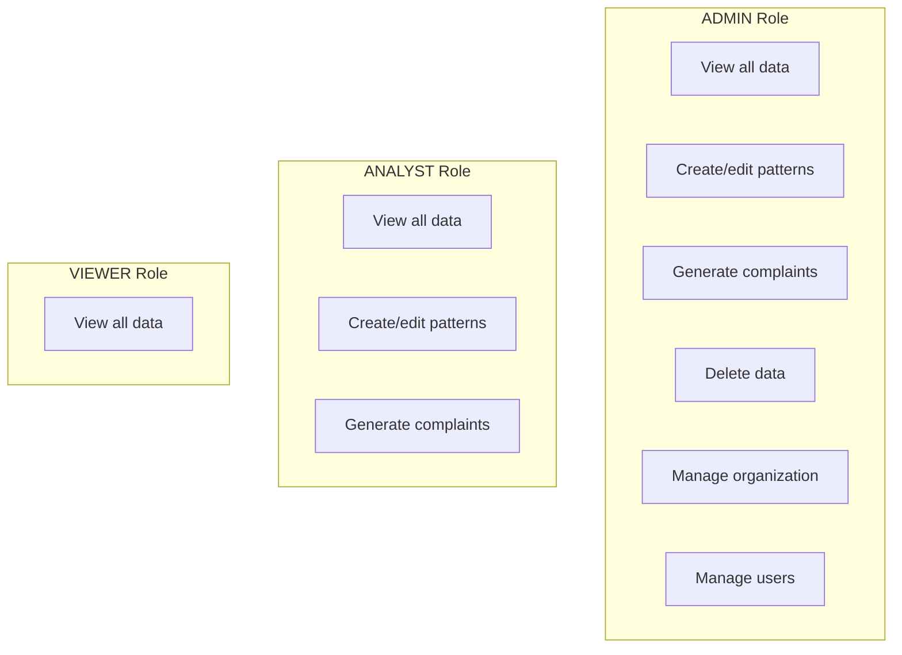
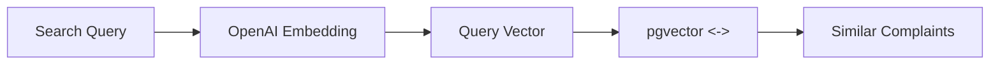
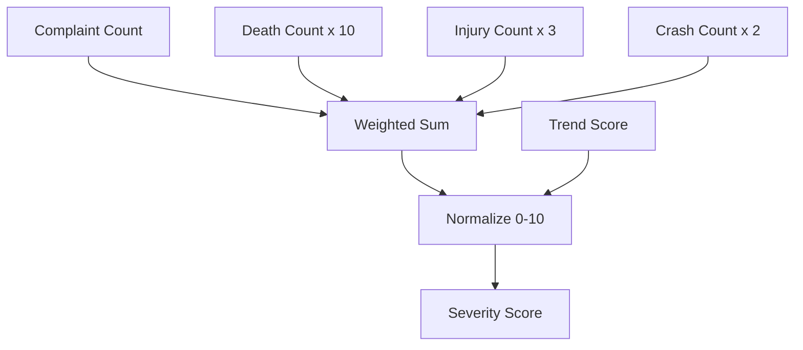
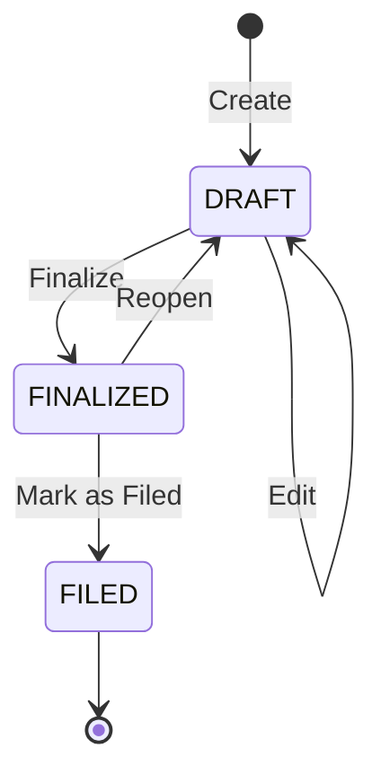
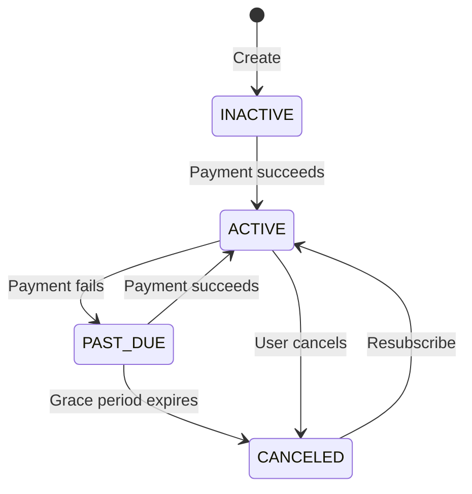

# CaseRadar Database Schema

## Overview

CaseRadar uses PostgreSQL with Prisma ORM and the pgvector extension for semantic search capabilities.

## Entity-Relationship Diagram

### Core Domain Model



### Relationship Details



---

## Table Specifications

### Organization

**Purpose:** Root entity for multi-tenancy. Each law firm is an organization.

| Column | Type | Constraints | Description |
|--------|------|-------------|-------------|
| `id` | String | PK, cuid() | Primary identifier |
| `name` | String | NOT NULL | Display name |
| `clerkOrgId` | String | UNIQUE, NOT NULL | Clerk organization ID |
| `plan` | Enum | DEFAULT FREE | Subscription tier |
| `createdAt` | DateTime | DEFAULT now() | Creation timestamp |
| `updatedAt` | DateTime | @updatedAt | Last modification |

**Indexes:**
- `clerkOrgId` - Fast lookup from Clerk webhooks

**Relations:**
- Has many `User`
- Has many `Pattern` (org-specific patterns)
- Has many `GeneratedComplaint`
- Has one `Subscription`
- Has many `AuditLog`

---

### User

**Purpose:** Individual users within an organization with role-based permissions.

| Column | Type | Constraints | Description |
|--------|------|-------------|-------------|
| `id` | String | PK, cuid() | Primary identifier |
| `clerkUserId` | String | UNIQUE, NOT NULL | Clerk user ID |
| `email` | String | NOT NULL | User's email address |
| `role` | Enum | DEFAULT VIEWER | Permission level |
| `organizationId` | String | FK, NOT NULL | Parent organization |
| `createdAt` | DateTime | DEFAULT now() | Creation timestamp |
| `updatedAt` | DateTime | @updatedAt | Last modification |

**Indexes:**
- `organizationId` - List users per organization
- `clerkUserId` - Lookup from auth middleware

**Relations:**
- Belongs to `Organization` (CASCADE on delete)

**Role Permissions:**


---

### Complaint

**Purpose:** Stores NHTSA vehicle complaint data with vector embeddings for semantic search.

| Column | Type | Constraints | Description |
|--------|------|-------------|-------------|
| `id` | String | PK, cuid() | Primary identifier |
| `nhtsaId` | String | UNIQUE, NOT NULL | CMPLID from NHTSA |
| `odiNumber` | String | NOT NULL | ODI number reference |
| `manufacturer` | String | NOT NULL | Vehicle manufacturer |
| `make` | String | NOT NULL | Vehicle make (e.g., FORD) |
| `model` | String | NOT NULL | Vehicle model (e.g., F-150) |
| `year` | Int | NOT NULL | Model year |
| `component` | String | NOT NULL | Affected component |
| `description` | Text | NOT NULL | Full complaint text |
| `crash` | Boolean | DEFAULT false | Crash reported |
| `fire` | Boolean | DEFAULT false | Fire reported |
| `injuries` | Int | DEFAULT 0 | Number of injuries |
| `deaths` | Int | DEFAULT 0 | Number of deaths |
| `failDate` | DateTime | nullable | Date of failure |
| `dateAdded` | DateTime | NOT NULL | When added to NHTSA |
| `embedding` | Vector(1536) | nullable | OpenAI embedding |
| `clusterId` | String | FK, nullable | Assigned pattern |
| `createdAt` | DateTime | DEFAULT now() | Creation timestamp |
| `updatedAt` | DateTime | @updatedAt | Last modification |

**Indexes:**
- `(make, model, year)` - Filter by vehicle
- `component` - Filter by affected part
- `dateAdded` - Sort by recency
- `clusterId` - Group by pattern

**Vector Search:**


---

### Pattern

**Purpose:** Detected patterns/clusters of related complaints, scored by severity.

| Column | Type | Constraints | Description |
|--------|------|-------------|-------------|
| `id` | String | PK, cuid() | Primary identifier |
| `name` | String | NOT NULL | Auto-generated name |
| `description` | String | nullable | Pattern explanation |
| `make` | String | NOT NULL | Target make |
| `model` | String | nullable | Target model |
| `yearStart` | Int | nullable | Year range start |
| `yearEnd` | Int | nullable | Year range end |
| `component` | String | NOT NULL | Affected component |
| `complaintCount` | Int | DEFAULT 0 | Total complaints |
| `crashCount` | Int | DEFAULT 0 | Crashes reported |
| `fireCount` | Int | DEFAULT 0 | Fires reported |
| `injuryCount` | Int | DEFAULT 0 | Total injuries |
| `deathCount` | Int | DEFAULT 0 | Total deaths |
| `severityScore` | Float | DEFAULT 0 | Computed severity |
| `trendScore` | Float | DEFAULT 0 | Rate of change |
| `trendDirection` | Enum | DEFAULT STABLE | INCREASING/DECREASING/STABLE |
| `firstSeen` | DateTime | NOT NULL | First detection |
| `lastUpdated` | DateTime | NOT NULL | Last update |
| `isActive` | Boolean | DEFAULT true | Currently active |
| `organizationId` | String | FK, nullable | null = global pattern |
| `createdAt` | DateTime | DEFAULT now() | Creation timestamp |
| `updatedAt` | DateTime | @updatedAt | Last modification |

**Indexes:**
- `severityScore` - Sort by severity
- `trendScore` - Sort by trend
- `(make, model)` - Filter by vehicle
- `component` - Filter by component
- `organizationId` - Filter by tenant

**Severity Scoring:**


---

### GeneratedComplaint

**Purpose:** AI-generated legal complaint drafts based on detected patterns.

| Column | Type | Constraints | Description |
|--------|------|-------------|-------------|
| `id` | String | PK, cuid() | Primary identifier |
| `patternId` | String | FK, NOT NULL | Source pattern |
| `organizationId` | String | FK, NOT NULL | Owning organization |
| `title` | String | NOT NULL | Complaint title |
| `content` | JSON | NOT NULL | Structured content |
| `pdfUrl` | String | nullable | Generated PDF URL |
| `status` | Enum | DEFAULT DRAFT | Workflow status |
| `version` | Int | DEFAULT 1 | Version number |
| `createdAt` | DateTime | DEFAULT now() | Creation timestamp |
| `updatedAt` | DateTime | @updatedAt | Last modification |
| `createdBy` | String | NOT NULL | Clerk user ID |

**Indexes:**
- `organizationId` - List by organization
- `patternId` - List by pattern
- `status` - Filter by status
- `createdAt` - Sort by date

**Content JSON Structure:**
```json
{
  "plaintiff": {
    "name": "string",
    "address": "string",
    "vehicleInfo": {
      "make": "string",
      "model": "string",
      "year": "number",
      "vin": "string"
    }
  },
  "sections": [
    {
      "title": "Nature of Action",
      "content": "string"
    },
    {
      "title": "Parties",
      "content": "string"
    },
    {
      "title": "Factual Allegations",
      "content": "string"
    },
    {
      "title": "Causes of Action",
      "content": "string"
    }
  ],
  "exhibits": ["string"]
}
```

**Status Workflow:**


---

### Subscription

**Purpose:** Stripe subscription management for billing.

| Column | Type | Constraints | Description |
|--------|------|-------------|-------------|
| `id` | String | PK, cuid() | Primary identifier |
| `organizationId` | String | FK, UNIQUE | Linked organization |
| `stripeCustomerId` | String | UNIQUE | Stripe customer |
| `stripeSubscriptionId` | String | UNIQUE, nullable | Active subscription |
| `stripePriceId` | String | nullable | Price plan ID |
| `status` | Enum | DEFAULT INACTIVE | Subscription status |
| `currentPeriodStart` | DateTime | nullable | Billing period start |
| `currentPeriodEnd` | DateTime | nullable | Billing period end |
| `createdAt` | DateTime | DEFAULT now() | Creation timestamp |
| `updatedAt` | DateTime | @updatedAt | Last modification |

**Status Transitions:**


---

### AuditLog

**Purpose:** Security audit trail for compliance and debugging.

| Column | Type | Constraints | Description |
|--------|------|-------------|-------------|
| `id` | String | PK, cuid() | Primary identifier |
| `organizationId` | String | FK, nullable | Target organization |
| `userId` | String | nullable | Acting user |
| `action` | String | NOT NULL | Action type |
| `resource` | String | NOT NULL | Resource type |
| `resourceId` | String | nullable | Affected resource ID |
| `metadata` | JSON | nullable | Additional context |
| `ipAddress` | String | nullable | Request IP |
| `userAgent` | String | nullable | Browser/client |
| `createdAt` | DateTime | DEFAULT now() | Event timestamp |

**Indexes:**
- `(organizationId, createdAt)` - Org audit timeline
- `userId` - User activity
- `action` - Filter by action type
- `resource` - Filter by resource type

**Action Types:**
| Action | Description |
|--------|-------------|
| `CREATE` | Resource created |
| `UPDATE` | Resource modified |
| `DELETE` | Resource deleted |
| `VIEW` | Resource accessed |
| `EXPORT` | Data exported |
| `LOGIN` | User authenticated |
| `LOGOUT` | User signed out |
| `LOGIN_FAILED` | Failed auth attempt |

**Resource Types:**
| Resource | Description |
|----------|-------------|
| `USER` | User entity |
| `ORGANIZATION` | Organization entity |
| `COMPLAINT` | NHTSA complaint |
| `PATTERN` | Detected pattern |
| `GENERATED_COMPLAINT` | Legal complaint draft |
| `AUTH` | Authentication events |
| `BILLING` | Subscription changes |

---

## Enums

### Plan
```prisma
enum Plan {
  FREE        // Limited features
  BASIC       // Small teams
  PRO         // Medium teams
  ENTERPRISE  // Unlimited
}
```

### Role
```prisma
enum Role {
  ADMIN    // Full access
  ANALYST  // Create/edit
  VIEWER   // Read-only
}
```

### ComplaintStatus
```prisma
enum ComplaintStatus {
  DRAFT      // Being edited
  FINALIZED  // Ready to file
  FILED      // Submitted to court
}
```

### SubscriptionStatus
```prisma
enum SubscriptionStatus {
  ACTIVE    // Paid and active
  INACTIVE  // Not subscribed
  PAST_DUE  // Payment failed
  CANCELED  // Subscription ended
}
```

### TrendDirection
```prisma
enum TrendDirection {
  INCREASING  // Growing pattern
  DECREASING  // Declining pattern
  STABLE      // Steady state
}
```

---

## Database Extensions

### pgvector

Enables vector similarity search for semantic complaint matching:

```sql
CREATE EXTENSION vector;

-- Example: Find similar complaints
SELECT id, description
FROM "Complaint"
WHERE embedding IS NOT NULL
ORDER BY embedding <-> '[0.1, 0.2, ...]'::vector
LIMIT 10;
```

---

## Migration Strategy

Prisma migrations handle schema changes:

```bash
# Generate migration
npx prisma migrate dev --name add_new_field

# Apply to production
npx prisma migrate deploy

# Generate client
npx prisma generate
```

---

**Previous:** [00-overview.md](./00-overview.md) - System Overview
**Next:** [02-api-routes.md](./02-api-routes.md) - API Routes Documentation
