# CaseRadar API Routes Documentation

## Overview

CaseRadar exposes a RESTful API built on Next.js 16 App Router API routes. All routes use TypeScript and follow consistent patterns for authentication, error handling, and response formatting.

## API Architecture

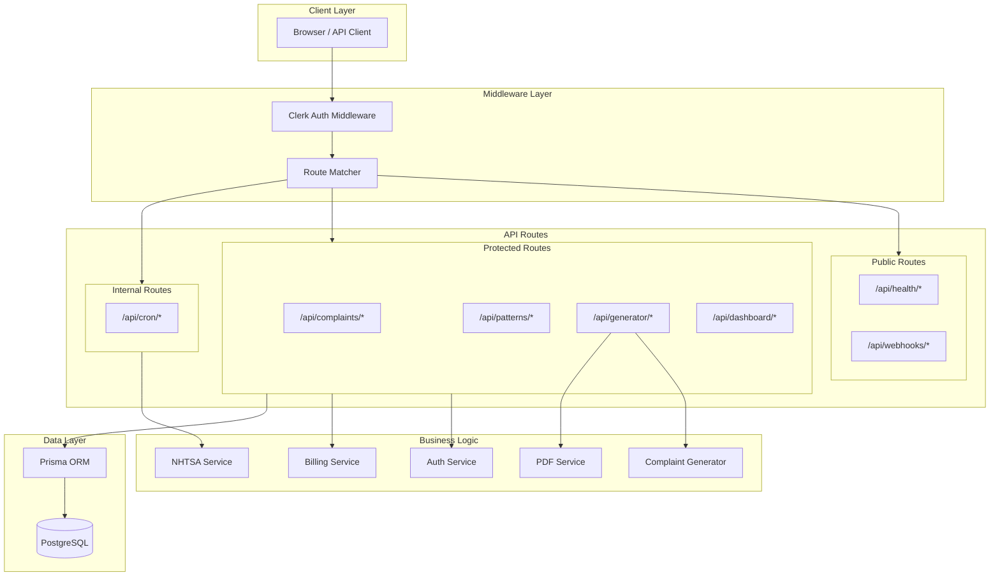
```mermaid
graph TB
    subgraph Client["Client Layer"]
        Browser["Browser / API Client"]
    end

    subgraph Middleware["Middleware Layer"]
        ClerkMW["Clerk Auth Middleware"]
        RouteMatcher["Route Matcher"]
    end

    subgraph APIRoutes["API Routes"]
        subgraph Public["Public Routes"]
            Health["/api/health/*"]
            Webhooks["/api/webhooks/*"]
        end

        subgraph Protected["Protected Routes"]
            Complaints["/api/complaints/*"]
            Patterns["/api/patterns/*"]
            Generator["/api/generator/*"]
            Dashboard["/api/dashboard/*"]
        end

        subgraph Internal["Internal Routes"]
            Cron["/api/cron/*"]
        end
    end

    subgraph Services["Business Logic"]
        AuthService["Auth Service"]
        BillingService["Billing Service"]
        NHTSAService["NHTSA Service"]
        ComplaintGen["Complaint Generator"]
        PDFService["PDF Service"]
    end

    subgraph Data["Data Layer"]
        Prisma["Prisma ORM"]
        PostgreSQL[(PostgreSQL)]
    end

    Browser --> ClerkMW
    ClerkMW --> RouteMatcher
    RouteMatcher --> Public
    RouteMatcher --> Protected
    RouteMatcher --> Internal

    Protected --> AuthService
    Protected --> BillingService
    Protected --> Prisma
    Internal --> NHTSAService
    Generator --> ComplaintGen
    Generator --> PDFService

    Prisma --> PostgreSQL
```

---

## Request Flow

### Authentication Flow

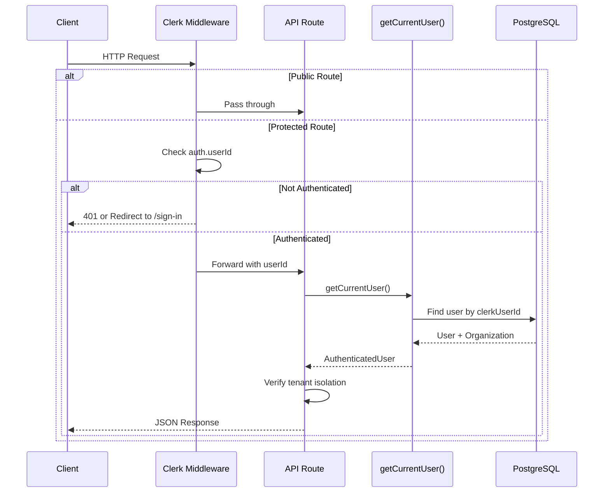
```mermaid
sequenceDiagram
    participant Client
    participant Middleware as Clerk Middleware
    participant Route as API Route
    participant Auth as getCurrentUser()
    participant DB as PostgreSQL

    Client->>Middleware: HTTP Request

    alt Public Route
        Middleware->>Route: Pass through
    else Protected Route
        Middleware->>Middleware: Check auth.userId
        alt Not Authenticated
            Middleware-->>Client: 401 or Redirect to /sign-in
        else Authenticated
            Middleware->>Route: Forward with userId
            Route->>Auth: getCurrentUser()
            Auth->>DB: Find user by clerkUserId
            DB-->>Auth: User + Organization
            Auth-->>Route: AuthenticatedUser
            Route->>Route: Verify tenant isolation
            Route-->>Client: JSON Response
        end
    end
```

### Tenant Isolation Pattern

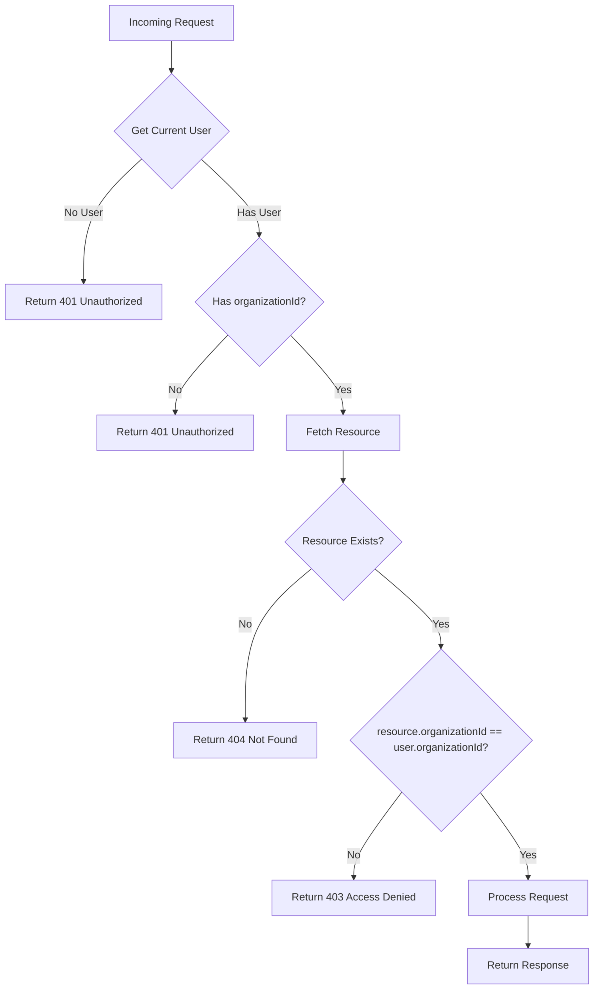
```mermaid
flowchart TD
    A[Incoming Request] --> B{Get Current User}
    B -->|No User| C[Return 401 Unauthorized]
    B -->|Has User| D{Has organizationId?}
    D -->|No| E[Return 401 Unauthorized]
    D -->|Yes| F[Fetch Resource]
    F --> G{Resource Exists?}
    G -->|No| H[Return 404 Not Found]
    G -->|Yes| I{resource.organizationId == user.organizationId?}
    I -->|No| J[Return 403 Access Denied]
    I -->|Yes| K[Process Request]
    K --> L[Return Response]
```

---

## Route Categories

### Public Routes

| Route | Description |
|-------|-------------|
| `GET /api/health` | Application health status |
| `GET /api/health/db` | Database connectivity check |
| `GET /api/health/services` | External services health |
| `POST /api/webhooks/clerk` | Clerk webhook handler |
| `POST /api/webhooks/stripe` | Stripe webhook handler |

### Protected Routes (Require Authentication)

| Route | Description |
|-------|-------------|
| `/api/complaints/*` | NHTSA complaint data |
| `/api/patterns/*` | Detected patterns |
| `/api/generator/*` | Generated legal complaints |
| `/api/dashboard/*` | Dashboard statistics |

### Internal Routes (Cron Jobs)

| Route | Description |
|-------|-------------|
| `GET /api/cron/sync-nhtsa` | NHTSA data sync (6 hours) |
| `GET /api/cron/analyze-patterns` | Pattern analysis (daily) |

---

## Complaints API

### GET /api/complaints

**Purpose:** Search and list NHTSA complaints with filtering, pagination, and optional statistics.

**Authentication:** Required

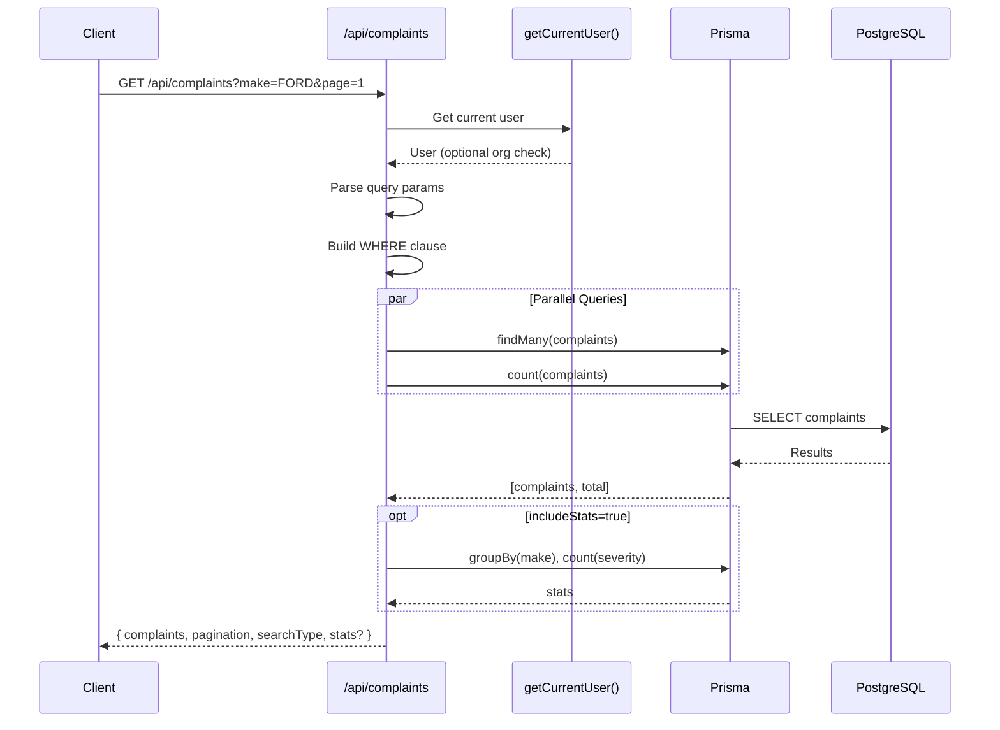
```mermaid
sequenceDiagram
    participant Client
    participant Route as /api/complaints
    participant Auth as getCurrentUser()
    participant Prisma
    participant DB as PostgreSQL

    Client->>Route: GET /api/complaints?make=FORD&page=1
    Route->>Auth: Get current user
    Auth-->>Route: User (optional org check)

    Route->>Route: Parse query params
    Route->>Route: Build WHERE clause

    par Parallel Queries
        Route->>Prisma: findMany(complaints)
        Route->>Prisma: count(complaints)
    end

    Prisma->>DB: SELECT complaints
    DB-->>Prisma: Results
    Prisma-->>Route: [complaints, total]

    opt includeStats=true
        Route->>Prisma: groupBy(make), count(severity)
        Prisma-->>Route: stats
    end

    Route-->>Client: { complaints, pagination, searchType, stats? }
```

**Query Parameters:**

| Parameter | Type | Description |
|-----------|------|-------------|
| `page` | number | Page number (default: 1) |
| `limit` | number | Results per page (default: 20, max: 100) |
| `make` | string | Filter by vehicle make |
| `model` | string | Filter by vehicle model |
| `yearFrom` | number | Minimum year filter |
| `yearTo` | number | Maximum year filter |
| `component` | string | Filter by component |
| `hasCrash` | boolean | Filter crash reports |
| `hasDeath` | boolean | Filter death reports |
| `hasInjury` | boolean | Filter injury reports |
| `hasFire` | boolean | Filter fire reports |
| `search` | string | Text search in description/component |
| `semanticSearch` | string | Semantic vector search |
| `sortBy` | string | Sort field (default: createdAt) |
| `sortOrder` | string | Sort direction (default: desc) |
| `includeStats` | boolean | Include aggregate statistics |

**Response Schema:**

```typescript
interface ComplaintsResponse {
  complaints: {
    id: string;
    nhtsaId: string;
    make: string;
    model: string;
    year: number;
    component: string;
    crash: boolean;
    fire: boolean;
    injuries: number;
    deaths: number;
    createdAt: string;
  }[];
  pagination: {
    page: number;
    limit: number;
    total: number;
    totalPages: number;
  };
  searchType: 'none' | 'keyword' | 'semantic';
  stats?: {
    totalComplaints: number;
    topMakes: { make: string; count: number }[];
    severityBreakdown: {
      withDeaths: number;
      withInjuries: number;
      withCrash: number;
      withFire: number;
    };
  };
}
```

---

### GET /api/complaints/[id]

**Purpose:** Get single complaint details with optional pattern inclusion.

**Authentication:** Required

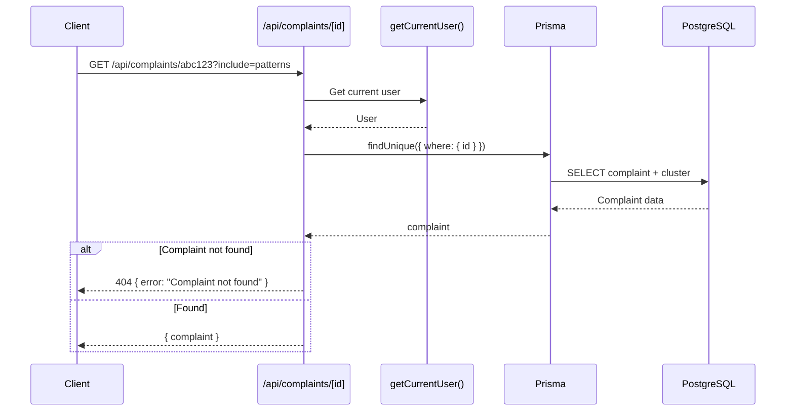
```mermaid
sequenceDiagram
    participant Client
    participant Route as /api/complaints/[id]
    participant Auth as getCurrentUser()
    participant Prisma
    participant DB as PostgreSQL

    Client->>Route: GET /api/complaints/abc123?include=patterns
    Route->>Auth: Get current user
    Auth-->>Route: User

    Route->>Prisma: findUnique({ where: { id } })
    Prisma->>DB: SELECT complaint + cluster
    DB-->>Prisma: Complaint data
    Prisma-->>Route: complaint

    alt Complaint not found
        Route-->>Client: 404 { error: "Complaint not found" }
    else Found
        Route-->>Client: { complaint }
    end
```

**Query Parameters:**

| Parameter | Type | Description |
|-----------|------|-------------|
| `include` | string | Include relations (e.g., "patterns") |

---

## Patterns API

### GET /api/patterns

**Purpose:** List detected patterns for organization with filtering.

**Authentication:** Required (returns demo data if no organizationId)

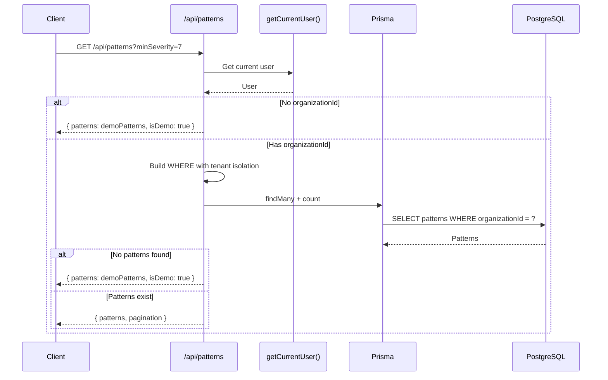
```mermaid
sequenceDiagram
    participant Client
    participant Route as /api/patterns
    participant Auth as getCurrentUser()
    participant Prisma
    participant DB as PostgreSQL

    Client->>Route: GET /api/patterns?minSeverity=7
    Route->>Auth: Get current user
    Auth-->>Route: User

    alt No organizationId
        Route-->>Client: { patterns: demoPatterns, isDemo: true }
    else Has organizationId
        Route->>Route: Build WHERE with tenant isolation
        Route->>Prisma: findMany + count
        Prisma->>DB: SELECT patterns WHERE organizationId = ?
        DB-->>Prisma: Patterns

        alt No patterns found
            Route-->>Client: { patterns: demoPatterns, isDemo: true }
        else Patterns exist
            Route-->>Client: { patterns, pagination }
        end
    end
```

**Query Parameters:**

| Parameter | Type | Description |
|-----------|------|-------------|
| `page` | number | Page number |
| `limit` | number | Results per page |
| `minSeverity` | number | Minimum severity score (0-10) |
| `trend` | string | Filter by trend direction (INCREASING, DECREASING, STABLE) |
| `make` | string | Filter by vehicle make |
| `search` | string | Text search |
| `sortBy` | string | Sort field (default: severityScore) |
| `sortOrder` | string | Sort direction (default: desc) |

---

### POST /api/patterns

**Purpose:** Create new pattern with plan limit checking.

**Authentication:** Required with ANALYST or ADMIN role

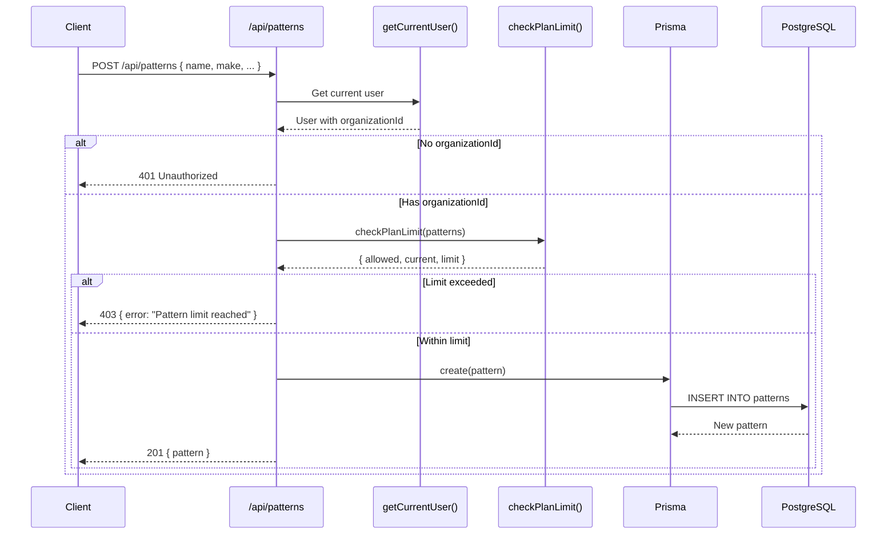
```mermaid
sequenceDiagram
    participant Client
    participant Route as /api/patterns
    participant Auth as getCurrentUser()
    participant Billing as checkPlanLimit()
    participant Prisma
    participant DB as PostgreSQL

    Client->>Route: POST /api/patterns { name, make, ... }
    Route->>Auth: Get current user
    Auth-->>Route: User with organizationId

    alt No organizationId
        Route-->>Client: 401 Unauthorized
    else Has organizationId
        Route->>Billing: checkPlanLimit(patterns)
        Billing-->>Route: { allowed, current, limit }

        alt Limit exceeded
            Route-->>Client: 403 { error: "Pattern limit reached" }
        else Within limit
            Route->>Prisma: create(pattern)
            Prisma->>DB: INSERT INTO patterns
            DB-->>Prisma: New pattern
            Route-->>Client: 201 { pattern }
        end
    end
```

**Request Body:**

```typescript
interface CreatePatternRequest {
  name: string;           // Required
  description?: string;
  make?: string;          // Default: "Unknown"
  model?: string;
  yearStart?: number;
  yearEnd?: number;
  component?: string;     // Default: "Unknown"
  severityScore?: number; // Default: 0
  complaintIds?: string[];
}
```

---

### GET /api/patterns/[id]

**Purpose:** Get pattern details with associated complaints.

**Authentication:** Required (demo patterns accessible without org)

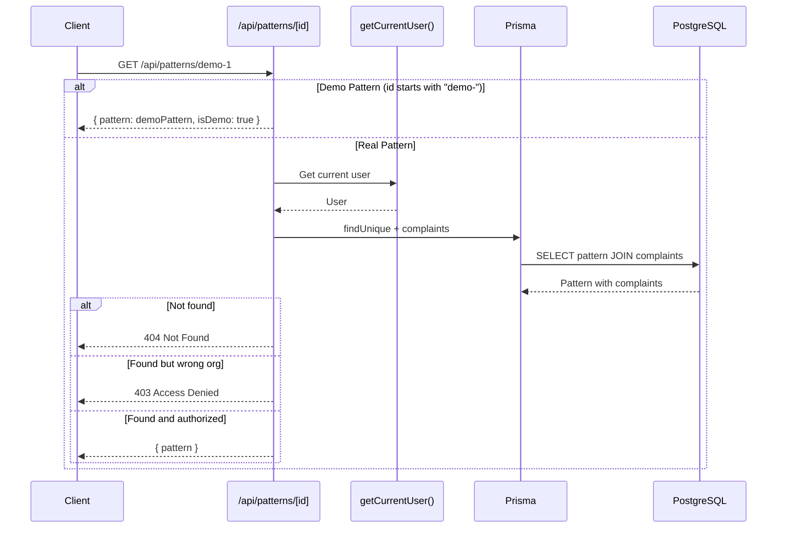
```mermaid
sequenceDiagram
    participant Client
    participant Route as /api/patterns/[id]
    participant Auth as getCurrentUser()
    participant Prisma
    participant DB as PostgreSQL

    Client->>Route: GET /api/patterns/demo-1

    alt Demo Pattern (id starts with "demo-")
        Route-->>Client: { pattern: demoPattern, isDemo: true }
    else Real Pattern
        Route->>Auth: Get current user
        Auth-->>Route: User

        Route->>Prisma: findUnique + complaints
        Prisma->>DB: SELECT pattern JOIN complaints
        DB-->>Prisma: Pattern with complaints

        alt Not found
            Route-->>Client: 404 Not Found
        else Found but wrong org
            Route-->>Client: 403 Access Denied
        else Found and authorized
            Route-->>Client: { pattern }
        end
    end
```

---

### PATCH /api/patterns/[id]

**Purpose:** Update pattern details.

**Authentication:** Required with ANALYST or ADMIN role

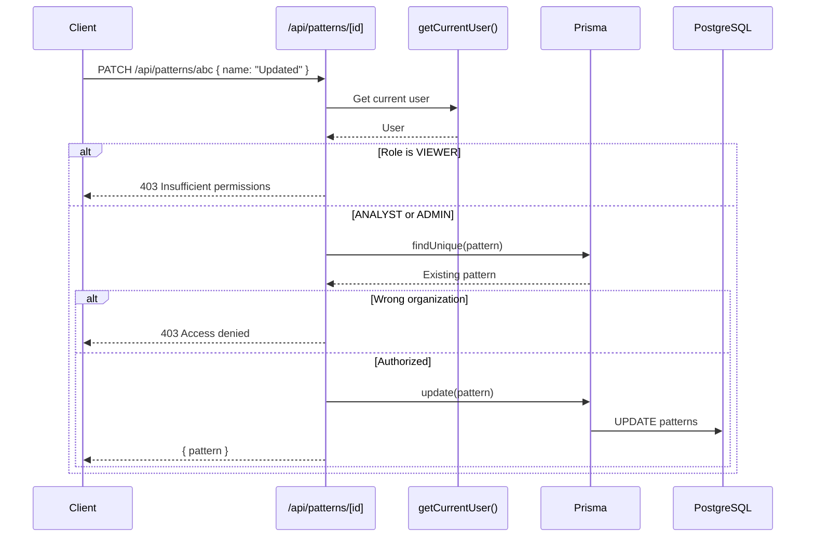
```mermaid
sequenceDiagram
    participant Client
    participant Route as /api/patterns/[id]
    participant Auth as getCurrentUser()
    participant Prisma
    participant DB as PostgreSQL

    Client->>Route: PATCH /api/patterns/abc { name: "Updated" }
    Route->>Auth: Get current user
    Auth-->>Route: User

    alt Role is VIEWER
        Route-->>Client: 403 Insufficient permissions
    else ANALYST or ADMIN
        Route->>Prisma: findUnique(pattern)
        Prisma-->>Route: Existing pattern

        alt Wrong organization
            Route-->>Client: 403 Access denied
        else Authorized
            Route->>Prisma: update(pattern)
            Prisma->>DB: UPDATE patterns
            Route-->>Client: { pattern }
        end
    end
```

---

### DELETE /api/patterns/[id]

**Purpose:** Delete pattern (ADMIN only).

**Authentication:** Required with ADMIN role

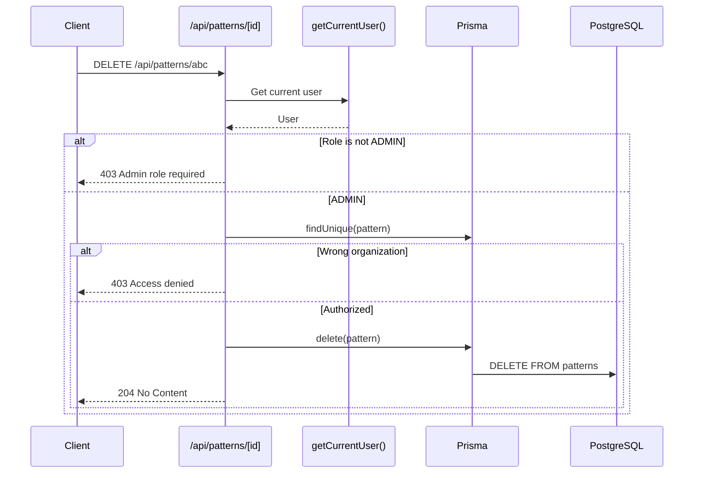
```mermaid
sequenceDiagram
    participant Client
    participant Route as /api/patterns/[id]
    participant Auth as getCurrentUser()
    participant Prisma
    participant DB as PostgreSQL

    Client->>Route: DELETE /api/patterns/abc
    Route->>Auth: Get current user
    Auth-->>Route: User

    alt Role is not ADMIN
        Route-->>Client: 403 Admin role required
    else ADMIN
        Route->>Prisma: findUnique(pattern)

        alt Wrong organization
            Route-->>Client: 403 Access denied
        else Authorized
            Route->>Prisma: delete(pattern)
            Prisma->>DB: DELETE FROM patterns
            Route-->>Client: 204 No Content
        end
    end
```

---

## Generator API

### POST /api/generator

**Purpose:** Generate AI-powered legal complaint from pattern.

**Authentication:** Required with feature and limit checks

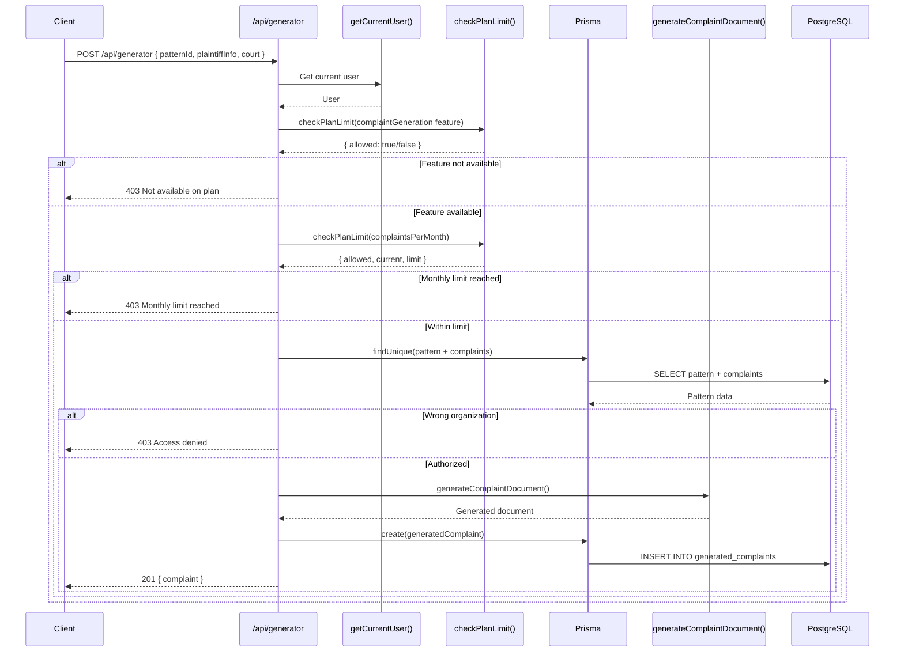
```mermaid
sequenceDiagram
    participant Client
    participant Route as /api/generator
    participant Auth as getCurrentUser()
    participant Billing as checkPlanLimit()
    participant Prisma
    participant AI as generateComplaintDocument()
    participant DB as PostgreSQL

    Client->>Route: POST /api/generator { patternId, plaintiffInfo, court }
    Route->>Auth: Get current user
    Auth-->>Route: User

    Route->>Billing: checkPlanLimit(complaintGeneration feature)
    Billing-->>Route: { allowed: true/false }

    alt Feature not available
        Route-->>Client: 403 Not available on plan
    else Feature available
        Route->>Billing: checkPlanLimit(complaintsPerMonth)
        Billing-->>Route: { allowed, current, limit }

        alt Monthly limit reached
            Route-->>Client: 403 Monthly limit reached
        else Within limit
            Route->>Prisma: findUnique(pattern + complaints)
            Prisma->>DB: SELECT pattern + complaints
            DB-->>Prisma: Pattern data

            alt Wrong organization
                Route-->>Client: 403 Access denied
            else Authorized
                Route->>AI: generateComplaintDocument()
                AI-->>Route: Generated document

                Route->>Prisma: create(generatedComplaint)
                Prisma->>DB: INSERT INTO generated_complaints
                Route-->>Client: 201 { complaint }
            end
        end
    end
```

**Request Body:**

```typescript
interface GenerateComplaintRequest {
  patternId: string;      // Required
  plaintiffInfo?: {
    name: string;
    address: string;
    vehicleInfo: {
      make: string;
      model: string;
      year: number;
      vin: string;
    };
  };
  court?: string;
  defendant?: string;     // Default: "{make} Motor Corporation"
}
```

---

### GET /api/generator

**Purpose:** List generated complaints for organization.

**Authentication:** Required

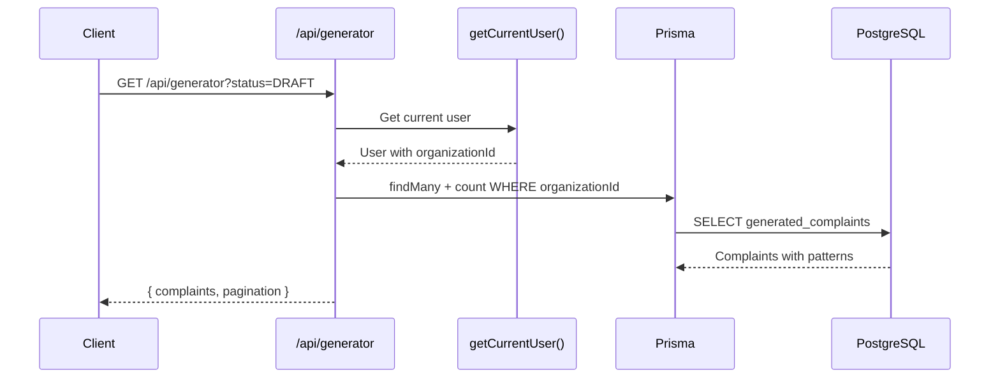
```mermaid
sequenceDiagram
    participant Client
    participant Route as /api/generator
    participant Auth as getCurrentUser()
    participant Prisma
    participant DB as PostgreSQL

    Client->>Route: GET /api/generator?status=DRAFT
    Route->>Auth: Get current user
    Auth-->>Route: User with organizationId

    Route->>Prisma: findMany + count WHERE organizationId
    Prisma->>DB: SELECT generated_complaints
    DB-->>Prisma: Complaints with patterns

    Route-->>Client: { complaints, pagination }
```

**Query Parameters:**

| Parameter | Type | Description |
|-----------|------|-------------|
| `page` | number | Page number |
| `limit` | number | Results per page |
| `status` | string | Filter by status (DRAFT, FINALIZED, FILED) |

---

### GET /api/generator/[id]

**Purpose:** Get generated complaint details.

**Authentication:** Required with tenant isolation

---

### DELETE /api/generator/[id]

**Purpose:** Delete generated complaint (cannot delete FINALIZED).

**Authentication:** Required with tenant isolation

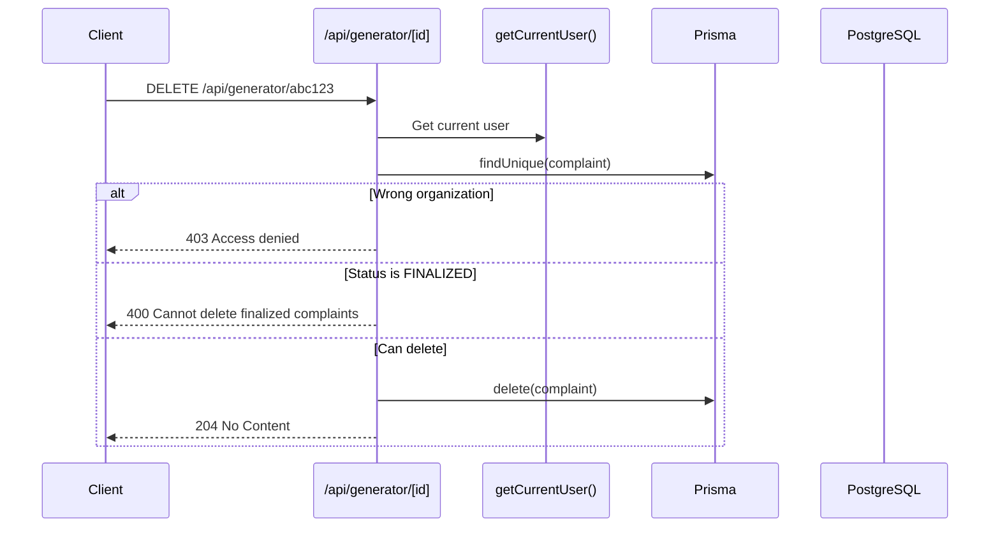
```mermaid
sequenceDiagram
    participant Client
    participant Route as /api/generator/[id]
    participant Auth as getCurrentUser()
    participant Prisma
    participant DB as PostgreSQL

    Client->>Route: DELETE /api/generator/abc123
    Route->>Auth: Get current user
    Route->>Prisma: findUnique(complaint)

    alt Wrong organization
        Route-->>Client: 403 Access denied
    else Status is FINALIZED
        Route-->>Client: 400 Cannot delete finalized complaints
    else Can delete
        Route->>Prisma: delete(complaint)
        Route-->>Client: 204 No Content
    end
```

---

### GET /api/generator/[id]/pdf

**Purpose:** Download generated complaint as PDF.

**Authentication:** Required with tenant isolation

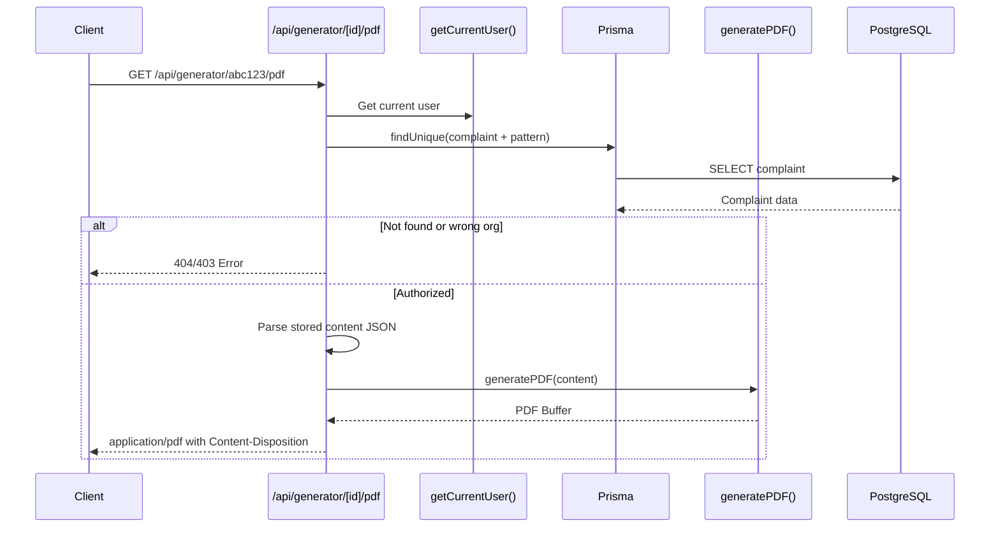
```mermaid
sequenceDiagram
    participant Client
    participant Route as /api/generator/[id]/pdf
    participant Auth as getCurrentUser()
    participant Prisma
    participant PDF as generatePDF()
    participant DB as PostgreSQL

    Client->>Route: GET /api/generator/abc123/pdf
    Route->>Auth: Get current user

    Route->>Prisma: findUnique(complaint + pattern)
    Prisma->>DB: SELECT complaint
    DB-->>Prisma: Complaint data

    alt Not found or wrong org
        Route-->>Client: 404/403 Error
    else Authorized
        Route->>Route: Parse stored content JSON
        Route->>PDF: generatePDF(content)
        PDF-->>Route: PDF Buffer

        Route-->>Client: application/pdf with Content-Disposition
    end
```

**Response Headers:**

```
Content-Type: application/pdf
Content-Disposition: attachment; filename="Complaint_Title.pdf"
Content-Length: <size>
```

---

## Dashboard API

### GET /api/dashboard/stats

**Purpose:** Get aggregated dashboard statistics.

**Authentication:** Required

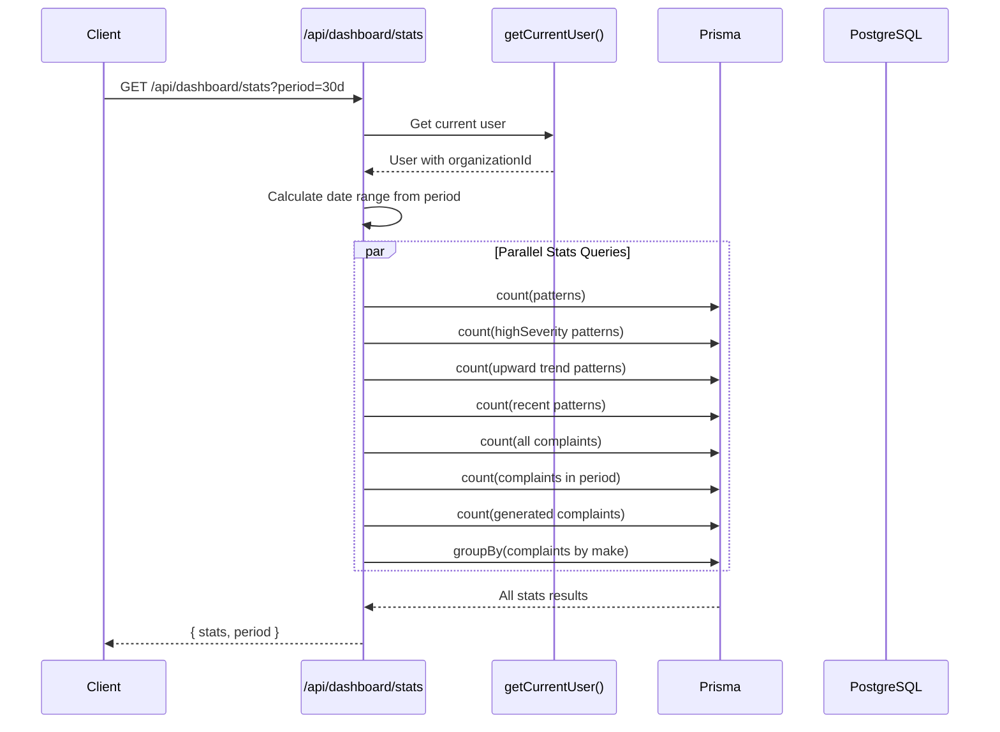
```mermaid
sequenceDiagram
    participant Client
    participant Route as /api/dashboard/stats
    participant Auth as getCurrentUser()
    participant Prisma
    participant DB as PostgreSQL

    Client->>Route: GET /api/dashboard/stats?period=30d
    Route->>Auth: Get current user
    Auth-->>Route: User with organizationId

    Route->>Route: Calculate date range from period

    par Parallel Stats Queries
        Route->>Prisma: count(patterns)
        Route->>Prisma: count(highSeverity patterns)
        Route->>Prisma: count(upward trend patterns)
        Route->>Prisma: count(recent patterns)
        Route->>Prisma: count(all complaints)
        Route->>Prisma: count(complaints in period)
        Route->>Prisma: count(generated complaints)
        Route->>Prisma: groupBy(complaints by make)
    end

    Prisma-->>Route: All stats results

    Route-->>Client: { stats, period }
```

**Query Parameters:**

| Parameter | Type | Description |
|-----------|------|-------------|
| `period` | string | Time period: 7d, 30d, 90d (default: 30d) |

**Response Schema:**

```typescript
interface DashboardStatsResponse {
  stats: {
    patterns: {
      total: number;
      highSeverity: number;    // >= 7
      upwardTrend: number;
      recentlyCreated: number;
    };
    complaints: {
      total: number;
      inPeriod: number;
      generated: number;
    };
    topManufacturers: {
      make: string;
      count: number;
    }[];
  };
  period: string;
}
```

---

### GET /api/dashboard/activity

**Purpose:** Get recent activity feed.

**Authentication:** Required

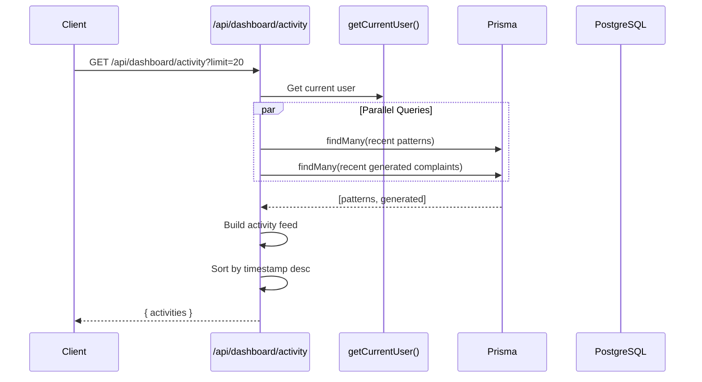
```mermaid
sequenceDiagram
    participant Client
    participant Route as /api/dashboard/activity
    participant Auth as getCurrentUser()
    participant Prisma
    participant DB as PostgreSQL

    Client->>Route: GET /api/dashboard/activity?limit=20
    Route->>Auth: Get current user

    par Parallel Queries
        Route->>Prisma: findMany(recent patterns)
        Route->>Prisma: findMany(recent generated complaints)
    end

    Prisma-->>Route: [patterns, generated]

    Route->>Route: Build activity feed
    Route->>Route: Sort by timestamp desc

    Route-->>Client: { activities }
```

**Activity Types:**

| Type | Description |
|------|-------------|
| `pattern_created` | New pattern detected |
| `pattern_updated` | Pattern modified |
| `complaint_generated` | New complaint drafted |
| `complaint_finalized` | Complaint finalized |

---

### GET /api/dashboard/alerts

**Purpose:** Get system alerts and notifications.

**Authentication:** Required

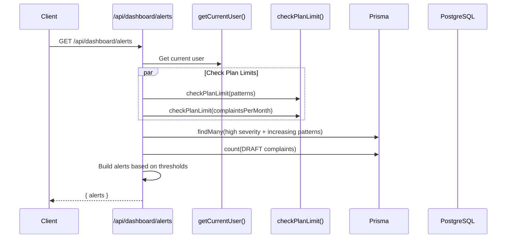
```mermaid
sequenceDiagram
    participant Client
    participant Route as /api/dashboard/alerts
    participant Auth as getCurrentUser()
    participant Billing as checkPlanLimit()
    participant Prisma
    participant DB as PostgreSQL

    Client->>Route: GET /api/dashboard/alerts
    Route->>Auth: Get current user

    par Check Plan Limits
        Route->>Billing: checkPlanLimit(patterns)
        Route->>Billing: checkPlanLimit(complaintsPerMonth)
    end

    Route->>Prisma: findMany(high severity + increasing patterns)
    Route->>Prisma: count(DRAFT complaints)

    Route->>Route: Build alerts based on thresholds

    Route-->>Client: { alerts }
```

**Alert Thresholds:**

| Condition | Alert Type | Threshold |
|-----------|------------|-----------|
| Pattern limit | critical | >= 90% |
| Pattern limit | warning | >= 75% |
| Monthly complaint limit | critical | >= 90% |
| Monthly complaint limit | warning | >= 75% |
| High severity patterns | warning | severity >= 8, trending up |
| Draft complaints | info | > 5 drafts pending |

---

## Health Check API

### GET /api/health

**Purpose:** Basic application health status.

**Authentication:** None (Public)

**Response:**

```typescript
interface HealthResponse {
  status: 'healthy';
  timestamp: string;
  version: string;
  uptime: number;
  environment: string;
  responseTime: string;
}
```

---

### GET /api/health/db

**Purpose:** Database connectivity check.

**Authentication:** None (Public)

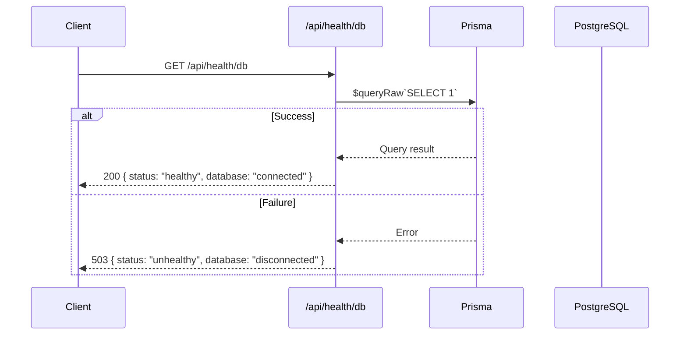
```mermaid
sequenceDiagram
    participant Client
    participant Route as /api/health/db
    participant Prisma
    participant DB as PostgreSQL

    Client->>Route: GET /api/health/db
    Route->>Prisma: $queryRaw`SELECT 1`

    alt Success
        Prisma-->>Route: Query result
        Route-->>Client: 200 { status: "healthy", database: "connected" }
    else Failure
        Prisma-->>Route: Error
        Route-->>Client: 503 { status: "unhealthy", database: "disconnected" }
    end
```

---

### GET /api/health/services

**Purpose:** External services connectivity check.

**Authentication:** None (Public)

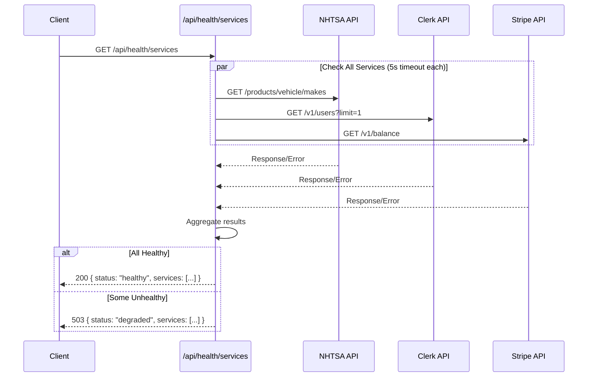
```mermaid
sequenceDiagram
    participant Client
    participant Route as /api/health/services
    participant NHTSA as NHTSA API
    participant Clerk as Clerk API
    participant Stripe as Stripe API

    Client->>Route: GET /api/health/services

    par Check All Services (5s timeout each)
        Route->>NHTSA: GET /products/vehicle/makes
        Route->>Clerk: GET /v1/users?limit=1
        Route->>Stripe: GET /v1/balance
    end

    NHTSA-->>Route: Response/Error
    Clerk-->>Route: Response/Error
    Stripe-->>Route: Response/Error

    Route->>Route: Aggregate results

    alt All Healthy
        Route-->>Client: 200 { status: "healthy", services: [...] }
    else Some Unhealthy
        Route-->>Client: 503 { status: "degraded", services: [...] }
    end
```

**Services Checked:**

| Service | Endpoint | Timeout |
|---------|----------|---------|
| NHTSA | api.nhtsa.gov | 5s |
| Clerk | api.clerk.dev | 5s |
| Stripe | api.stripe.com | 5s |

---

## Cron Jobs

### GET /api/cron/sync-nhtsa

**Purpose:** Sync new complaints from NHTSA API.

**Schedule:** Every 6 hours

**Authorization:** Bearer token (CRON_SECRET)

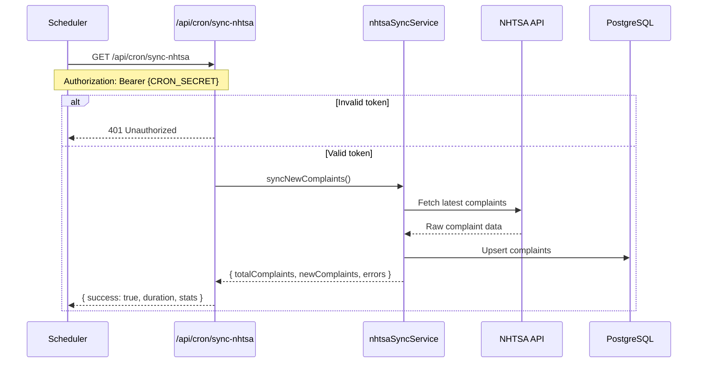
```mermaid
sequenceDiagram
    participant Scheduler
    participant Route as /api/cron/sync-nhtsa
    participant NHTSA as nhtsaSyncService
    participant API as NHTSA API
    participant DB as PostgreSQL

    Scheduler->>Route: GET /api/cron/sync-nhtsa
    Note over Scheduler,Route: Authorization: Bearer {CRON_SECRET}

    alt Invalid token
        Route-->>Scheduler: 401 Unauthorized
    else Valid token
        Route->>NHTSA: syncNewComplaints()
        NHTSA->>API: Fetch latest complaints
        API-->>NHTSA: Raw complaint data
        NHTSA->>DB: Upsert complaints
        NHTSA-->>Route: { totalComplaints, newComplaints, errors }

        Route-->>Scheduler: { success: true, duration, stats }
    end
```

**Response:**

```typescript
interface SyncResponse {
  success: boolean;
  duration: number;
  totalComplaints: number;
  newComplaints: number;
  errors: number;
}
```

---

### GET /api/cron/analyze-patterns

**Purpose:** Analyze complaint patterns and detect trends.

**Schedule:** Daily at 2 AM

**Authorization:** Bearer token (CRON_SECRET)

```mermaid
sequenceDiagram
    participant Scheduler
    participant Route as /api/cron/analyze-patterns
    participant Trend as calculateTrendDirection()
    participant Anomaly as detectIQRAnomalies()
    participant DB as PostgreSQL

    Scheduler->>Route: GET /api/cron/analyze-patterns

    alt Invalid token
        Route-->>Scheduler: 401 Unauthorized
    else Valid token
        Route->>DB: SELECT complaints (last 90 days)
        DB-->>Route: Complaints

        Route->>Route: Prepare data points
        Route->>Trend: Calculate trend direction
        Trend-->>Route: { direction, slope }

        Route->>Anomaly: Detect anomalies
        Anomaly-->>Route: Anomaly indices

        Route-->>Scheduler: { success, complaintsAnalyzed, trendDirection, anomaliesFound }
    end
```

---

## Webhook Handlers

### POST /api/webhooks/clerk

**Purpose:** Process Clerk webhooks for user/org synchronization.

**Authentication:** Svix signature verification

```mermaid
sequenceDiagram
    participant Clerk as Clerk
    participant Route as /api/webhooks/clerk
    participant Svix as Svix Verification
    participant Handler as processClerkWebhook()
    participant DB as PostgreSQL

    Clerk->>Route: POST with svix headers
    Note over Clerk,Route: svix-id, svix-timestamp, svix-signature

    Route->>Svix: Verify signature

    alt Invalid signature
        Svix-->>Route: Verification failed
        Route-->>Clerk: 400 Invalid signature
    else Valid signature
        Svix-->>Route: Verified event

        Route->>Handler: processClerkWebhook(event)

        alt user.created
            Handler->>DB: Upsert user
        else user.updated
            Handler->>DB: Update user email
        else user.deleted
            Handler->>DB: Delete user
        else organization.created
            Handler->>DB: Create organization
        else organization.updated
            Handler->>DB: Update organization name
        else organizationMembership.created
            Handler->>DB: Create/update user with role
        end

        Handler-->>Route: Success
        Route-->>Clerk: { received: true }
    end
```

**Handled Events:**

| Event | Action |
|-------|--------|
| `user.created` | Create user in DB |
| `user.updated` | Update user email |
| `user.deleted` | Delete user from DB |
| `organization.created` | Create organization |
| `organization.updated` | Update organization name |
| `organizationMembership.created` | Add user to org with role |
| `organizationMembership.deleted` | Log (no action) |

---

### POST /api/webhooks/stripe

**Purpose:** Process Stripe webhooks for subscription management.

**Authentication:** Stripe signature verification

```mermaid
sequenceDiagram
    participant Stripe as Stripe
    participant Route as /api/webhooks/stripe
    participant Verify as Stripe Signature
    participant Handler as processStripeWebhook()
    participant DB as PostgreSQL

    Stripe->>Route: POST with stripe-signature

    Route->>Verify: constructEvent(body, signature, secret)

    alt Invalid signature
        Verify-->>Route: Verification failed
        Route-->>Stripe: 400 Invalid signature
    else Valid signature
        Verify-->>Route: Stripe.Event

        Route->>Handler: processStripeWebhook(event)

        alt checkout.session.completed
            Handler->>DB: Create/update subscription
        else customer.subscription.updated
            Handler->>DB: Update subscription status
        else customer.subscription.deleted
            Handler->>DB: Mark subscription canceled
        else invoice.payment_succeeded
            Handler->>DB: Update period dates
        else invoice.payment_failed
            Handler->>DB: Mark subscription past_due
        end

        Handler-->>Route: Success
        Route-->>Stripe: { received: true }
    end
```

---

## Error Handling

### Standard Error Response

```typescript
interface ErrorResponse {
  error: string;
  code?: string;
  details?: Record<string, unknown>;
}
```

### HTTP Status Codes

| Code | Meaning | Usage |
|------|---------|-------|
| 200 | OK | Successful GET/PATCH |
| 201 | Created | Successful POST |
| 204 | No Content | Successful DELETE |
| 400 | Bad Request | Invalid input/validation |
| 401 | Unauthorized | Missing/invalid auth |
| 403 | Forbidden | Insufficient permissions |
| 404 | Not Found | Resource doesn't exist |
| 500 | Internal Error | Server error |
| 503 | Service Unavailable | Health check failure |

---

## Rate Limiting

Rate limiting is enforced per-organization based on subscription plan:

| Plan | Complaint Searches/mo | Pattern Alerts | Generated Complaints/mo |
|------|----------------------|----------------|------------------------|
| FREE | 50 | 3 | 1 |
| BASIC | 500 | 10 | 10 |
| PRO | 5,000 | Unlimited | 50 |
| ENTERPRISE | Unlimited | Unlimited | Unlimited |

---

**Previous:** [01-database-schema.md](./01-database-schema.md) - Database Schema
**Next:** [03-frontend-components.md](./03-frontend-components.md) - Frontend Components
