# CaseRadar Frontend Components Documentation

## Overview

CaseRadar's frontend is built with Next.js 16 App Router, React 19, TypeScript, and Tailwind CSS 4. Components follow a hierarchical structure with shared UI primitives from Radix UI (shadcn/ui).

## Component Architecture

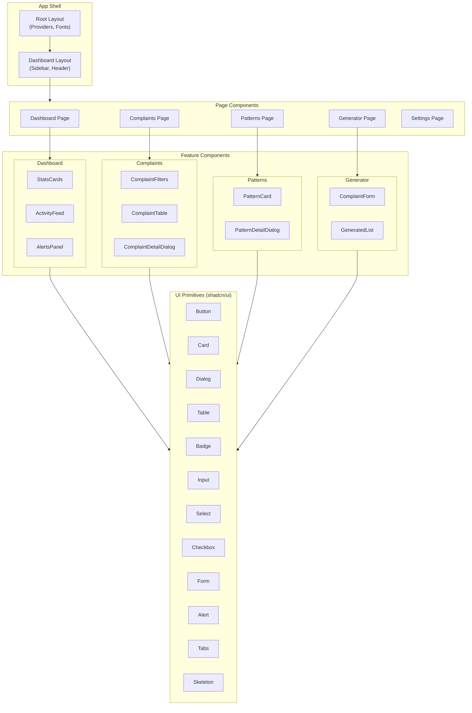

---

## Layouts

### Root Layout (`src/app/layout.tsx`)

**Purpose:** Provides global providers, fonts, and body structure.

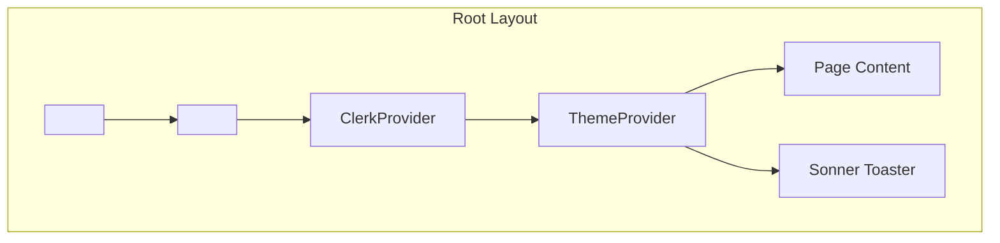

**Providers:**
- `ClerkProvider` - Authentication context
- `ThemeProvider` - Light/dark mode support
- `Sonner Toaster` - Toast notifications

---

### Dashboard Layout (`src/app/(dashboard)/layout.tsx`)

**Purpose:** Provides sidebar navigation and header for authenticated pages.

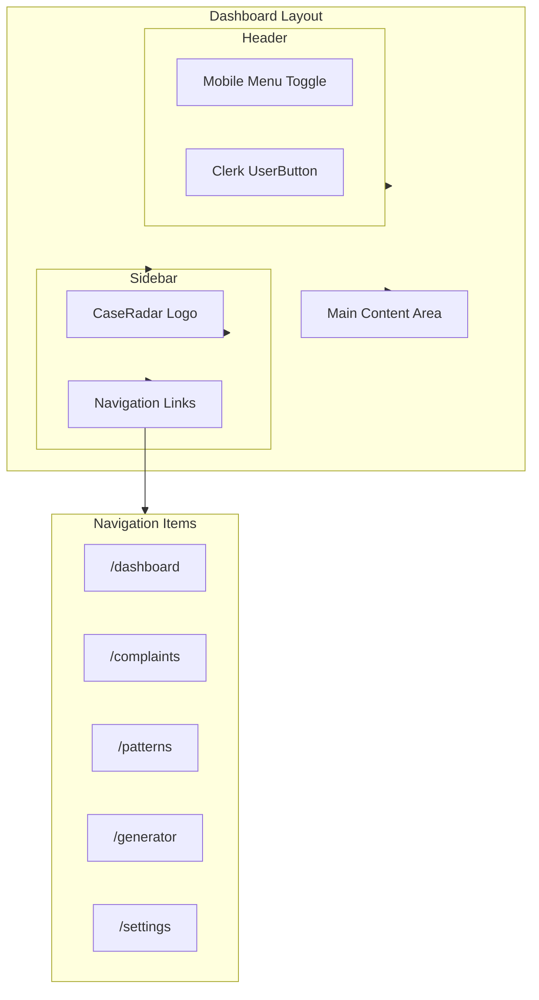

**Features:**
- Collapsible sidebar on mobile (off-canvas)
- Sticky header with backdrop blur
- Active route highlighting
- Clerk `UserButton` for logout/account management

---

## Feature Components

### Dashboard Components

#### StatsCards

**Purpose:** Displays key metrics in card grid format.

**File:** `src/components/dashboard/stats-cards.tsx`

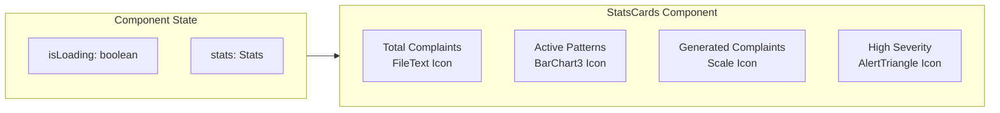

**Props:**
| Prop | Type | Description |
|------|------|-------------|
| `stats` | `Stats` | Metrics data |
| `isLoading` | `boolean` | Show skeleton loaders |

**Stats Interface:**
```typescript
interface Stats {
  totalComplaints: number;
  activePatterns: number;
  generatedComplaints: number;
  highSeverityPatterns: number;
  trends?: {
    complaints?: { direction: 'up' | 'down'; value: number };
    patterns?: { direction: 'up' | 'down'; value: number };
  };
}
```

---

#### ActivityFeed

**Purpose:** Shows recent activity timeline.

**File:** `src/components/dashboard/activity-feed.tsx`

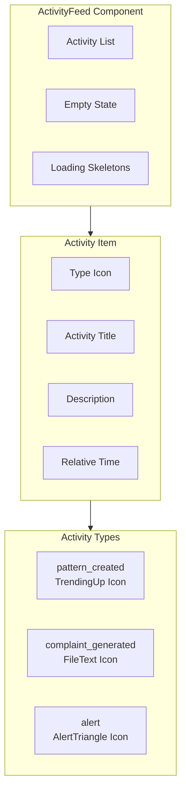

**Props:**
| Prop | Type | Description |
|------|------|-------------|
| `activities` | `Activity[]` | List of activities |
| `isLoading` | `boolean` | Show skeletons |
| `hasMore` | `boolean` | Show "View All" link |
| `onItemClick` | `(activity) => void` | Click handler |
| `onViewAll` | `() => void` | View all handler |

---

#### AlertsPanel

**Purpose:** Displays system alerts sorted by priority.

**File:** `src/components/dashboard/alerts-panel.tsx`

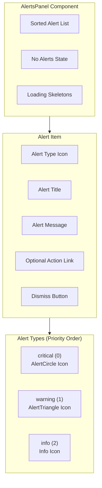

**Props:**
| Prop | Type | Description |
|------|------|-------------|
| `alerts` | `Alert[]` | List of alerts |
| `isLoading` | `boolean` | Show skeletons |
| `onDismiss` | `(id: string) => void` | Dismiss handler |

---

### Complaint Components

#### ComplaintFilters

**Purpose:** Search and filter controls for complaints.

**File:** `src/components/complaints/complaint-filters.tsx`

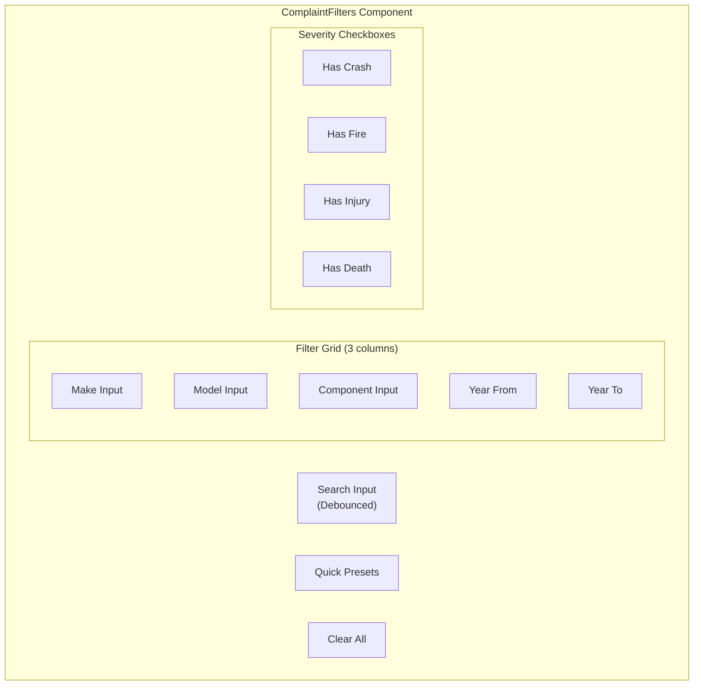

**Props:**
| Prop | Type | Description |
|------|------|-------------|
| `filters` | `Filters` | Current filter state |
| `onFiltersChange` | `(filters) => void` | Filter change handler |
| `debounceMs` | `number` | Search debounce (default: 300) |
| `showPresets` | `boolean` | Show quick presets |

**Filters Interface:**
```typescript
interface Filters {
  search: string;
  make: string;
  model: string;
  yearFrom: number | undefined;
  yearTo: number | undefined;
  component: string;
  hasCrash: boolean;
  hasFire: boolean;
  hasInjury: boolean;
  hasDeath: boolean;
}
```

---

#### ComplaintTable

**Purpose:** Data table for NHTSA complaints with sorting and selection.

**File:** `src/components/complaints/complaint-table.tsx`

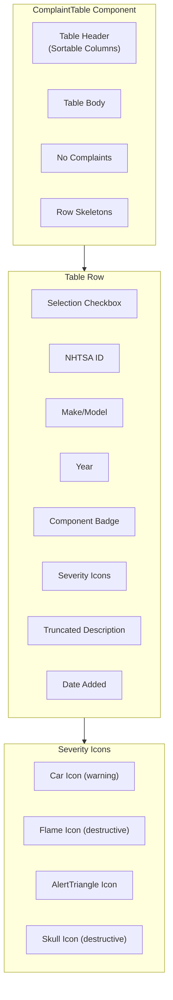

**Props:**
| Prop | Type | Description |
|------|------|-------------|
| `complaints` | `Complaint[]` | Complaint data |
| `isLoading` | `boolean` | Show skeletons |
| `selectable` | `boolean` | Enable selection |
| `selectedIds` | `string[]` | Selected IDs |
| `onSelect` | `(ids) => void` | Selection handler |
| `onRowClick` | `(complaint) => void` | Row click handler |
| `onSort` | `(config) => void` | Sort handler |
| `sortConfig` | `SortConfig` | Current sort state |

---

#### ComplaintDetailDialog

**Purpose:** Modal dialog showing full complaint details.

**File:** `src/components/complaints/complaint-detail-dialog.tsx`

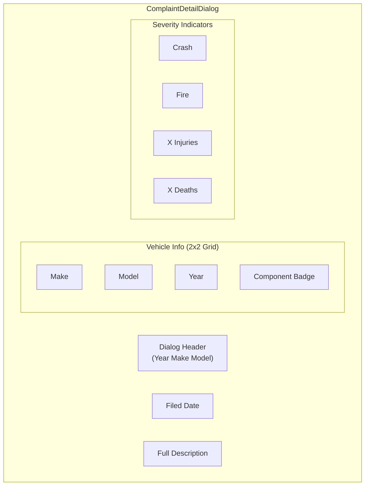

**Props:**
| Prop | Type | Description |
|------|------|-------------|
| `complaint` | `Complaint | null` | Complaint to display |
| `open` | `boolean` | Dialog open state |
| `onOpenChange` | `(open) => void` | Open state handler |

---

### Pattern Components

#### PatternCard

**Purpose:** Card displaying pattern summary with severity badge.

**File:** `src/components/patterns/pattern-card.tsx`

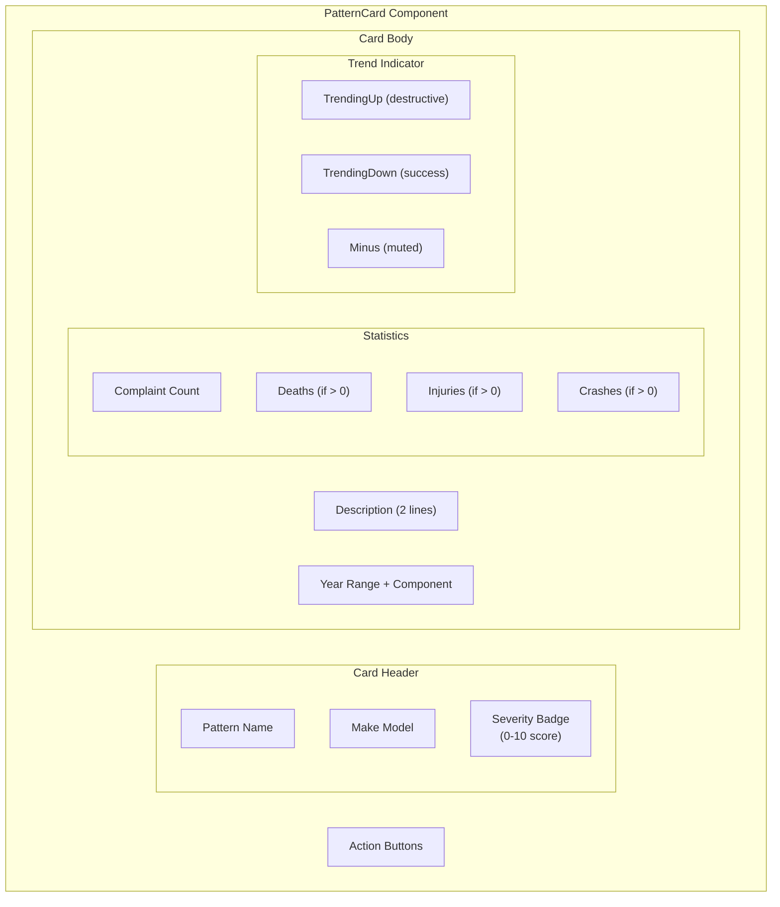

**Severity Color Mapping:**
| Score | Color Class |
|-------|-------------|
| >= 7 | `bg-destructive` |
| >= 4 | `bg-warning` |
| < 4 | `bg-success` |

**Props:**
| Prop | Type | Description |
|------|------|-------------|
| `pattern` | `Pattern` | Pattern data |
| `isLoading` | `boolean` | Show skeleton |
| `isSelected` | `boolean` | Highlight ring |
| `showActions` | `boolean` | Show action buttons |
| `onClick` | `(pattern) => void` | Click handler |
| `onGenerateComplaint` | `(id) => void` | Generate handler |

---

#### PatternDetailDialog

**Purpose:** Modal dialog showing full pattern details with statistics.

**File:** `src/components/patterns/pattern-detail-dialog.tsx`

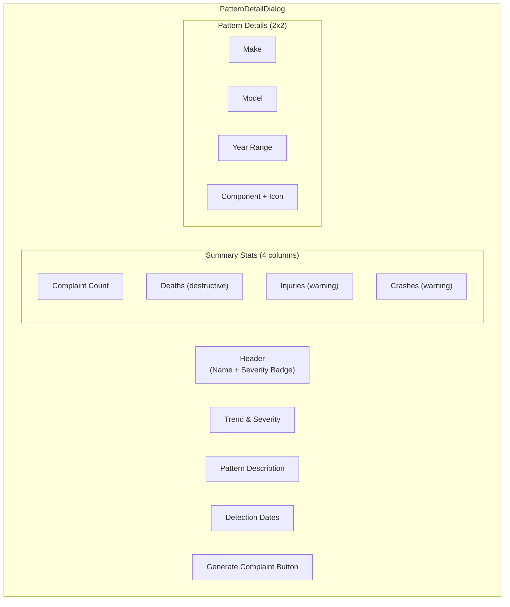

**Props:**
| Prop | Type | Description |
|------|------|-------------|
| `pattern` | `Pattern | null` | Pattern to display |
| `open` | `boolean` | Dialog open state |
| `onOpenChange` | `(open) => void` | Open state handler |
| `onGenerateComplaint` | `(id) => void` | Generate handler |

---

### Generator Components

#### ComplaintForm

**Purpose:** Multi-step form for generating legal complaints.

**File:** `src/components/generator/complaint-form.tsx`

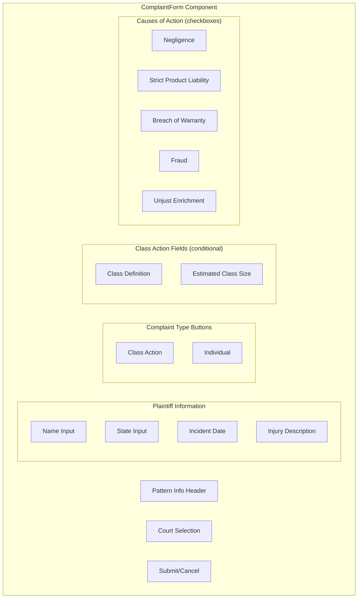

**Props:**
| Prop | Type | Description |
|------|------|-------------|
| `pattern` | `Pattern` | Source pattern |
| `onSubmit` | `(data) => void` | Form submit handler |
| `onCancel` | `() => void` | Cancel handler |
| `isLoading` | `boolean` | Disable form during submit |
| `error` | `string` | Error message to display |
| `initialData` | `Partial<FormData>` | Pre-fill data |

**Form Validation:**
- Plaintiff name: Required
- State: Required
- Year range: Validated (from <= to)

---

#### GeneratedList

**Purpose:** Table of generated complaints with status filtering and actions.

**File:** `src/components/generator/generated-list.tsx`

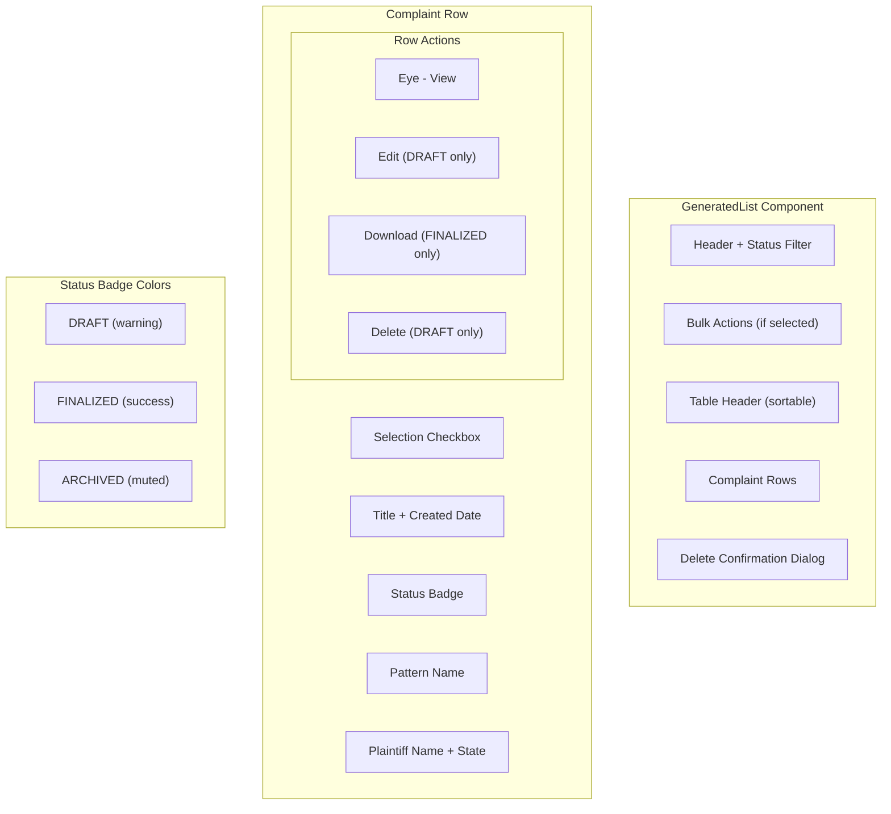

**Props:**
| Prop | Type | Description |
|------|------|-------------|
| `complaints` | `GeneratedComplaint[]` | Complaint list |
| `isLoading` | `boolean` | Show skeletons |
| `selectable` | `boolean` | Enable selection |
| `selectedIds` | `string[]` | Selected IDs |
| `onSelect` | `(ids) => void` | Selection handler |
| `onView` | `(id) => void` | View handler |
| `onEdit` | `(id) => void` | Edit handler |
| `onDownload` | `(id) => void` | Download handler |
| `onDelete` | `(id) => void` | Delete handler |
| `onSort` | `(config) => void` | Sort handler |

---

## UI Components (shadcn/ui)

All UI components are built on Radix UI primitives with Tailwind CSS styling.

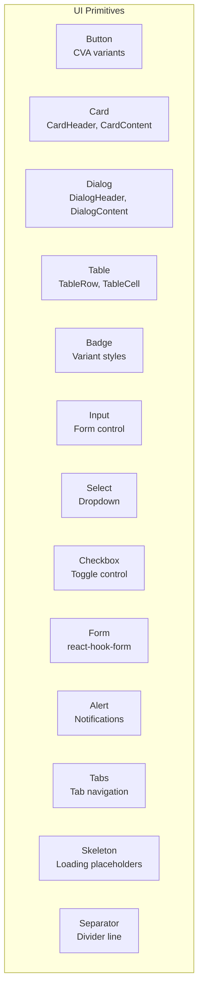

### Component Files

| Component | File | Dependencies |
|-----------|------|--------------|
| Button | `ui/button.tsx` | Radix Slot, CVA |
| Card | `ui/card.tsx` | - |
| Dialog | `ui/dialog.tsx` | @radix-ui/react-dialog |
| Table | `ui/table.tsx` | - |
| Badge | `ui/badge.tsx` | CVA |
| Input | `ui/input.tsx` | - |
| Select | `ui/select.tsx` | @radix-ui/react-select |
| Checkbox | `ui/checkbox.tsx` | @radix-ui/react-checkbox |
| Form | `ui/form.tsx` | react-hook-form |
| Alert | `ui/alert.tsx` | - |
| Tabs | `ui/tabs.tsx` | @radix-ui/react-tabs |
| Skeleton | `ui/skeleton.tsx` | - |
| Separator | `ui/separator.tsx` | @radix-ui/react-separator |
| Label | `ui/label.tsx` | @radix-ui/react-label |
| Dropdown | `ui/dropdown-menu.tsx` | @radix-ui/react-dropdown-menu |
| Textarea | `ui/textarea.tsx` | - |
| Sonner | `ui/sonner.tsx` | sonner |

---

## State Management

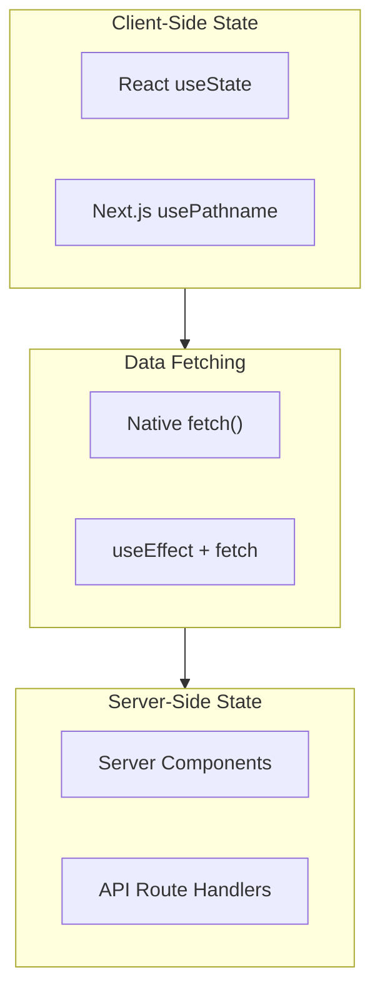

**Pattern:** CaseRadar uses a simple data fetching pattern:
1. Server components fetch initial data
2. Client components use `useState` + `fetch` for dynamic updates
3. No global state management library (Redux, Zustand)

---

## Component Data Flow

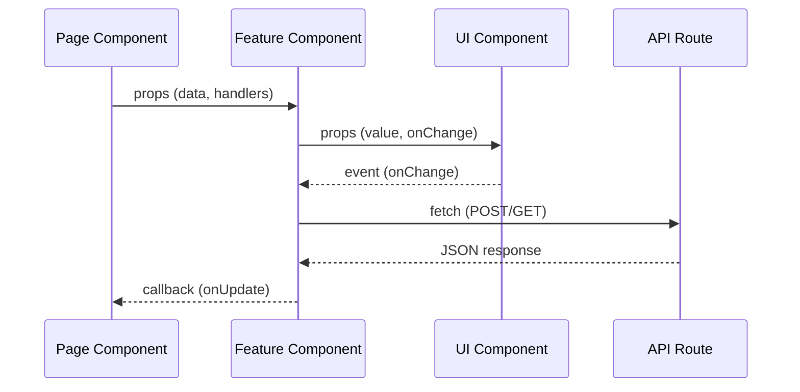

---

## Styling Patterns

### Tailwind CSS 4 Classes

**Layout:**
- Grid: `grid grid-cols-2 md:grid-cols-4 gap-4`
- Flexbox: `flex items-center justify-between`
- Spacing: `p-4 md:p-6 lg:p-8`

**Colors:**
- Primary: `text-primary`, `bg-primary`
- Muted: `text-muted-foreground`, `bg-muted`
- Destructive: `text-destructive`, `bg-destructive`
- Warning: `text-warning`, `bg-warning`
- Success: `text-success`, `bg-success`

**States:**
- Hover: `hover:bg-muted/50`
- Active: `ring-2 ring-primary`
- Disabled: `disabled:opacity-50`

### Dark Mode Support

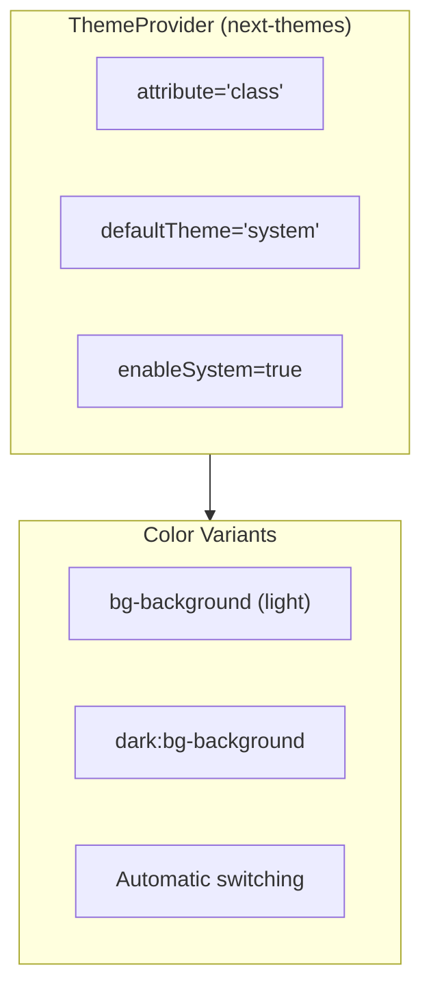

---

## Testing

Components use Vitest + Testing Library:

```
src/components/
├── complaints/__tests__/
│   ├── complaint-filters.test.tsx
│   └── complaint-table.test.tsx
├── dashboard/__tests__/
│   ├── activity-feed.test.tsx
│   ├── alerts-panel.test.tsx
│   └── stats-cards.test.tsx
├── generator/__tests__/
│   ├── complaint-form.test.tsx
│   └── generated-list.test.tsx
└── patterns/__tests__/
    └── pattern-card.test.tsx
```

**Test Patterns:**
- Render tests with test IDs
- User interaction with `@testing-library/user-event`
- Loading state tests
- Empty state tests

---

**Previous:** [02-api-routes.md](./02-api-routes.md) - API Routes
**Next:** [04-authentication.md](./04-authentication.md) - Authentication
