# CaseRadar Authentication Documentation

## Overview

CaseRadar uses [Clerk](https://clerk.com) for authentication and organization management. The system implements multi-tenant authentication with role-based access control (RBAC).

## Architecture Overview

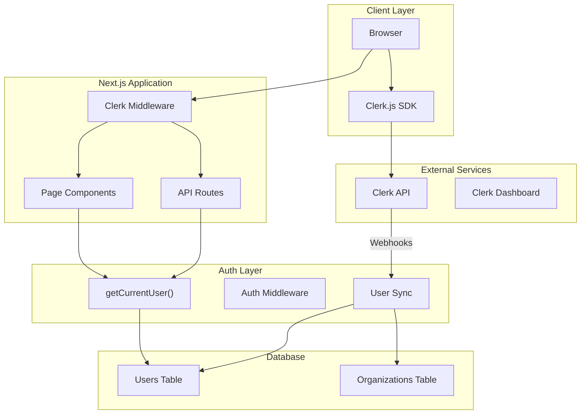

---

## Authentication Flow

### Sign-In Flow

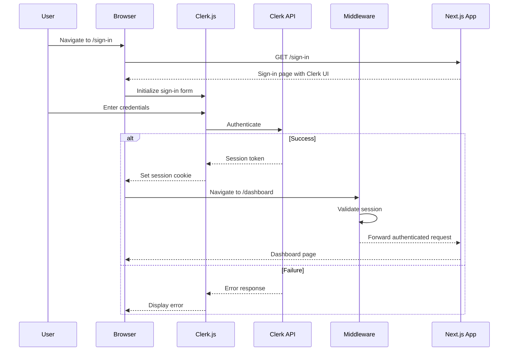

### Sign-Up Flow

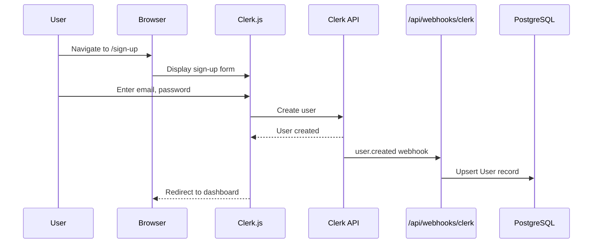

---

## Middleware Configuration

**File:** `src/middleware.ts`

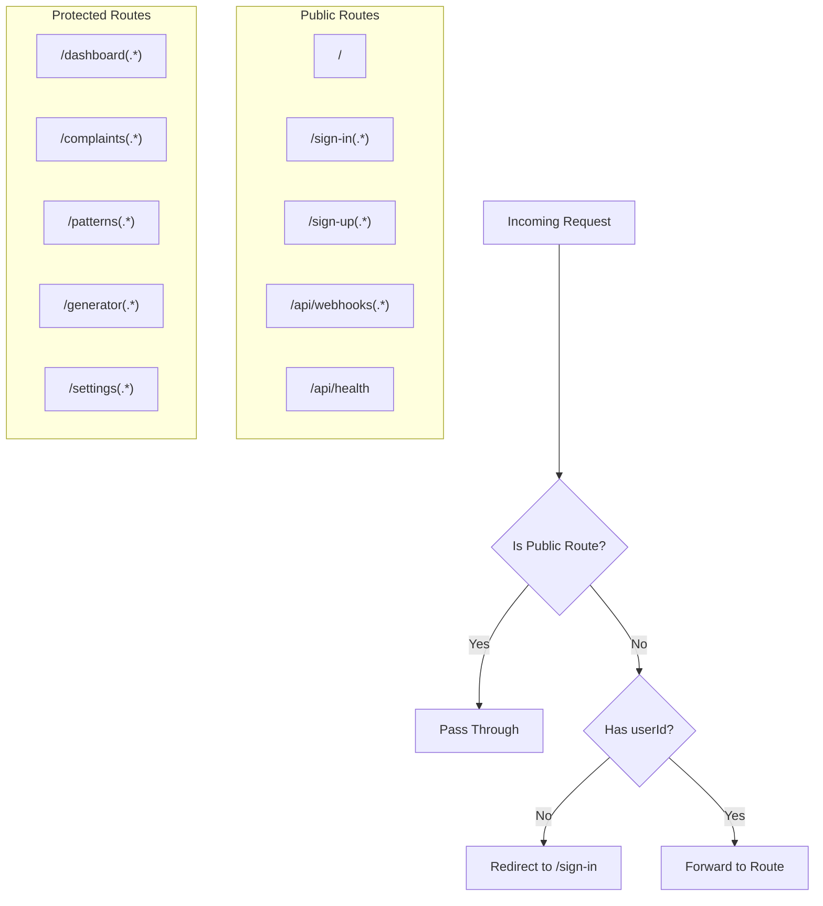

**Route Matchers:**

```typescript
// Public routes - no auth required
const isPublicRoute = createRouteMatcher([
  '/',
  '/sign-in(.*)',
  '/sign-up(.*)',
  '/api/webhooks(.*)',
  '/api/health',
]);

// Org routes - require organization membership
const isOrgRoute = createRouteMatcher([
  '/dashboard(.*)',
  '/complaints(.*)',
  '/patterns(.*)',
  '/generator(.*)',
  '/settings(.*)',
  '/admin(.*)',
  '/api/complaints(.*)',
  '/api/patterns(.*)',
  '/api/generator(.*)',
]);
```

**Matcher Config:**
```typescript
export const config = {
  matcher: [
    // Skip Next.js internals and static files
    '/((?!_next|[^?]*\\.(?:html?|css|js(?!on)|jpe?g|webp|png|gif|svg|ttf|woff2?|ico|csv|docx?|xlsx?|zip|webmanifest)).*)',
    // Always run for API routes
    '/(api|trpc)(.*)',
  ],
};
```

---

## Auth Utilities

### getCurrentUser()

**File:** `src/lib/auth/auth-middleware.ts`

**Purpose:** Retrieves authenticated user with database info.

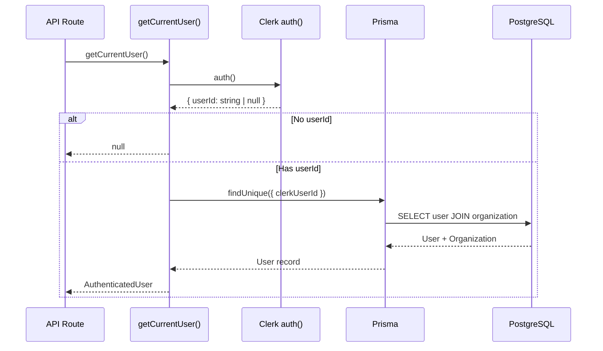

**Return Type:**
```typescript
interface AuthenticatedUser {
  id: string;               // Database user ID
  clerkUserId: string;      // Clerk user ID
  email: string;
  role: Role;               // ADMIN | ANALYST | VIEWER
  organizationId: string;   // Database org ID
  organization: {
    id: string;
    clerkOrgId: string;     // Clerk org ID
    name: string;
    plan: Plan;             // FREE | BASIC | PRO | ENTERPRISE
  };
}
```

---

### Higher-Order Functions

#### withAuth

**Purpose:** Wraps handler with authentication check.

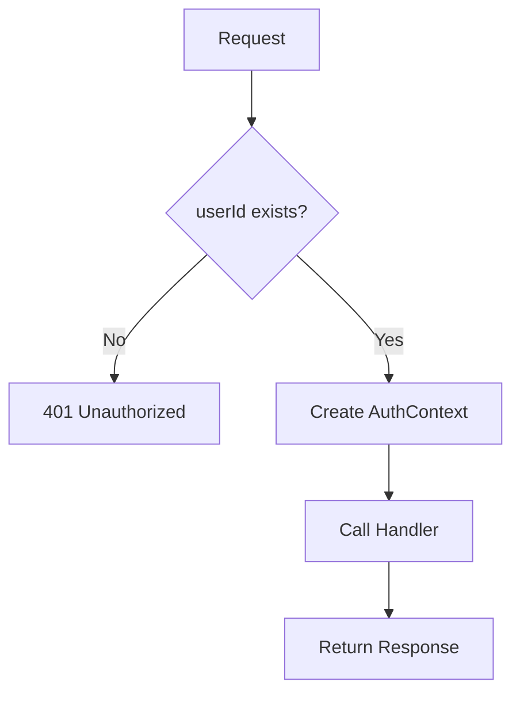

```typescript
export function withAuth(handler: AuthenticatedHandler) {
  return async (request: NextRequest) => {
    const authResult = await auth();
    if (!authResult.userId) {
      return NextResponse.json({ error: 'Unauthorized' }, { status: 401 });
    }
    return handler(request, { auth: authContext });
  };
}
```

#### withRole

**Purpose:** Requires specific role(s) for access.

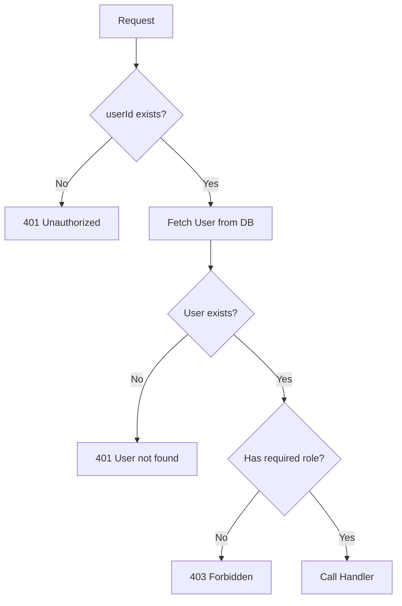

#### withOrganization

**Purpose:** Requires organization membership.

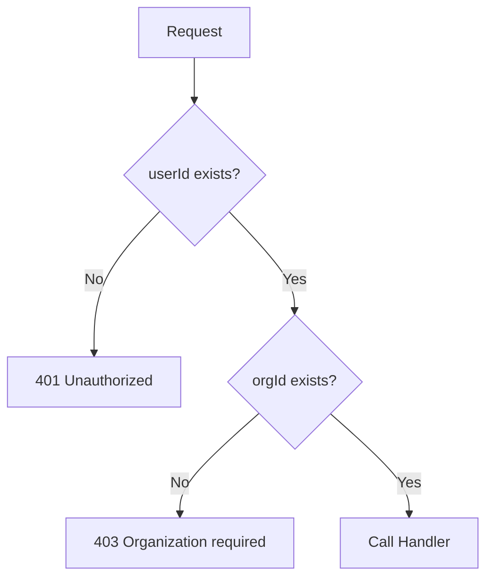

---

## Role-Based Access Control

### Role Hierarchy

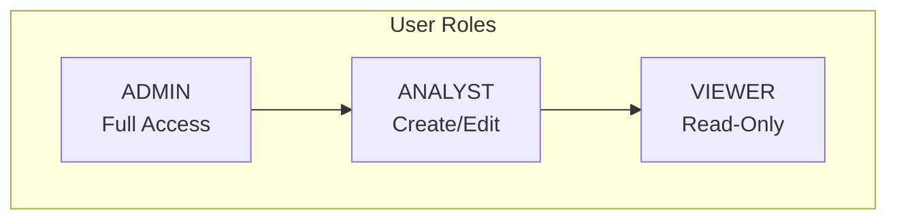

### Permission Matrix

| Resource | Action | ADMIN | ANALYST | VIEWER |
|----------|--------|-------|---------|--------|
| Complaints | read | ✅ | ✅ | ✅ |
| Complaints | search | ✅ | ✅ | ✅ |
| Patterns | read | ✅ | ✅ | ✅ |
| Patterns | create | ✅ | ✅ | ❌ |
| Patterns | update | ✅ | ✅ | ❌ |
| Patterns | delete | ✅ | ❌ | ❌ |
| Generated Complaints | read | ✅ | ✅ | ✅ |
| Generated Complaints | create | ✅ | ✅ | ❌ |
| Generated Complaints | update | ✅ | ✅ | ❌ |
| Generated Complaints | delete | ✅ | ✅ | ❌ |
| Users | read | ✅ | ✅ | ❌ |
| Users | manage | ✅ | ❌ | ❌ |
| Organization | read | ✅ | ✅ | ✅ |
| Organization | manage | ✅ | ❌ | ❌ |

### Permission Check Function

```typescript
export function hasPermission(
  user: AuthenticatedUser,
  action: string,
  resource: string
): boolean {
  const permissions: Record<Role, Record<string, string[]>> = {
    ADMIN: { '*': ['*'] },  // Wildcard access
    ANALYST: {
      complaints: ['read', 'search'],
      patterns: ['read', 'create', 'update'],
      generated_complaints: ['read', 'create', 'update', 'delete'],
      users: ['read'],
      organizations: ['read'],
    },
    VIEWER: {
      complaints: ['read', 'search'],
      patterns: ['read'],
      generated_complaints: ['read'],
      organizations: ['read'],
    },
  };
  // ... permission check logic
}
```

---

## Webhook Handlers

### Clerk Webhooks

**File:** `src/app/api/webhooks/clerk/route.ts`

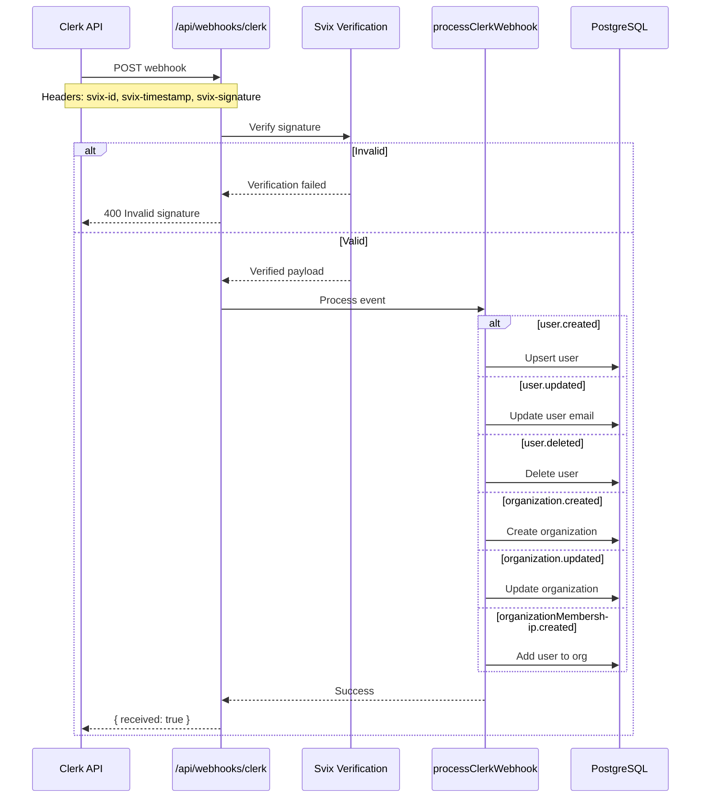

### Supported Webhook Events

| Event | Action |
|-------|--------|
| `user.created` | Create user record if org exists |
| `user.updated` | Update user email |
| `user.deleted` | Delete user record |
| `organization.created` | Create organization with FREE plan |
| `organization.updated` | Update organization name |
| `organizationMembership.created` | Add user to org with mapped role |
| `organizationMembership.deleted` | Log (no database action) |

### Role Mapping

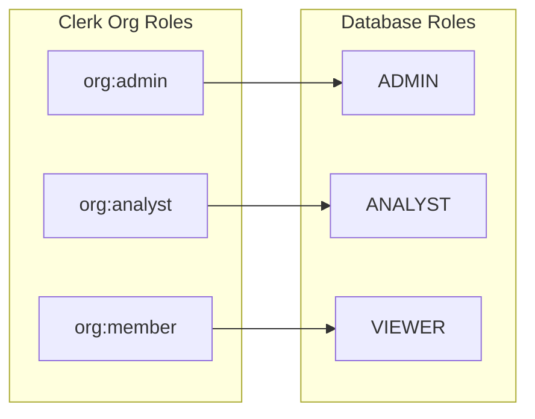

```typescript
function mapClerkRoleToDbRole(clerkRole: string): Role {
  switch (clerkRole) {
    case 'org:admin':
      return 'ADMIN';
    case 'org:analyst':
      return 'ANALYST';
    case 'org:member':
    default:
      return 'VIEWER';
  }
}
```

---

## User Sync

### syncUser Function

**File:** `src/lib/auth/user-sync.ts`

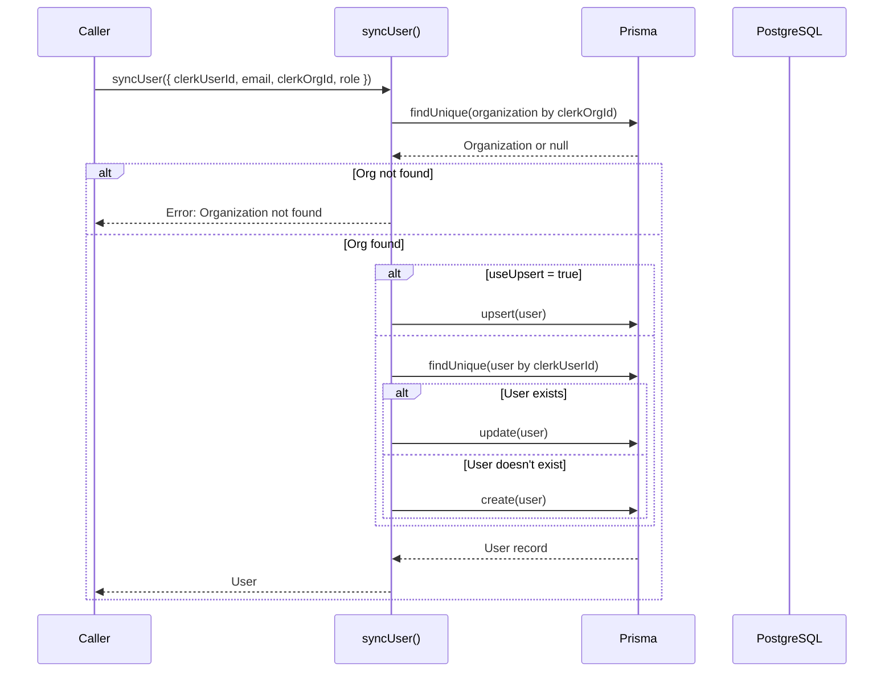

### syncOrganization Function

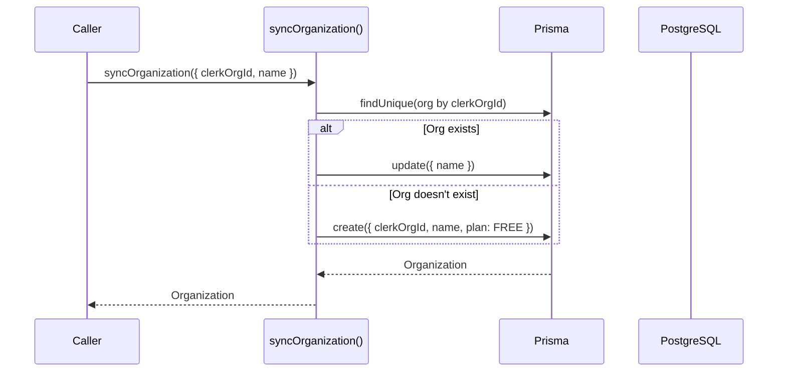

---

## Multi-Tenant Isolation

### Tenant Boundary

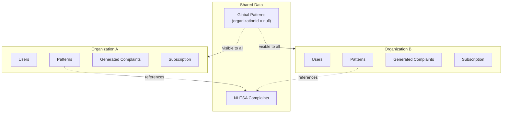

### Isolation Enforcement

Every API route that accesses organization-specific data must:

1. Get current user via `getCurrentUser()`
2. Verify `user.organizationId` exists
3. Include `organizationId` in all queries
4. Verify resource `organizationId` matches user's

```typescript
// Example pattern in API routes
export async function GET(request: NextRequest) {
  const user = await getCurrentUser();

  // Step 1: Verify user exists
  if (!user?.organizationId) {
    return NextResponse.json({ error: 'Unauthorized' }, { status: 401 });
  }

  // Step 2: Query with tenant filter
  const patterns = await prisma.pattern.findMany({
    where: { organizationId: user.organizationId },  // Tenant isolation
  });

  return NextResponse.json({ patterns });
}
```

---

## Client Components

### ClerkProvider

Wraps the application with Clerk context.

```typescript
// src/app/layout.tsx
<ClerkProvider>
  <html>
    <body>{children}</body>
  </html>
</ClerkProvider>
```

### UserButton

Used in dashboard header for user menu.

```typescript
// src/app/(dashboard)/layout.tsx
import { UserButton } from '@clerk/nextjs';

<UserButton afterSignOutUrl="/" />
```

### Sign-In/Sign-Up Pages

Clerk provides pre-built UI components:

- `/sign-in` - `<SignIn />` component
- `/sign-up` - `<SignUp />` component

---

## Environment Variables

```bash
# Required Clerk Environment Variables
NEXT_PUBLIC_CLERK_PUBLISHABLE_KEY=pk_test_...
CLERK_SECRET_KEY=sk_test_...
CLERK_WEBHOOK_SECRET=whsec_...

# Optional: Custom URLs
NEXT_PUBLIC_CLERK_SIGN_IN_URL=/sign-in
NEXT_PUBLIC_CLERK_SIGN_UP_URL=/sign-up
NEXT_PUBLIC_CLERK_AFTER_SIGN_IN_URL=/dashboard
NEXT_PUBLIC_CLERK_AFTER_SIGN_UP_URL=/dashboard
```

---

## Security Considerations

### Webhook Verification

All Clerk webhooks are verified using Svix:

```typescript
const wh = new Webhook(webhookSecret);
const evt = wh.verify(body, {
  'svix-id': svix_id,
  'svix-timestamp': svix_timestamp,
  'svix-signature': svix_signature,
});
```

### Session Management

- Sessions managed by Clerk
- JWT tokens stored as HTTP-only cookies
- Automatic token refresh
- Server-side validation via `auth()` helper

### Data Access

- All database queries scoped to `organizationId`
- Role checks before mutations
- No cross-tenant data leakage

---

**Previous:** [03-frontend-components.md](./03-frontend-components.md) - Frontend Components
**Next:** [05-data-flow.md](./05-data-flow.md) - Data Flow
