# CaseRadar Data Flow Documentation

## Overview

This document details all data flows in CaseRadar, from NHTSA data ingestion through AI analysis to legal complaint generation.

---

## High-Level Data Pipeline

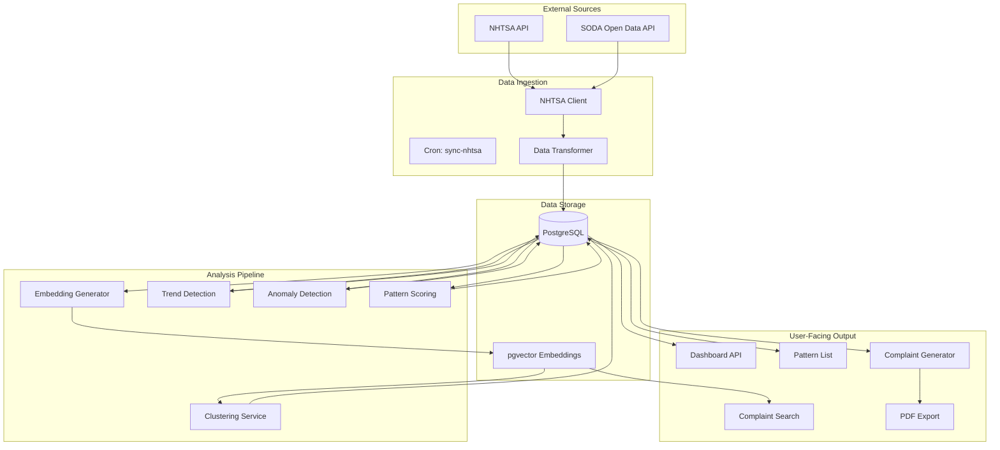
```mermaid
flowchart TB
    subgraph External["External Sources"]
        NHTSA["NHTSA API"]
        SODA["SODA Open Data API"]
    end

    subgraph Ingestion["Data Ingestion"]
        CronSync["Cron: sync-nhtsa"]
        Client["NHTSA Client"]
        Transformer["Data Transformer"]
    end

    subgraph Storage["Data Storage"]
        DB[(PostgreSQL)]
        Embeddings["pgvector Embeddings"]
    end

    subgraph Analysis["Analysis Pipeline"]
        EmbGen["Embedding Generator"]
        Clustering["Clustering Service"]
        TrendDetect["Trend Detection"]
        AnomalyDetect["Anomaly Detection"]
        PatternScore["Pattern Scoring"]
    end

    subgraph Output["User-Facing Output"]
        Dashboard["Dashboard API"]
        ComplaintSearch["Complaint Search"]
        PatternList["Pattern List"]
        Generator["Complaint Generator"]
        PDF["PDF Export"]
    end

    NHTSA --> Client
    SODA --> Client
    Client --> Transformer
    Transformer --> DB

    DB --> EmbGen
    EmbGen --> Embeddings
    Embeddings --> Clustering
    Clustering --> DB

    DB --> TrendDetect
    DB --> AnomalyDetect
    TrendDetect --> DB
    AnomalyDetect --> DB
    DB --> PatternScore
    PatternScore --> DB

    DB --> Dashboard
    Embeddings --> ComplaintSearch
    DB --> PatternList
    DB --> Generator
    Generator --> PDF
```

---

## 1. NHTSA Data Ingestion Flow

### Cron Job Trigger

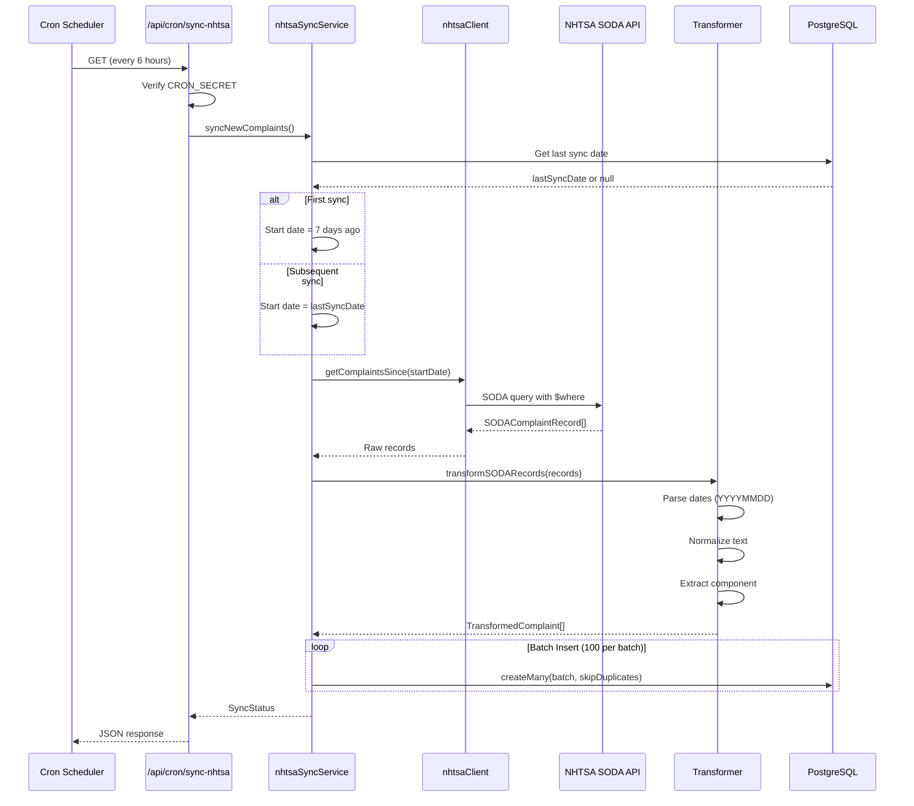
```mermaid
sequenceDiagram
    participant Cron as Cron Scheduler
    participant Route as /api/cron/sync-nhtsa
    participant Sync as nhtsaSyncService
    participant Client as nhtsaClient
    participant NHTSA as NHTSA SODA API
    participant Transform as Transformer
    participant DB as PostgreSQL

    Cron->>Route: GET (every 6 hours)
    Route->>Route: Verify CRON_SECRET
    Route->>Sync: syncNewComplaints()

    Sync->>DB: Get last sync date
    DB-->>Sync: lastSyncDate or null

    alt First sync
        Sync->>Sync: Start date = 7 days ago
    else Subsequent sync
        Sync->>Sync: Start date = lastSyncDate
    end

    Sync->>Client: getComplaintsSince(startDate)
    Client->>NHTSA: SODA query with $where
    NHTSA-->>Client: SODAComplaintRecord[]
    Client-->>Sync: Raw records

    Sync->>Transform: transformSODARecords(records)
    Transform->>Transform: Parse dates (YYYYMMDD)
    Transform->>Transform: Normalize text
    Transform->>Transform: Extract component
    Transform-->>Sync: TransformedComplaint[]

    loop Batch Insert (100 per batch)
        Sync->>DB: createMany(batch, skipDuplicates)
    end

    Sync-->>Route: SyncStatus
    Route-->>Cron: JSON response
```

### NHTSA Client Data Flow

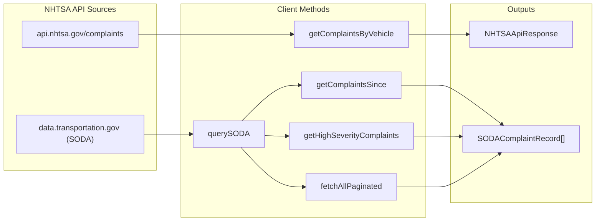
```mermaid
flowchart LR
    subgraph APIs["NHTSA API Sources"]
        API1["api.nhtsa.gov/complaints"]
        API2["data.transportation.gov (SODA)"]
    end

    subgraph Methods["Client Methods"]
        M1["getComplaintsByVehicle"]
        M2["querySODA"]
        M3["getComplaintsSince"]
        M4["getHighSeverityComplaints"]
        M5["fetchAllPaginated"]
    end

    subgraph Output["Outputs"]
        O1["NHTSAApiResponse"]
        O2["SODAComplaintRecord[]"]
    end

    API1 --> M1
    API2 --> M2
    M2 --> M3
    M2 --> M4
    M2 --> M5

    M1 --> O1
    M3 --> O2
    M4 --> O2
    M5 --> O2
```

### Data Transformation

```mermaid
flowchart TD
    subgraph Input["SODA Record"]
        I1["cmplid"]
        I2["odino"]
        I3["mfr_name"]
        I4["maketxt"]
        I5["modeltxt"]
        I6["yeartxt"]
        I7["compdesc"]
        I8["cdescr"]
        I9["crash (Y/N)"]
        I10["fire (Y/N)"]
        I11["injured"]
        I12["deaths"]
        I13["datea (YYYYMMDD)"]
        I14["faildate"]
    end

    subgraph Transform["Transformation"]
        T1["parseNHTSADate()"]
        T2["parseBoolean()"]
        T3["parseInteger()"]
        T4["normalizeText()"]
        T5["extractComponent()"]
    end

    subgraph Output["TransformedComplaint"]
        O1["nhtsaId: string"]
        O2["odiNumber: string"]
        O3["manufacturer: string"]
        O4["make: string (uppercase)"]
        O5["model: string"]
        O6["year: number"]
        O7["component: string"]
        O8["description: string"]
        O9["crash: boolean"]
        O10["fire: boolean"]
        O11["injuries: number"]
        O12["deaths: number"]
        O13["dateAdded: Date"]
        O14["failDate: Date | null"]
    end

    I1 --> O1
    I2 --> O2
    I3 --> T4 --> O3
    I4 --> T4 --> O4
    I5 --> T4 --> O5
    I6 --> T3 --> O6
    I7 --> T5 --> O7
    I8 --> T4 --> O8
    I9 --> T2 --> O9
    I10 --> T2 --> O10
    I11 --> T3 --> O11
    I12 --> T3 --> O12
    I13 --> T1 --> O13
    I14 --> T1 --> O14
```

---

## 2. Embedding Generation Flow

### OpenAI Embedding Pipeline

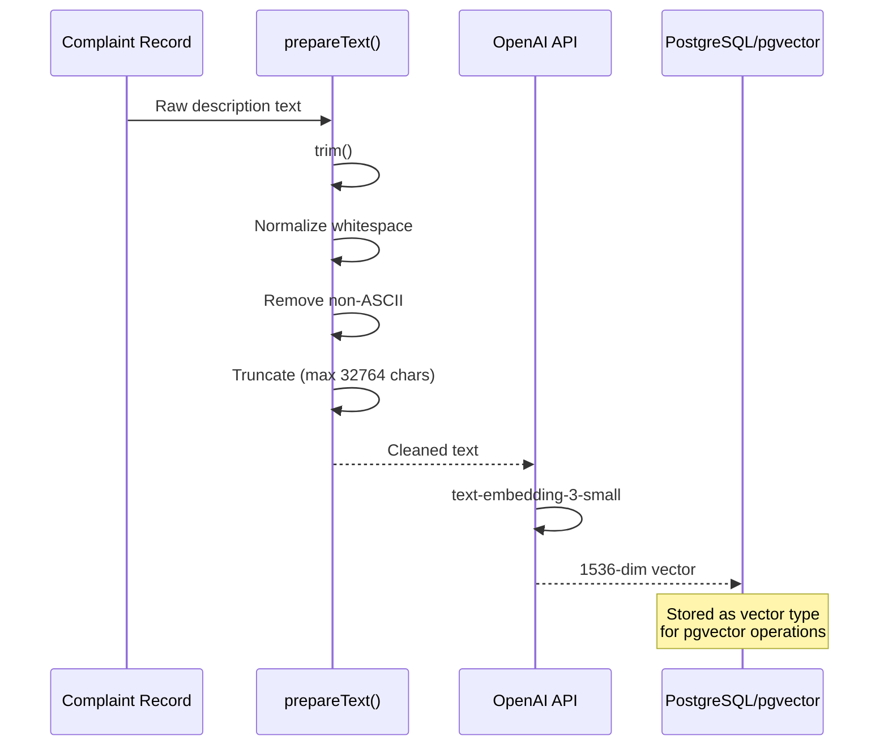
```mermaid
sequenceDiagram
    participant Complaint as Complaint Record
    participant Prep as prepareText()
    participant OpenAI as OpenAI API
    participant DB as PostgreSQL/pgvector

    Complaint->>Prep: Raw description text
    Prep->>Prep: trim()
    Prep->>Prep: Normalize whitespace
    Prep->>Prep: Remove non-ASCII
    Prep->>Prep: Truncate (max 32764 chars)
    Prep-->>OpenAI: Cleaned text

    OpenAI->>OpenAI: text-embedding-3-small
    OpenAI-->>DB: 1536-dim vector

    Note over DB: Stored as vector type<br/>for pgvector operations
```

### Batch Embedding Processing

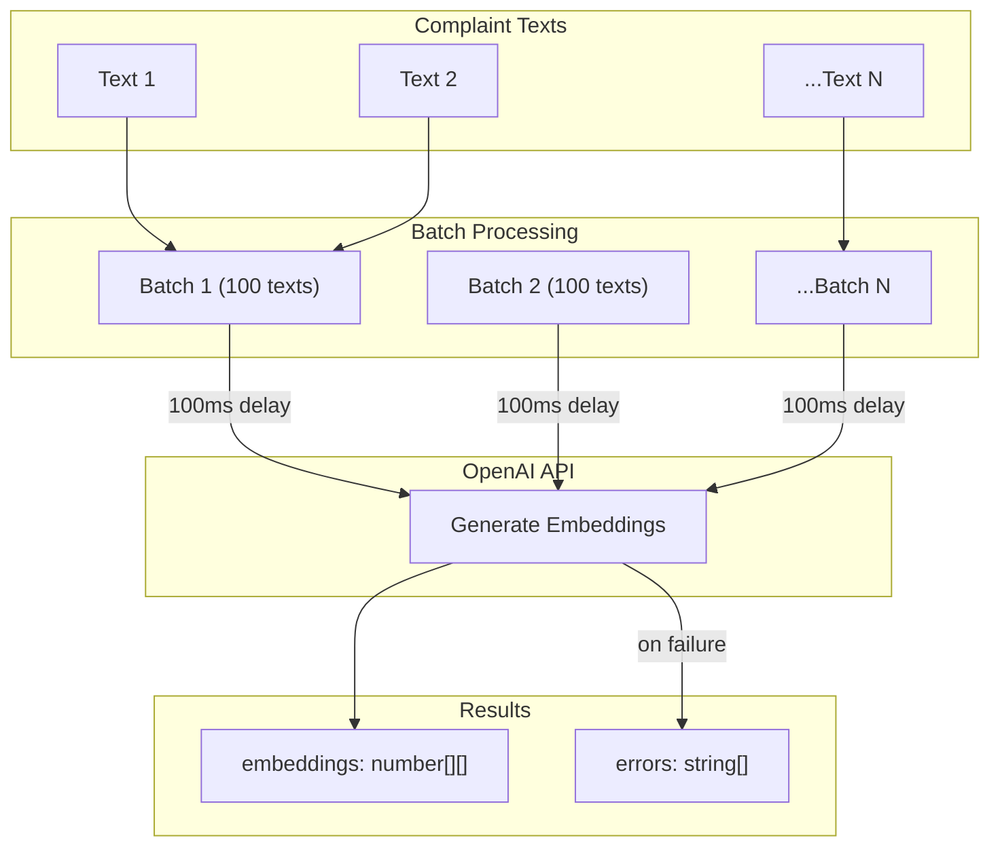
```mermaid
flowchart TD
    subgraph Input["Complaint Texts"]
        T1["Text 1"]
        T2["Text 2"]
        TN["...Text N"]
    end

    subgraph Batching["Batch Processing"]
        B1["Batch 1 (100 texts)"]
        B2["Batch 2 (100 texts)"]
        BN["...Batch N"]
    end

    subgraph API["OpenAI API"]
        E1["Generate Embeddings"]
    end

    subgraph Output["Results"]
        R1["embeddings: number[][]"]
        R2["errors: string[]"]
    end

    T1 --> B1
    T2 --> B1
    TN --> BN

    B1 -->|"100ms delay"| E1
    B2 -->|"100ms delay"| E1
    BN -->|"100ms delay"| E1

    E1 --> R1
    E1 -->|"on failure"| R2
```

---

## 3. Pattern Detection & Clustering

### Clustering Algorithm Flow

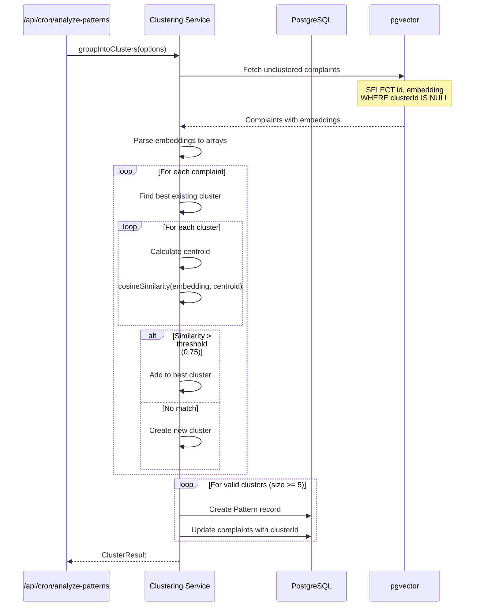
```mermaid
sequenceDiagram
    participant Cron as /api/cron/analyze-patterns
    participant Cluster as Clustering Service
    participant DB as PostgreSQL
    participant PGVec as pgvector

    Cron->>Cluster: groupIntoClusters(options)

    Cluster->>PGVec: Fetch unclustered complaints
    Note over PGVec: SELECT id, embedding<br/>WHERE clusterId IS NULL
    PGVec-->>Cluster: Complaints with embeddings

    Cluster->>Cluster: Parse embeddings to arrays

    loop For each complaint
        Cluster->>Cluster: Find best existing cluster

        loop For each cluster
            Cluster->>Cluster: Calculate centroid
            Cluster->>Cluster: cosineSimilarity(embedding, centroid)
        end

        alt Similarity > threshold (0.75)
            Cluster->>Cluster: Add to best cluster
        else No match
            Cluster->>Cluster: Create new cluster
        end
    end

    loop For valid clusters (size >= 5)
        Cluster->>DB: Create Pattern record
        Cluster->>DB: Update complaints with clusterId
    end

    Cluster-->>Cron: ClusterResult
```

### Greedy Clustering Visualization

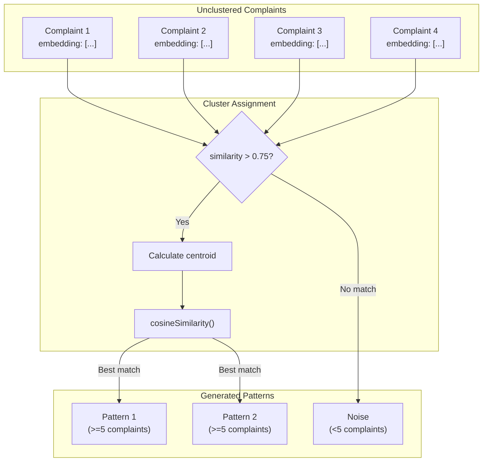
```mermaid
flowchart TD
    subgraph Complaints["Unclustered Complaints"]
        C1["Complaint 1<br/>embedding: [...]"]
        C2["Complaint 2<br/>embedding: [...]"]
        C3["Complaint 3<br/>embedding: [...]"]
        C4["Complaint 4<br/>embedding: [...]"]
    end

    subgraph Clusters["Cluster Assignment"]
        Check{"similarity > 0.75?"}
        Calc["Calculate centroid"]
        CosSim["cosineSimilarity()"]
    end

    subgraph Patterns["Generated Patterns"]
        P1["Pattern 1<br/>(>=5 complaints)"]
        P2["Pattern 2<br/>(>=5 complaints)"]
        Noise["Noise<br/>(<5 complaints)"]
    end

    C1 --> Check
    C2 --> Check
    C3 --> Check
    C4 --> Check

    Check -->|Yes| Calc
    Calc --> CosSim
    CosSim -->|Best match| P1
    CosSim -->|Best match| P2
    Check -->|No match| Noise
```

---

## 4. Trend Detection Flow

### Trend Analysis Pipeline

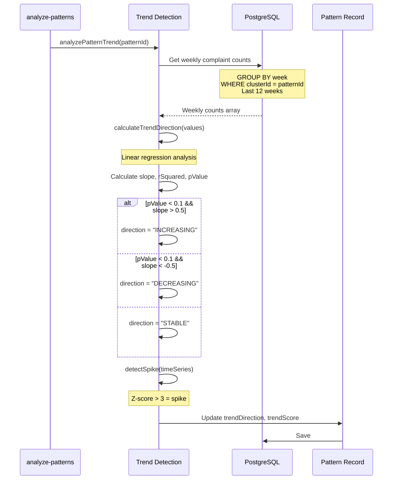
```mermaid
sequenceDiagram
    participant Cron as analyze-patterns
    participant Trend as Trend Detection
    participant DB as PostgreSQL
    participant Pattern as Pattern Record

    Cron->>Trend: analyzePatternTrend(patternId)

    Trend->>DB: Get weekly complaint counts
    Note over DB: GROUP BY week<br/>WHERE clusterId = patternId<br/>Last 12 weeks
    DB-->>Trend: Weekly counts array

    Trend->>Trend: calculateTrendDirection(values)
    Note over Trend: Linear regression analysis
    Trend->>Trend: Calculate slope, rSquared, pValue

    alt pValue < 0.1 && slope > 0.5
        Trend->>Trend: direction = "INCREASING"
    else pValue < 0.1 && slope < -0.5
        Trend->>Trend: direction = "DECREASING"
    else
        Trend->>Trend: direction = "STABLE"
    end

    Trend->>Trend: detectSpike(timeSeries)
    Note over Trend: Z-score > 3 = spike

    Trend->>Pattern: Update trendDirection, trendScore
    Pattern->>DB: Save
```

### Linear Regression for Trend

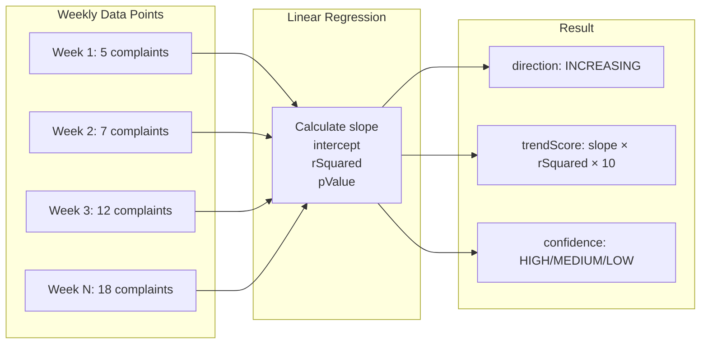
```mermaid
flowchart LR
    subgraph Input["Weekly Data Points"]
        W1["Week 1: 5 complaints"]
        W2["Week 2: 7 complaints"]
        W3["Week 3: 12 complaints"]
        WN["Week N: 18 complaints"]
    end

    subgraph Regression["Linear Regression"]
        Calc["Calculate slope<br/>intercept<br/>rSquared<br/>pValue"]
    end

    subgraph Output["Result"]
        Dir["direction: INCREASING"]
        Score["trendScore: slope × rSquared × 10"]
        Conf["confidence: HIGH/MEDIUM/LOW"]
    end

    W1 --> Calc
    W2 --> Calc
    W3 --> Calc
    WN --> Calc

    Calc --> Dir
    Calc --> Score
    Calc --> Conf
```

---

## 5. Anomaly Detection Flow

### IQR-Based Anomaly Detection

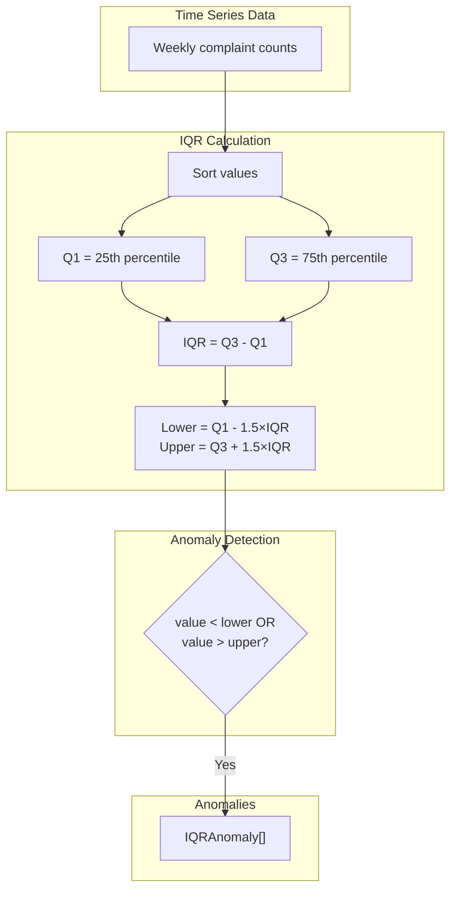
```mermaid
flowchart TD
    subgraph Input["Time Series Data"]
        Data["Weekly complaint counts"]
    end

    subgraph IQR["IQR Calculation"]
        Sort["Sort values"]
        Q1["Q1 = 25th percentile"]
        Q3["Q3 = 75th percentile"]
        IQRVal["IQR = Q3 - Q1"]
        Bounds["Lower = Q1 - 1.5×IQR<br/>Upper = Q3 + 1.5×IQR"]
    end

    subgraph Detection["Anomaly Detection"]
        Check{"value < lower OR<br/>value > upper?"}
    end

    subgraph Output["Anomalies"]
        Anomaly["IQRAnomaly[]"]
    end

    Data --> Sort
    Sort --> Q1
    Sort --> Q3
    Q1 --> IQRVal
    Q3 --> IQRVal
    IQRVal --> Bounds
    Bounds --> Check
    Check -->|Yes| Anomaly
```

### Anomaly Classification

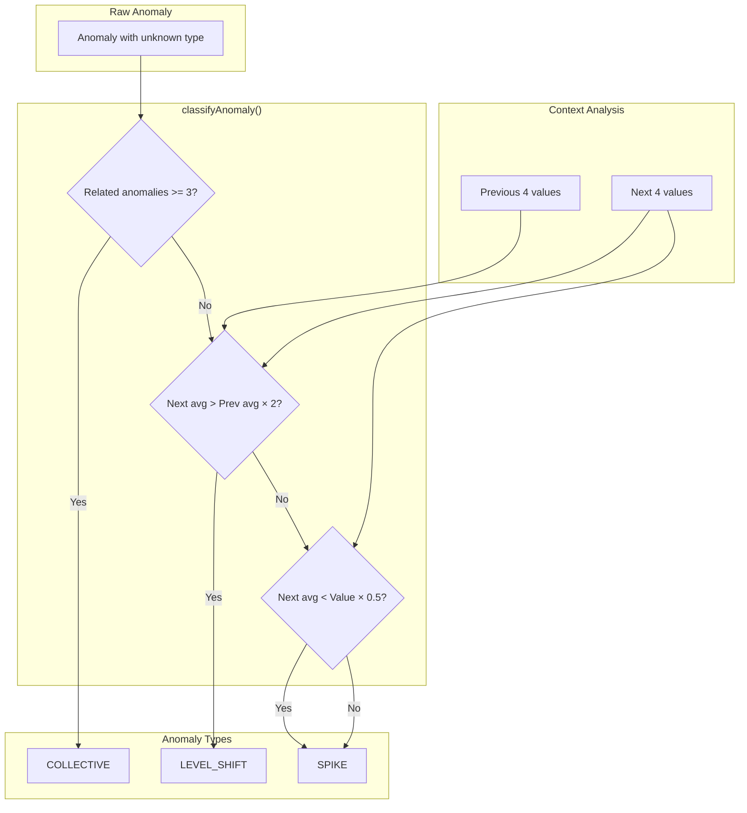
```mermaid
flowchart TD
    subgraph Detected["Raw Anomaly"]
        Raw["Anomaly with unknown type"]
    end

    subgraph Context["Context Analysis"]
        Prev["Previous 4 values"]
        Next["Next 4 values"]
    end

    subgraph Classification["classifyAnomaly()"]
        C1{"Related anomalies >= 3?"}
        C2{"Next avg > Prev avg × 2?"}
        C3{"Next avg < Value × 0.5?"}
    end

    subgraph Types["Anomaly Types"]
        Collective["COLLECTIVE"]
        LevelShift["LEVEL_SHIFT"]
        Spike["SPIKE"]
    end

    Raw --> C1
    Prev --> C2
    Next --> C2
    Next --> C3

    C1 -->|Yes| Collective
    C1 -->|No| C2
    C2 -->|Yes| LevelShift
    C2 -->|No| C3
    C3 -->|Yes| Spike
    C3 -->|No| Spike
```

---

## 6. Pattern Scoring Flow

### Severity Score Calculation

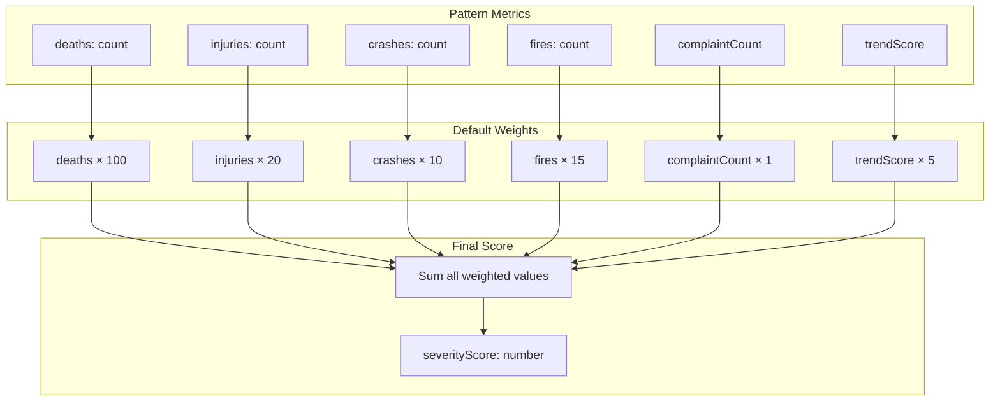
```mermaid
flowchart TD
    subgraph Metrics["Pattern Metrics"]
        M1["deaths: count"]
        M2["injuries: count"]
        M3["crashes: count"]
        M4["fires: count"]
        M5["complaintCount"]
        M6["trendScore"]
    end

    subgraph Weights["Default Weights"]
        W1["deaths × 100"]
        W2["injuries × 20"]
        W3["crashes × 10"]
        W4["fires × 15"]
        W5["complaintCount × 1"]
        W6["trendScore × 5"]
    end

    subgraph Score["Final Score"]
        Sum["Sum all weighted values"]
        Result["severityScore: number"]
    end

    M1 --> W1
    M2 --> W2
    M3 --> W3
    M4 --> W4
    M5 --> W5
    M6 --> W6

    W1 --> Sum
    W2 --> Sum
    W3 --> Sum
    W4 --> Sum
    W5 --> Sum
    W6 --> Sum

    Sum --> Result
```

### Pattern Ranking Flow

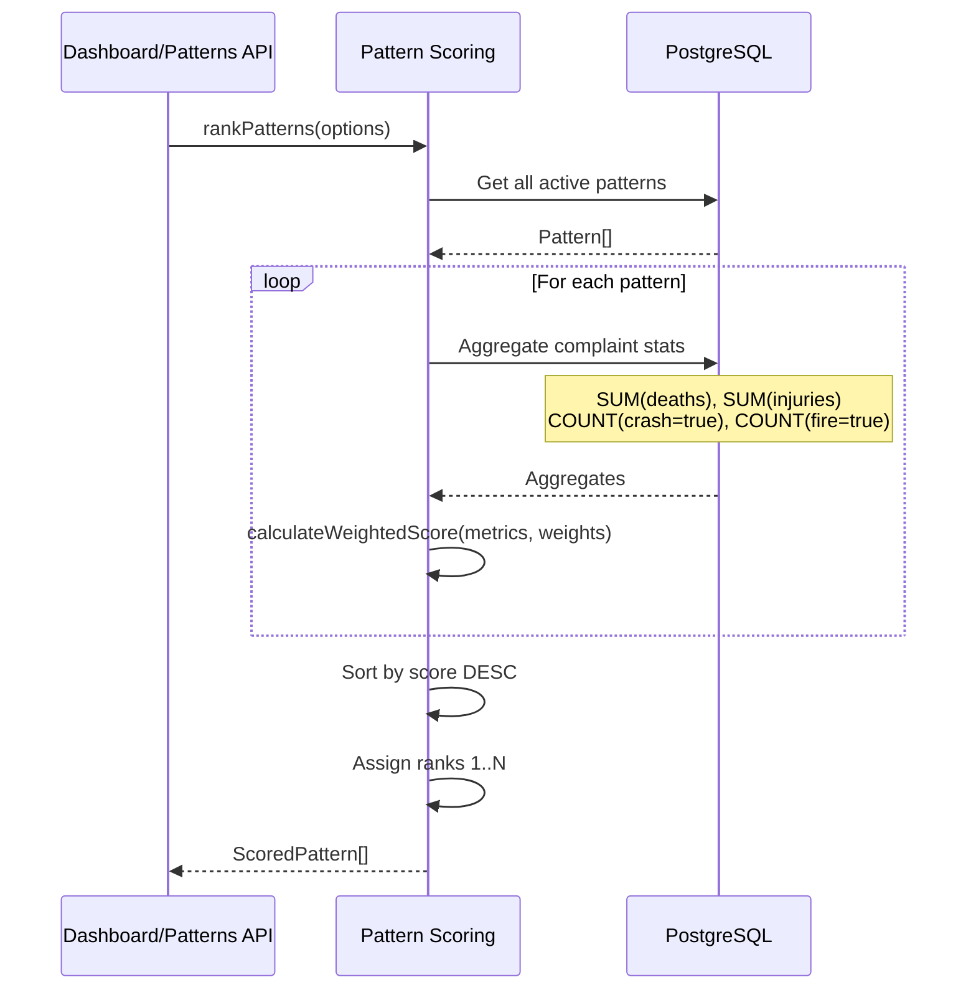
```mermaid
sequenceDiagram
    participant API as Dashboard/Patterns API
    participant Scoring as Pattern Scoring
    participant DB as PostgreSQL

    API->>Scoring: rankPatterns(options)

    Scoring->>DB: Get all active patterns
    DB-->>Scoring: Pattern[]

    loop For each pattern
        Scoring->>DB: Aggregate complaint stats
        Note over DB: SUM(deaths), SUM(injuries)<br/>COUNT(crash=true), COUNT(fire=true)
        DB-->>Scoring: Aggregates

        Scoring->>Scoring: calculateWeightedScore(metrics, weights)
    end

    Scoring->>Scoring: Sort by score DESC
    Scoring->>Scoring: Assign ranks 1..N

    Scoring-->>API: ScoredPattern[]
```

---

## 7. Complaint Generation Flow

### AI-Powered Document Generation

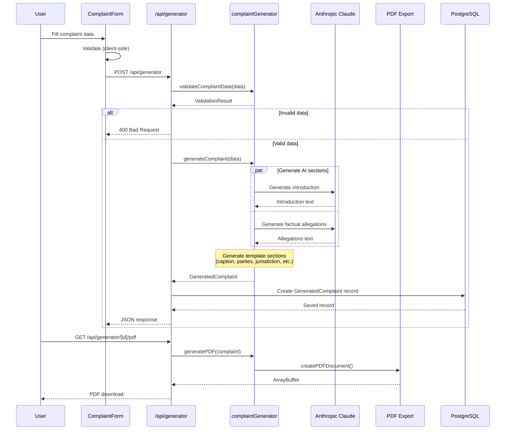
```mermaid
sequenceDiagram
    participant User
    participant Form as ComplaintForm
    participant API as /api/generator
    participant Gen as complaintGenerator
    participant Claude as Anthropic Claude
    participant PDF as PDF Export
    participant DB as PostgreSQL

    User->>Form: Fill complaint data
    Form->>Form: Validate (client-side)
    Form->>API: POST /api/generator

    API->>Gen: validateComplaintData(data)
    Gen-->>API: ValidationResult

    alt Invalid data
        API-->>Form: 400 Bad Request
    else Valid data
        API->>Gen: generateComplaint(data)

        par Generate AI sections
            Gen->>Claude: Generate introduction
            Claude-->>Gen: Introduction text
        and
            Gen->>Claude: Generate factual allegations
            Claude-->>Gen: Allegations text
        end

        Note over Gen: Generate template sections<br/>(caption, parties, jurisdiction, etc.)

        Gen-->>API: GeneratedComplaint

        API->>DB: Create GeneratedComplaint record
        DB-->>API: Saved record

        API-->>Form: JSON response
    end

    User->>API: GET /api/generator/[id]/pdf
    API->>Gen: generatePDF(complaint)
    Gen->>PDF: createPDFDocument()
    PDF-->>API: ArrayBuffer
    API-->>User: PDF download
```

### Complaint Section Generation

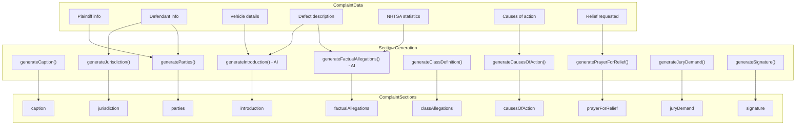
```mermaid
flowchart TB
    subgraph Input["ComplaintData"]
        CD1["Plaintiff info"]
        CD2["Defendant info"]
        CD3["Vehicle details"]
        CD4["Defect description"]
        CD5["NHTSA statistics"]
        CD6["Causes of action"]
        CD7["Relief requested"]
    end

    subgraph Generation["Section Generation"]
        G1["generateCaption()"]
        G2["generateIntroduction() - AI"]
        G3["generateJurisdiction()"]
        G4["generateParties()"]
        G5["generateFactualAllegations() - AI"]
        G6["generateClassDefinition()"]
        G7["generateCausesOfAction()"]
        G8["generatePrayerForRelief()"]
        G9["generateJuryDemand()"]
        G10["generateSignature()"]
    end

    subgraph Output["ComplaintSections"]
        O1["caption"]
        O2["introduction"]
        O3["jurisdiction"]
        O4["parties"]
        O5["factualAllegations"]
        O6["classAllegations"]
        O7["causesOfAction"]
        O8["prayerForRelief"]
        O9["juryDemand"]
        O10["signature"]
    end

    CD1 --> G4
    CD2 --> G3
    CD2 --> G4
    CD3 --> G2
    CD4 --> G2
    CD4 --> G5
    CD5 --> G5
    CD6 --> G7
    CD7 --> G8

    G1 --> O1
    G2 --> O2
    G3 --> O3
    G4 --> O4
    G5 --> O5
    G6 --> O6
    G7 --> O7
    G8 --> O8
    G9 --> O9
    G10 --> O10
```

### Claude AI Prompt Flow

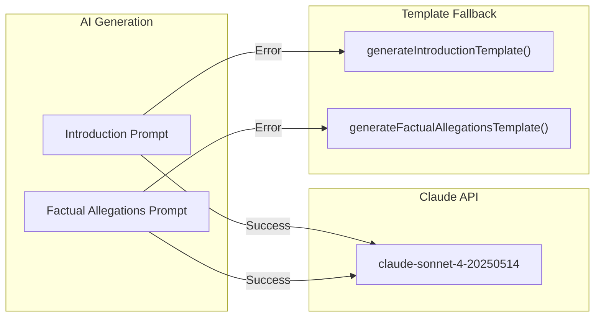
```mermaid
flowchart LR
    subgraph Prompts["AI Generation"]
        P1["Introduction Prompt"]
        P2["Factual Allegations Prompt"]
    end

    subgraph Model["Claude API"]
        M1["claude-sonnet-4-20250514"]
    end

    subgraph Fallback["Template Fallback"]
        F1["generateIntroductionTemplate()"]
        F2["generateFactualAllegationsTemplate()"]
    end

    P1 -->|Success| M1
    P2 -->|Success| M1
    P1 -->|Error| F1
    P2 -->|Error| F2
```

---

## 8. PDF Export Flow

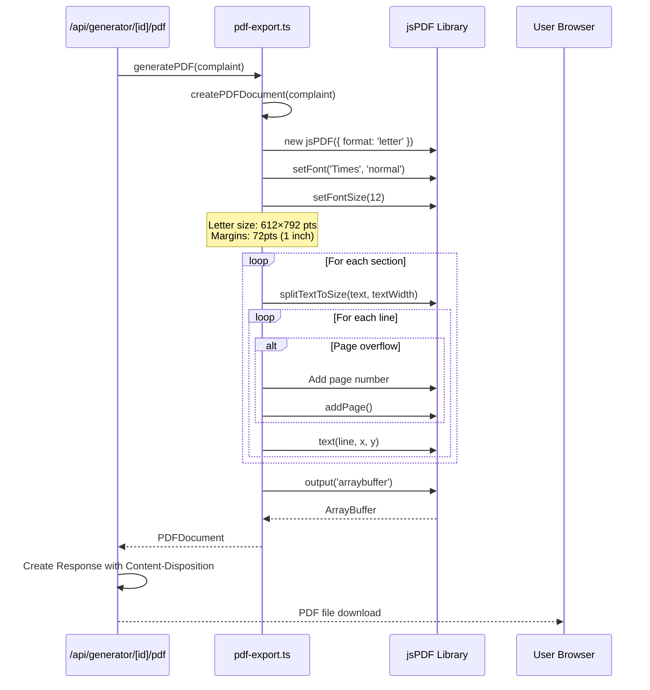
```mermaid
sequenceDiagram
    participant API as /api/generator/[id]/pdf
    participant Export as pdf-export.ts
    participant jsPDF as jsPDF Library
    participant Browser as User Browser

    API->>Export: generatePDF(complaint)
    Export->>Export: createPDFDocument(complaint)

    Export->>jsPDF: new jsPDF({ format: 'letter' })
    Export->>jsPDF: setFont('Times', 'normal')
    Export->>jsPDF: setFontSize(12)

    Note over Export: Letter size: 612×792 pts<br/>Margins: 72pts (1 inch)

    loop For each section
        Export->>jsPDF: splitTextToSize(text, textWidth)

        loop For each line
            alt Page overflow
                Export->>jsPDF: Add page number
                Export->>jsPDF: addPage()
            end
            Export->>jsPDF: text(line, x, y)
        end
    end

    Export->>jsPDF: output('arraybuffer')
    jsPDF-->>Export: ArrayBuffer

    Export-->>API: PDFDocument
    API->>API: Create Response with Content-Disposition
    API-->>Browser: PDF file download
```

---

## 9. Semantic Search Flow

### Vector Similarity Search

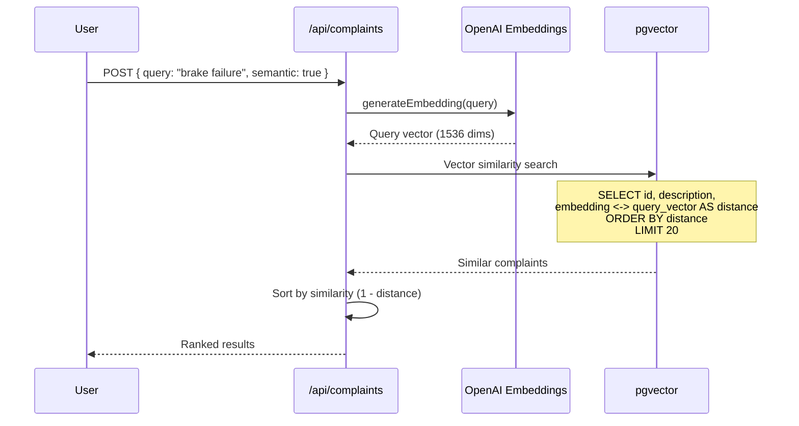
```mermaid
sequenceDiagram
    participant User
    participant API as /api/complaints
    participant Embed as OpenAI Embeddings
    participant PGVector as pgvector

    User->>API: POST { query: "brake failure", semantic: true }

    API->>Embed: generateEmbedding(query)
    Embed-->>API: Query vector (1536 dims)

    API->>PGVector: Vector similarity search
    Note over PGVector: SELECT id, description,<br/>embedding <-> query_vector AS distance<br/>ORDER BY distance<br/>LIMIT 20

    PGVector-->>API: Similar complaints
    API->>API: Sort by similarity (1 - distance)
    API-->>User: Ranked results
```

### pgvector Query Optimization

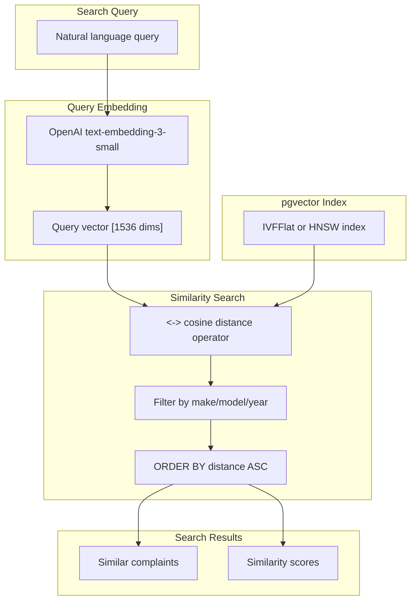
```mermaid
flowchart TD
    subgraph Query["Search Query"]
        Q1["Natural language query"]
    end

    subgraph Embedding["Query Embedding"]
        E1["OpenAI text-embedding-3-small"]
        E2["Query vector [1536 dims]"]
    end

    subgraph Index["pgvector Index"]
        I1["IVFFlat or HNSW index"]
    end

    subgraph Search["Similarity Search"]
        S1["<-> cosine distance operator"]
        S2["Filter by make/model/year"]
        S3["ORDER BY distance ASC"]
    end

    subgraph Results["Search Results"]
        R1["Similar complaints"]
        R2["Similarity scores"]
    end

    Q1 --> E1
    E1 --> E2
    E2 --> S1
    I1 --> S1
    S1 --> S2
    S2 --> S3
    S3 --> R1
    S3 --> R2
```

---

## 10. Dashboard Data Flow

### Stats Aggregation

```mermaid
sequenceDiagram
    participant Dashboard as /dashboard
    participant API as /api/dashboard/stats
    participant DB as PostgreSQL

    Dashboard->>API: GET /api/dashboard/stats

    par Parallel queries
        API->>DB: COUNT complaints
        API->>DB: COUNT active patterns
        API->>DB: SUM injuries + deaths
        API->>DB: COUNT patterns WHERE trendDirection='INCREASING'
    end

    DB-->>API: Aggregated counts

    API-->>Dashboard: Stats response
```

### Activity Feed Flow

```mermaid
sequenceDiagram
    participant Dashboard as /dashboard
    participant API as /api/dashboard/activity
    participant DB as PostgreSQL

    Dashboard->>API: GET /api/dashboard/activity?limit=10

    API->>DB: Get recent complaints
    Note over DB: ORDER BY dateAdded DESC<br/>LIMIT 10

    API->>DB: Get recent patterns
    Note over DB: ORDER BY lastUpdated DESC<br/>LIMIT 5

    API->>DB: Get recent generated complaints
    Note over DB: WHERE org = user.org<br/>ORDER BY createdAt DESC<br/>LIMIT 5

    DB-->>API: Recent items

    API->>API: Merge and sort by date
    API->>API: Format as ActivityItem[]

    API-->>Dashboard: Activity feed
```

### Alerts Generation

```mermaid
flowchart TD
    subgraph Sources["Alert Sources"]
        S1["Anomaly Detection"]
        S2["Trend Detection"]
        S3["Pattern Scoring"]
    end

    subgraph Triggers["Alert Triggers"]
        T1["Spike detected (Z > 3)"]
        T2["Level shift detected"]
        T3["Severity score > threshold"]
        T4["Trend direction = INCREASING"]
    end

    subgraph Priority["Priority Assignment"]
        P1["Critical: deaths > 0"]
        P2["High: injuries > 0"]
        P3["Medium: increasing trend"]
        P4["Low: new pattern"]
    end

    subgraph Output["Alert Response"]
        O1["AlertItem[]"]
    end

    S1 --> T1
    S1 --> T2
    S2 --> T4
    S3 --> T3

    T1 --> P1
    T2 --> P2
    T3 --> P3
    T4 --> P4

    P1 --> O1
    P2 --> O1
    P3 --> O1
    P4 --> O1
```

---

## 11. User Journey Flows

### New User Onboarding

```mermaid
flowchart TD
    subgraph Start["Entry"]
        A["Visit /"]
    end

    subgraph Auth["Authentication"]
        B["Click Sign Up"]
        C["/sign-up page"]
        D["Clerk SignUp component"]
        E["Create account"]
        F["Clerk webhook: user.created"]
        G["Create org in Clerk"]
        H["Clerk webhook: org.created"]
        I["Clerk webhook: membership.created"]
    end

    subgraph Setup["Database Setup"]
        J["Create Organization record"]
        K["Create User record"]
        L["Assign ADMIN role"]
    end

    subgraph Ready["Dashboard"]
        M["/dashboard"]
        N["View stats, activity, alerts"]
    end

    A --> B
    B --> C
    C --> D
    D --> E
    E --> F
    F --> K
    E --> G
    G --> H
    H --> J
    G --> I
    I --> L
    L --> M
    M --> N
```

### Complaint Search Journey

```mermaid
flowchart TD
    subgraph Search["Search Flow"]
        A["Navigate to /complaints"]
        B["Enter search query"]
        C["Apply filters"]
        D["Submit search"]
    end

    subgraph API["API Processing"]
        E["POST /api/complaints"]
        F{"Semantic search?"}
        G["Generate query embedding"]
        H["pgvector similarity search"]
        I["Traditional text search"]
        J["Apply filters"]
    end

    subgraph Results["Results Display"]
        K["ComplaintTable renders"]
        L["Click complaint row"]
        M["ComplaintDetailDialog opens"]
    end

    A --> B
    B --> C
    C --> D
    D --> E
    E --> F
    F -->|Yes| G
    G --> H
    H --> J
    F -->|No| I
    I --> J
    J --> K
    K --> L
    L --> M
```

### Pattern Investigation Journey

```mermaid
flowchart TD
    subgraph Browse["Browse Patterns"]
        A["Navigate to /patterns"]
        B["View PatternCard list"]
        C["Filter by severity/trend"]
    end

    subgraph Investigate["Investigation"]
        D["Click pattern"]
        E["PatternDetailDialog opens"]
        F["View statistics"]
        G["See trend chart"]
        H["Browse related complaints"]
    end

    subgraph Action["Take Action"]
        I["Click 'Generate Complaint'"]
        J["Navigate to /generator"]
        K["Pre-filled with pattern data"]
    end

    A --> B
    B --> C
    C --> D
    D --> E
    E --> F
    E --> G
    E --> H
    H --> I
    I --> J
    J --> K
```

### Complaint Generation Journey

```mermaid
flowchart TD
    subgraph Start["Start Generation"]
        A["Navigate to /generator"]
        B["Select pattern or start fresh"]
    end

    subgraph Form["Multi-Step Form"]
        C["Step 1: Court Info"]
        D["Step 2: Plaintiff Info"]
        E["Step 3: Defendant Info"]
        F["Step 4: Vehicle Details"]
        G["Step 5: Defect Info"]
        H["Step 6: Class Definition"]
        I["Step 7: Causes of Action"]
        J["Step 8: Relief"]
        K["Step 9: Attorney Info"]
    end

    subgraph Generate["Generation"]
        L["Submit form"]
        M["Claude generates sections"]
        N["Save to database"]
    end

    subgraph Export["Export"]
        O["View generated complaint"]
        P["Download PDF"]
        Q["Edit/finalize"]
    end

    A --> B
    B --> C
    C --> D
    D --> E
    E --> F
    F --> G
    G --> H
    H --> I
    I --> J
    J --> K
    K --> L
    L --> M
    M --> N
    N --> O
    O --> P
    O --> Q
```

---

## 12. Data Synchronization Flow

### Real-Time Data Updates

```mermaid
sequenceDiagram
    participant Browser as User Browser
    participant Next as Next.js
    participant API as API Routes
    participant DB as PostgreSQL

    Note over Browser: Client-side polling (SWR)

    loop Every 30 seconds
        Browser->>API: GET /api/dashboard/stats
        API->>DB: Query current stats
        DB-->>API: Updated counts
        API-->>Browser: Stats JSON
        Browser->>Browser: Update UI if changed
    end

    Note over Browser: On-demand refresh
    Browser->>Browser: User clicks refresh
    Browser->>API: Invalidate SWR cache
    Browser->>API: Fetch fresh data
```

### Cron Job Schedule

```mermaid
gantt
    title CaseRadar Cron Jobs
    dateFormat HH:mm
    axisFormat %H:%M

    section NHTSA Sync
    sync-nhtsa (6h interval)    :00:00, 6h
    sync-nhtsa (6h interval)    :06:00, 6h
    sync-nhtsa (6h interval)    :12:00, 6h
    sync-nhtsa (6h interval)    :18:00, 6h

    section Pattern Analysis
    analyze-patterns (daily)    :02:00, 1h
```

---

## 13. Error Handling Flows

### API Error Flow

```mermaid
flowchart TD
    subgraph Request["Incoming Request"]
        R1["API Route Handler"]
    end

    subgraph Validation["Validation Layer"]
        V1{"Auth check"}
        V2{"Input validation"}
        V3{"Permission check"}
    end

    subgraph Errors["Error Responses"]
        E1["401 Unauthorized"]
        E2["400 Bad Request"]
        E3["403 Forbidden"]
        E4["500 Internal Error"]
    end

    subgraph Success["Success Path"]
        S1["Process request"]
        S2["Return data"]
    end

    R1 --> V1
    V1 -->|No auth| E1
    V1 -->|Auth OK| V2
    V2 -->|Invalid| E2
    V2 -->|Valid| V3
    V3 -->|Denied| E3
    V3 -->|Allowed| S1
    S1 -->|Error| E4
    S1 -->|Success| S2
```

### Sync Error Recovery

```mermaid
flowchart TD
    subgraph Sync["NHTSA Sync"]
        A["Start sync"]
        B["Fetch from NHTSA"]
        C["Transform records"]
        D["Insert to DB"]
    end

    subgraph Errors["Error Handling"]
        E1["API timeout"]
        E2["Transform error"]
        E3["DB constraint violation"]
    end

    subgraph Recovery["Recovery"]
        R1["Retry with backoff"]
        R2["Log error, continue"]
        R3["skipDuplicates: true"]
    end

    subgraph Status["SyncStatus"]
        S1["errors: string[]"]
        S2["newComplaints: number"]
    end

    A --> B
    B -->|Error| E1
    E1 --> R1
    R1 --> B

    B --> C
    C -->|Error| E2
    E2 --> R2
    R2 --> C

    C --> D
    D -->|Duplicate| E3
    E3 --> R3
    R3 --> S2

    D --> S2
    R2 --> S1
```

---

**Previous:** [04-authentication.md](./04-authentication.md) - Authentication
**Next:** [06-file-structure.md](./06-file-structure.md) - File Structure
