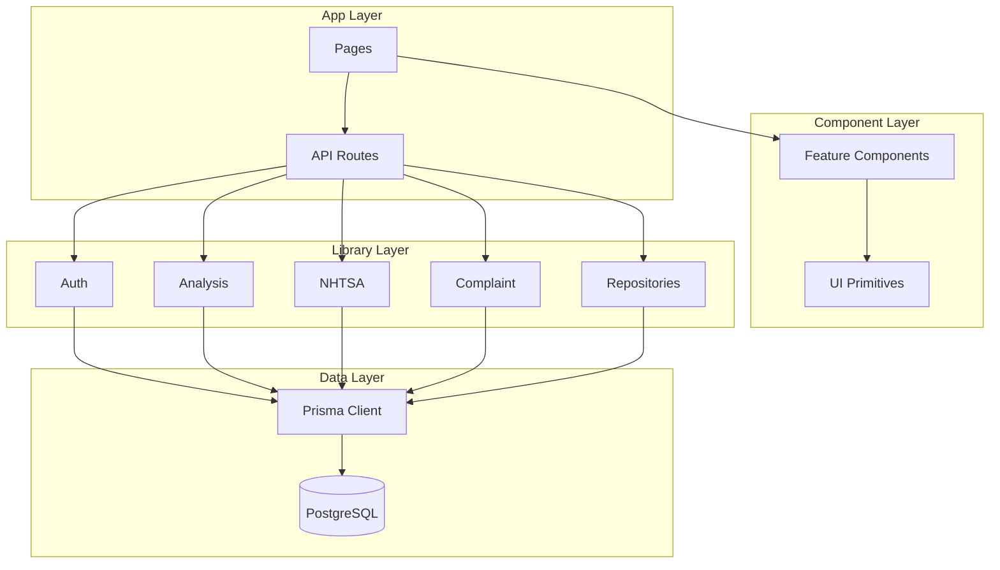

# CaseRadar File Structure Documentation

## Overview

This document provides a complete file tree of CaseRadar with descriptions of every directory and file.

---

## Root Directory Structure

```
caseradar/
├── .claude/                    # Claude AI agent configuration
├── .env                        # Environment variables (not committed)
├── .env.example                # Example environment variables template
├── .git/                       # Git repository
├── .github/                    # GitHub Actions and templates
├── .gitignore                  # Git ignore patterns
├── .next/                      # Next.js build output (generated)
├── .prettierignore             # Prettier ignore patterns
├── .prettierrc                 # Prettier configuration
├── .serena/                    # Serena AI agent memories
├── bun.lock                    # Bun package lock file
├── components.json             # shadcn/ui components configuration
├── coverage/                   # Test coverage reports
├── docker/                     # Docker configurations
├── docker-compose.yml          # Docker Compose configuration
├── docs/                       # Documentation
├── e2e/                        # End-to-end Playwright tests
├── eslint.config.mjs           # ESLint configuration
├── next-env.d.ts               # Next.js TypeScript declarations
├── next.config.ts              # Next.js configuration
├── node_modules/               # npm dependencies (generated)
├── package.json                # Project dependencies and scripts
├── playwright-report/          # Playwright test reports
├── playwright.config.ts        # Playwright configuration
├── postcss.config.mjs          # PostCSS configuration (Tailwind)
├── prisma/                     # Prisma ORM configuration
├── prisma.config.ts            # Prisma client configuration
├── prompts/                    # AI prompt templates
├── public/                     # Static assets
├── README.md                   # Project README
├── sentry.client.config.ts     # Sentry client-side config
├── sentry.edge.config.ts       # Sentry edge runtime config
├── sentry.server.config.ts     # Sentry server-side config
├── src/                        # Application source code
├── test-results/               # Playwright test results
├── tsconfig.json               # TypeScript configuration
├── vercel.json                 # Vercel deployment config
└── vitest.config.ts            # Vitest test configuration
```

---

## Source Directory (`src/`)

### Top-Level Source Structure

```
src/
├── app/                        # Next.js App Router
├── components/                 # React components
├── lib/                        # Business logic & utilities
├── middleware.ts               # Next.js middleware (Clerk auth)
└── test/                       # Test utilities and mocks
```

---

## App Directory (`src/app/`)

### Next.js App Router Structure

```
src/app/
├── (dashboard)/                # Dashboard route group (authenticated)
│   ├── complaints/
│   │   └── page.tsx           # Complaints search & list page
│   ├── dashboard/
│   │   └── page.tsx           # Main dashboard page
│   ├── generator/
│   │   └── page.tsx           # Complaint generator page
│   ├── layout.tsx             # Dashboard layout (sidebar + header)
│   ├── patterns/
│   │   └── page.tsx           # Patterns list page
│   └── settings/
│       └── page.tsx           # User settings page
├── api/                        # API routes
│   ├── __tests__/             # API route tests
│   │   ├── complaints.test.ts
│   │   ├── dashboard.test.ts
│   │   ├── generator.test.ts
│   │   └── patterns.test.ts
│   ├── complaints/
│   │   ├── [id]/
│   │   │   └── route.ts       # GET single complaint
│   │   └── route.ts           # GET/POST complaints (search/list)
│   ├── cron/
│   │   ├── analyze-patterns/
│   │   │   └── route.ts       # Pattern analysis cron job
│   │   └── sync-nhtsa/
│   │       └── route.ts       # NHTSA data sync cron job
│   ├── dashboard/
│   │   ├── activity/
│   │   │   └── route.ts       # Activity feed endpoint
│   │   ├── alerts/
│   │   │   └── route.ts       # Alerts endpoint
│   │   └── stats/
│   │       └── route.ts       # Dashboard statistics
│   ├── generator/
│   │   ├── [id]/
│   │   │   ├── pdf/
│   │   │   │   └── route.ts   # PDF download endpoint
│   │   │   └── route.ts       # GET/DELETE generated complaint
│   │   └── route.ts           # POST create / GET list
│   ├── health/
│   │   ├── db/
│   │   │   └── route.ts       # Database health check
│   │   ├── route.ts           # Basic health check
│   │   └── services/
│   │       └── route.ts       # External services health
│   ├── patterns/
│   │   ├── [id]/
│   │   │   └── route.ts       # GET/PUT/DELETE pattern
│   │   └── route.ts           # GET list / POST create pattern
│   └── webhooks/
│       ├── clerk/
│       │   └── route.ts       # Clerk auth webhooks
│       └── stripe/
│           └── route.ts       # Stripe billing webhooks
├── globals.css                 # Global styles (Tailwind base)
├── layout.tsx                  # Root layout (ClerkProvider)
├── login/
│   └── page.tsx               # Legacy login redirect
├── page.tsx                    # Landing page (/)
├── sign-in/
│   └── [[...sign-in]]/
│       └── page.tsx           # Clerk sign-in page
└── sign-up/
    └── [[...sign-up]]/
        └── page.tsx           # Clerk sign-up page
```

### Route Descriptions

| Route | File | Description |
|-------|------|-------------|
| `/` | `page.tsx` | Public landing page with hero and features |
| `/sign-in` | `sign-in/[[...sign-in]]/page.tsx` | Clerk sign-in component |
| `/sign-up` | `sign-up/[[...sign-up]]/page.tsx` | Clerk sign-up component |
| `/dashboard` | `(dashboard)/dashboard/page.tsx` | Stats cards, activity, alerts |
| `/complaints` | `(dashboard)/complaints/page.tsx` | Complaint search and filtering |
| `/patterns` | `(dashboard)/patterns/page.tsx` | Pattern grid with severity badges |
| `/generator` | `(dashboard)/generator/page.tsx` | Multi-step complaint form |
| `/settings` | `(dashboard)/settings/page.tsx` | User preferences (tabs) |

---

## Components Directory (`src/components/`)

### Component Structure

```
src/components/
├── complaints/                 # Complaint-specific components
│   ├── __tests__/
│   │   ├── complaint-filters.test.tsx
│   │   └── complaint-table.test.tsx
│   ├── complaint-detail-dialog.tsx  # Full complaint view modal
│   ├── complaint-filters.tsx        # Search and filter controls
│   ├── complaint-table.tsx          # Data table with sorting
│   └── index.ts                     # Barrel export
├── dashboard/                  # Dashboard components
│   ├── __tests__/
│   │   ├── activity-feed.test.tsx
│   │   ├── alerts-panel.test.tsx
│   │   └── stats-cards.test.tsx
│   ├── activity-feed.tsx            # Recent activity timeline
│   ├── alerts-panel.tsx             # Priority-sorted alerts
│   ├── index.ts                     # Barrel export
│   └── stats-cards.tsx              # Metrics display cards
├── generator/                  # Generator components
│   ├── __tests__/
│   │   ├── complaint-form.test.tsx
│   │   └── generated-list.test.tsx
│   ├── complaint-form.tsx           # Multi-step form wizard
│   ├── generated-list.tsx           # History table
│   └── index.ts                     # Barrel export
├── patterns/                   # Pattern components
│   ├── __tests__/
│   │   └── pattern-card.test.tsx
│   ├── index.ts                     # Barrel export
│   ├── pattern-card.tsx             # Pattern summary card
│   └── pattern-detail-dialog.tsx    # Full pattern view modal
├── theme-provider.tsx          # Next-themes provider wrapper
├── types.ts                    # Shared component types
└── ui/                         # shadcn/ui primitives
    ├── alert.tsx               # Alert component
    ├── badge.tsx               # Badge component
    ├── button.tsx              # Button component
    ├── card.tsx                # Card component
    ├── checkbox.tsx            # Checkbox component
    ├── dialog.tsx              # Dialog/modal component
    ├── dropdown-menu.tsx       # Dropdown menu component
    ├── form.tsx                # Form components (react-hook-form)
    ├── input.tsx               # Input component
    ├── label.tsx               # Label component
    ├── select.tsx              # Select component
    ├── separator.tsx           # Separator component
    ├── skeleton.tsx            # Loading skeleton
    ├── sonner.tsx              # Toast notifications (Sonner)
    ├── table.tsx               # Table component
    ├── tabs.tsx                # Tabs component
    └── textarea.tsx            # Textarea component
```

### Component Details

| Component | Purpose |
|-----------|---------|
| `ComplaintFilters` | Search input, make/model/year dropdowns, date range |
| `ComplaintTable` | Sortable data table with row selection |
| `ComplaintDetailDialog` | Full complaint details in modal |
| `StatsCards` | 4-card grid showing key metrics |
| `ActivityFeed` | Timeline of recent system activity |
| `AlertsPanel` | Priority-sorted alerts with actions |
| `PatternCard` | Pattern summary with severity badge |
| `PatternDetailDialog` | Full pattern stats and related complaints |
| `ComplaintForm` | 9-step wizard for legal complaint generation |
| `GeneratedList` | Table of generated complaints with actions |

---

## Library Directory (`src/lib/`)

### Business Logic Structure

```
src/lib/
├── analysis/                   # ML/AI analysis services
│   ├── __tests__/
│   │   ├── anomaly-detection.test.ts
│   │   ├── clustering.test.ts
│   │   ├── pattern-scoring.test.ts
│   │   └── trend-detection.test.ts
│   ├── anomaly-detection.ts    # IQR-based anomaly detection
│   ├── clustering.ts           # Vector similarity clustering
│   ├── index.ts                # Barrel export
│   ├── pattern-scoring.ts      # Severity score calculation
│   └── trend-detection.ts      # Linear regression trends
├── api/                        # API utilities
│   ├── index.ts                # Barrel export
│   ├── response-helpers.ts     # JSON response utilities
│   └── types.ts                # API type definitions
├── auth/                       # Authentication utilities
│   ├── __tests__/
│   │   ├── auth-middleware.test.ts
│   │   └── user-sync.test.ts
│   ├── auth-middleware.ts      # getCurrentUser, withAuth, withRole
│   ├── index.ts                # Barrel export
│   └── user-sync.ts            # Clerk webhook processing
├── billing/                    # Stripe billing
│   ├── __tests__/
│   │   ├── billing-service.test.ts
│   │   └── subscription-webhook.test.ts
│   ├── billing-service.ts      # Subscription management
│   ├── index.ts                # Barrel export
│   └── subscription-webhook.ts # Stripe webhook handlers
├── complaint/                  # Complaint generation
│   ├── __tests__/
│   │   ├── complaint-generator.test.ts
│   │   └── pdf-export.test.ts
│   ├── api-helpers.ts          # API route helpers
│   ├── complaint-generator.ts  # Claude AI document generation
│   ├── index.ts                # Barrel export
│   ├── pdf-export.ts           # jsPDF document creation
│   └── types.ts                # Complaint type definitions
├── db.ts                       # Prisma client singleton
├── embeddings/                 # OpenAI embeddings
│   ├── complaint-embedder.ts   # Batch embedding for complaints
│   ├── index.ts                # Barrel export
│   └── openai.ts               # OpenAI API wrapper
├── nhtsa/                      # NHTSA data integration
│   ├── client.ts               # NHTSA API client
│   ├── index.ts                # Barrel export
│   ├── sync.ts                 # Data sync service
│   ├── transformer.ts          # SODA → database transform
│   └── types.ts                # NHTSA type definitions
├── pdf/                        # PDF utilities
│   └── index.ts                # PDF export barrel
├── repositories/               # Data access layer
│   ├── complaint.ts            # Complaint queries
│   ├── index.ts                # Barrel export
│   ├── organization.ts         # Organization queries
│   ├── pattern.ts              # Pattern queries
│   └── user.ts                 # User queries
├── security/                   # Security utilities
│   ├── __tests__/
│   │   ├── audit-logging.test.ts
│   │   ├── input-sanitization.test.ts
│   │   └── security-headers.test.ts
│   ├── audit-logging.ts        # Audit log creation
│   ├── index.ts                # Barrel export
│   ├── input-sanitization.ts   # XSS/injection prevention
│   └── security-headers.ts     # HTTP security headers
└── utils.ts                    # Shared utility functions (cn)
```

### Library Module Details

| Module | Purpose |
|--------|---------|
| `analysis/` | ML analysis: clustering, trend detection, anomaly detection, scoring |
| `api/` | API response helpers and shared types |
| `auth/` | Authentication utilities, Clerk integration, user sync |
| `billing/` | Stripe subscription management and webhooks |
| `complaint/` | Legal complaint generation with Claude AI |
| `embeddings/` | OpenAI embedding generation for semantic search |
| `nhtsa/` | NHTSA API client, data sync, and transformation |
| `repositories/` | Database access layer (Prisma queries) |
| `security/` | Audit logging, input sanitization, security headers |

---

## Prisma Directory (`prisma/`)

```
prisma/
├── schema.prisma              # Database schema definition
└── seed.ts                    # Database seeding script
```

### Schema Models

| Model | Purpose |
|-------|---------|
| `Organization` | Multi-tenant root entity |
| `User` | Individual users with roles |
| `Complaint` | NHTSA vehicle complaints |
| `Pattern` | Detected complaint clusters |
| `GeneratedComplaint` | AI-generated legal documents |
| `Subscription` | Stripe subscription info |
| `AuditLog` | Security audit trail |

---

## E2E Test Directory (`e2e/`)

```
e2e/
├── accessibility.spec.ts      # Accessibility compliance tests
├── complaints.spec.ts         # Complaints page tests
├── dashboard.spec.ts          # Dashboard tests
├── generator.spec.ts          # Generator workflow tests
├── home.spec.ts               # Landing page tests
├── patterns.spec.ts           # Patterns page tests
└── settings.spec.ts           # Settings page tests
```

---

## Test Directory (`src/test/`)

```
src/test/
├── mocks/
│   ├── handlers.ts            # MSW request handlers
│   └── server.ts              # MSW server setup
├── setup.ts                   # Vitest global setup
└── test-utils.tsx             # Testing utilities (render, etc.)
```

---

## Documentation Directory (`docs/`)

```
docs/
├── ADMIN_GUIDE.md             # Administrator guide
├── architecture/              # Architecture documentation
│   ├── 00-overview.md         # System overview
│   ├── 01-database-schema.md  # Database ERD
│   ├── 02-api-routes.md       # API documentation
│   ├── 03-frontend-components.md  # Component architecture
│   ├── 04-authentication.md   # Auth system docs
│   ├── 05-data-flow.md        # Data flow diagrams
│   ├── 06-file-structure.md   # This file
│   ├── 07-dependencies.md     # Dependencies catalog
│   └── 08-deployment.md       # Deployment guide
├── IMPLEMENTATION_ROADMAP.md  # Development roadmap
├── KNOWN_ISSUES.md            # Known issues tracker
├── OPERATIONS.md              # Operations guide
├── PLAN_v1.md                 # Original project plan
├── PLAN_v2.md                 # Updated project plan
├── README.md                  # Documentation index
├── research/                  # Research documents
│   ├── analysis-tools.md      # ML/analysis research
│   ├── compliance.md          # Compliance research
│   ├── legal-complaints.md    # Legal document research
│   ├── nhtsa-api.md           # NHTSA API research
│   ├── saas-infrastructure.md # Infrastructure research
│   └── tech-stack.md          # Technology decisions
├── RESEARCH_AGENDA.md         # Research planning
├── SECURITY.md                # Security documentation
├── TEST_STRATEGY.md           # Testing strategy
├── USER_GUIDE.md              # End-user guide
└── ux-testing-report.md       # UX testing results
```

---

## Configuration Files

### Root Configuration

| File | Purpose |
|------|---------|
| `package.json` | Dependencies, scripts, project metadata |
| `tsconfig.json` | TypeScript compiler configuration |
| `next.config.ts` | Next.js configuration |
| `tailwind.config.ts` | Tailwind CSS configuration (if present) |
| `postcss.config.mjs` | PostCSS plugins (Tailwind) |
| `eslint.config.mjs` | ESLint rules |
| `.prettierrc` | Prettier formatting rules |
| `components.json` | shadcn/ui component configuration |
| `vitest.config.ts` | Vitest test runner configuration |
| `playwright.config.ts` | Playwright E2E test configuration |
| `prisma.config.ts` | Prisma client configuration |
| `vercel.json` | Vercel deployment settings |
| `docker-compose.yml` | Docker services (PostgreSQL) |

### Sentry Configuration

| File | Purpose |
|------|---------|
| `sentry.client.config.ts` | Client-side error tracking |
| `sentry.server.config.ts` | Server-side error tracking |
| `sentry.edge.config.ts` | Edge runtime error tracking |

### Environment Files

| File | Purpose |
|------|---------|
| `.env` | Local environment variables |
| `.env.example` | Template for required env vars |

---

## Naming Conventions

### Files

| Pattern | Convention | Example |
|---------|------------|---------|
| React Components | `kebab-case.tsx` | `complaint-filters.tsx` |
| API Routes | `route.ts` | `api/complaints/route.ts` |
| Utility Modules | `kebab-case.ts` | `auth-middleware.ts` |
| Test Files | `*.test.ts(x)` | `complaint-filters.test.tsx` |
| Type Files | `types.ts` | `lib/complaint/types.ts` |
| Index Files | `index.ts` | Barrel exports |

### Directories

| Pattern | Convention | Example |
|---------|------------|---------|
| Feature Modules | `kebab-case` | `src/lib/nhtsa/` |
| Component Groups | `kebab-case` | `src/components/complaints/` |
| Route Groups | `(group-name)` | `src/app/(dashboard)/` |
| Dynamic Routes | `[param]` or `[[...param]]` | `[id]/` or `[[...sign-in]]/` |
| Test Directories | `__tests__/` | `src/components/complaints/__tests__/` |

### Exports

- All library modules use barrel exports (`index.ts`)
- Components are exported from feature directories
- Types are co-located with their modules

---

## File Dependencies



---

## Import Aliases

Configured in `tsconfig.json`:

| Alias | Path |
|-------|------|
| `@/` | `src/` |
| `@/app` | `src/app/` |
| `@/components` | `src/components/` |
| `@/lib` | `src/lib/` |
| `@/test` | `src/test/` |

---

**Previous:** [05-data-flow.md](./05-data-flow.md) - Data Flow
**Next:** [07-dependencies.md](./07-dependencies.md) - Dependencies
