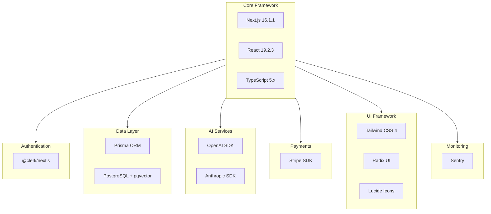
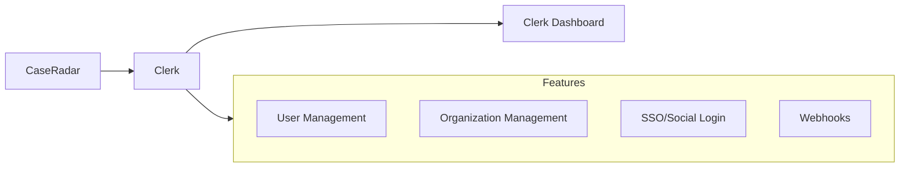
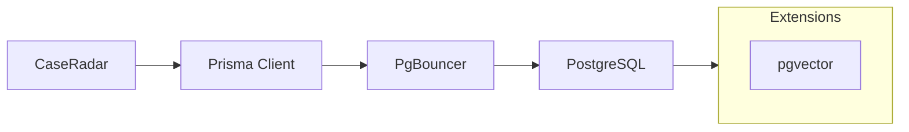
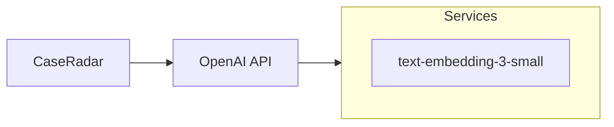
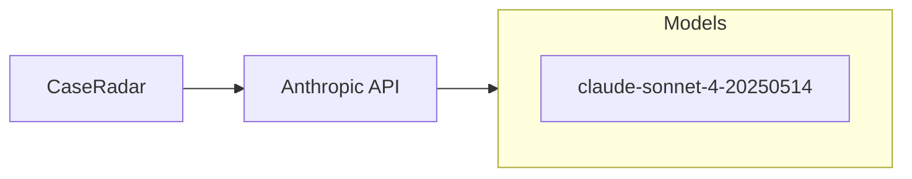
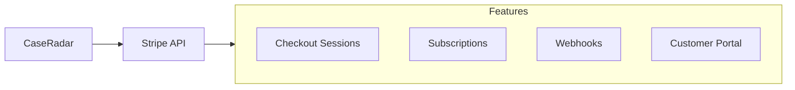
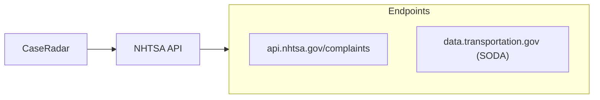
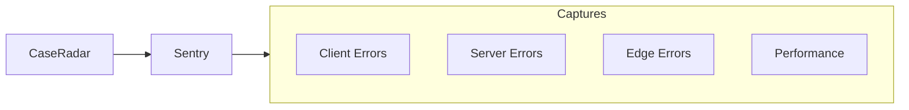
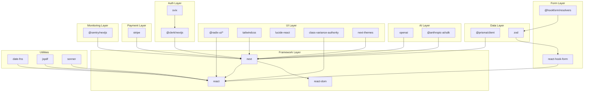

# CaseRadar Dependencies Documentation

## Overview

This document catalogs all npm packages and external services used in CaseRadar.

---

## Dependency Categories



---

## Production Dependencies

### Core Framework

| Package | Version | Purpose |
|---------|---------|---------|
| `next` | 16.1.1 | React meta-framework with App Router |
| `react` | 19.2.3 | UI library |
| `react-dom` | 19.2.3 | React DOM renderer |

### Authentication

| Package | Version | Purpose |
|---------|---------|---------|
| `@clerk/nextjs` | ^6.36.7 | Clerk authentication for Next.js |
| `svix` | ^1.84.1 | Webhook signature verification |

**Usage:**
```typescript
// Middleware authentication
import { clerkMiddleware } from '@clerk/nextjs/server';

// Client components
import { SignIn, SignUp, UserButton } from '@clerk/nextjs';

// Server auth
import { auth, currentUser } from '@clerk/nextjs/server';
```

### Database

| Package | Version | Purpose |
|---------|---------|---------|
| `@prisma/client` | ^6.19.1 | Prisma ORM client |
| `prisma` | ^6.19.1 | Prisma CLI and schema tools |

**Usage:**
```typescript
import { prisma } from '@/lib/db';

const complaints = await prisma.complaint.findMany({
  where: { clusterId: patternId },
});
```

### AI Services

| Package | Version | Purpose |
|---------|---------|---------|
| `openai` | ^6.16.0 | OpenAI API for embeddings |
| `@anthropic-ai/sdk` | ^0.71.2 | Anthropic Claude for text generation |

**OpenAI Usage:**
```typescript
import OpenAI from 'openai';

const openai = new OpenAI({ apiKey: process.env.OPENAI_API_KEY });

const response = await openai.embeddings.create({
  model: 'text-embedding-3-small',
  input: text,
});
```

**Anthropic Usage:**
```typescript
import Anthropic from '@anthropic-ai/sdk';

const anthropic = new Anthropic({
  apiKey: process.env.ANTHROPIC_API_KEY,
});

const response = await anthropic.messages.create({
  model: 'claude-sonnet-4-20250514',
  max_tokens: 1024,
  messages: [{ role: 'user', content: prompt }],
});
```

### Payments

| Package | Version | Purpose |
|---------|---------|---------|
| `stripe` | ^20.1.2 | Stripe payment processing |

**Usage:**
```typescript
import Stripe from 'stripe';

const stripe = new Stripe(process.env.STRIPE_SECRET_KEY!, {
  apiVersion: '2024-06-20',
});

const session = await stripe.checkout.sessions.create({
  mode: 'subscription',
  payment_method_types: ['card'],
  line_items: [{ price: priceId, quantity: 1 }],
});
```

### UI Components

| Package | Version | Purpose |
|---------|---------|---------|
| `@radix-ui/react-checkbox` | ^1.3.3 | Accessible checkbox primitive |
| `@radix-ui/react-dialog` | ^1.1.15 | Accessible modal dialog |
| `@radix-ui/react-dropdown-menu` | ^2.1.16 | Dropdown menu primitive |
| `@radix-ui/react-label` | ^2.1.8 | Form label primitive |
| `@radix-ui/react-select` | ^2.2.6 | Select/dropdown primitive |
| `@radix-ui/react-separator` | ^1.1.8 | Visual separator |
| `@radix-ui/react-slot` | ^1.2.4 | Slot component for composition |
| `@radix-ui/react-tabs` | ^1.1.13 | Tab navigation primitive |
| `lucide-react` | ^0.562.0 | Icon library |
| `sonner` | ^2.0.7 | Toast notifications |

### Styling

| Package | Version | Purpose |
|---------|---------|---------|
| `class-variance-authority` | ^0.7.1 | CSS class variant management |
| `clsx` | ^2.1.1 | Conditional className utility |
| `tailwind-merge` | ^3.4.0 | Merge Tailwind classes |
| `next-themes` | ^0.4.6 | Theme switching (dark/light mode) |

**Usage:**
```typescript
import { cn } from '@/lib/utils';

const className = cn(
  'base-class',
  isActive && 'active-class',
  variant === 'primary' && 'primary-class'
);
```

### Forms

| Package | Version | Purpose |
|---------|---------|---------|
| `react-hook-form` | ^7.71.0 | Form state management |
| `@hookform/resolvers` | ^5.2.2 | Form validation resolvers |
| `zod` | ^4.3.5 | Schema validation |

**Usage:**
```typescript
import { useForm } from 'react-hook-form';
import { zodResolver } from '@hookform/resolvers/zod';
import { z } from 'zod';

const schema = z.object({
  name: z.string().min(1, 'Required'),
  email: z.string().email(),
});

const form = useForm({
  resolver: zodResolver(schema),
});
```

### Utilities

| Package | Version | Purpose |
|---------|---------|---------|
| `date-fns` | ^4.1.0 | Date manipulation and formatting |
| `jspdf` | ^4.0.0 | PDF document generation |

**date-fns Usage:**
```typescript
import { format, formatDistanceToNow } from 'date-fns';

const formatted = format(date, 'MMM d, yyyy');
const relative = formatDistanceToNow(date, { addSuffix: true });
```

### Monitoring

| Package | Version | Purpose |
|---------|---------|---------|
| `@sentry/nextjs` | ^10.32.1 | Error tracking and performance monitoring |

---

## Development Dependencies

### Testing

| Package | Version | Purpose |
|---------|---------|---------|
| `vitest` | ^4.0.16 | Unit/integration test runner |
| `@vitest/ui` | ^4.0.16 | Vitest browser UI |
| `@vitest/coverage-v8` | ^4.0.16 | Code coverage |
| `@testing-library/react` | ^16.3.1 | React component testing |
| `@testing-library/jest-dom` | ^6.9.1 | Jest DOM matchers |
| `@testing-library/user-event` | ^14.6.1 | User interaction simulation |
| `jsdom` | ^24.1.3 | DOM environment for tests |
| `msw` | ^2.12.7 | API mocking (Mock Service Worker) |
| `@playwright/test` | ^1.57.0 | End-to-end testing |
| `@axe-core/playwright` | ^4.11.0 | Accessibility testing |

### Build Tools

| Package | Version | Purpose |
|---------|---------|---------|
| `typescript` | ^5 | TypeScript compiler |
| `tsx` | ^4.21.0 | TypeScript execution (for scripts) |
| `@vitejs/plugin-react` | ^4.7.0 | React plugin for Vite/Vitest |

### Styling

| Package | Version | Purpose |
|---------|---------|---------|
| `tailwindcss` | ^4 | Utility-first CSS framework |
| `@tailwindcss/postcss` | ^4 | PostCSS plugin for Tailwind |
| `tw-animate-css` | ^1.4.0 | Animation utilities |
| `prettier-plugin-tailwindcss` | ^0.6.14 | Auto-sort Tailwind classes |

### Linting & Formatting

| Package | Version | Purpose |
|---------|---------|---------|
| `eslint` | ^9 | JavaScript/TypeScript linter |
| `eslint-config-next` | 16.1.1 | Next.js ESLint config |
| `eslint-config-prettier` | ^10.1.8 | Disable ESLint rules that conflict with Prettier |
| `eslint-plugin-prettier` | ^5.5.4 | Run Prettier as ESLint rule |
| `prettier` | ^3.7.4 | Code formatter |

### Type Definitions

| Package | Version | Purpose |
|---------|---------|---------|
| `@types/node` | ^20 | Node.js type definitions |
| `@types/react` | ^19 | React type definitions |
| `@types/react-dom` | ^19 | React DOM type definitions |

---

## External Services

### Authentication: Clerk



**Configuration:**
```bash
NEXT_PUBLIC_CLERK_PUBLISHABLE_KEY=pk_test_...
CLERK_SECRET_KEY=sk_test_...
CLERK_WEBHOOK_SECRET=whsec_...
```

**Webhook Events Used:**
- `user.created` - Sync new user to database
- `user.updated` - Update user email
- `user.deleted` - Remove user record
- `organization.created` - Create organization record
- `organization.updated` - Update organization name
- `organizationMembership.created` - Add user to organization

---

### Database: Supabase (PostgreSQL)



**Configuration:**
```bash
# Connection pooling (for API routes)
DATABASE_URL="postgresql://...?pgbouncer=true&connection_limit=1"

# Direct connection (for migrations)
DIRECT_URL="postgresql://..."
```

**pgvector Extension:**
- Used for semantic search
- Stores 1536-dimensional embeddings
- Supports cosine distance operator (`<->`)

---

### AI: OpenAI



**Configuration:**
```bash
OPENAI_API_KEY=sk-...
```

**Usage:**
- Generate complaint text embeddings
- Enable semantic similarity search
- 1536-dimensional vectors

---

### AI: Anthropic



**Configuration:**
```bash
ANTHROPIC_API_KEY=sk-ant-...
```

**Usage:**
- Generate legal complaint introduction
- Generate factual allegations section
- AI-assisted document drafting

---

### Payments: Stripe



**Configuration:**
```bash
STRIPE_SECRET_KEY=sk_test_...
STRIPE_WEBHOOK_SECRET=whsec_...
NEXT_PUBLIC_STRIPE_PUBLISHABLE_KEY=pk_test_...
STRIPE_PRICE_BASIC=price_...
STRIPE_PRICE_PRO=price_...
STRIPE_PRICE_ENTERPRISE=price_...
```

**Webhook Events Used:**
- `customer.subscription.created`
- `customer.subscription.updated`
- `customer.subscription.deleted`
- `invoice.paid`
- `invoice.payment_failed`

---

### External API: NHTSA



**Configuration:**
```bash
NHTSA_API_BASE_URL=https://api.nhtsa.gov
```

**No API key required** - Public API

**Data Retrieved:**
- Vehicle complaint records
- Crash/fire/injury/death statistics
- Component failure descriptions

---

### Monitoring: Sentry



**Configuration:**
```bash
SENTRY_DSN=https://...@sentry.io/...
SENTRY_AUTH_TOKEN=...
NEXT_PUBLIC_SENTRY_DSN=https://...@sentry.io/...
```

**Features:**
- Error tracking
- Performance monitoring
- Session replay
- Release tracking

---

## Environment Variables Summary

### Required Variables

| Variable | Service | Description |
|----------|---------|-------------|
| `DATABASE_URL` | Supabase | PostgreSQL connection string |
| `DIRECT_URL` | Supabase | Direct DB connection for migrations |
| `NEXT_PUBLIC_CLERK_PUBLISHABLE_KEY` | Clerk | Client-side auth key |
| `CLERK_SECRET_KEY` | Clerk | Server-side auth key |
| `CLERK_WEBHOOK_SECRET` | Clerk | Webhook signature verification |
| `OPENAI_API_KEY` | OpenAI | Embeddings API key |
| `ANTHROPIC_API_KEY` | Anthropic | Claude API key |

### Optional Variables

| Variable | Service | Description |
|----------|---------|-------------|
| `STRIPE_SECRET_KEY` | Stripe | Payment processing |
| `STRIPE_WEBHOOK_SECRET` | Stripe | Webhook verification |
| `SENTRY_DSN` | Sentry | Error tracking |
| `CRON_SECRET` | Internal | Cron job authentication |
| `RESEND_API_KEY` | Resend | Email notifications |
| `UPSTASH_REDIS_REST_URL` | Upstash | Rate limiting cache |

---

## Dependency Graph



---

## Version Compatibility

### React 19 Compatibility

React 19 introduced breaking changes. Compatible packages:
- `@clerk/nextjs` ^6.x (React 19 support)
- `react-hook-form` ^7.71.0 (React 19 support)
- `@radix-ui/*` (latest versions)

### Next.js 16 Features

Using App Router features:
- Server Components (default)
- Server Actions
- Route Handlers
- Middleware

### TypeScript 5

Using TypeScript 5.x features:
- `satisfies` operator
- Const type parameters
- Improved union narrowing

---

## Security Considerations

### API Key Management
- All API keys stored in environment variables
- Never committed to version control
- Different keys for development/production

### Webhook Verification
- Clerk webhooks verified with Svix
- Stripe webhooks verified with signature
- Cron jobs protected with secret token

### Database Security
- Connection pooling (PgBouncer)
- Prepared statements (Prisma)
- Row-level security (Supabase)

---

**Previous:** [06-file-structure.md](./06-file-structure.md) - File Structure
**Next:** [08-deployment.md](./08-deployment.md) - Deployment
