# CaseRadar Security & Compliance Documentation

## Overview

CaseRadar handles sensitive legal data for law firms investigating vehicle defect cases. This document details security controls, compliance requirements, and data protection measures required for enterprise legal tech.

---

## Security Architecture

### Defense in Depth

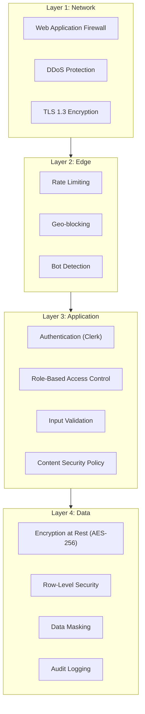

### Zero-Trust Model

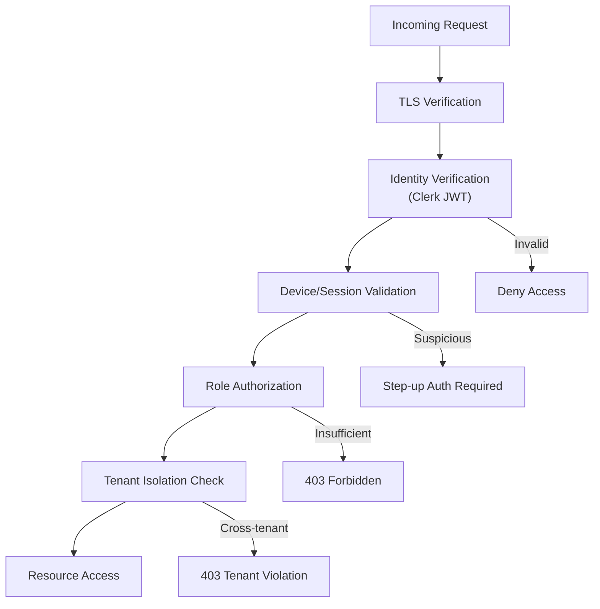

**Principles:**
1. **Never trust, always verify** - Every request authenticated and authorized
2. **Least privilege** - Users get minimum required permissions
3. **Assume breach** - Design systems to contain damage
4. **Verify explicitly** - All access decisions based on all available data points

---

## Encryption Standards

### Data in Transit

| Protocol | Configuration | Purpose |
|----------|---------------|---------|
| TLS 1.3 | Required | All HTTP traffic |
| HSTS | 2 years, preload | Force HTTPS |
| Certificate | Let's Encrypt (auto) | Vercel managed |

**Cipher Suites (TLS 1.3):**
- `TLS_AES_256_GCM_SHA384`
- `TLS_CHACHA20_POLY1305_SHA256`
- `TLS_AES_128_GCM_SHA256`

### Data at Rest

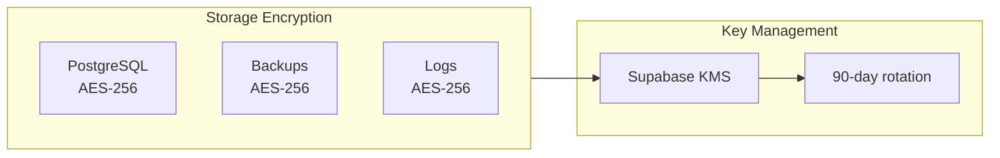

| Data Type | Encryption | Key Management |
|-----------|------------|----------------|
| Database | AES-256 (Supabase) | Supabase KMS |
| Backups | AES-256 (Supabase) | Supabase KMS |
| File Storage | AES-256 (Supabase Storage) | Supabase KMS |
| API Keys | Environment variables | Vercel encrypted |

### Secrets Management

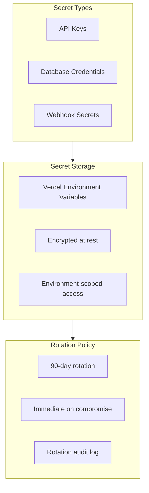

**Secret Rotation Schedule:**

| Secret | Rotation Period | Procedure |
|--------|-----------------|-----------|
| `CLERK_SECRET_KEY` | 90 days | Regenerate in Clerk Dashboard |
| `OPENAI_API_KEY` | 90 days | Regenerate in OpenAI |
| `ANTHROPIC_API_KEY` | 90 days | Regenerate in Anthropic Console |
| `STRIPE_SECRET_KEY` | 90 days | Regenerate in Stripe Dashboard |
| `DATABASE_URL` | On compromise | Rotate Supabase credentials |
| `CRON_SECRET` | 90 days | Generate new UUID |

---

## Multi-Tenant Data Isolation

### Isolation Architecture

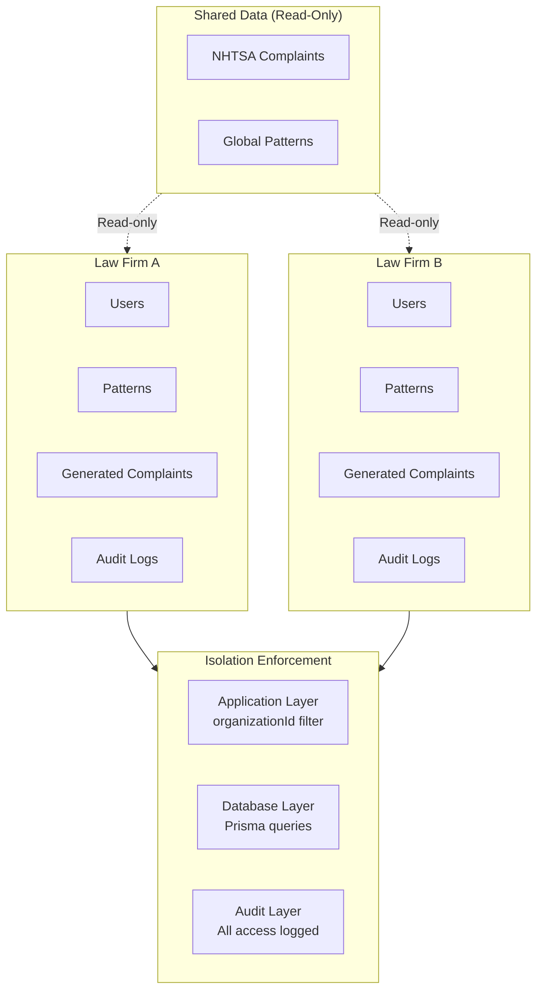

### Isolation Enforcement Points

| Layer | Mechanism | Enforcement |
|-------|-----------|-------------|
| API Routes | `getCurrentUser()` | Every request verified |
| Database Queries | `WHERE organizationId = ?` | All queries filtered |
| Webhooks | Signature verification | Svix/Stripe signatures |
| File Storage | Path-based isolation | `/org/{orgId}/files/` |

### Cross-Tenant Access Prevention

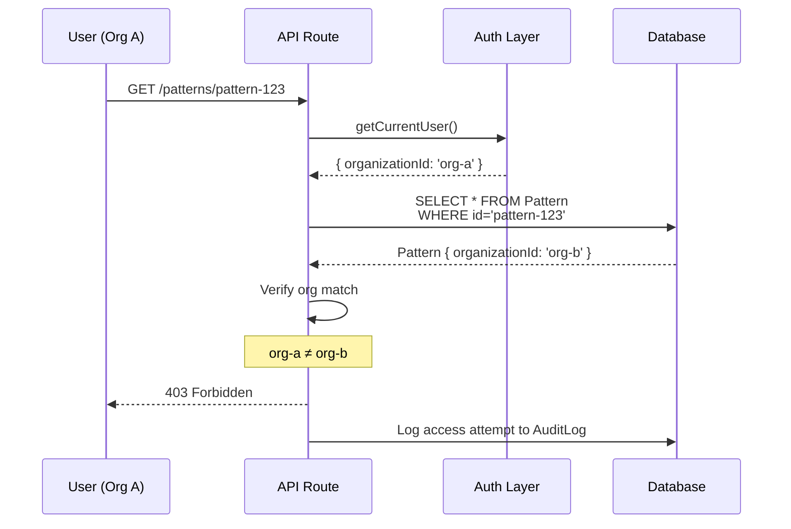

---

## Input Validation & Sanitization

### Validation Strategy

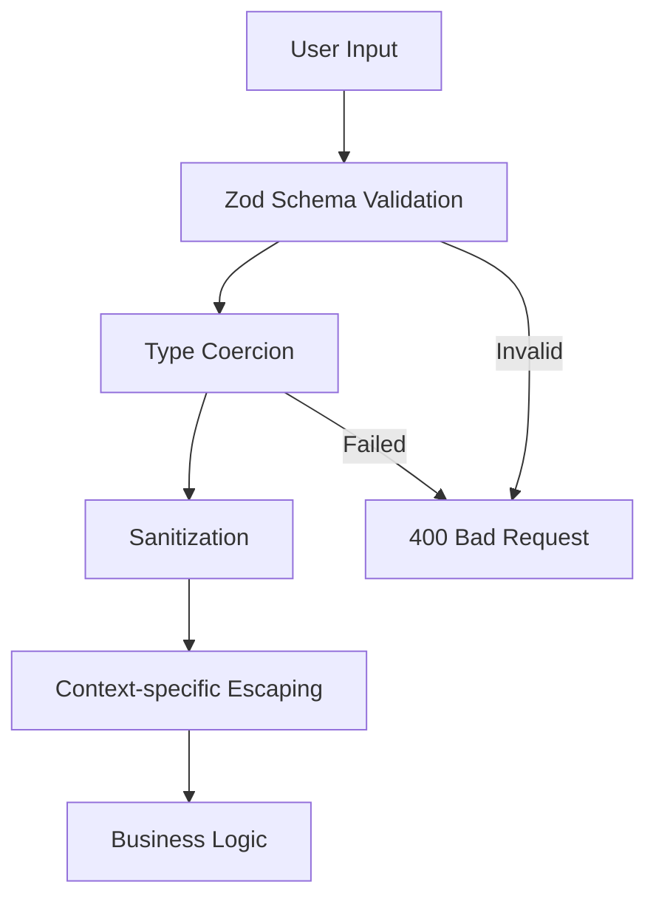

### Validation Rules

| Input Type | Validation | Sanitization |
|------------|------------|--------------|
| IDs (CUID) | Regex: `^c[a-z0-9]{24}$` | None needed |
| Email | Zod `.email()` | Lowercase, trim |
| Search queries | Max length 500 | Strip HTML, escape SQL wildcards |
| Complaint text | Max 10,000 chars | DOMPurify for display |
| File uploads | MIME type + size | Virus scan (future) |

### SQL Injection Prevention

```typescript
// GOOD: Parameterized queries via Prisma
const complaints = await prisma.complaint.findMany({
  where: {
    organizationId: user.organizationId,  // Always parameterized
    description: { contains: searchTerm }, // Escaped by Prisma
  },
});

// NEVER: Raw SQL with user input
// prisma.$queryRaw`SELECT * FROM Complaint WHERE desc = ${userInput}`
```

### XSS Prevention

| Context | Mitigation |
|---------|------------|
| React rendering | Auto-escaped by default |
| `dangerouslySetInnerHTML` | Never use with user content |
| URL parameters | Validate against allowlist |
| PDF generation | Escape special characters |

---

## Rate Limiting

### Rate Limit Configuration

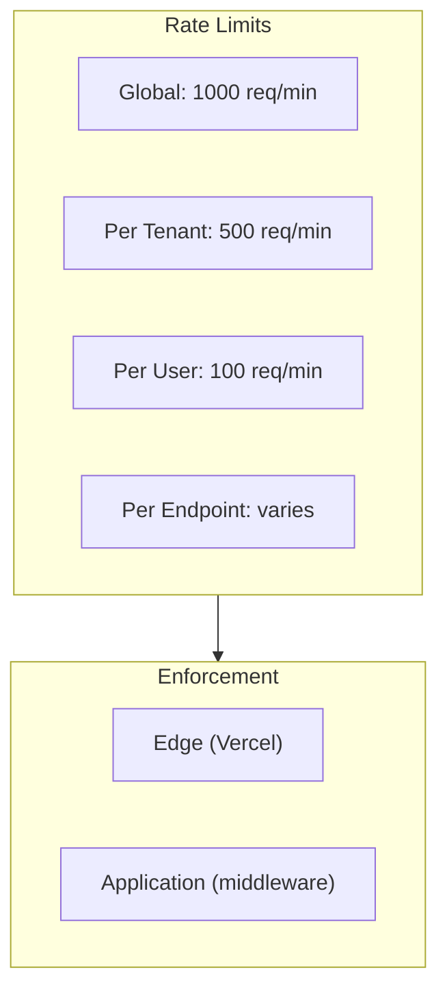

### Endpoint-Specific Limits

| Endpoint | Limit | Window | Reason |
|----------|-------|--------|--------|
| `/api/complaints/search` | 60/min | User | Expensive vector search |
| `/api/generator/generate` | 10/min | User | AI API costs |
| `/api/generator/export-pdf` | 20/min | User | CPU intensive |
| `/api/auth/*` | 10/min | IP | Brute force prevention |
| `/api/webhooks/*` | 1000/min | IP | Webhook bursts |
| `/api/cron/*` | 10/hour | Global | Scheduled only |

### Rate Limit Response

```json
{
  "error": "Rate limit exceeded",
  "retryAfter": 60,
  "limit": 100,
  "remaining": 0,
  "reset": "2024-01-15T12:00:00Z"
}
```

**Headers:**
- `X-RateLimit-Limit: 100`
- `X-RateLimit-Remaining: 0`
- `X-RateLimit-Reset: 1705320000`
- `Retry-After: 60`

---

## Audit Logging

### Audit Log Architecture

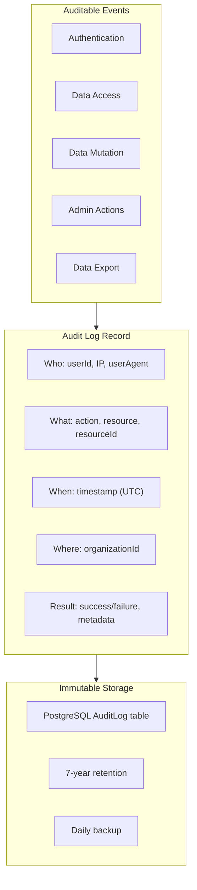

### Audit Event Types

| Category | Event | Logged Data |
|----------|-------|-------------|
| **Auth** | `AUTH_LOGIN` | userId, IP, success/fail |
| **Auth** | `AUTH_LOGOUT` | userId, sessionId |
| **Auth** | `AUTH_FAILED` | email attempted, IP, reason |
| **Data** | `COMPLAINT_VIEW` | complaintId, searchQuery |
| **Data** | `PATTERN_VIEW` | patternId |
| **Data** | `COMPLAINT_SEARCH` | query, resultCount |
| **Mutation** | `PATTERN_CREATE` | patternId, complaintIds |
| **Mutation** | `PATTERN_UPDATE` | patternId, changedFields |
| **Mutation** | `PATTERN_DELETE` | patternId |
| **Mutation** | `GENERATED_CREATE` | documentId, patternId |
| **Mutation** | `GENERATED_UPDATE` | documentId, version |
| **Export** | `PDF_EXPORT` | documentId, format |
| **Export** | `DATA_EXPORT` | exportType, recordCount |
| **Admin** | `USER_ROLE_CHANGE` | targetUserId, oldRole, newRole |
| **Admin** | `ORG_SETTINGS_CHANGE` | setting, oldValue, newValue |

### Audit Log Schema

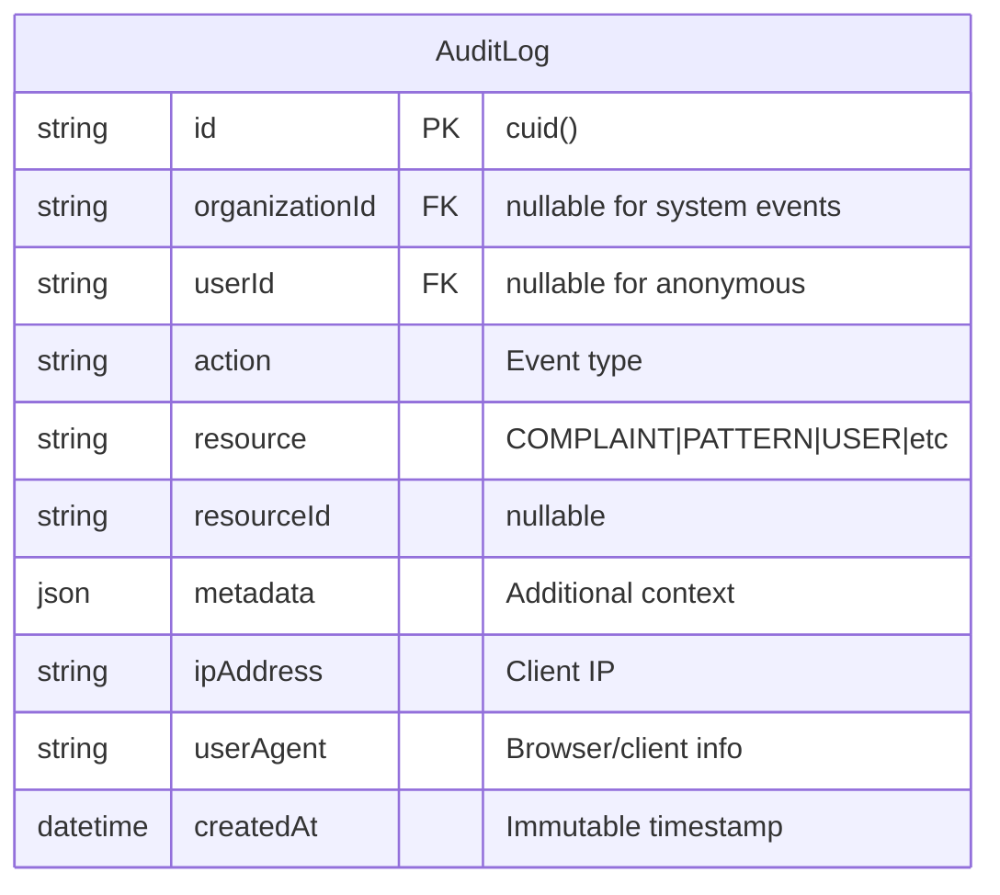

### Audit Log Query Examples

```typescript
// Get all data access for a specific complaint (legal discovery)
const accessLog = await prisma.auditLog.findMany({
  where: {
    resourceId: complaintId,
    action: { in: ['COMPLAINT_VIEW', 'COMPLAINT_SEARCH'] },
  },
  orderBy: { createdAt: 'desc' },
});

// Get all actions by a specific user (compliance review)
const userActivity = await prisma.auditLog.findMany({
  where: { userId: userId },
  orderBy: { createdAt: 'desc' },
  take: 1000,
});

// Get failed authentication attempts (security monitoring)
const failedLogins = await prisma.auditLog.findMany({
  where: {
    action: 'AUTH_FAILED',
    createdAt: { gte: last24Hours },
  },
});
```

---

## Legal Compliance

### Data Retention Policy

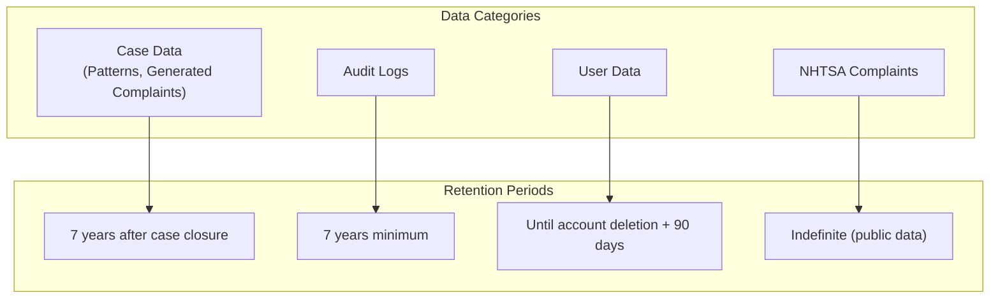

| Data Type | Retention Period | Deletion Trigger | Legal Basis |
|-----------|-----------------|------------------|-------------|
| Patterns | 7 years post-closure | Manual + aging | Statute of limitations |
| Generated Complaints | 7 years post-closure | Manual + aging | Legal hold requirements |
| Audit Logs | 7 years minimum | Never auto-delete | SOC2, legal discovery |
| User Data | 90 days post-deletion | GDPR request | GDPR Article 17 |
| NHTSA Complaints | Indefinite | Never | Public record |
| Session Data | 30 days | Auto-expire | Performance |

### GDPR Compliance

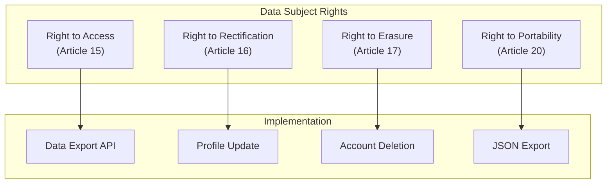

**GDPR Procedures:**

| Right | Endpoint | Response Time |
|-------|----------|---------------|
| Access | `/api/settings/export-data` | 24 hours |
| Rectification | `/api/settings/profile` | Immediate |
| Erasure | `/api/settings/delete-account` | 30 days |
| Portability | `/api/settings/export-data?format=json` | 24 hours |

### Legal Hold

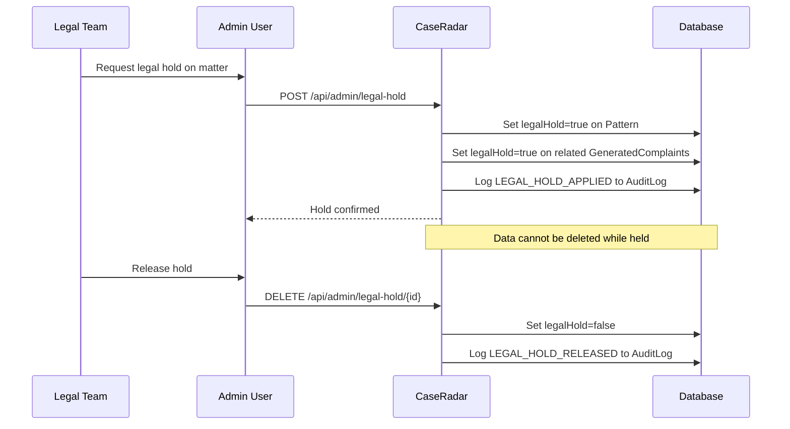

### Attorney-Client Privilege

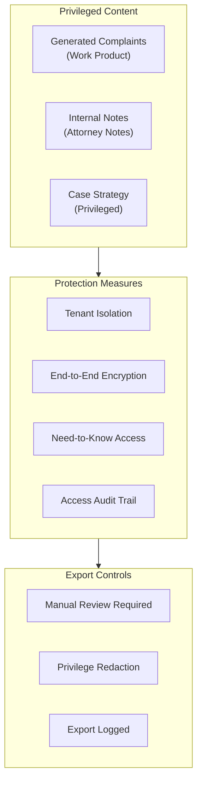

**Privilege Markers:**
- Generated complaints marked as `privileged: true`
- Work product doctrine protection
- Export requires ADMIN role + explicit confirmation
- All privileged data access logged

---

## Document Chain of Custody

### Document Lifecycle

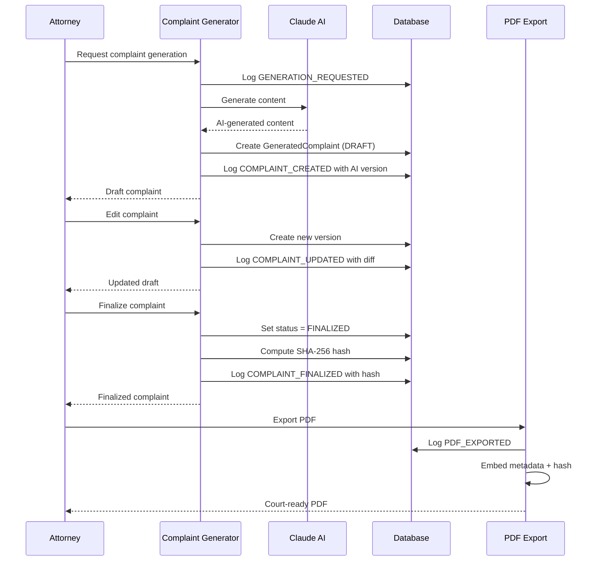

### Document Versioning

| Field | Purpose | Immutability |
|-------|---------|--------------|
| `version` | Sequential version number | Append-only |
| `content` | Document content JSON | New version on edit |
| `contentHash` | SHA-256 of content | Computed on save |
| `status` | DRAFT → FINALIZED → FILED | One-way transitions |
| `createdAt` | Creation timestamp | Immutable |
| `updatedAt` | Last modification | Auto-updated |
| `finalizedAt` | Finalization timestamp | Set once |
| `finalizedBy` | Finalizing user ID | Set once |

### Document Integrity Verification

```typescript
// Compute document hash for integrity verification
function computeDocumentHash(content: DocumentContent): string {
  const canonical = JSON.stringify(content, Object.keys(content).sort());
  return crypto.createHash('sha256').update(canonical).digest('hex');
}

// Verify document hasn't been tampered
function verifyDocumentIntegrity(doc: GeneratedComplaint): boolean {
  const computedHash = computeDocumentHash(doc.content);
  return computedHash === doc.contentHash;
}
```

---

## Security Headers Configuration

### Complete Headers

```json
{
  "headers": [
    {
      "source": "/(.*)",
      "headers": [
        {
          "key": "Strict-Transport-Security",
          "value": "max-age=63072000; includeSubDomains; preload"
        },
        {
          "key": "X-Frame-Options",
          "value": "DENY"
        },
        {
          "key": "X-Content-Type-Options",
          "value": "nosniff"
        },
        {
          "key": "X-XSS-Protection",
          "value": "1; mode=block"
        },
        {
          "key": "Referrer-Policy",
          "value": "strict-origin-when-cross-origin"
        },
        {
          "key": "Permissions-Policy",
          "value": "camera=(), microphone=(), geolocation=(), interest-cohort=()"
        },
        {
          "key": "Content-Security-Policy",
          "value": "default-src 'self'; script-src 'self' 'unsafe-inline' 'unsafe-eval' https://js.clerk.dev https://js.stripe.com; style-src 'self' 'unsafe-inline'; img-src 'self' data: https:; font-src 'self' data:; connect-src 'self' https://*.clerk.dev https://api.stripe.com https://api.openai.com https://api.anthropic.com https://*.sentry.io; frame-src https://js.stripe.com https://hooks.stripe.com;"
        }
      ]
    }
  ]
}
```

### Header Purposes

| Header | Value | Protection |
|--------|-------|------------|
| `Strict-Transport-Security` | 2 years + preload | Force HTTPS, prevent downgrade |
| `X-Frame-Options` | DENY | Prevent clickjacking |
| `X-Content-Type-Options` | nosniff | Prevent MIME sniffing |
| `X-XSS-Protection` | 1; mode=block | Legacy XSS filter |
| `Referrer-Policy` | strict-origin-when-cross-origin | Control referrer leakage |
| `Permissions-Policy` | Disabled all | Block sensitive APIs |
| `Content-Security-Policy` | Strict allowlist | Prevent XSS, data exfiltration |

---

## Incident Response

### Security Incident Classification

| Severity | Description | Response Time | Examples |
|----------|-------------|---------------|----------|
| **P0 Critical** | Active data breach | 15 minutes | Data exfiltration, auth bypass |
| **P1 High** | Potential breach | 1 hour | Suspicious access, failed intrusions |
| **P2 Medium** | Security weakness | 24 hours | Vulnerability discovered |
| **P3 Low** | Minor issue | 1 week | Policy violation, config drift |

### Incident Response Flow

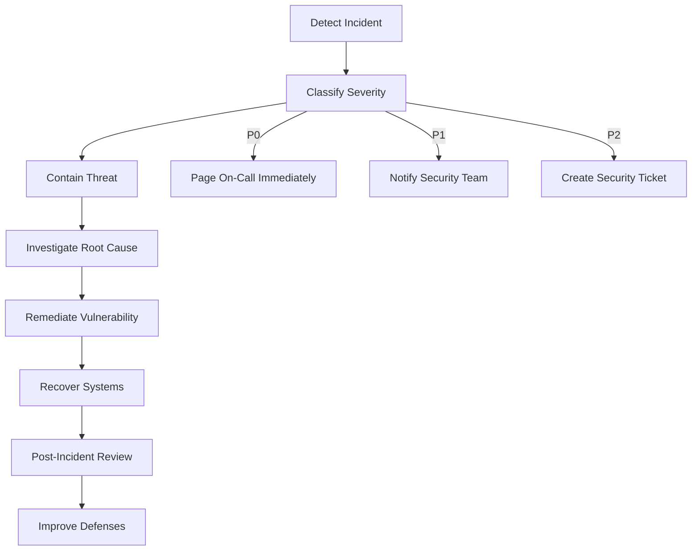

### Data Breach Response

1. **Immediate (0-1 hour)**
   - Isolate affected systems
   - Revoke compromised credentials
   - Enable enhanced logging
   - Notify security team

2. **Short-term (1-24 hours)**
   - Assess scope of breach
   - Identify affected data/users
   - Preserve evidence (forensics)
   - Engage legal counsel

3. **Notification (24-72 hours)**
   - Notify affected users (if required)
   - Notify regulatory bodies (GDPR: 72 hours)
   - Prepare public statement (if needed)

4. **Recovery (1-2 weeks)**
   - Patch vulnerabilities
   - Reset all credentials
   - Enhanced monitoring
   - Post-incident review

---

## Compliance Certifications

### Current Status

| Certification | Status | Target Date |
|---------------|--------|-------------|
| SOC 2 Type I | Planned | Q3 2025 |
| SOC 2 Type II | Planned | Q1 2026 |
| GDPR Compliant | In Progress | Q2 2025 |
| CCPA Compliant | In Progress | Q2 2025 |
| ISO 27001 | Future | TBD |

### SOC 2 Control Mapping

| Trust Service Criteria | CaseRadar Control |
|------------------------|-------------------|
| **Security** | Clerk auth, RBAC, encryption |
| **Availability** | Vercel SLA, health checks |
| **Processing Integrity** | Input validation, audit logs |
| **Confidentiality** | Tenant isolation, encryption |
| **Privacy** | GDPR procedures, data retention |

---

## Security Checklist

### Development
- [ ] All dependencies scanned for vulnerabilities
- [ ] Secrets never committed to repository
- [ ] Input validation on all user input
- [ ] Output encoding for all rendered content
- [ ] Parameterized queries only (no raw SQL)

### Deployment
- [ ] Security headers configured
- [ ] TLS 1.3 enforced
- [ ] Rate limiting enabled
- [ ] Audit logging active
- [ ] Error messages sanitized (no stack traces)

### Operations
- [ ] Secret rotation scheduled
- [ ] Backup verification tested
- [ ] Incident response plan documented
- [ ] Security monitoring active
- [ ] Access reviews quarterly

---

**Previous:** [08-deployment.md](./08-deployment.md) - Deployment
**Next:** [10-ai-governance.md](./10-ai-governance.md) - AI Governance
