# CaseRadar AI Governance Documentation

## Overview

CaseRadar uses AI for two critical functions:
1. **Semantic embeddings** (OpenAI) - Vector representations for similarity search
2. **Legal document generation** (Anthropic Claude) - Drafting formal complaints

This document establishes governance, risk mitigation, and quality controls for AI systems in a legal technology context.

---

## AI System Architecture

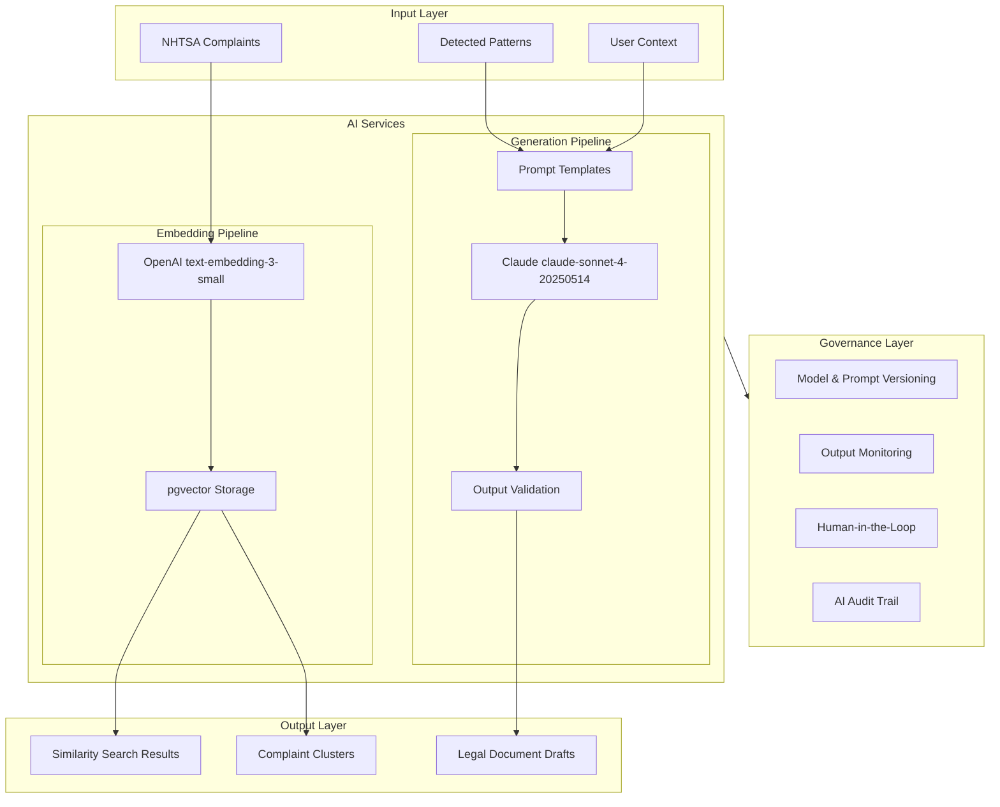

---

## Model Inventory

### Active Models

| Model | Provider | Version | Purpose | Last Updated |
|-------|----------|---------|---------|--------------|
| `text-embedding-3-small` | OpenAI | 3-small | Complaint embeddings | 2024-01 |
| `claude-sonnet-4-20250514` | Anthropic | claude-sonnet-4-20250514 | Legal document generation | 2024-12 |

### Model Selection Rationale

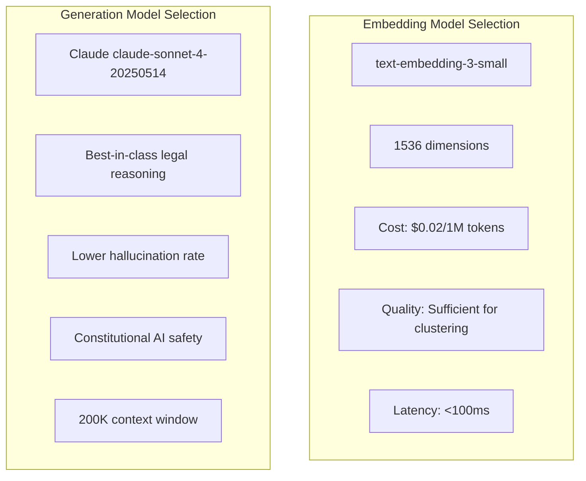

**Decision Record: Why Claude claude-sonnet-4-20250514 for Legal Generation**
- Superior performance on legal reasoning benchmarks
- Constitutional AI reduces harmful outputs
- Better instruction following for structured documents
- Lower hallucination rate on factual claims
- Cost-effective for document-length outputs

---

## Hallucination Mitigation

### Risk Assessment

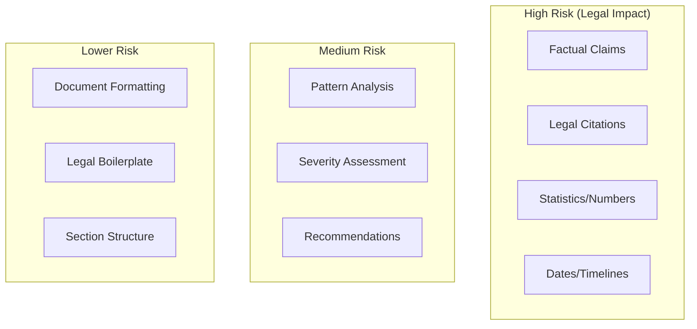

### Mitigation Strategies

| Risk | Mitigation | Implementation |
|------|------------|----------------|
| **Fabricated facts** | Ground in source data | Include complaint IDs in prompts |
| **Invented citations** | No citation generation | Explicitly instruct not to cite cases |
| **Wrong statistics** | Computed externally | Pass pre-calculated stats to AI |
| **False claims** | Human review required | DRAFT → Review → FINALIZE workflow |
| **Inconsistent analysis** | Deterministic clustering | AI only summarizes, not analyzes |

### Prompt Engineering for Accuracy

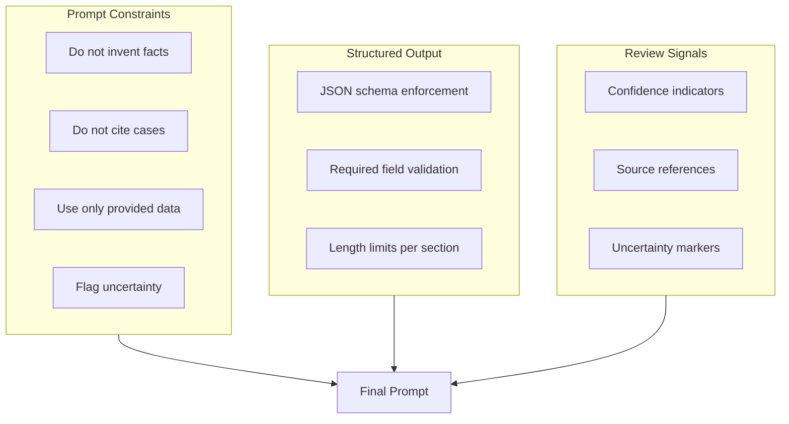

### Example Prompt Template

```typescript
const LEGAL_COMPLAINT_PROMPT = `
You are a legal document assistant helping attorneys draft NHTSA vehicle defect complaints.

CRITICAL RULES:
1. ONLY use information from the provided complaint data
2. DO NOT cite any court cases or legal precedents
3. DO NOT invent any facts, statistics, or dates
4. If uncertain about something, mark it with [VERIFY]
5. Use the exact complaint counts and statistics provided

INPUT DATA:
- Pattern ID: {patternId}
- Vehicle: {make} {model} ({yearRange})
- Total Complaints: {complaintCount} (exact count)
- Injuries: {injuryCount} (exact count)
- Deaths: {deathCount} (exact count)
- Common Components: {components}
- Sample Complaints: {sampleComplaints}

OUTPUT REQUIREMENTS:
- Generate sections in JSON format
- Each section must be complete and professional
- Reference specific complaint IDs when possible
- Mark any assumptions with [ASSUMPTION]

Generate a formal complaint document with the following sections:
{sectionInstructions}
`;
```

---

## Human-in-the-Loop Workflow

### Document Lifecycle States

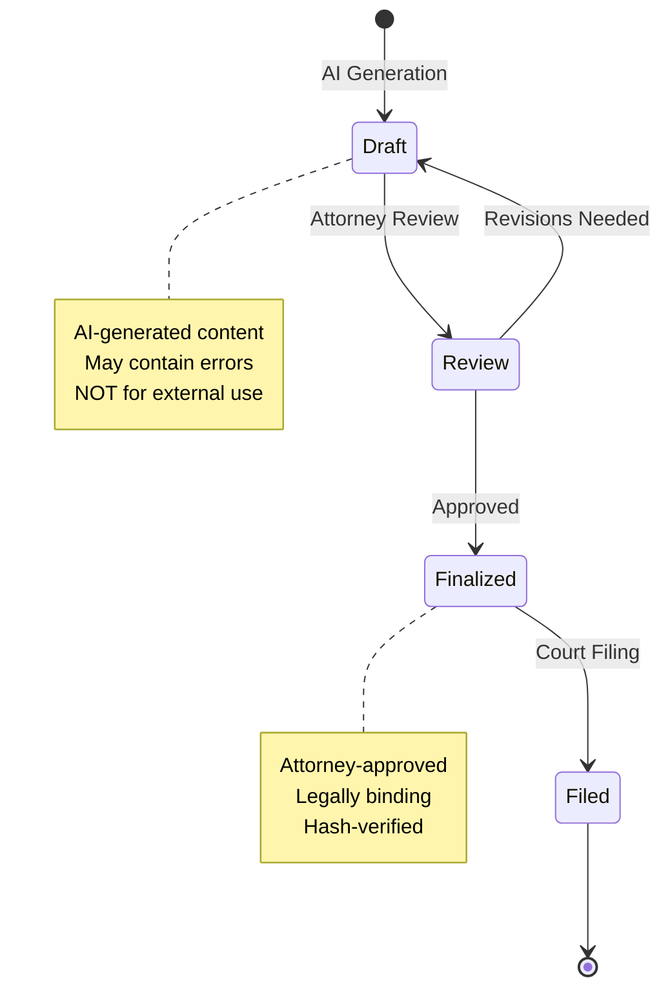

### Review Checklist

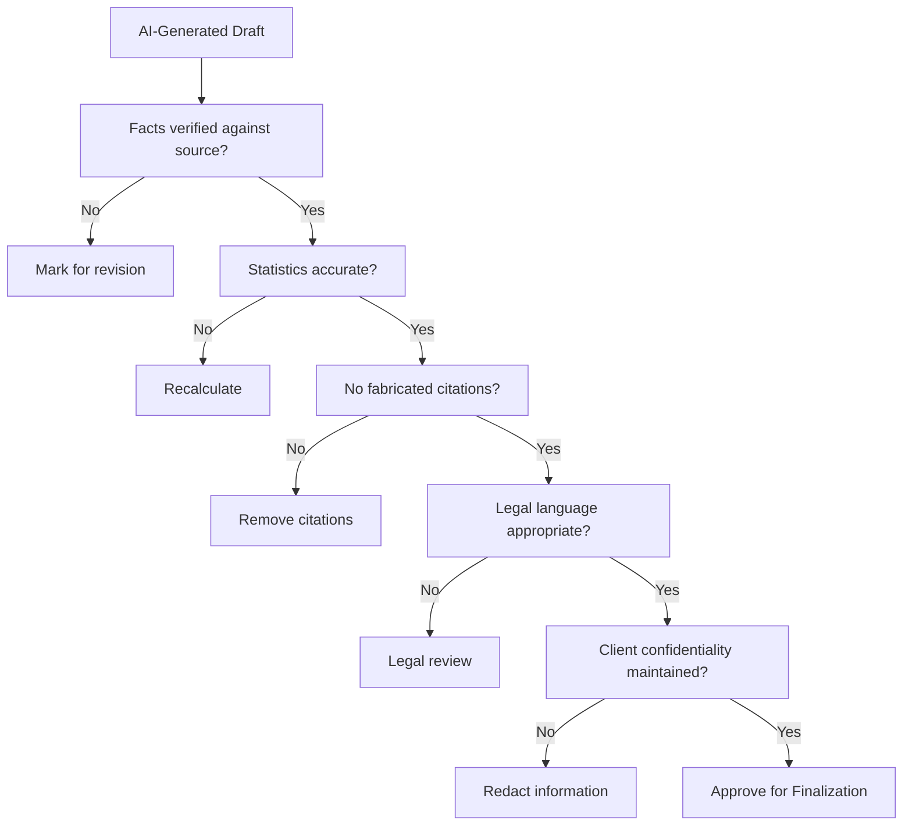

### Required Attestations

Before finalizing any AI-generated document, the reviewing attorney must attest:

| Attestation | Description | Required |
|-------------|-------------|----------|
| **Factual accuracy** | All facts verified against source complaints | Yes |
| **Statistical accuracy** | All numbers match calculated values | Yes |
| **No hallucinations** | No fabricated information present | Yes |
| **Legal appropriateness** | Language suitable for legal filing | Yes |
| **Client authorization** | Client approved filing | Yes |

---

## Embedding Pipeline Governance

### Embedding Generation Flow

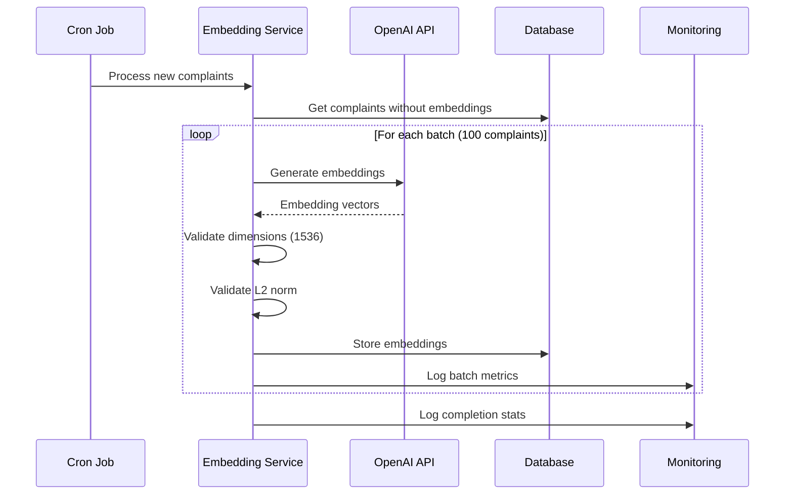

### Embedding Quality Assurance

| Check | Threshold | Action on Failure |
|-------|-----------|-------------------|
| Dimension count | Exactly 1536 | Reject, retry |
| L2 norm | 0.9 - 1.1 | Flag for review |
| Null/zero vectors | 0% | Reject, alert |
| Generation time | < 5s per batch | Alert, investigate |
| API errors | < 1% | Retry with backoff |

### Embedding Drift Detection

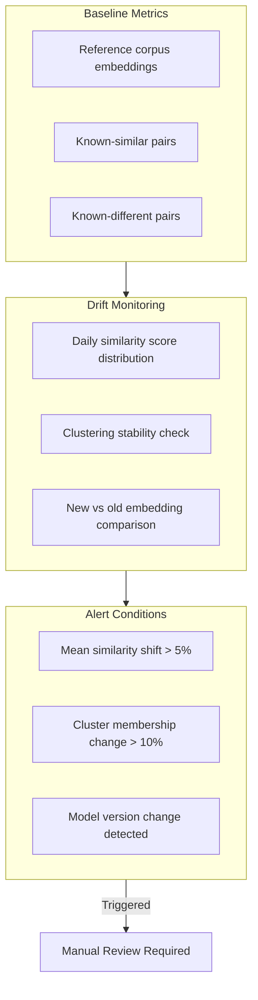

---

## Clustering Reproducibility

### Deterministic Clustering Requirements

For legal defensibility, pattern detection must be reproducible:

| Requirement | Implementation |
|-------------|----------------|
| **Same input → same output** | Fixed random seed |
| **Versioned algorithm** | Algorithm version stored with pattern |
| **Audit trail** | All clustering runs logged |
| **Parameter documentation** | Threshold values documented |

### Clustering Parameters

```typescript
// Clustering configuration - versioned
const CLUSTERING_CONFIG_V1 = {
  version: '1.0.0',
  algorithm: 'greedy-centroid',
  similarityThreshold: 0.85,
  minClusterSize: 3,
  maxClusterSize: 1000,
  randomSeed: 42,  // Fixed for reproducibility
};
```

### Clustering Audit Log

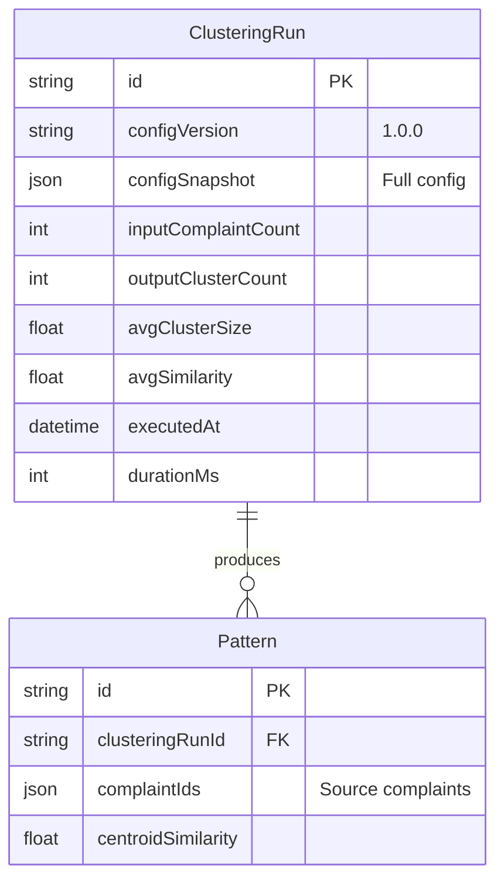

---

## AI Output Validation

### Validation Pipeline

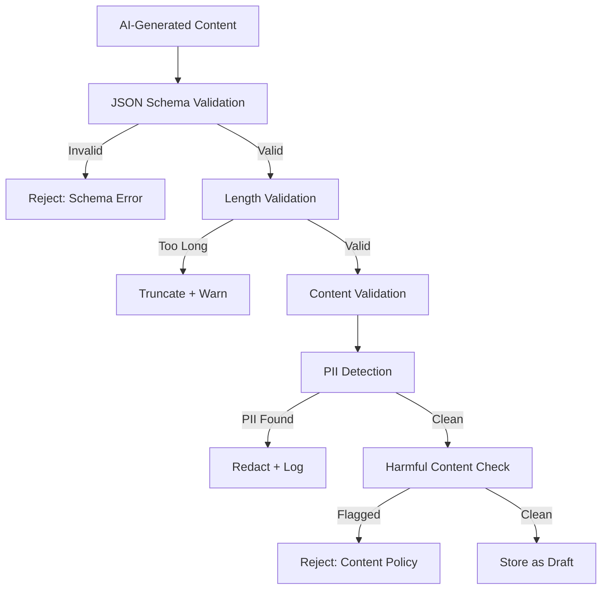

### Validation Rules

| Rule | Check | Action |
|------|-------|--------|
| **Schema compliance** | JSON matches expected structure | Reject if invalid |
| **Section length** | Each section < 10,000 chars | Truncate with warning |
| **PII detection** | Scan for SSN, phone, email patterns | Redact and log |
| **Harmful content** | Check for inappropriate language | Reject and alert |
| **Completeness** | All required sections present | Flag missing sections |

### PII Detection Patterns

```typescript
const PII_PATTERNS = [
  /\b\d{3}-\d{2}-\d{4}\b/,           // SSN
  /\b\d{3}[-.]?\d{3}[-.]?\d{4}\b/,   // Phone
  /\b[A-Z0-9._%+-]+@[A-Z0-9.-]+\.[A-Z]{2,}\b/i, // Email
  /\b\d{4}[-\s]?\d{4}[-\s]?\d{4}[-\s]?\d{4}\b/, // Credit card
];

function detectPII(content: string): PIIMatch[] {
  const matches: PIIMatch[] = [];
  for (const pattern of PII_PATTERNS) {
    const found = content.match(pattern);
    if (found) {
      matches.push({ pattern: pattern.source, value: '[REDACTED]' });
    }
  }
  return matches;
}
```

---

## Model Versioning & Rollback

### Version Tracking

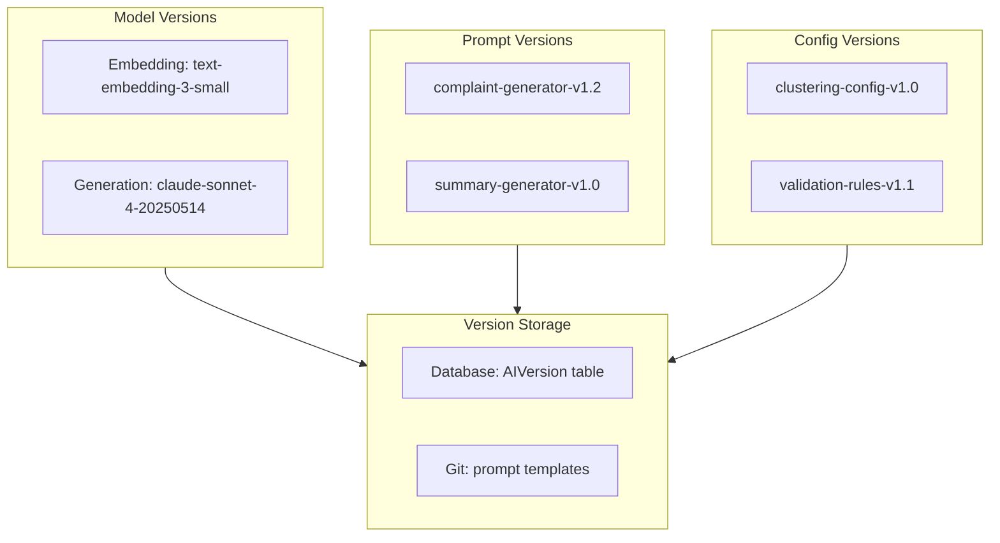

### AIVersion Schema

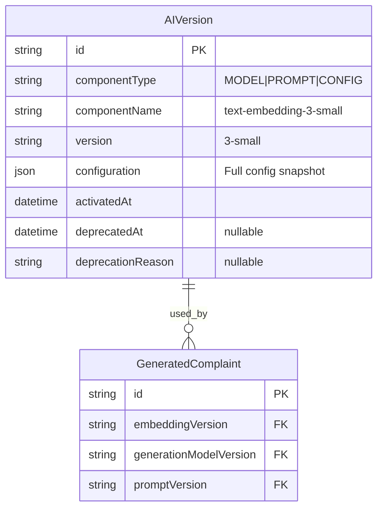

### Rollback Procedure

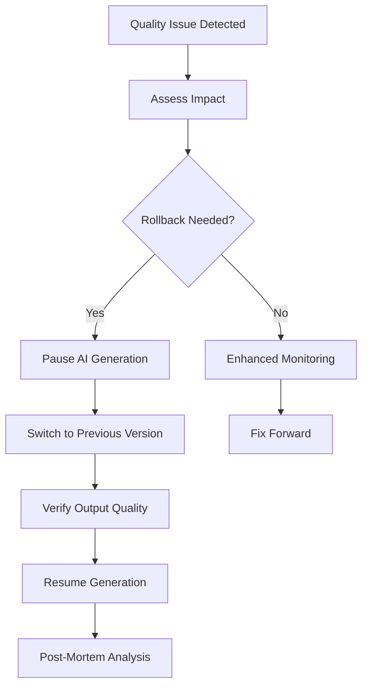

---

## Cost Management

### AI Cost Tracking

| Service | Unit | Cost | Monthly Budget |
|---------|------|------|----------------|
| OpenAI Embeddings | 1M tokens | $0.02 | $50 |
| Claude Generation | 1M input tokens | $3.00 | $200 |
| Claude Generation | 1M output tokens | $15.00 | $300 |

### Cost Controls

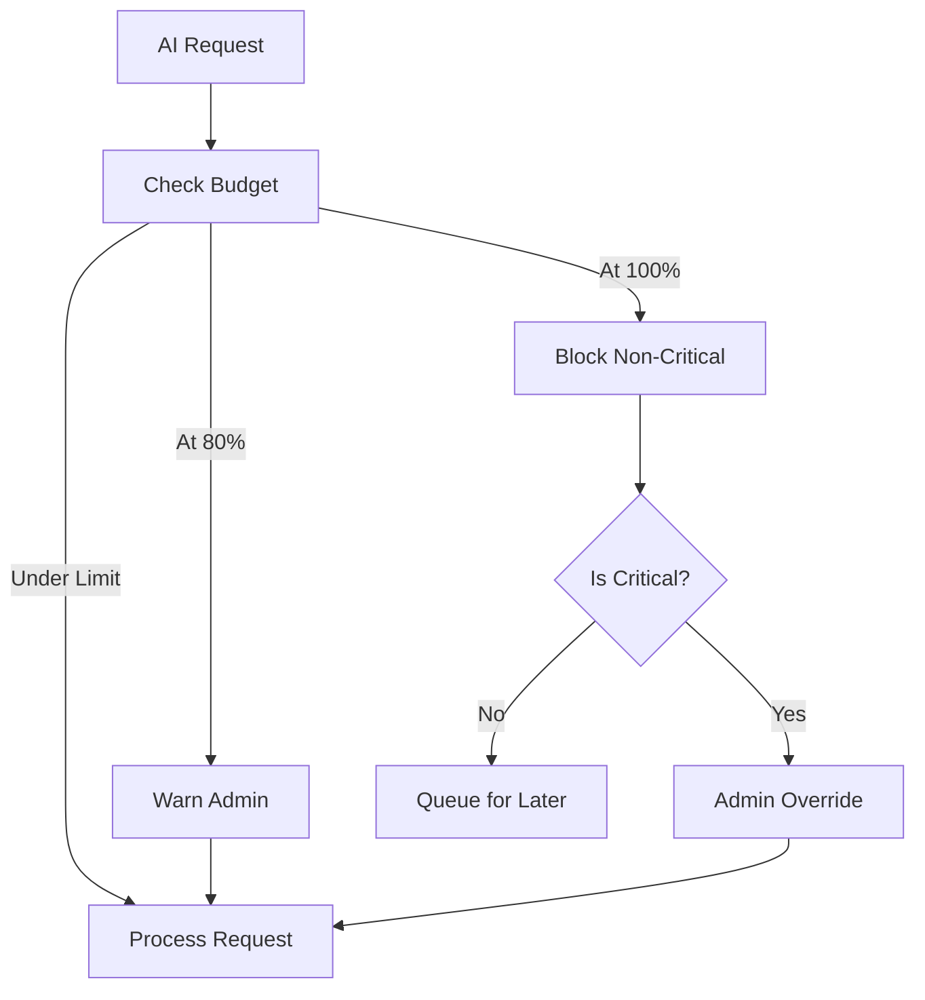

### Rate Limiting by Plan

| Plan | Embedding Requests/Day | Generation Requests/Day |
|------|------------------------|------------------------|
| FREE | 100 | 5 |
| BASIC | 1,000 | 50 |
| PRO | 10,000 | 200 |
| ENTERPRISE | Unlimited | Unlimited |

---

## AI Incident Response

### AI-Specific Incidents

| Incident Type | Severity | Response |
|---------------|----------|----------|
| Hallucinated content in finalized doc | P0 | Immediate recall, client notification |
| Embedding quality degradation | P1 | Pause clustering, investigate |
| Model API outage | P2 | Graceful degradation, user notification |
| Cost overrun | P2 | Throttle requests, alert admin |
| Prompt injection attempt | P1 | Block request, security review |

### Hallucination Incident Response

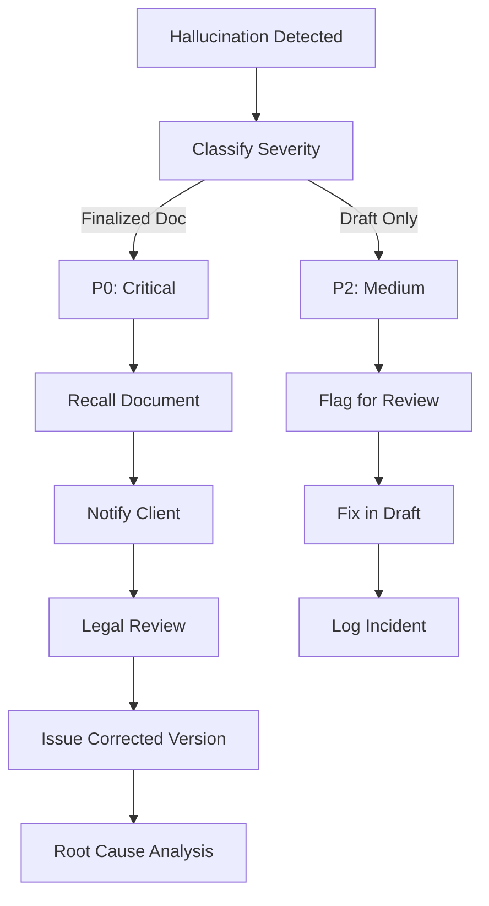

---

## Compliance & Ethics

### AI Ethics Principles

1. **Transparency** - Users know when content is AI-generated
2. **Accuracy** - AI must not fabricate information
3. **Accountability** - Human review required for legal documents
4. **Fairness** - AI must not introduce bias into legal analysis
5. **Privacy** - AI must not expose confidential information

### AI Disclosure

All AI-generated documents include disclosure:

```
NOTICE: This document was drafted with AI assistance using CaseRadar's
legal document generation system (Claude claude-sonnet-4-20250514). The content has been
reviewed and approved by [Attorney Name] on [Date]. AI was used to
structure and draft the document based on verified complaint data; all
facts and statistics have been independently verified.
```

### Bias Monitoring

| Check | Frequency | Method |
|-------|-----------|--------|
| Clustering fairness | Weekly | Statistical parity across manufacturers |
| Generation consistency | Per request | Same input → similar output |
| Severity scoring fairness | Monthly | Calibration across vehicle types |

---

## AI Governance Checklist

### Before Production
- [ ] Model selection documented with rationale
- [ ] Hallucination mitigation strategies implemented
- [ ] Human-in-the-loop workflow defined
- [ ] Output validation pipeline active
- [ ] Version tracking configured
- [ ] Cost controls in place

### Ongoing Operations
- [ ] Weekly output quality review
- [ ] Monthly drift detection check
- [ ] Quarterly model evaluation
- [ ] Annual ethics review

---

**Previous:** [09-security-compliance.md](./09-security-compliance.md) - Security & Compliance
**Next:** [11-operational-runbooks.md](./11-operational-runbooks.md) - Operational Runbooks
