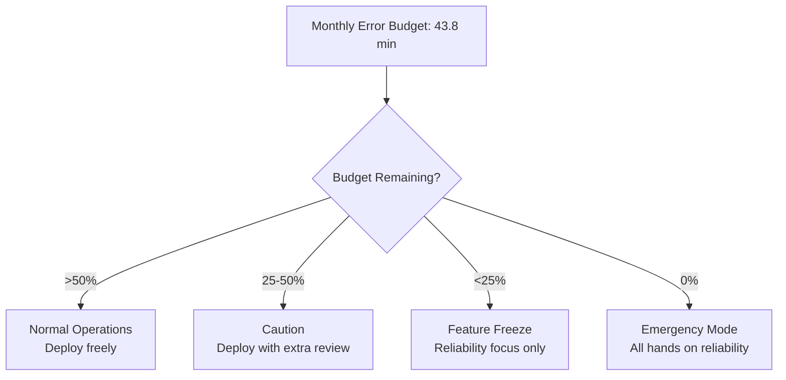
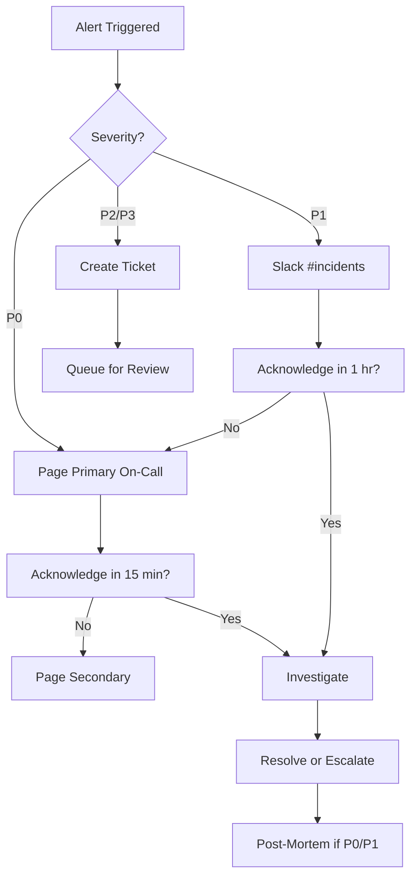
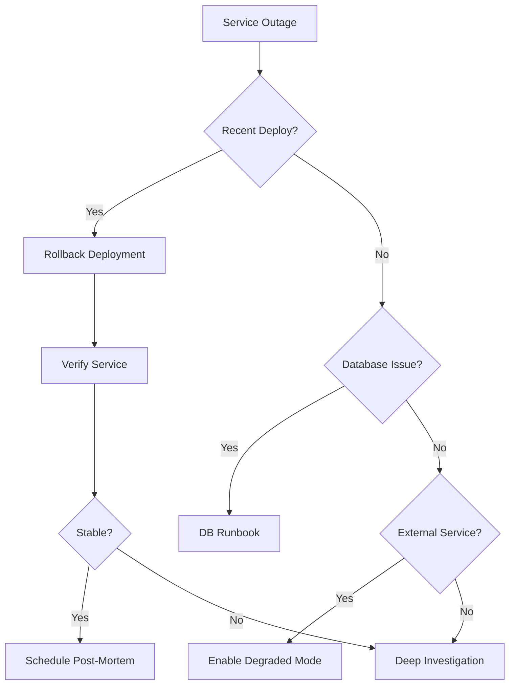
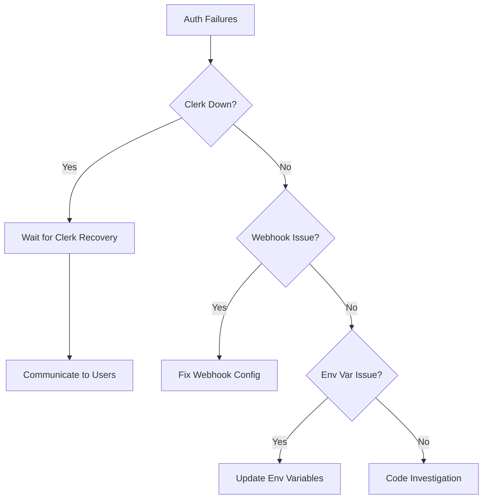
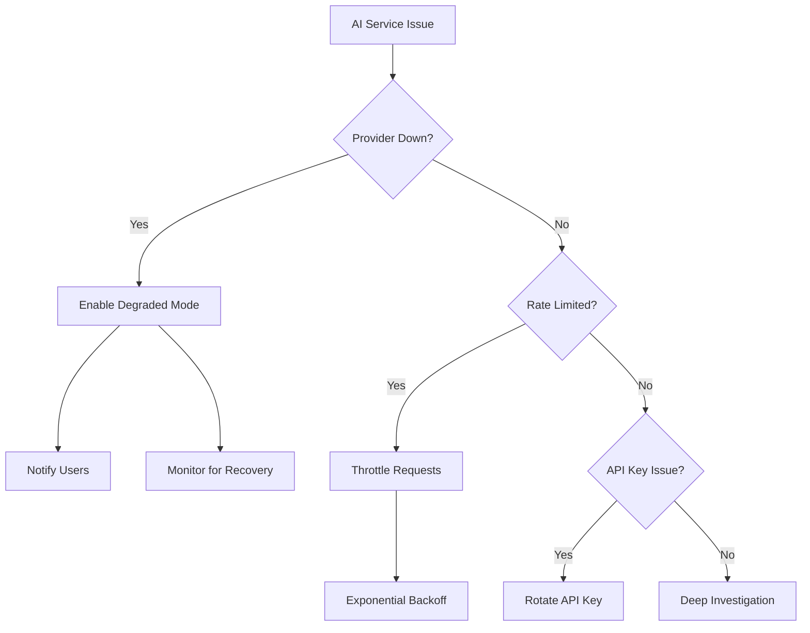
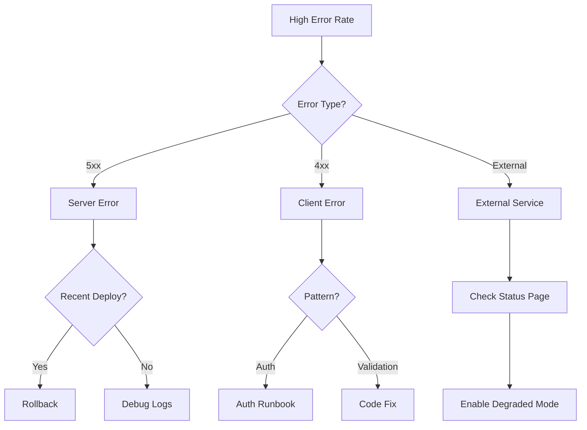
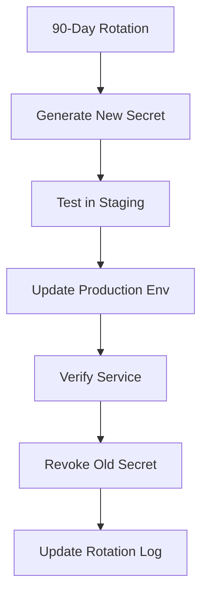

# CaseRadar Operational Runbooks

## Overview

This document provides operational runbooks for CaseRadar support engineers. These procedures cover common incidents, maintenance tasks, and emergency responses.

---

## Service Level Objectives (SLOs)

### Availability SLO

| Metric | Target | Measurement |
|--------|--------|-------------|
| **Uptime** | 99.9% (8.76 hrs/year downtime) | Monthly |
| **API Success Rate** | 99.5% | Hourly |
| **Error Budget** | 0.1% (43.8 min/month) | Monthly |

### Performance SLOs

| Endpoint Category | p50 | p95 | p99 |
|-------------------|-----|-----|-----|
| Page loads | 500ms | 1.5s | 3s |
| API reads | 200ms | 500ms | 1s |
| API writes | 300ms | 800ms | 2s |
| Search queries | 500ms | 1.5s | 3s |
| AI generation | 10s | 30s | 60s |
| PDF export | 2s | 5s | 10s |

### Error Budget Policy



---

## On-Call Responsibilities

### Rotation Schedule

| Role | Coverage | Response Time |
|------|----------|---------------|
| Primary On-Call | 24/7 weekly rotation | 15 min (P0), 1 hr (P1) |
| Secondary On-Call | Backup | 30 min (P0), 2 hr (P1) |
| Engineering Lead | Escalation | As needed |

### Handoff Checklist

- [ ] Review open incidents from previous shift
- [ ] Check monitoring dashboards
- [ ] Verify pager is working
- [ ] Review recent deployments
- [ ] Check error budget status

---

## Incident Classification

### Severity Levels

| Level | Definition | Examples | Response Time |
|-------|------------|----------|---------------|
| **P0** | Service down, data breach | Complete outage, security incident | 15 min |
| **P1** | Major feature broken | Auth failing, generation broken | 1 hour |
| **P2** | Degraded performance | Slow queries, partial outage | 4 hours |
| **P3** | Minor issue | UI bug, non-critical error | 24 hours |

### Escalation Path



---

## Runbook: Service Outage

### Symptoms
- Health checks failing
- Users reporting errors
- Monitoring alerts firing

### Diagnosis Steps

```bash
# 1. Check Vercel deployment status
vercel ls --project caseradar

# 2. Check recent deployments
vercel ls --project caseradar --limit 5

# 3. Check function logs
vercel logs --project caseradar --since 1h

# 4. Check database connectivity
curl -s https://caseradar.com/api/health/db

# 5. Check external services
curl -s https://caseradar.com/api/health/services
```

### Resolution Steps



### Rollback Procedure

```bash
# 1. List recent deployments
vercel ls --project caseradar

# 2. Identify last known good deployment
# Look for deployment before issues started

# 3. Rollback to previous deployment
vercel rollback [deployment-url]

# 4. Verify service restored
curl -s https://caseradar.com/api/health

# 5. Notify stakeholders
# Post in #incidents channel
```

---

## Runbook: Database Issues

### Symptoms
- Slow queries
- Connection timeouts
- "Database connection failed" errors

### Diagnosis

```bash
# 1. Check connection count (Supabase dashboard)
# Navigate to: Project > Settings > Database > Connection Pooling

# 2. Check for long-running queries
# Supabase SQL Editor:
SELECT pid, now() - pg_stat_activity.query_start AS duration, query
FROM pg_stat_activity
WHERE (now() - pg_stat_activity.query_start) > interval '5 minutes';

# 3. Check table sizes
SELECT relname, pg_size_pretty(pg_total_relation_size(relid))
FROM pg_catalog.pg_statio_user_tables
ORDER BY pg_total_relation_size(relid) DESC;

# 4. Check index usage
SELECT relname, idx_scan, seq_scan
FROM pg_stat_user_tables
WHERE seq_scan > idx_scan;
```

### Resolution

| Issue | Solution |
|-------|----------|
| Connection pool exhausted | Restart connection pooler, check for leaks |
| Long-running query | Kill query: `SELECT pg_terminate_backend(pid)` |
| Table bloat | Schedule VACUUM ANALYZE |
| Missing index | Add index (coordinate with team) |
| Disk space | Archive old data, expand storage |

### Emergency: Database Restore

```bash
# 1. Go to Supabase Dashboard > Settings > Database > Backups

# 2. Select Point-in-Time Recovery
# Choose time before incident

# 3. Restore to new database
# This creates a new project

# 4. Verify data integrity
# Run validation queries

# 5. Update connection strings
# Update Vercel environment variables

# 6. Notify stakeholders
```

---

## Runbook: Authentication Failures

### Symptoms
- Users can't sign in
- "Unauthorized" errors
- Session validation failing

### Diagnosis

```bash
# 1. Check Clerk status page
# https://status.clerk.dev/

# 2. Check webhook delivery
# Clerk Dashboard > Webhooks > View logs

# 3. Check middleware logs
vercel logs --project caseradar --since 1h | grep -i "auth\|clerk"

# 4. Verify environment variables
vercel env ls --project caseradar
```

### Resolution



### Webhook Recovery

```bash
# 1. Check webhook secret matches
# Clerk Dashboard > Webhooks > Signing Secret

# 2. Verify Vercel env var
vercel env ls --project caseradar | grep CLERK_WEBHOOK

# 3. If mismatch, update:
vercel env add CLERK_WEBHOOK_SECRET

# 4. Redeploy
vercel --prod

# 5. Test webhook
# Clerk Dashboard > Webhooks > Send test event
```

---

## Runbook: AI Service Degradation

### Symptoms
- Document generation failing
- Embedding generation slow/failing
- High AI API error rate

### Diagnosis

```bash
# 1. Check OpenAI status
# https://status.openai.com/

# 2. Check Anthropic status
# https://status.anthropic.com/

# 3. Check API logs for errors
vercel logs --project caseradar --since 1h | grep -i "openai\|anthropic\|claude"

# 4. Check rate limit headers in logs
# Look for X-RateLimit-* headers
```

### Resolution



### Degraded Mode

When AI services are unavailable:

1. **Document Generation**: Display "AI generation temporarily unavailable"
2. **Embedding Search**: Fall back to keyword search
3. **Pattern Analysis**: Skip new clustering, use cached patterns

```typescript
// Degraded mode check
const AI_DEGRADED = process.env.AI_DEGRADED_MODE === 'true';

if (AI_DEGRADED) {
  return {
    error: 'AI services temporarily unavailable',
    fallback: true,
    retryAfter: 300, // 5 minutes
  };
}
```

---

## Runbook: Cron Job Failures

### Symptoms
- NHTSA data not updating
- Patterns not being analyzed
- Cron monitoring alerts

### Diagnosis

```bash
# 1. Check Vercel cron logs
vercel logs --project caseradar --since 24h | grep -i "cron"

# 2. Check last successful run
# Query database for last sync timestamp
SELECT MAX("dateAdded") FROM "Complaint";

# 3. Check for timeout errors
# Cron jobs have 10s (hobby) or 60s (pro) limits

# 4. Check NHTSA API status
curl -s "https://api.nhtsa.gov/complaints/complaintsByVehicle?make=Toyota&model=Camry&modelYear=2020"
```

### Resolution

| Issue | Solution |
|-------|----------|
| Timeout | Optimize query, increase timeout (Pro plan) |
| NHTSA API down | Wait, add retry logic |
| Auth failure | Verify CRON_SECRET env var |
| Database full | Archive old data |

### Manual Cron Trigger

```bash
# Trigger NHTSA sync manually
curl -X GET "https://caseradar.com/api/cron/sync-nhtsa" \
  -H "Authorization: Bearer $CRON_SECRET"

# Trigger pattern analysis manually
curl -X GET "https://caseradar.com/api/cron/analyze-patterns" \
  -H "Authorization: Bearer $CRON_SECRET"
```

---

## Runbook: High Error Rate

### Symptoms
- Sentry alerts firing
- Error rate > 1%
- User complaints increasing

### Diagnosis

```bash
# 1. Check Sentry for error patterns
# https://sentry.io/organizations/[org]/issues/

# 2. Group errors by:
# - Endpoint
# - Error type
# - User agent
# - Time pattern

# 3. Check for recent deployments
vercel ls --project caseradar --limit 5

# 4. Check external service status
# Clerk, Stripe, OpenAI, Anthropic, Supabase
```

### Triage Matrix

| Error Type | Priority | Action |
|------------|----------|--------|
| Auth errors (401/403) | P1 | Check Clerk |
| Database errors | P1 | Check Supabase |
| AI errors | P2 | Enable degraded mode |
| Validation errors (400) | P3 | Review input handling |
| Rate limit errors (429) | P2 | Adjust limits |
| Server errors (500) | P1 | Investigate stack trace |

### Error Response



---

## Runbook: Performance Degradation

### Symptoms
- Slow page loads
- API latency increasing
- Users reporting slowness

### Diagnosis

```bash
# 1. Check Vercel Analytics
# Vercel Dashboard > Analytics > Web Vitals

# 2. Check function duration
# Vercel Dashboard > Deployments > [latest] > Functions

# 3. Check database performance
# Supabase Dashboard > Database > Query Performance

# 4. Check for N+1 queries
# Look for repeated similar queries in logs
```

### Common Causes & Solutions

| Cause | Indicator | Solution |
|-------|-----------|----------|
| N+1 queries | Repeated similar queries | Add `include` to Prisma |
| Missing index | High seq_scan count | Add database index |
| Large payload | Slow API response | Paginate, compress |
| Cold starts | First request slow | Optimize bundle size |
| External API slow | High duration on AI calls | Add caching, timeout |

### Performance Optimization Checklist

- [ ] Verify database indexes exist
- [ ] Check for N+1 query patterns
- [ ] Verify caching is working
- [ ] Check CDN cache hit rate
- [ ] Review recent code changes
- [ ] Check external API latency

---

## Maintenance Procedures

### Database Maintenance

```sql
-- Weekly: Vacuum and analyze
VACUUM ANALYZE;

-- Monthly: Check for bloat
SELECT schemaname, relname,
       n_dead_tup, n_live_tup,
       round(n_dead_tup * 100.0 / nullif(n_live_tup, 0), 2) as dead_pct
FROM pg_stat_user_tables
WHERE n_dead_tup > 1000
ORDER BY n_dead_tup DESC;

-- Quarterly: Reindex large tables
REINDEX TABLE "Complaint";
REINDEX TABLE "Pattern";
```

### Secret Rotation



### Deployment Procedure

```bash
# 1. Pre-deployment checks
bun run typecheck
bun run lint
bun run test

# 2. Create preview deployment
vercel

# 3. Test preview
# Manual verification of key flows

# 4. Deploy to production
vercel --prod

# 5. Post-deployment verification
curl -s https://caseradar.com/api/health
curl -s https://caseradar.com/api/health/db

# 6. Monitor for errors
# Watch Sentry for 15 minutes
```

---

## Emergency Contacts

### Internal

| Role | Contact | When to Reach |
|------|---------|---------------|
| Primary On-Call | [Pager] | P0/P1 incidents |
| Engineering Lead | [Phone] | P0 escalation |
| Product Lead | [Slack] | User-facing decisions |

### External Services

| Service | Status Page | Support |
|---------|-------------|---------|
| Vercel | status.vercel.com | support@vercel.com |
| Supabase | status.supabase.com | support@supabase.io |
| Clerk | status.clerk.dev | support@clerk.dev |
| Stripe | status.stripe.com | support@stripe.com |
| OpenAI | status.openai.com | support@openai.com |
| Anthropic | status.anthropic.com | support@anthropic.com |
| Sentry | status.sentry.io | support@sentry.io |

---

## Post-Incident Review

### Template

```markdown
# Post-Incident Review: [Title]

## Summary
- **Date**: YYYY-MM-DD
- **Duration**: X hours Y minutes
- **Severity**: P0/P1/P2
- **Impact**: [Users affected, data impacted]

## Timeline
- HH:MM - Incident detected
- HH:MM - On-call paged
- HH:MM - Investigation started
- HH:MM - Root cause identified
- HH:MM - Mitigation applied
- HH:MM - Service restored
- HH:MM - Incident resolved

## Root Cause
[Detailed explanation of what went wrong]

## Impact
- Users affected: X
- Revenue impact: $Y
- Error budget consumed: Z%

## What Went Well
-
-

## What Went Poorly
-
-

## Action Items
- [ ] [Action 1] - Owner - Due Date
- [ ] [Action 2] - Owner - Due Date

## Lessons Learned
[Key takeaways for future prevention]
```

---

**Previous:** [10-ai-governance.md](./10-ai-governance.md) - AI Governance
**Index:** [00-overview.md](./00-overview.md) - System Overview
