# CaseRadar Reliability & Scalability Documentation

## Overview

This document details resilience patterns, failure handling, and scalability architecture for CaseRadar. As a legal technology platform, reliability is paramount - system failures can impact active legal proceedings.

---

## Reliability Architecture

### System Reliability Goals

| Metric | Target | Measurement Period |
|--------|--------|-------------------|
| Availability | 99.9% | Monthly |
| Mean Time to Recovery (MTTR) | < 30 minutes | Per incident |
| Mean Time Between Failures (MTBF) | > 720 hours | Rolling |
| Error Rate | < 0.1% | Hourly |

### External Service Dependencies

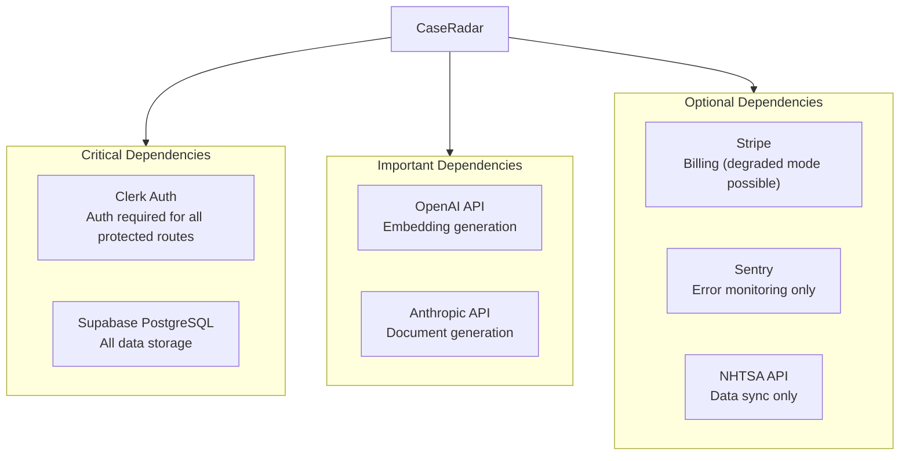

---

## Circuit Breaker Pattern

### Circuit Breaker States

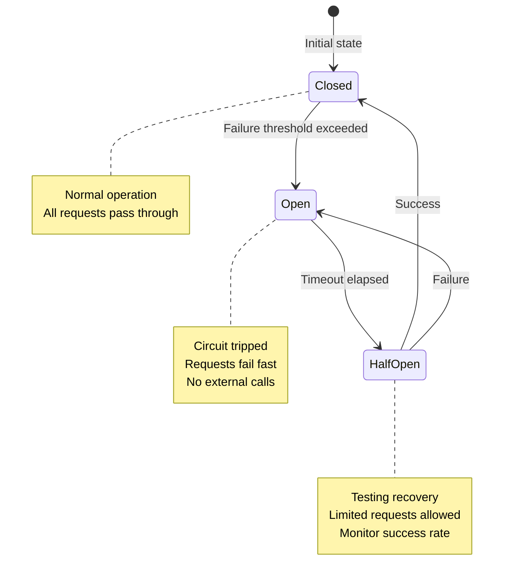

### Circuit Breaker Configuration

| Service | Failure Threshold | Timeout | Half-Open Requests |
|---------|-------------------|---------|-------------------|
| OpenAI API | 5 failures in 60s | 30s | 3 |
| Anthropic API | 5 failures in 60s | 30s | 3 |
| NHTSA API | 10 failures in 300s | 60s | 5 |
| Stripe API | 3 failures in 60s | 30s | 2 |

### Implementation Pattern

```typescript
interface CircuitBreakerConfig {
  name: string;
  failureThreshold: number;
  successThreshold: number;
  timeout: number;  // milliseconds
  monitoringWindow: number;  // milliseconds
}

const CIRCUIT_BREAKER_CONFIGS: Record<string, CircuitBreakerConfig> = {
  openai: {
    name: 'openai',
    failureThreshold: 5,
    successThreshold: 3,
    timeout: 30000,
    monitoringWindow: 60000,
  },
  anthropic: {
    name: 'anthropic',
    failureThreshold: 5,
    successThreshold: 3,
    timeout: 30000,
    monitoringWindow: 60000,
  },
  nhtsa: {
    name: 'nhtsa',
    failureThreshold: 10,
    successThreshold: 5,
    timeout: 60000,
    monitoringWindow: 300000,
  },
};
```

### Circuit Breaker Flow

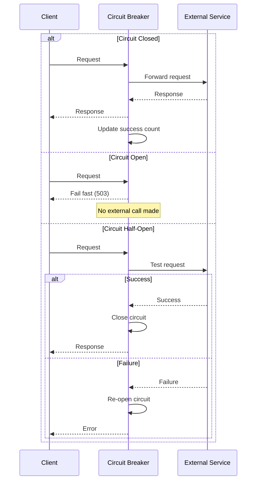

---

## Retry Logic

### Retry Strategy

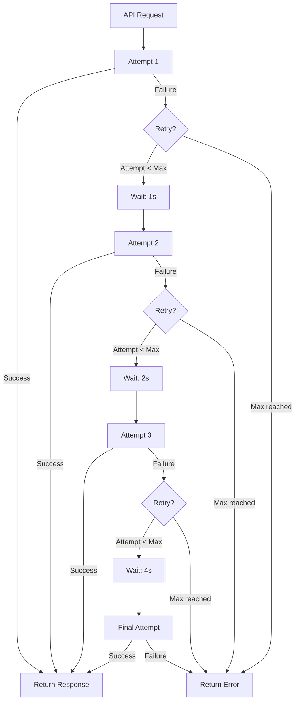

### Retry Configuration

| Operation | Max Retries | Base Delay | Max Delay | Jitter |
|-----------|-------------|------------|-----------|--------|
| OpenAI Embedding | 3 | 1s | 8s | ±500ms |
| Anthropic Generation | 3 | 2s | 16s | ±1s |
| NHTSA Fetch | 5 | 5s | 60s | ±2s |
| Database Query | 2 | 100ms | 1s | ±50ms |
| Webhook Delivery | 5 | 1s | 32s | ±500ms |

### Retryable vs Non-Retryable Errors

| Retryable (Transient) | Non-Retryable (Permanent) |
|----------------------|--------------------------|
| 429 Rate Limited | 400 Bad Request |
| 500 Internal Server Error | 401 Unauthorized |
| 502 Bad Gateway | 403 Forbidden |
| 503 Service Unavailable | 404 Not Found |
| 504 Gateway Timeout | 422 Validation Error |
| Network timeout | Invalid API key |
| Connection refused | Insufficient funds |

### Exponential Backoff Implementation

```typescript
async function withRetry<T>(
  operation: () => Promise<T>,
  config: RetryConfig
): Promise<T> {
  let lastError: Error;

  for (let attempt = 1; attempt <= config.maxRetries; attempt++) {
    try {
      return await operation();
    } catch (error) {
      lastError = error as Error;

      if (!isRetryableError(error) || attempt === config.maxRetries) {
        throw error;
      }

      const delay = calculateBackoff(attempt, config);
      await sleep(delay);
    }
  }

  throw lastError!;
}

function calculateBackoff(attempt: number, config: RetryConfig): number {
  const exponentialDelay = config.baseDelay * Math.pow(2, attempt - 1);
  const cappedDelay = Math.min(exponentialDelay, config.maxDelay);
  const jitter = (Math.random() - 0.5) * 2 * config.jitter;
  return cappedDelay + jitter;
}
```

---

## Graceful Degradation

### Degradation Levels

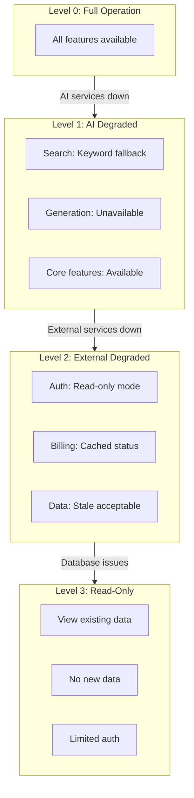

### Fallback Strategies

| Service | Primary | Fallback | User Experience |
|---------|---------|----------|-----------------|
| OpenAI Embeddings | Vector search | Keyword search | Slower, less accurate |
| Anthropic Claude | AI generation | Manual drafting | Feature unavailable |
| NHTSA API | Live sync | Cached data | Data may be stale |
| Stripe | Live billing | Cached status | Delayed updates |
| Clerk | JWT validation | Session cache | Brief window |

### Degradation Implementation

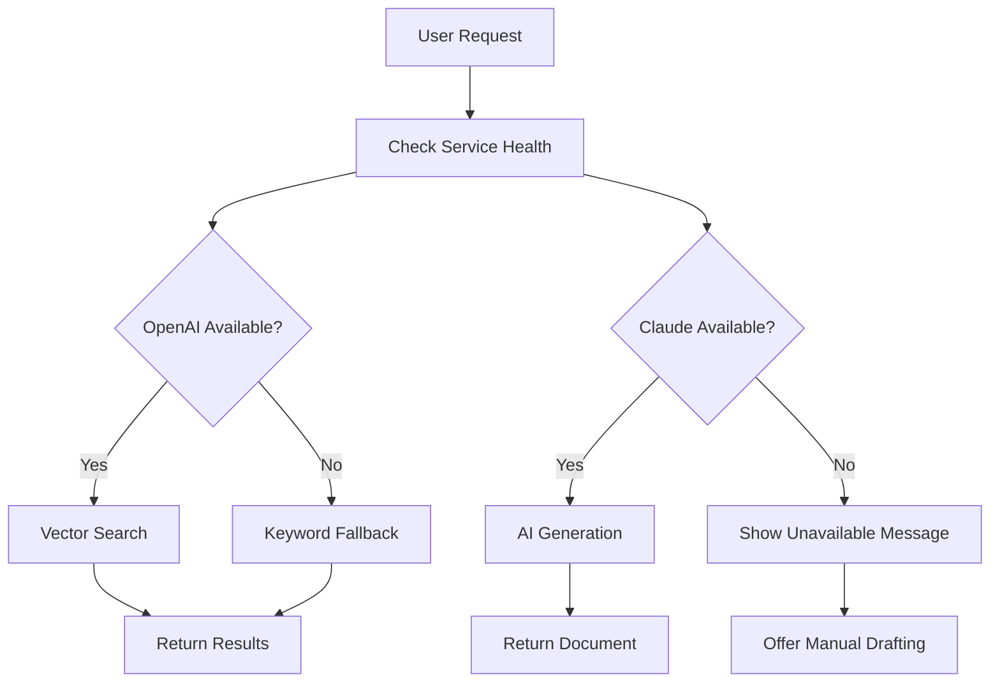

---

## Timeout Configuration

### Timeout Values

| Operation | Timeout | Rationale |
|-----------|---------|-----------|
| Database query (simple) | 5s | Should be <100ms normally |
| Database query (complex) | 30s | Aggregations, joins |
| OpenAI embedding | 30s | Batch processing |
| Anthropic generation | 120s | Long document generation |
| NHTSA API fetch | 60s | External API latency |
| PDF generation | 30s | Complex documents |
| Health check | 5s | Quick status only |
| Total request | 300s | Vercel Pro limit |

### Timeout Flow

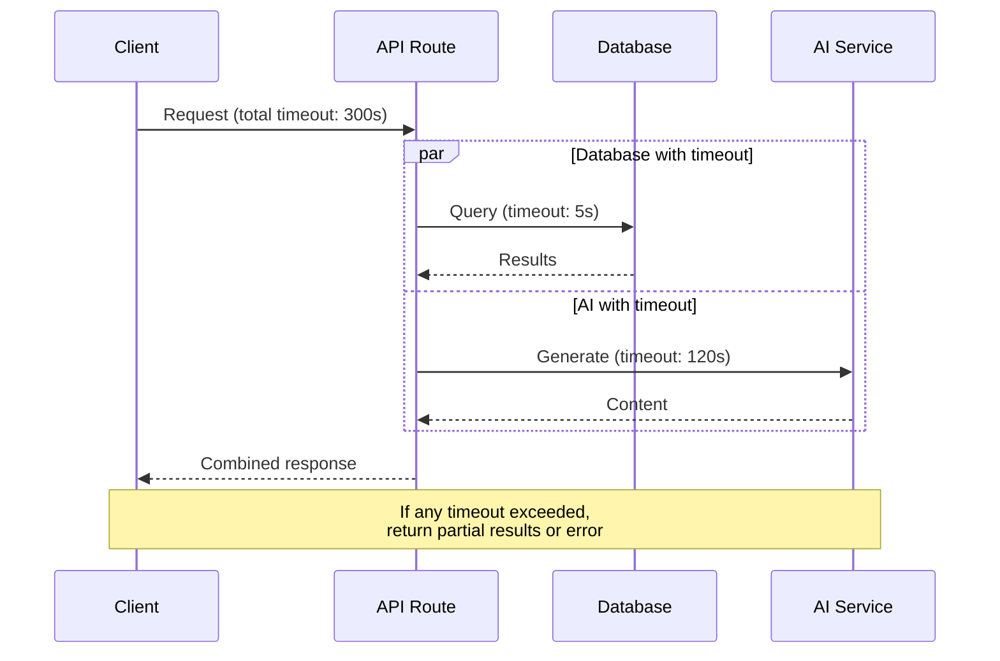

---

## Health Check Architecture

### Health Check Endpoints

| Endpoint | Purpose | Frequency | Timeout |
|----------|---------|-----------|---------|
| `/api/health` | Basic liveness | 30s | 5s |
| `/api/health/db` | Database connectivity | 60s | 10s |
| `/api/health/services` | External dependencies | 300s | 30s |
| `/api/health/deep` | Full system check | 600s | 60s |

### Health Check Flow

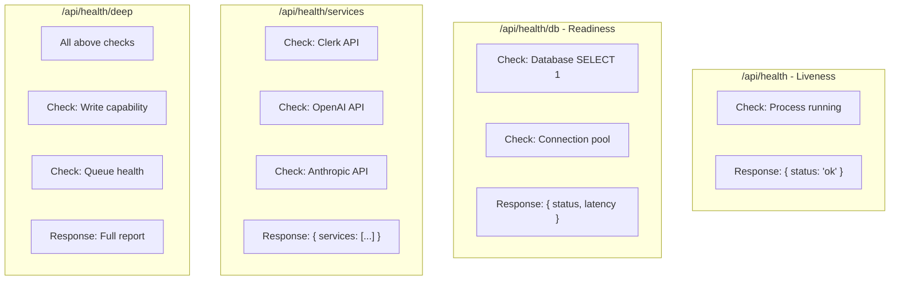

### Health Check Response Format

```json
{
  "status": "healthy",
  "timestamp": "2024-01-15T12:00:00Z",
  "version": "1.2.3",
  "checks": {
    "database": {
      "status": "healthy",
      "latency": 12,
      "connections": {
        "active": 5,
        "idle": 15,
        "max": 20
      }
    },
    "services": {
      "clerk": { "status": "healthy", "latency": 45 },
      "openai": { "status": "healthy", "latency": 120 },
      "anthropic": { "status": "healthy", "latency": 200 },
      "stripe": { "status": "degraded", "error": "rate_limited" }
    }
  },
  "degraded": false
}
```

---

## Scalability Architecture

### Scaling Strategy

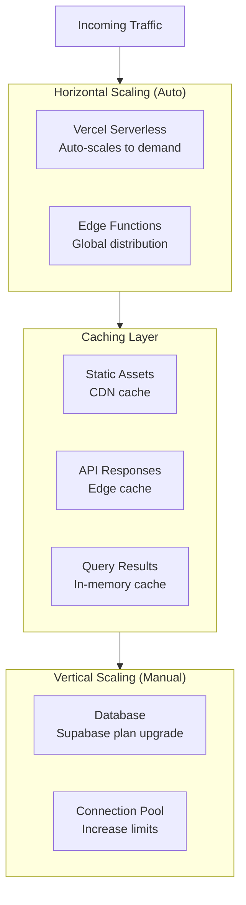

### Capacity Planning

#### Current Limits

| Resource | Current Limit | Scaling Path |
|----------|---------------|--------------|
| Serverless functions | Unlimited (Vercel Pro) | N/A |
| Database connections | 60 (Supabase Pro) | Upgrade to 200 |
| OpenAI rate limit | 3500 RPM | Request increase |
| Anthropic rate limit | 1000 RPM | Request increase |
| Storage | 8GB (Supabase Pro) | Upgrade to 100GB |

#### Projected Capacity

| Users | Requests/min | DB Connections | AI Calls/day | Storage/month |
|-------|--------------|----------------|--------------|---------------|
| 100 | 50 | 10 | 500 | 100MB |
| 500 | 250 | 25 | 2,500 | 500MB |
| 1,000 | 500 | 50 | 5,000 | 1GB |
| 5,000 | 2,500 | 100 | 25,000 | 5GB |
| 10,000 | 5,000 | 200 | 50,000 | 10GB |

### Database Scaling

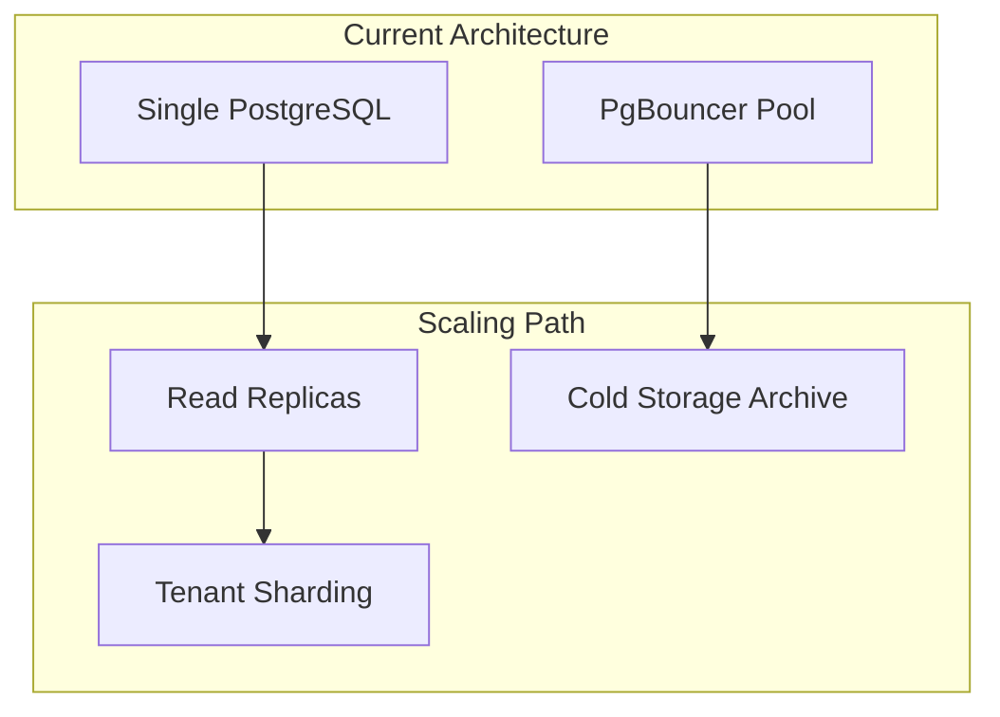

#### Database Scaling Triggers

| Metric | Threshold | Action |
|--------|-----------|--------|
| Connection usage | > 80% | Add read replica |
| Query latency p99 | > 500ms | Index optimization |
| Storage usage | > 70% | Archive old data |
| CPU usage | > 70% | Upgrade plan |

---

## Caching Strategy

### Cache Layers

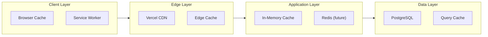

### Cache Configuration

| Resource | Cache Location | TTL | Invalidation |
|----------|---------------|-----|--------------|
| Static assets | CDN | 1 year | Deploy |
| API responses | Edge | 0 (no-store) | N/A |
| User session | Memory | 5 min | Logout |
| Complaint data | Memory | 1 hour | NHTSA sync |
| Pattern data | Memory | 15 min | Analysis run |
| Dashboard stats | Memory | 5 min | Data change |

### Cache-Aside Pattern

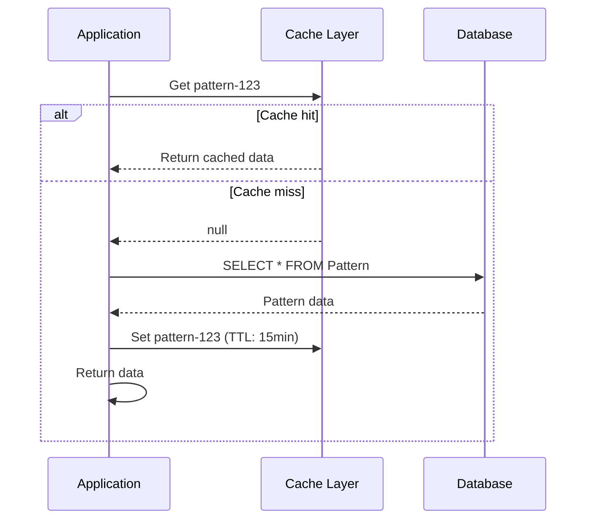

---

## Rate Limiting Architecture

### Rate Limit Tiers

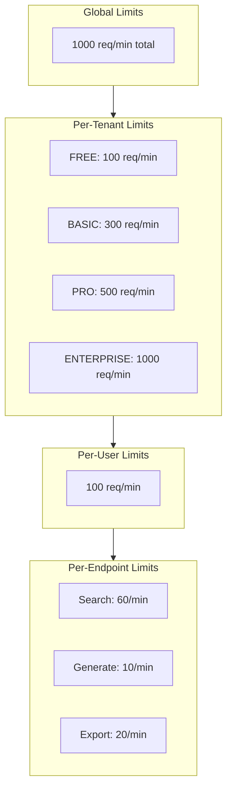

### Rate Limit Response

```json
{
  "error": "rate_limit_exceeded",
  "message": "Too many requests",
  "limits": {
    "endpoint": "search",
    "limit": 60,
    "remaining": 0,
    "reset": "2024-01-15T12:01:00Z"
  },
  "retryAfter": 45
}
```

### Rate Limit Headers

```
X-RateLimit-Limit: 60
X-RateLimit-Remaining: 0
X-RateLimit-Reset: 1705320060
Retry-After: 45
```

---

## Load Testing Results

### Baseline Performance (Expected)

| Endpoint | Concurrent Users | p50 | p95 | p99 | Error Rate |
|----------|------------------|-----|-----|-----|------------|
| Dashboard | 100 | 200ms | 500ms | 1s | < 0.1% |
| Complaint Search | 50 | 500ms | 1.5s | 3s | < 0.1% |
| Pattern List | 100 | 150ms | 400ms | 800ms | < 0.1% |
| Document Generate | 10 | 10s | 25s | 45s | < 1% |
| PDF Export | 20 | 2s | 5s | 8s | < 0.5% |

### Stress Test Thresholds

| Scenario | Breaking Point | Failure Mode |
|----------|----------------|--------------|
| Concurrent users | ~500 | DB connection exhaustion |
| Requests/second | ~100 | Rate limiting kicks in |
| AI generation concurrent | ~20 | API rate limits |
| Search concurrent | ~50 | Slow response degradation |

---

## Disaster Recovery

### RTO/RPO Targets

| Data Type | RTO | RPO | Method |
|-----------|-----|-----|--------|
| User data | 4 hours | 1 hour | Supabase PITR |
| Complaints | 4 hours | 6 hours | Daily sync |
| Patterns | 4 hours | 1 hour | Supabase PITR |
| Generated docs | 4 hours | 1 hour | Supabase PITR |
| Audit logs | 4 hours | 0 (no loss) | Supabase PITR |

### Recovery Procedures

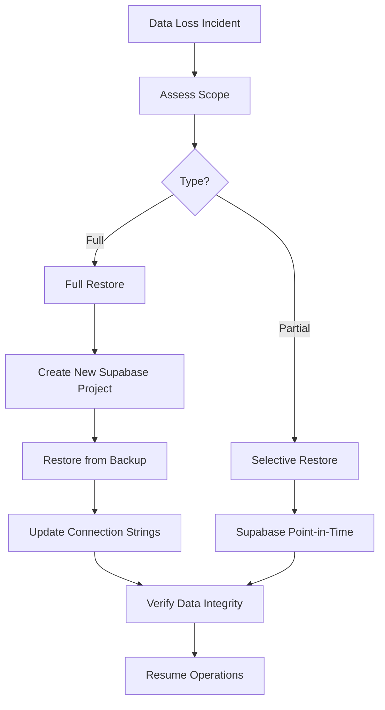

---

## Reliability Checklist

### Pre-Production
- [ ] Circuit breakers configured for all external APIs
- [ ] Retry logic with exponential backoff
- [ ] Timeout values set for all operations
- [ ] Health check endpoints implemented
- [ ] Graceful degradation paths defined

### Monitoring
- [ ] Error rate alerts configured
- [ ] Latency alerts configured
- [ ] Circuit breaker state alerts
- [ ] Database connection alerts
- [ ] External service status monitoring

### Documentation
- [ ] Runbooks for all failure scenarios
- [ ] Escalation paths defined
- [ ] Recovery procedures tested
- [ ] Capacity limits documented
- [ ] Scaling triggers defined

---

**Previous:** [11-operational-runbooks.md](./11-operational-runbooks.md) - Operational Runbooks
**Index:** [00-overview.md](./00-overview.md) - System Overview
