# CaseRadar Monitoring & Observability Documentation

## Overview

This document defines the monitoring, alerting, and observability strategy for CaseRadar. As a legal technology platform, comprehensive monitoring is essential to detect issues before they impact attorney workflows or legal proceedings.

---

## Observability Architecture

### Three Pillars of Observability

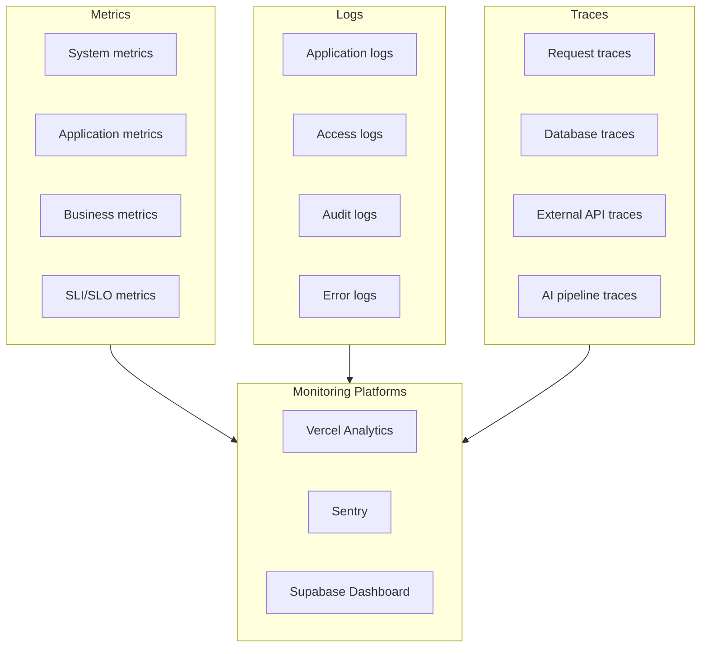

---

## Metrics Strategy

### System Metrics

| Metric | Source | Alert Threshold |
|--------|--------|-----------------|
| CPU utilization | Vercel | > 80% sustained |
| Memory usage | Vercel | > 85% |
| Function execution time | Vercel | p99 > 10s |
| Cold start duration | Vercel | p95 > 2s |
| Edge requests/sec | Vercel | > 1000 |

### Application Metrics

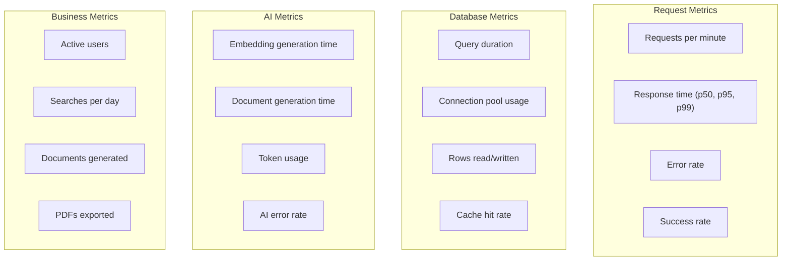

### Custom Metrics Implementation

```typescript
// src/lib/monitoring/metrics.ts
import { track } from '@vercel/analytics';

export const metrics = {
  // Request metrics
  trackRequest: (endpoint: string, duration: number, status: number) => {
    track('api_request', {
      endpoint,
      duration_ms: duration,
      status_code: status,
      success: status < 400,
    });
  },

  // AI metrics
  trackAIGeneration: (type: string, duration: number, tokens: number) => {
    track('ai_generation', {
      type, // 'embedding' | 'document'
      duration_ms: duration,
      token_count: tokens,
    });
  },

  // Business metrics
  trackSearch: (resultCount: number, duration: number) => {
    track('complaint_search', {
      result_count: resultCount,
      duration_ms: duration,
    });
  },

  trackDocumentExport: (format: string, success: boolean) => {
    track('document_export', {
      format, // 'pdf' | 'json'
      success,
    });
  },
};
```

---

## SLI/SLO Monitoring

### Service Level Indicators (SLIs)

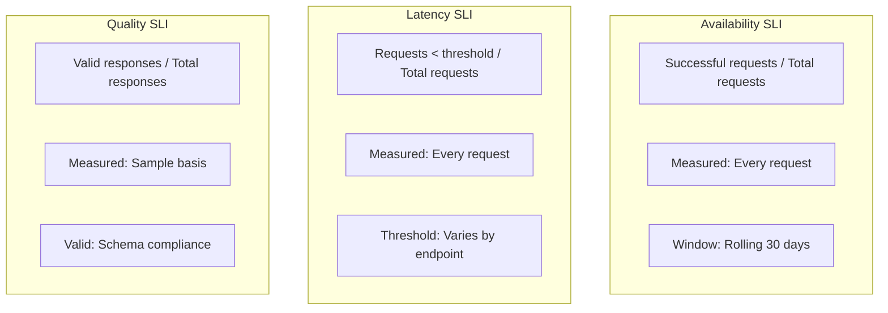

### SLO Dashboard

| SLO | Target | Current | Budget Remaining |
|-----|--------|---------|-----------------|
| API Availability | 99.9% | 99.95% | 72% |
| Dashboard Latency (p95) | < 1.5s | 1.2s | 85% |
| Search Latency (p95) | < 1.5s | 1.3s | 78% |
| AI Generation Success | 99% | 99.5% | 90% |
| Error Rate | < 0.1% | 0.05% | 80% |

### Error Budget Tracking

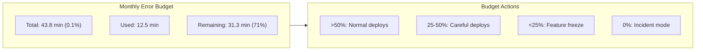

---

## Logging Strategy

### Log Levels

| Level | Usage | Examples |
|-------|-------|----------|
| `ERROR` | Failures requiring attention | Unhandled exceptions, API failures |
| `WARN` | Anomalies that may need attention | Rate limiting, retry exhausted |
| `INFO` | Normal operational events | Request completed, user action |
| `DEBUG` | Detailed debugging info | Query parameters, response data |

### Structured Logging Format

```typescript
// src/lib/monitoring/logger.ts
interface LogEntry {
  level: 'error' | 'warn' | 'info' | 'debug';
  message: string;
  timestamp: string;
  requestId: string;
  userId?: string;
  organizationId?: string;
  metadata?: Record<string, unknown>;
}

export function log(entry: LogEntry) {
  const logLine = JSON.stringify({
    ...entry,
    timestamp: new Date().toISOString(),
    environment: process.env.VERCEL_ENV || 'development',
  });

  switch (entry.level) {
    case 'error':
      console.error(logLine);
      break;
    case 'warn':
      console.warn(logLine);
      break;
    default:
      console.log(logLine);
  }
}

// Usage
log({
  level: 'info',
  message: 'Complaint search completed',
  requestId: 'req-123',
  userId: 'user-456',
  organizationId: 'org-789',
  metadata: {
    query: 'toyota camry brake',
    resultCount: 42,
    durationMs: 234,
  },
});
```

### Log Categories

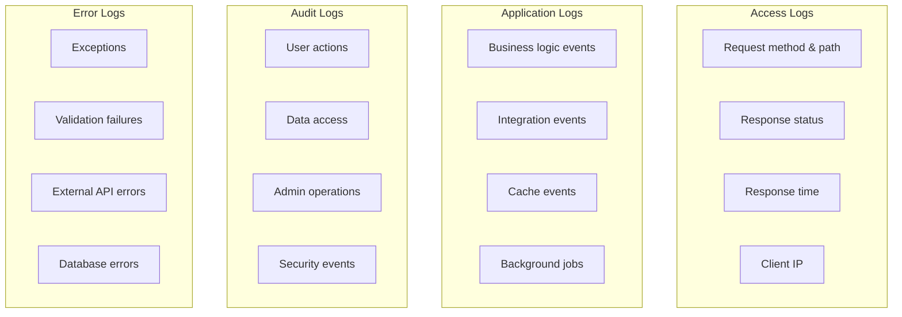

---

## Error Tracking (Sentry)

### Sentry Configuration

```typescript
// src/lib/monitoring/sentry.ts
import * as Sentry from '@sentry/nextjs';

Sentry.init({
  dsn: process.env.SENTRY_DSN,
  environment: process.env.VERCEL_ENV,
  release: process.env.VERCEL_GIT_COMMIT_SHA,

  // Performance monitoring
  tracesSampleRate: 0.1, // 10% of transactions
  profilesSampleRate: 0.1,

  // Error filtering
  beforeSend(event, hint) {
    // Don't send expected errors
    if (event.exception?.values?.[0]?.type === 'NotFoundError') {
      return null;
    }

    // Scrub sensitive data
    if (event.request?.headers) {
      delete event.request.headers['authorization'];
      delete event.request.headers['cookie'];
    }

    return event;
  },

  // User context
  initialScope: (scope) => {
    scope.setTag('platform', 'web');
    return scope;
  },
});
```

### Error Classification

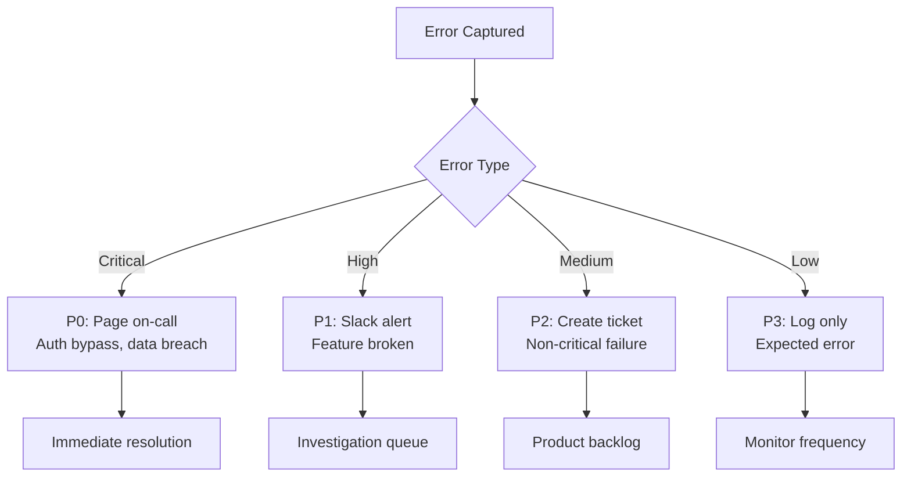

### Sentry Alert Rules

| Alert | Condition | Channel | Severity |
|-------|-----------|---------|----------|
| High error rate | > 10 errors/min | PagerDuty | P1 |
| New issue (production) | First seen | Slack #alerts | P2 |
| Regression | Previously resolved | Slack #alerts | P2 |
| Performance degradation | p95 > 5s | Slack #perf | P2 |
| Database errors | > 5 errors/5min | PagerDuty | P1 |

---

## Distributed Tracing

### Trace Context

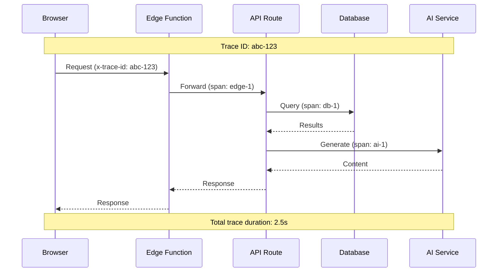

### Trace Implementation

```typescript
// src/lib/monitoring/tracing.ts
import { trace, context, SpanStatusCode } from '@opentelemetry/api';

const tracer = trace.getTracer('caseradar');

export async function withSpan<T>(
  name: string,
  fn: () => Promise<T>,
  attributes?: Record<string, string>
): Promise<T> {
  const span = tracer.startSpan(name, { attributes });

  try {
    const result = await fn();
    span.setStatus({ code: SpanStatusCode.OK });
    return result;
  } catch (error) {
    span.setStatus({
      code: SpanStatusCode.ERROR,
      message: error instanceof Error ? error.message : 'Unknown error',
    });
    span.recordException(error as Error);
    throw error;
  } finally {
    span.end();
  }
}

// Usage
export async function searchComplaints(query: string) {
  return withSpan('complaint.search', async () => {
    const embedding = await withSpan('embedding.generate', () =>
      generateEmbedding(query)
    );

    const results = await withSpan('database.vector_search', () =>
      vectorSearch(embedding)
    );

    return results;
  }, { query });
}
```

---

## Alerting Strategy

### Alert Hierarchy

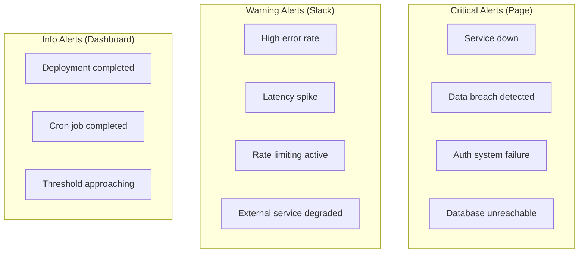

### Alert Configuration

```yaml
# alerting-rules.yml
alerts:
  # Critical
  - name: service_down
    condition: health_check_failed > 3
    window: 5m
    severity: critical
    channels: [pagerduty, slack-critical]

  - name: high_error_rate
    condition: error_rate > 5%
    window: 5m
    severity: critical
    channels: [pagerduty, slack-critical]

  # Warning
  - name: elevated_latency
    condition: p95_latency > 3s
    window: 10m
    severity: warning
    channels: [slack-alerts]

  - name: database_connections_high
    condition: db_connections > 80%
    window: 5m
    severity: warning
    channels: [slack-alerts]

  # Info
  - name: error_budget_low
    condition: error_budget_remaining < 25%
    window: 1h
    severity: info
    channels: [slack-eng]
```

### Alert Fatigue Prevention

| Strategy | Implementation |
|----------|----------------|
| **Grouping** | Related alerts bundled into single notification |
| **Deduplication** | Same alert won't repeat within 30 minutes |
| **Escalation** | Auto-escalate if not acknowledged |
| **Snooze** | Ability to temporarily silence known issues |
| **Runbook links** | Every alert links to remediation steps |

---

## Dashboard Design

### Executive Dashboard

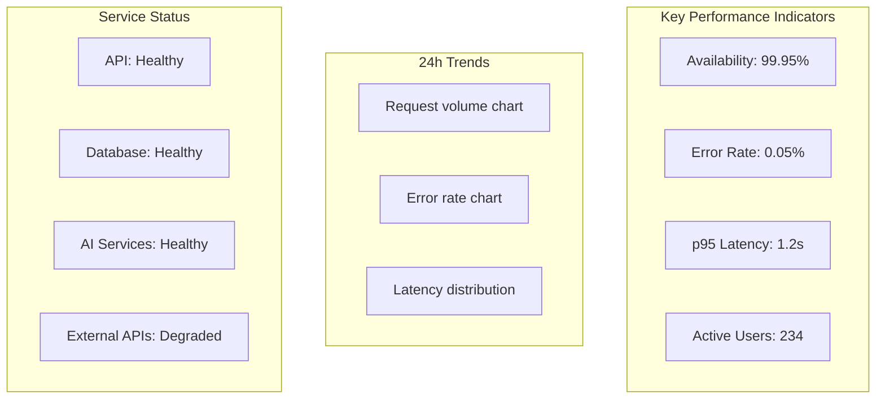

### Operations Dashboard

| Panel | Metrics | Refresh |
|-------|---------|---------|
| Request rate | Requests/second by endpoint | 10s |
| Error distribution | Errors by type and endpoint | 30s |
| Latency heatmap | Response time distribution | 30s |
| Database stats | Connections, query time, cache | 60s |
| AI pipeline | Token usage, generation time | 60s |
| Active incidents | Open incidents with status | 10s |

### Business Dashboard

| Panel | Metrics | Audience |
|-------|---------|----------|
| User activity | DAU, WAU, MAU | Product |
| Feature usage | Searches, generations, exports | Product |
| Revenue metrics | MRR, churn, conversions | Finance |
| Support metrics | Ticket volume, resolution time | Support |

---

## Health Checks

### Health Check Endpoints

```typescript
// /api/health - Basic liveness
export async function GET() {
  return NextResponse.json({
    status: 'ok',
    timestamp: new Date().toISOString(),
    version: process.env.VERCEL_GIT_COMMIT_SHA?.slice(0, 7),
  });
}

// /api/health/db - Database readiness
export async function GET() {
  const start = Date.now();
  try {
    await prisma.$queryRaw`SELECT 1`;
    return NextResponse.json({
      status: 'healthy',
      latency: Date.now() - start,
    });
  } catch (error) {
    return NextResponse.json({
      status: 'unhealthy',
      error: 'Database connection failed',
    }, { status: 503 });
  }
}

// /api/health/services - External services
export async function GET() {
  const checks = await Promise.allSettled([
    checkClerk(),
    checkOpenAI(),
    checkAnthropic(),
    checkStripe(),
  ]);

  const services = {
    clerk: checks[0].status === 'fulfilled' ? checks[0].value : 'unhealthy',
    openai: checks[1].status === 'fulfilled' ? checks[1].value : 'unhealthy',
    anthropic: checks[2].status === 'fulfilled' ? checks[2].value : 'unhealthy',
    stripe: checks[3].status === 'fulfilled' ? checks[3].value : 'unhealthy',
  };

  const allHealthy = Object.values(services).every(s => s === 'healthy');

  return NextResponse.json({
    status: allHealthy ? 'healthy' : 'degraded',
    services,
  }, { status: allHealthy ? 200 : 503 });
}
```

### Health Check Flow

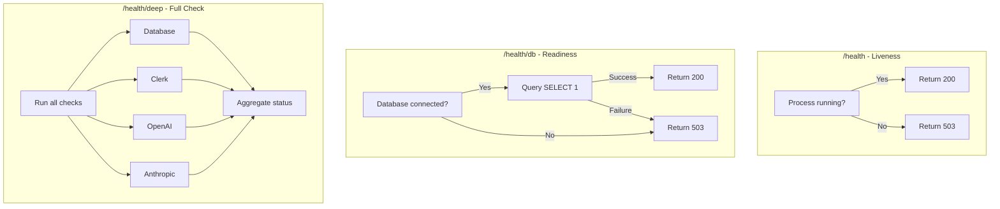

---

## Incident Detection

### Anomaly Detection

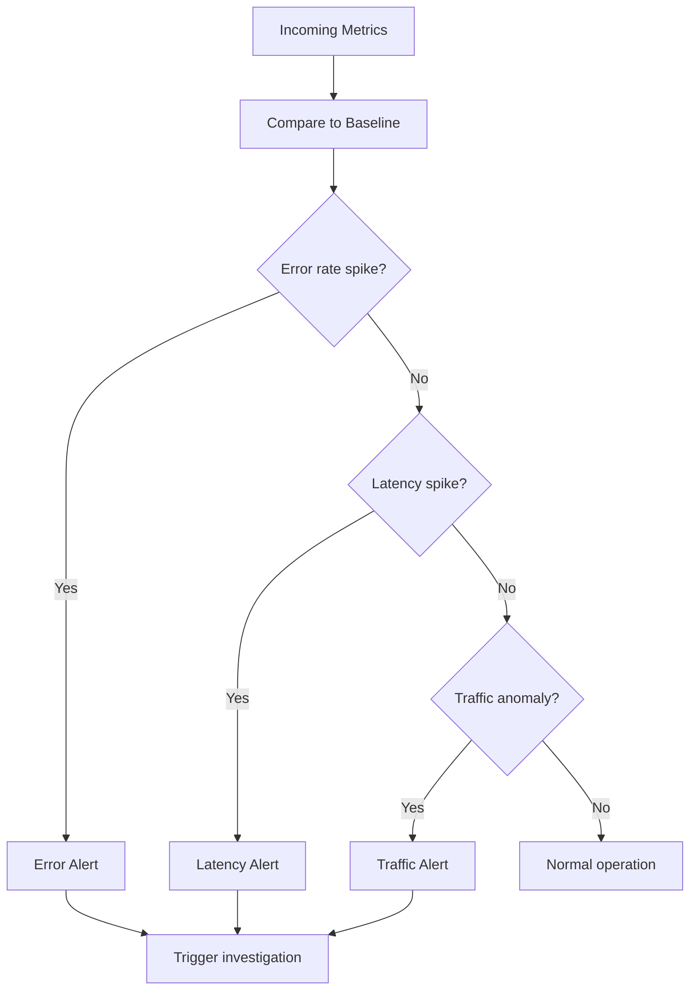

### Detection Thresholds

| Metric | Baseline | Warning | Critical |
|--------|----------|---------|----------|
| Error rate | 0.1% | > 1% | > 5% |
| p95 latency | 1.5s | > 3s | > 5s |
| Request rate | 100/min | +200% | +500% |
| DB connections | 20 | > 50 | > 80% |
| AI token usage | 10k/hr | > 50k/hr | > 100k/hr |

---

## Runbook Integration

### Alert-to-Runbook Mapping

| Alert | Runbook | Auto-Remediation |
|-------|---------|------------------|
| `service_down` | [Service Outage](./11-operational-runbooks.md#runbook-service-outage) | Rollback if recent deploy |
| `database_issues` | [Database Issues](./11-operational-runbooks.md#runbook-database-issues) | Kill long queries |
| `auth_failures` | [Authentication Failures](./11-operational-runbooks.md#runbook-authentication-failures) | Check Clerk status |
| `ai_degradation` | [AI Service Degradation](./11-operational-runbooks.md#runbook-ai-service-degradation) | Enable degraded mode |

### Runbook Links in Alerts

```typescript
// Alert notification template
const alertTemplate = {
  title: '🚨 High Error Rate Detected',
  severity: 'critical',
  message: 'Error rate exceeded 5% threshold for 5 minutes',
  metrics: {
    current: '6.2%',
    threshold: '5%',
    duration: '5 minutes',
  },
  runbook: 'https://docs.caseradar.com/runbooks/high-error-rate',
  dashboard: 'https://vercel.com/caseradar/analytics',
  actions: [
    { label: 'View in Sentry', url: 'https://sentry.io/...' },
    { label: 'Rollback', url: 'https://vercel.com/.../rollback' },
  ],
};
```

---

## Monitoring Checklist

### Initial Setup
- [ ] Sentry configured with proper DSN
- [ ] Vercel Analytics enabled
- [ ] Health check endpoints deployed
- [ ] Alert channels configured (Slack, PagerDuty)
- [ ] Dashboard created in monitoring platform

### Ongoing Operations
- [ ] Weekly SLO review
- [ ] Monthly alert tuning (reduce noise)
- [ ] Quarterly dashboard review
- [ ] Annual monitoring strategy review

### Incident Response
- [ ] Alerts link to runbooks
- [ ] On-call rotation documented
- [ ] Escalation paths defined
- [ ] Post-incident review process

---

**Previous:** [13-testing-development.md](./13-testing-development.md) - Testing & Development
**Next:** [15-threat-model.md](./15-threat-model.md) - Threat Model & Attack Surface
**Index:** [00-overview.md](./00-overview.md) - System Overview
