# CaseRadar Data Governance & Privacy Documentation

## Overview

This document defines data governance policies, privacy controls, and legal compliance procedures for CaseRadar. As a platform handling attorney-client privileged information, data governance is not optional—it's foundational.

---

## Data Classification

### Classification Levels

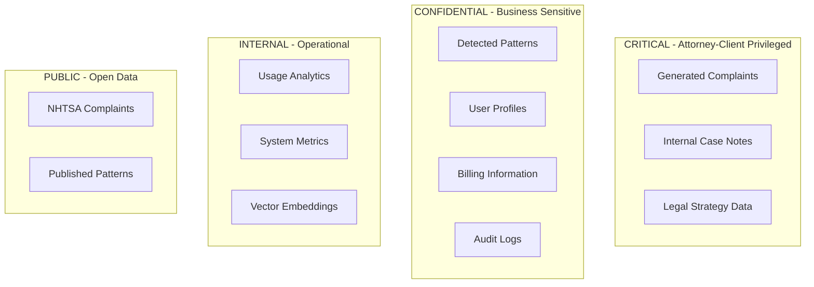

### Data Classification Matrix

| Data Type | Classification | Encryption | Retention | Access Control |
|-----------|---------------|------------|-----------|----------------|
| Generated complaints | CRITICAL | AES-256 + field-level | 7 years post-case | Role: ADMIN, ANALYST |
| User credentials | CRITICAL | Clerk-managed (bcrypt) | Account lifetime | Clerk only |
| Payment data | CRITICAL | Stripe-managed (PCI-DSS) | Stripe retention | Stripe only |
| Detected patterns | CONFIDENTIAL | AES-256 | 7 years | Role: All authenticated |
| Audit logs | CONFIDENTIAL | AES-256 | 7 years minimum | Role: ADMIN only |
| User profiles | CONFIDENTIAL | AES-256 | 90 days post-deletion | Role: Self + ADMIN |
| NHTSA complaints | PUBLIC | AES-256 (at rest) | Indefinite | All users |
| System metrics | INTERNAL | AES-256 | 90 days | Operations team |

### Field-Level Classification

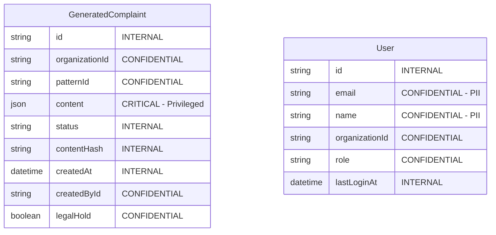

---

## Data Residency & Sovereignty

### Current Infrastructure Location

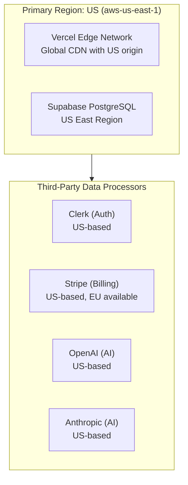

### Data Residency Requirements

| Customer Type | Requirement | CaseRadar Support |
|---------------|-------------|-------------------|
| US Law Firms | US-only storage | ✅ Supported (default) |
| EU Law Firms | EU data residency (GDPR) | ⚠️ Requires Supabase EU region |
| UK Law Firms | UK data residency | ⚠️ Requires configuration |
| APAC Law Firms | Regional residency | ❌ Not currently supported |

### Cross-Border Data Transfer

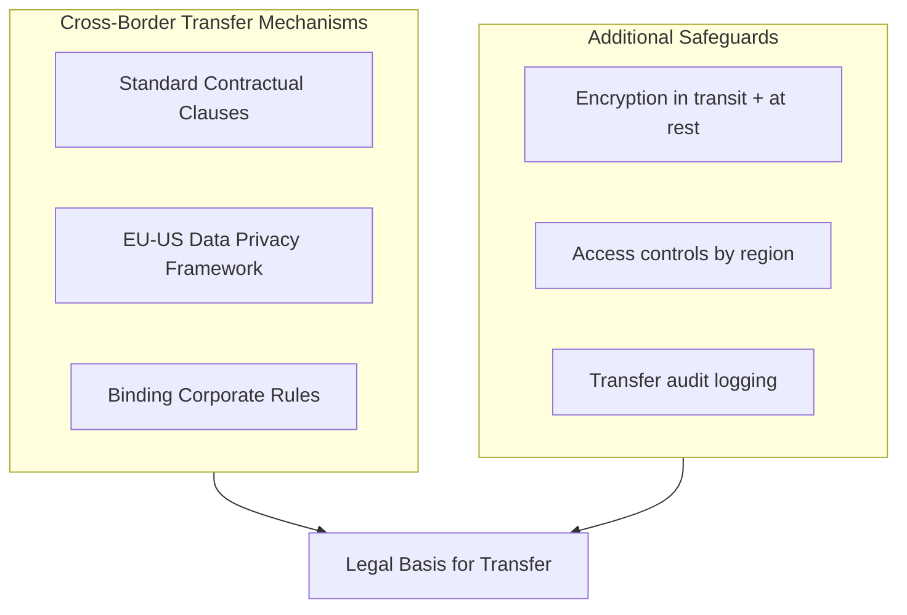

**GDPR Transfer Compliance:**
- Standard Contractual Clauses (SCCs) with all US processors
- Data Privacy Framework certification verification
- Transfer Impact Assessments for high-risk transfers

---

## Third-Party Processor Management

### Processor Inventory (GDPR Article 30)

| Processor | Purpose | Data Accessed | DPA Status | Security Review |
|-----------|---------|---------------|------------|-----------------|
| **Supabase** | Database hosting | All data | ✅ Signed | Annual |
| **Clerk** | Authentication | User identity, email | ✅ Signed | Annual |
| **Stripe** | Billing | Payment info, email | ✅ Signed (built-in) | Annual |
| **Vercel** | Application hosting | Request data, logs | ✅ Signed | Annual |
| **OpenAI** | Embeddings | Complaint text | ✅ DPA available | Annual |
| **Anthropic** | Generation | Pattern data, context | ✅ DPA available | Annual |
| **Sentry** | Error tracking | Error context, user ID | ✅ Signed | Annual |

### Sub-Processor Change Notification

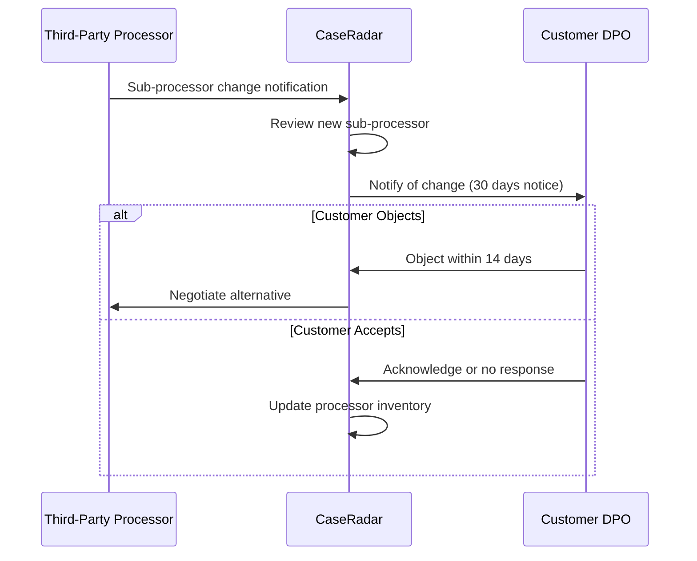

### Processor Security Requirements

| Requirement | Minimum Standard | Verification |
|-------------|------------------|--------------|
| Encryption at rest | AES-256 | Annual audit |
| Encryption in transit | TLS 1.2+ | Continuous monitoring |
| Access controls | RBAC, MFA | Annual audit |
| Incident notification | 72 hours | Contract clause |
| Audit rights | Annual | Contract clause |
| Data deletion | On request | Tested annually |

---

## e-Discovery & Litigation Support

### e-Discovery Readiness

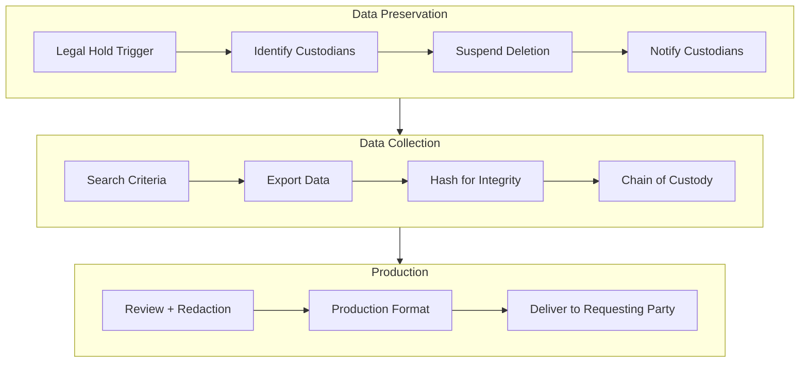

### Legal Hold Procedures

| Step | Action | Responsible | Timeline |
|------|--------|-------------|----------|
| 1 | Receive litigation notice | Legal team | T+0 |
| 2 | Issue hold notice to IT | Legal team | T+24h |
| 3 | Identify affected data | Engineering | T+48h |
| 4 | Implement hold in system | Engineering | T+72h |
| 5 | Notify affected users | Legal team | T+72h |
| 6 | Confirm hold active | Engineering | T+96h |
| 7 | Document preservation | Legal team | T+1 week |

### Legal Hold Implementation

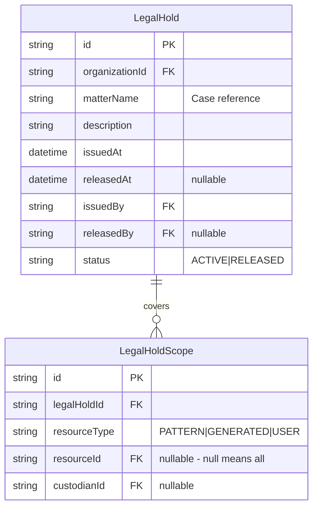

### Data Export for e-Discovery

| Export Type | Format | Includes | Use Case |
|-------------|--------|----------|----------|
| Full export | JSON + attachments | All org data | Complete discovery |
| Pattern export | JSON + PDF | Pattern + linked complaints | Matter-specific |
| User export | JSON | All user activity | Custodian-specific |
| Audit export | CSV | All audit logs | Activity timeline |

```typescript
// e-Discovery export API (admin only)
interface DiscoveryExportRequest {
  organizationId: string;
  dateRange: { start: Date; end: Date };
  custodians?: string[];  // User IDs
  resourceTypes?: ('PATTERN' | 'GENERATED' | 'COMPLAINT')[];
  format: 'json' | 'csv' | 'pdf-bundle';
  includeMetadata: boolean;
  hashAlgorithm: 'SHA-256';
}

interface DiscoveryExportResult {
  exportId: string;
  files: {
    path: string;
    hash: string;  // SHA-256 for integrity
    size: number;
  }[];
  manifest: {
    exportedAt: Date;
    exportedBy: string;
    totalRecords: number;
    integrityHash: string;  // Hash of all file hashes
  };
}
```

---

## GDPR Compliance

### Records of Processing (Article 30)

| Field | Value |
|-------|-------|
| **Controller** | Customer (Law Firm) |
| **Processor** | CaseRadar, Inc. |
| **Processing Purpose** | Legal document management, pattern detection |
| **Data Categories** | User identity, case data, generated documents |
| **Data Subject Categories** | Law firm employees, represented clients (indirect) |
| **Recipients** | Supabase, Clerk, Stripe, OpenAI, Anthropic |
| **Transfers to Third Countries** | US (SCCs in place) |
| **Retention Period** | 7 years post-case closure |
| **Security Measures** | See 09-security-compliance.md |

### Data Subject Rights Implementation

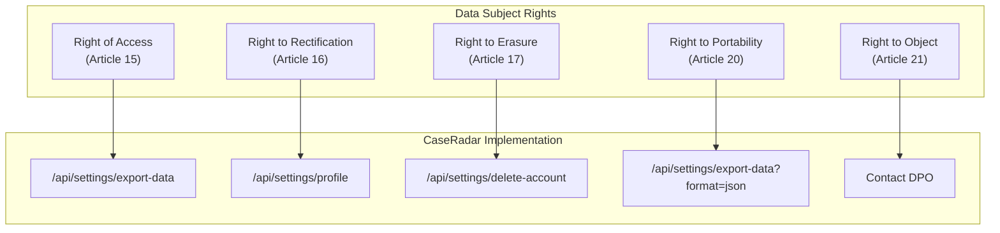

### DSAR Response Procedures

| Request Type | Response Time | Process |
|--------------|---------------|---------|
| Access request | 30 days | Export via API or manual |
| Rectification | 30 days | User self-service or admin |
| Erasure | 30 days | Verify no legal hold, then delete |
| Portability | 30 days | JSON export via API |
| Objection | 30 days | Review and respond |

### Erasure Exception Handling

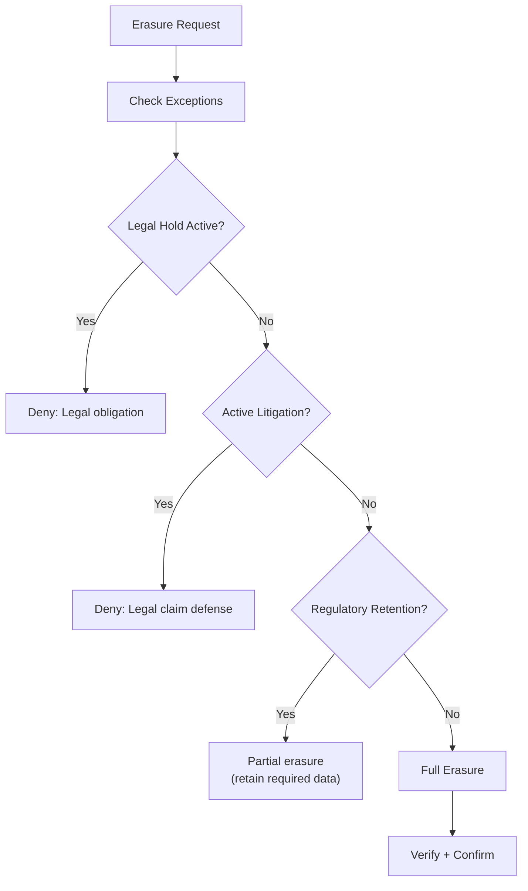

---

## Data Breach Response

### Breach Classification

| Severity | Criteria | Notification Requirement |
|----------|----------|--------------------------|
| **Critical** | Privileged data exposed | 24 hours (internal), 72 hours (regulators) |
| **High** | PII exposed to unauthorized party | 72 hours (regulators), 30 days (subjects) |
| **Medium** | Internal data exposure | 72 hours (internal review) |
| **Low** | Near-miss, no actual exposure | Log and monitor |

### Breach Response Timeline (GDPR)

```mermaid
gantt
    title Data Breach Response Timeline
    dateFormat  HH:mm
    axisFormat  %H:%M

    section Detection
    Detect breach           :d1, 00:00, 1h
    Initial assessment      :d2, after d1, 2h

    section Containment
    Contain threat          :c1, after d2, 4h
    Preserve evidence       :c2, after d2, 4h

    section Notification
    Internal notification   :n1, after c1, 2h
    Regulator notification  :n2, after n1, 66h
    Subject notification    :n3, after n2, 27d

    section Recovery
    Remediate vulnerability :r1, after c1, 24h
    Monitor for recurrence  :r2, after r1, 30d
```

### Breach Notification Template

```markdown
## Data Breach Notification

**Date of Notification:** [DATE]
**Date of Discovery:** [DATE]
**Incident Reference:** [REF]

### Nature of the Breach
[Description of what happened]

### Data Categories Affected
- [ ] User identity (name, email)
- [ ] Authentication credentials
- [ ] Payment information
- [ ] Legal documents (privileged)
- [ ] Case patterns

### Likely Consequences
[Assessment of risk to data subjects]

### Measures Taken
[Steps taken to address the breach]

### Contact Information
Data Protection Officer: [EMAIL]
```

---

## Data Retention & Deletion

### Retention Schedule

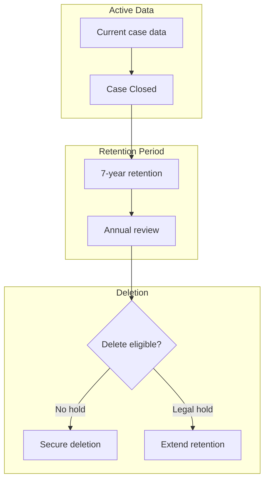

### Deletion Procedures

| Data Type | Retention | Deletion Method | Verification |
|-----------|-----------|-----------------|--------------|
| User accounts | 90 days post-deletion | Soft delete → hard delete | Automated + audit |
| Generated docs | 7 years post-case | Soft delete → hard delete | Manual review |
| Audit logs | 7 years minimum | Archive → secure delete | Compliance review |
| Embeddings | With source data | Cascade delete | Automated |
| Payment data | Stripe retention | Stripe handles | Stripe certification |

### Secure Deletion Standard

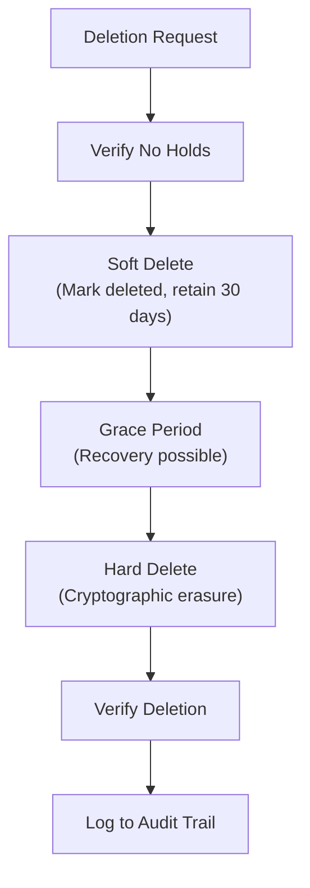

---

## Privacy by Design

### Privacy Principles in Architecture

| Principle | Implementation |
|-----------|----------------|
| **Data minimization** | Only collect necessary data |
| **Purpose limitation** | Data used only for stated purpose |
| **Storage limitation** | Auto-delete after retention period |
| **Accuracy** | User can update their data |
| **Integrity** | Encryption + audit trails |
| **Confidentiality** | Access controls + encryption |

### Privacy Impact Assessment Triggers

| Change | PIA Required | Reason |
|--------|--------------|--------|
| New data collection | Yes | Scope change |
| New third-party processor | Yes | Data sharing |
| New AI model | Yes | Automated decision-making |
| Cross-border transfer | Yes | Jurisdiction change |
| New feature with PII | Yes | Risk assessment |

---

## Compliance Checklist

### GDPR Compliance
- [ ] Records of processing maintained
- [ ] DPAs signed with all processors
- [ ] Data subject rights implemented
- [ ] Breach notification procedures in place
- [ ] Privacy by design applied
- [ ] Transfer mechanisms documented

### Legal Industry Requirements
- [ ] Attorney-client privilege protected
- [ ] Legal hold procedures documented
- [ ] e-Discovery export capability
- [ ] Chain of custody maintained
- [ ] 7-year retention for case data

### SOC2 Data Controls
- [ ] Data classification implemented
- [ ] Access controls documented
- [ ] Encryption verified
- [ ] Deletion procedures tested
- [ ] Audit trails complete

---

**Previous:** [15-threat-model.md](./15-threat-model.md) - Threat Model
**Next:** [17-business-continuity.md](./17-business-continuity.md) - Business Continuity Plan
**Index:** [00-overview.md](./00-overview.md) - System Overview
