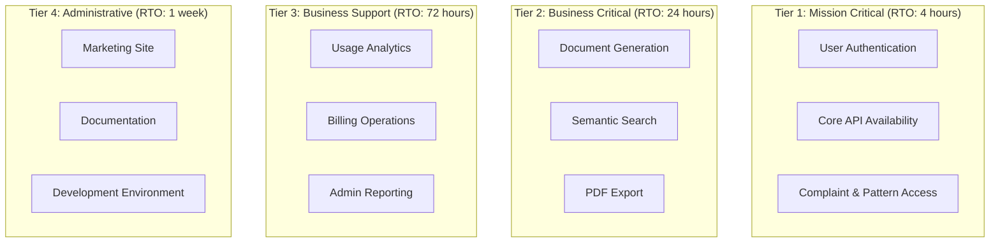
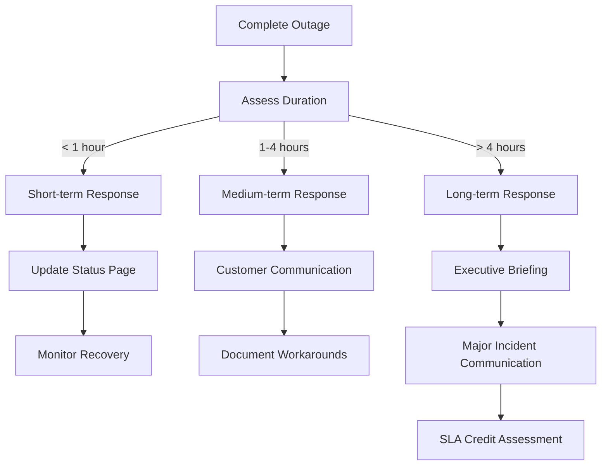
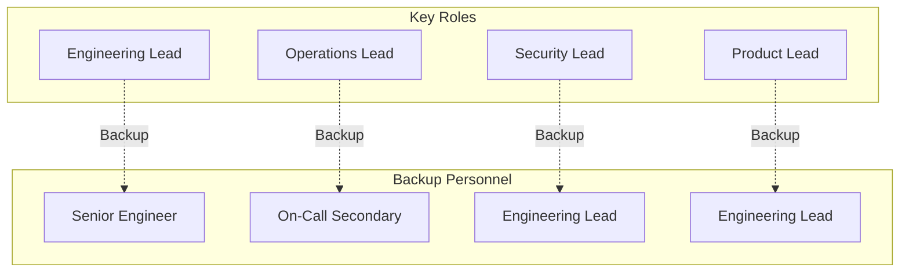
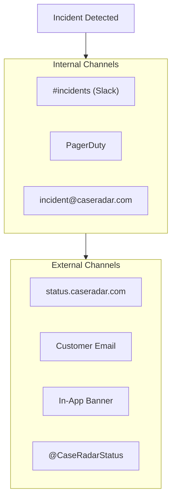
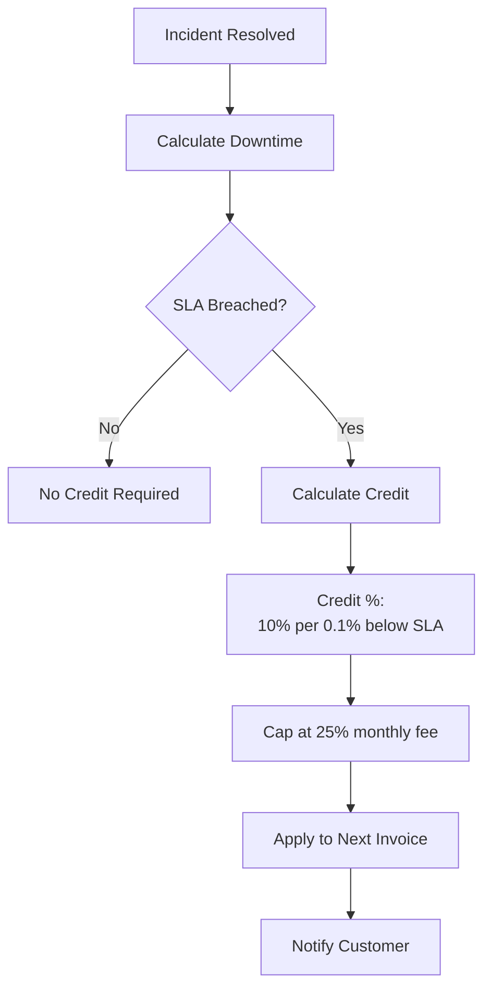
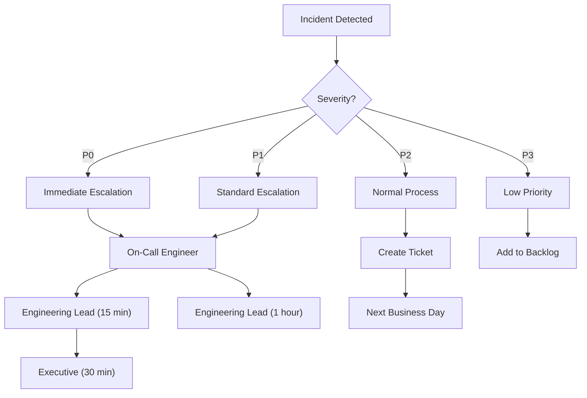
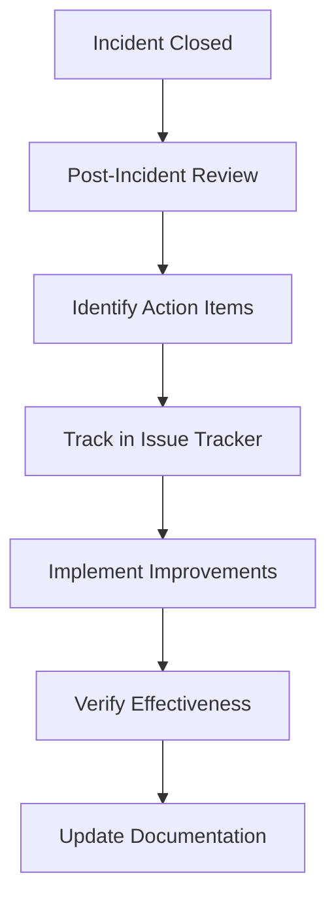

# CaseRadar Business Continuity Plan

## Overview

This document defines the Business Continuity Plan (BCP) for CaseRadar. Unlike disaster recovery (which focuses on technical recovery), BCP focuses on maintaining business operations during disruptions and ensuring effective stakeholder communication.

---

## Business Impact Analysis

### Critical Business Functions



### Impact Assessment Matrix

| Function | Revenue Impact | Legal Impact | Reputation Impact | RTO |
|----------|---------------|--------------|-------------------|-----|
| Authentication | High | Critical | High | 4 hours |
| Data Access | High | Critical | High | 4 hours |
| Document Generation | Medium | High | Medium | 24 hours |
| Search | Medium | Medium | Medium | 24 hours |
| Billing | High | Medium | Medium | 24 hours |
| PDF Export | Low | Medium | Low | 72 hours |

---

## Continuity Scenarios

### Scenario 1: Complete Service Outage



**Response Actions:**
1. **0-15 min:** Acknowledge incident, page on-call
2. **15-30 min:** Initial diagnosis, update status page
3. **30-60 min:** Customer notification (if ongoing)
4. **1-4 hours:** Hourly updates, executive briefing
5. **4+ hours:** Major incident process, SLA review

### Scenario 2: Third-Party Service Failure

| Service | Fallback Strategy | Customer Impact |
|---------|-------------------|-----------------|
| **Clerk** | Display "Auth temporarily unavailable" | Cannot sign in (existing sessions work) |
| **Supabase** | Enable read-only mode from replica | No writes, limited functionality |
| **OpenAI** | Disable semantic search, use keyword | Degraded search quality |
| **Anthropic** | Disable generation, show unavailable | Cannot generate documents |
| **Stripe** | Cache subscription status | Billing delays |

### Scenario 3: Key Person Unavailability



**Key Person Dependencies:**
| Role | Primary | Backup | Knowledge Transfer |
|------|---------|--------|-------------------|
| System Architecture | [Name] | [Backup] | Architecture docs |
| Database Admin | [Name] | [Backup] | Runbooks |
| Security Response | [Name] | [Backup] | Incident playbooks |
| Customer Escalation | [Name] | [Backup] | Escalation procedures |

---

## Incident Communication

### Communication Channels



### Communication Timeline

| Time | Action | Channel | Audience |
|------|--------|---------|----------|
| T+0 | Incident acknowledged | PagerDuty | On-call |
| T+5 min | Internal notification | Slack #incidents | Engineering |
| T+15 min | Status page update | status.caseradar.com | Public |
| T+30 min | Customer notification | Email | Affected customers |
| T+1 hour | Executive briefing | Email | Leadership |
| Ongoing | Hourly updates | Status page | Public |
| Resolution | Resolution notice | All channels | All stakeholders |
| T+48 hours | Post-incident report | Email | Affected customers |

### Status Page Severity Levels

| Status | Color | Description | Example |
|--------|-------|-------------|---------|
| **Operational** | Green | All systems normal | Normal operations |
| **Degraded** | Yellow | Some features impacted | Slow search |
| **Partial Outage** | Orange | Major feature unavailable | Generation down |
| **Major Outage** | Red | Service unavailable | Complete outage |

---

## Communication Templates

### Initial Incident Notification

```markdown
Subject: [INCIDENT] CaseRadar Service Disruption - [DATE]

We are currently experiencing issues with [AFFECTED SERVICE].

**Status:** Investigating
**Impact:** [DESCRIPTION OF USER IMPACT]
**Started:** [TIME] UTC

Our team is actively working to resolve this issue. We will provide
updates every [30 minutes / 1 hour] until resolved.

For urgent matters, please contact support@caseradar.com.

Current status: https://status.caseradar.com
```

### Progress Update Template

```markdown
Subject: [UPDATE] CaseRadar Service Disruption - [DATE]

**Current Status:** [Identified / Monitoring / Resolved]
**Impact:** [DESCRIPTION]

**Update:**
[DESCRIPTION OF PROGRESS]

**Next Steps:**
[WHAT WE'RE DOING NEXT]

**Estimated Resolution:** [TIME or "Under investigation"]

Next update in [TIMEFRAME] or upon resolution.
```

### Resolution Notification

```markdown
Subject: [RESOLVED] CaseRadar Service Disruption - [DATE]

The service disruption affecting [SERVICES] has been resolved.

**Duration:** [START TIME] to [END TIME] ([TOTAL DURATION])
**Root Cause:** [BRIEF DESCRIPTION]
**Resolution:** [WHAT WE DID]

We apologize for any inconvenience this may have caused. A detailed
post-incident report will be shared within 48 hours.

If you continue to experience issues, please contact support@caseradar.com.
```

### Post-Incident Report Template

```markdown
# Post-Incident Report: [TITLE]

**Incident Date:** [DATE]
**Duration:** [DURATION]
**Severity:** [P0/P1/P2]
**Author:** [NAME]

## Executive Summary
[2-3 sentence summary of what happened and impact]

## Timeline
- [TIME] - [EVENT]
- [TIME] - [EVENT]
- [TIME] - [EVENT]

## Impact
- Users affected: [NUMBER]
- Duration: [TIME]
- Revenue impact: [ESTIMATE if applicable]
- SLA impact: [YES/NO, details]

## Root Cause
[Detailed technical explanation]

## Resolution
[What was done to fix it]

## Lessons Learned
1. [LESSON]
2. [LESSON]

## Action Items
| Action | Owner | Due Date | Status |
|--------|-------|----------|--------|
| [ACTION] | [NAME] | [DATE] | Pending |

## SLA Credit (if applicable)
[Details of any service credits]
```

---

## Customer SLA Management

### SLA Definitions

| Plan | Availability SLA | Support Response | Incident Credit |
|------|------------------|------------------|-----------------|
| FREE | Best effort | 5 business days | None |
| BASIC | 99.5% | 2 business days | 5% monthly fee |
| PRO | 99.9% | 4 hours | 10% monthly fee |
| ENTERPRISE | 99.95% | 1 hour | 25% monthly fee |

### SLA Credit Calculation



### SLA Exclusions

The following are excluded from SLA calculations:
- Scheduled maintenance (with 72-hour notice)
- Third-party service outages beyond our control
- Customer-caused issues
- Force majeure events
- Features in beta/preview

---

## Escalation Procedures

### Escalation Matrix



### Escalation Contacts

| Level | Role | Contact Method | Response Time |
|-------|------|----------------|---------------|
| L1 | On-Call Engineer | PagerDuty | 15 min |
| L2 | Engineering Lead | Phone + Slack | 30 min |
| L3 | CTO/VP Engineering | Phone | 1 hour |
| L4 | CEO | Phone | As needed |

---

## Recovery Procedures

### Service Recovery Priorities

| Priority | Service | Dependencies | Recovery Action |
|----------|---------|--------------|-----------------|
| 1 | Database | None | Restore from backup |
| 2 | Authentication | Database | Verify Clerk connection |
| 3 | Core API | Database, Auth | Deploy from last known good |
| 4 | AI Services | Core API | Re-enable circuit breaker |
| 5 | Background Jobs | All above | Resume cron jobs |

### Recovery Validation Checklist

- [ ] Database accessible and consistent
- [ ] Authentication working (test login)
- [ ] API health check passing
- [ ] Core features functional (list complaints, patterns)
- [ ] Search returning results
- [ ] Generation working (test generation)
- [ ] No elevated error rates
- [ ] Customer confirmation (for major incidents)

---

## Testing & Exercises

### BCP Testing Schedule

| Test Type | Frequency | Scope | Participants |
|-----------|-----------|-------|--------------|
| Tabletop Exercise | Quarterly | Communication procedures | All teams |
| Failover Test | Semi-annual | Database failover | Engineering |
| Full DR Test | Annual | Complete recovery | All teams |
| Communication Test | Monthly | Status page update | On-call |

### Tabletop Exercise Scenarios

1. **Complete Supabase outage** - 4 hours, no data access
2. **Clerk authentication breach** - All sessions compromised
3. **AI provider rate limit** - All generation blocked
4. **Key engineer unavailable** - During P0 incident
5. **Customer data exposure** - GDPR breach notification required

---

## Continuous Improvement

### Post-Incident Review Requirements

| Severity | Review Required | Timeline | Participants |
|----------|-----------------|----------|--------------|
| P0 | Mandatory | Within 48 hours | All involved + leadership |
| P1 | Mandatory | Within 1 week | Engineering team |
| P2 | Optional | Within 2 weeks | Affected team |
| P3 | Not required | - | - |

### Improvement Tracking



---

## BCP Maintenance

### Review Schedule

| Document | Review Frequency | Owner |
|----------|------------------|-------|
| Contact lists | Monthly | Operations |
| Escalation procedures | Quarterly | Engineering Lead |
| Communication templates | Quarterly | Operations |
| Recovery procedures | Semi-annual | Engineering |
| Full BCP | Annual | Leadership |

### Change Triggers

BCP must be reviewed when:
- New critical service added
- Key personnel change
- Major architecture change
- After any P0 incident
- Customer SLA changes
- Regulatory requirement changes

---

**Previous:** [16-data-governance.md](./16-data-governance.md) - Data Governance
**Index:** [00-overview.md](./00-overview.md) - System Overview
