# CaseRadar Pattern Detection System Architecture

**Version:** 3.4
**Last Updated:** January 2025
**Status:** Ready for Principal Engineer Review

---

## How to Use This Document

| If You Are... | Start Here | Key Sections |
|---------------|------------|--------------|
| **Executive/PM** | [Executive Summary](#executive-summary) | TL;DR box, Key Recommendations, Cost Analysis (Appendix C) |
| **Backend Engineer** | [Recommended Architecture](#recommended-architecture) | Component Deep Dives, API Design (Appendix F) |
| **Data Scientist** | [Approach Catalog](#approach-catalog) | Decision Framework, Trade-off Analysis |
| **DevOps/SRE** | [Migration Strategy](#migration-strategy) | Monitoring, SLA/DR (Appendix I), On-Call Runbook (Appendix J) |
| **Reviewer** | [Open Questions & Risks](#open-questions--risks) | ADRs, Edge Cases (Appendix K), Testing Strategy (Appendix E) |

---

## Table of Contents

1. [Executive Summary](#executive-summary)
2. [Problem Statement](#problem-statement)
3. [Prior Art & Existing Research](#prior-art--existing-research)
4. [Approach Catalog](#approach-catalog)
5. [Decision Framework](#decision-framework)
6. [Recommended Architecture](#recommended-architecture)
7. [Component Deep Dives](#component-deep-dives)
8. [Trade-off Analysis](#trade-off-analysis)
9. [Failure Modes & Mitigations](#failure-modes--mitigations)
10. [Phased Implementation Plan](#phased-implementation-plan)
11. [Success Metrics & Evaluation](#success-metrics--evaluation)
12. [Monitoring & Observability](#monitoring--observability)
13. [Migration Strategy](#migration-strategy)
14. [Architecture Decision Records](#architecture-decision-records)
15. [Open Questions & Risks](#open-questions--risks)
16. [References](#references)

**Appendices:**
- [A: Algorithm Quick Reference](#appendix-a-algorithm-quick-reference)
- [B: Glossary](#appendix-b-glossary)
- [C: Cost Analysis](#appendix-c-cost-analysis)
- [D: Data Quality & Validation](#appendix-d-data-quality--validation)
- [E: Testing Strategy](#appendix-e-testing-strategy)
- [F: API Design](#appendix-f-api-design)
- [G: Model Versioning & Rollback](#appendix-g-model-versioning--rollback)
- [H: Security Considerations](#appendix-h-security-considerations)
- [I: SLA & Disaster Recovery](#appendix-i-sla--disaster-recovery)
- [J: On-Call Runbook](#appendix-j-on-call-runbook)
- [K: Edge Cases & Boundary Conditions](#appendix-k-edge-cases--boundary-conditions)
- [L: Sample Outputs & Examples](#appendix-l-sample-outputs--examples)

---

## Executive Summary

### Quick Reference (TL;DR)

```
┌─────────────────────────────────────────────────────────────────────┐
│  CaseRadar Pattern Detection - Technology Stack Summary             │
├─────────────────────────────────────────────────────────────────────┤
│  Topic Modeling:     BERTopic + HDBSCAN (auto-clusters, temporal)   │
│  Anomaly Detection:  PyOD ensemble (IF + LOF + HBOS)                │
│  Change Detection:   Ruptures PELT (O(n) complexity)                │
│  Signal Detection:   PRR (threshold 2.0) + EBGM backup              │
│  Embeddings:         sentence-transformers (all-mpnet-base-v2)      │
│  Storage:            PostgreSQL + pgvector                          │
│  Architecture:       Batch-first (nightly), not streaming           │
│  Cost:               ~$90-150/month at 100K complaints              │
│  Latency:            <24 hours from complaint to pattern inclusion  │
└─────────────────────────────────────────────────────────────────────┘
```

### Overview

CaseRadar requires a pattern detection system to identify emerging vehicle defects, anomalies, and trends from NHTSA complaint data (currently 17K+ records, scaling to 100K+). This document provides a comprehensive architectural blueprint based on:

- **Prior art analysis** of NHTSA-specific research and FDA pharmacovigilance systems
- **Comparative evaluation** of 12+ approaches across topic modeling, anomaly detection, and change detection
- **Production-grade design** with failure modes, scaling considerations, and operational concerns

### Key Recommendations

| Layer | Primary Technology | Rationale |
|-------|-------------------|-----------|
| **Topic Clustering** | BERTopic + HDBSCAN | Best-in-class for interpretable topics with temporal tracking; 34%+ improvement over LDA/Top2Vec |
| **Anomaly Detection** | PyOD (Isolation Forest + LOF ensemble) | 50+ algorithms, proven in production, complements clustering |
| **Change Detection** | Ruptures (PELT algorithm) | O(n) complexity, detects distributional shifts |
| **Signal Classification** | Disproportionality Analysis (PRR/EBGM) | Industry-standard for safety signal detection in pharmacovigilance |
| **Architecture Pattern** | Batch-first with streaming optional | 90% of value from nightly batch; streaming adds complexity without proportional benefit at current scale |

### What This System Answers

1. **"What are the main complaint themes?"** - Topic clustering
2. **"How are themes evolving over time?"** - Temporal topic tracking
3. **"What complaints don't fit any pattern?"** - Anomaly detection
4. **"When did something change?"** - Change point detection
5. **"Is this a statistically significant signal?"** - Disproportionality analysis

---

## Problem Statement

### Business Context

Law firms specializing in automotive product liability need to:
- Identify emerging defect patterns before they become widespread recalls
- Detect weak signals that might indicate future mass torts
- Understand temporal trends in complaint categories
- Surface anomalous complaints worthy of individual investigation

### Technical Requirements

| Requirement | Target | Notes |
|-------------|--------|-------|
| Data Volume | 17K current, 100K+ future | NHTSA complaint database grows ~20K/year |
| Latency | Daily batch acceptable | Not real-time critical |
| Detection Sensitivity | High recall preferred | False negatives are costly (missed cases) |
| Interpretability | Critical | Must explain to attorneys why a pattern was flagged |
| Historical Analysis | Full history (2000-present) | Retroactive pattern detection |

### Key Constraints

- **Budget**: Open-source preferred; commercial solutions only if 10x better
- **Team**: Small engineering team; operational simplicity valued
- **Integration**: Must work with existing PostgreSQL + Prisma stack
- **Compute**: Standard cloud instances (no GPU required for MVP)

### Scope & Non-Goals

#### In Scope (This Document)

| Area | Coverage |
|------|----------|
| Pattern detection algorithms | Detailed comparison, selection rationale, configuration |
| System architecture | Data flow, component design, integration points |
| Migration strategy | Current → proposed, phased rollout, rollback |
| Operations | Monitoring, alerting, runbooks, disaster recovery |
| Evaluation | Success metrics, backtesting, quality gates |

#### Out of Scope (Separate Documents)

| Area | Reason |
|------|--------|
| **Frontend implementation** | Covered by UI/UX design docs; this focuses on backend ML |
| **Infrastructure provisioning** | Covered by DevOps runbooks (Terraform, K8s manifests) |
| **NHTSA API integration** | Already implemented; sync service exists |
| **User authentication/authorization** | Orthogonal to pattern detection |
| **Complaint generation (GPT)** | Separate feature; consumes patterns, doesn't create them |
| **Legal workflow integration** | Business process, not technical architecture |

#### Assumptions

1. **Embeddings already exist** - Current system generates OpenAI embeddings
2. **pgvector configured** - Vector storage already operational
3. **Complaints normalized** - Text cleaning/normalization handled upstream
4. **Daily sync operational** - NHTSA data flows into system reliably

#### Dependencies

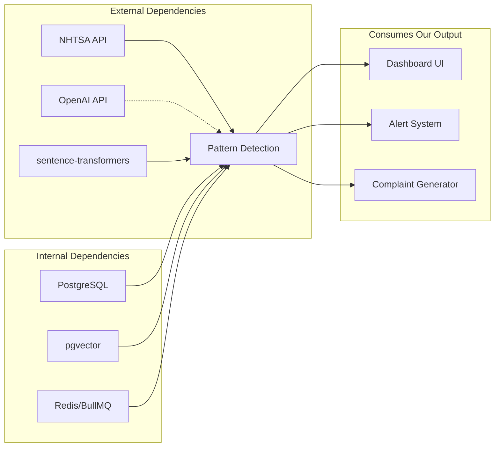

---

## Prior Art & Existing Research

### NHTSA-Specific Research

#### Foundational Work: Ghazizadeh, McDonald, Lee (2014)

The seminal paper ["Text Mining to Decipher Free-Response Consumer Complaints"](https://journals.sagepub.com/doi/abs/10.1177/0018720813519473) established the approach for NHTSA complaint analysis:

- **Method**: Latent Semantic Analysis (LSA) + Hierarchical Clustering
- **Key Finding**: Complaint clusters predicted Toyota and Ford/Firestone recalls before official announcements
- **Limitation**: Manual threshold tuning required; no automated weak signal detection

#### SmarTxT System (2022)

NHTSA's internal prototype uses NLP to process defect reports:
- Processes millions of entries with basic NLP
- Assists human analysts in investigation prioritization
- **Limitation**: Still requires significant human review

### FDA FAERS (Pharmacovigilance)

The FDA's Adverse Event Reporting System provides the closest analogous system:

#### Disproportionality Methods

| Method | Type | Sensitivity | Specificity | Best For |
|--------|------|-------------|-------------|----------|
| PRR (Proportional Reporting Ratio) | Frequentist | 38.2% | ~75% | Quick screening, simple implementation |
| ROR (Reporting Odds Ratio) | Frequentist | 37.3% | ~75% | Case-control equivalent |
| EBGM (Empirical Bayes Geometric Mean) | Bayesian | 0.9% | 96.7% | Reducing false positives when data is sparse |
| BCPNN | Bayesian | ~35% | ~80% | Balanced approach |

**Key Insight**: MGPS/EBGM methods sacrifice sensitivity for specificity. For legal discovery (where missing a signal is costly), PRR/ROR with lower thresholds may be preferred.

#### ML Enhancements (2024)

Recent research shows:
- Logistic regression outperforms disproportionality methods (AUC 0.83 vs 0.72)
- Integrating DrugBank + SIDER metadata improves recall and precision
- NLP on narrative text extracts signals missed by structured data alone

### Consumer Complaint Analysis (CFPB)

Research on CFPB financial complaints shows:
- SVM outperforms other classifiers for complaint anomaly detection
- Knowledge graphs enable multi-theme complaint analysis (typical complaint has 2-3 themes)
- Semi-supervised topic modeling (CorEx with anchor words) produces cleaner topics

### Vehicle Recall Prediction

AWS and Upstream research demonstrates:
- **70% of recalls since 2020** could have been detected earlier with connected vehicle data + AI
- XGBoost risk prediction models identify key recall risk factors
- Text mining user forums predicts recalls "once in every two recall events"

---

## Approach Catalog

### 1. Topic Modeling Approaches

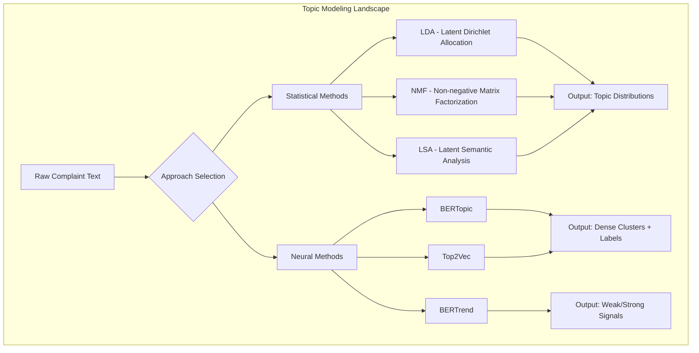

#### Comparative Analysis

| Method | Accuracy* | Temporal | Interpretability | Scale | Preprocessing |
|--------|-----------|----------|-----------------|-------|---------------|
| **LDA** | Baseline | Limited | Good (but requires tuning K) | Excellent | Heavy |
| **NMF** | +5-10% | Limited | Excellent | Excellent | Heavy |
| **LSA** | Baseline | None | Poor | Excellent | Heavy |
| **BERTopic** | +34% | Excellent | Excellent (c-TF-IDF labels) | Good (100K) | Minimal |
| **Top2Vec** | +20% | Limited | Moderate | Good | Minimal |
| **BERTrend** | +34% | Excellent | Excellent + Signal Classification | Experimental | Minimal |

*Accuracy relative to LDA baseline based on benchmark studies

**Recommendation**: BERTopic for production; monitor BERTrend for future adoption

### 2. Clustering Algorithms

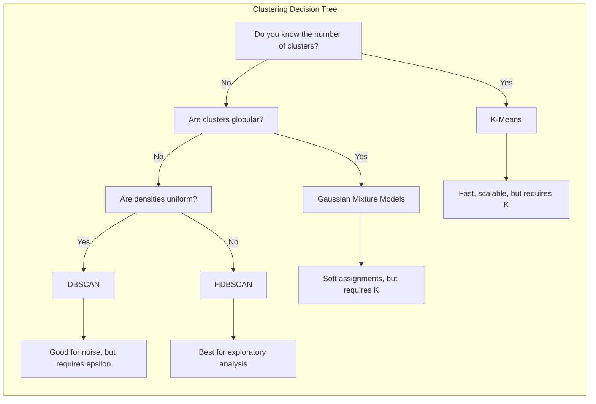

#### Comparison Matrix

| Algorithm | Noise Handling | Varying Density | Cluster Count | Speed (100K) | Interpretability |
|-----------|---------------|-----------------|---------------|--------------|------------------|
| **K-Means** | Poor | Poor | Required | 1s | High |
| **DBSCAN** | Excellent | Poor | Automatic | 5s | Moderate |
| **HDBSCAN** | Excellent | Excellent | Automatic | 30s | Excellent |
| **OPTICS** | Excellent | Good | Automatic | 60s | Moderate |

**Recommendation**: HDBSCAN for exploratory analysis; k-means only for known cluster structures

### 3. Anomaly Detection Approaches

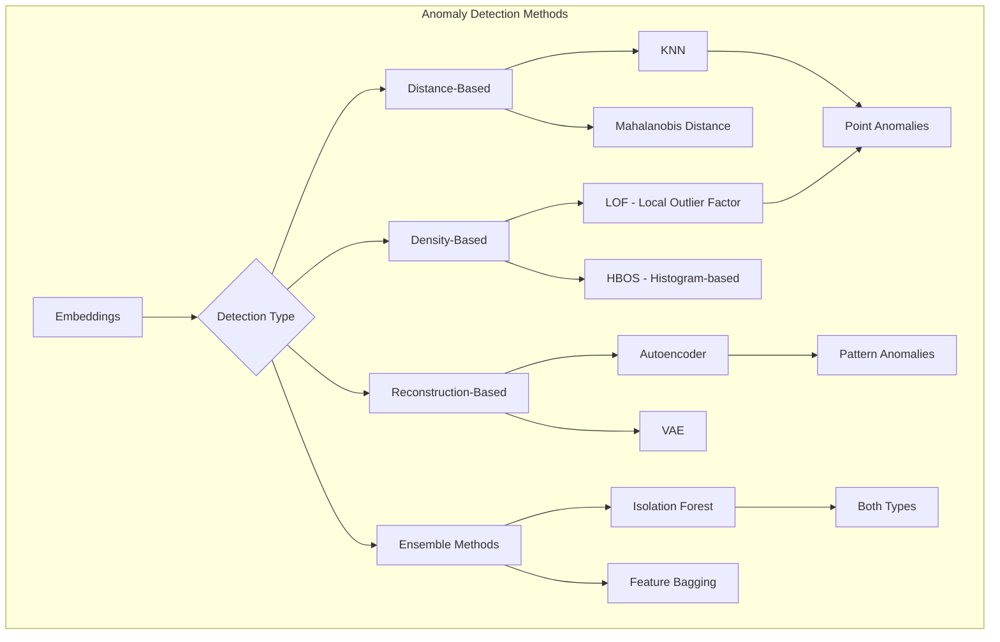

#### PyOD Algorithm Selection Guide

| Scenario | Recommended Algorithm | Why |
|----------|----------------------|-----|
| General-purpose, no assumptions | Isolation Forest | Efficient, few hyperparameters |
| High-dimensional embeddings | LOF | Handles local density variation |
| Speed critical | HBOS | O(n) complexity |
| Interpretability required | KNN | Explainable distances |
| Sequential patterns | Deep SVDD | Neural network-based |

### 4. Change Point Detection

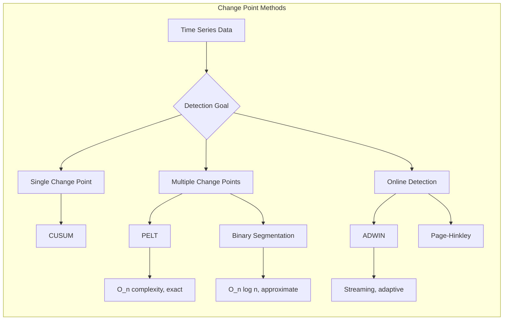

### 5. Disproportionality / Signal Detection

For safety signal detection specifically:

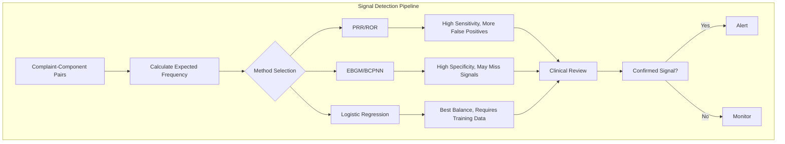

### 6. Knowledge Graph Approaches

For complex relationship analysis:

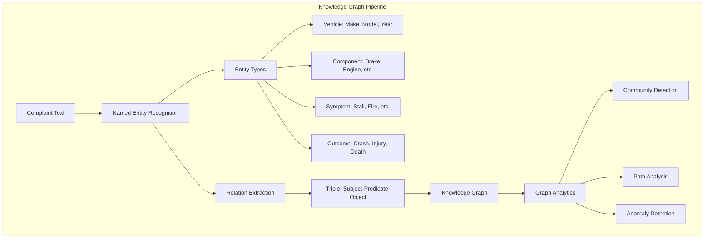

**When to use**: Knowledge graphs excel when:
- Complaints have multiple interacting themes
- Relationships between entities matter (e.g., "brake failure + steering lock + rollover")
- Need to trace causation chains

**Trade-off**: Higher implementation complexity, requires entity ontology design

---

## Decision Framework

### When to Use Which Approach

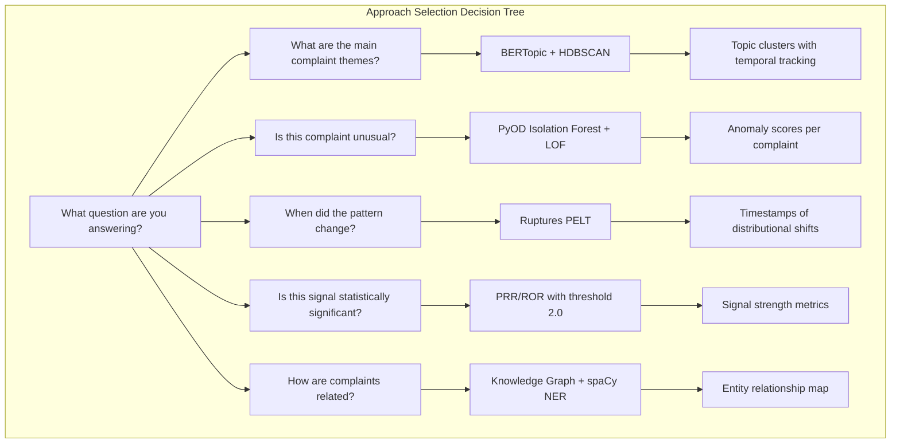

### Hybrid vs Single-Method Approaches

#### When Hybrid Adds Value

| Scenario | Hybrid Approach | Value Add |
|----------|-----------------|-----------|
| Need both clusters AND anomalies | BERTopic + PyOD | Anomalies that don't fit any topic may be early signals |
| Temporal + Severity | BERTopic + Ruptures | Know WHAT changed and WHEN |
| Statistical rigor | Clustering + Disproportionality | Clusters provide structure; PRR provides significance |
| Interpretability | Topic Model + Knowledge Graph | Topics for overview; KG for drill-down |

#### When Hybrid Adds Unnecessary Complexity

| Scenario | Why Single Method Suffices |
|----------|---------------------------|
| Pure exploratory analysis | BERTopic alone covers clustering + temporal |
| Simple anomaly detection | Isolation Forest is robust enough |
| Low data volume (<5K) | Statistical methods may be more stable |
| One-time analysis | Don't build pipeline for single use |

### Scale-Based Recommendations

| Data Volume | Recommended Stack | Notes |
|-------------|-------------------|-------|
| **<10K** | BERTopic (CPU) + PyOD | Single machine, in-memory |
| **10K-100K** | BERTopic + HDBSCAN + Ruptures | Batch processing, may need optimization |
| **100K-1M** | BERTopic (incremental) + River | Consider GPU, incremental updates |
| **>1M** | Spark + Elasticsearch | Distributed processing required |

---

## Recommended Architecture

### System Context (C4 Level 1)

This diagram shows the system boundary and how external actors interact with CaseRadar.

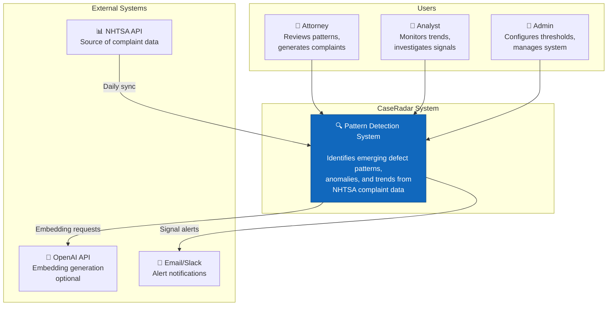

### High-Level Architecture (C4 Level 2)

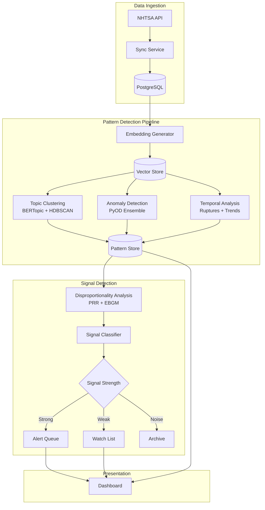

### Data Flow Architecture

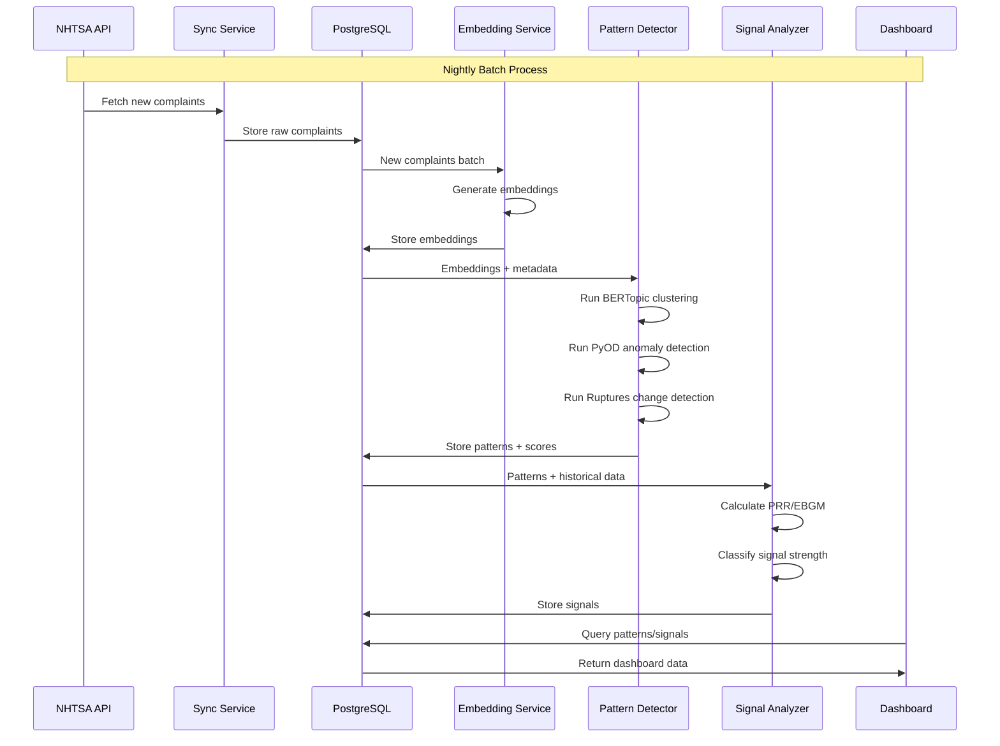

### Component Architecture

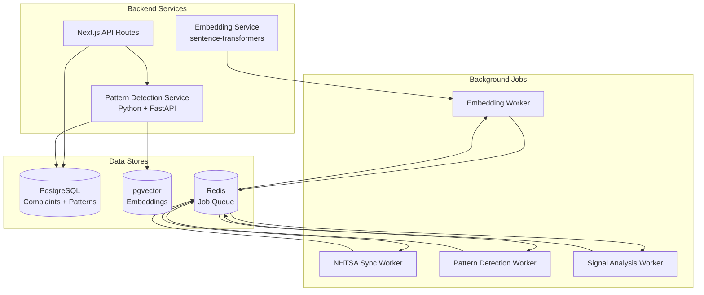

---

## Component Deep Dives

### 1. Embedding Generation

#### Architecture

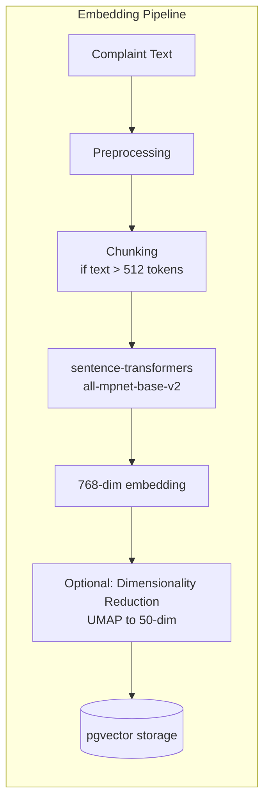

#### Model Selection

| Model | Dimensions | Speed | Quality | Cost |
|-------|------------|-------|---------|------|
| all-MiniLM-L6-v2 | 384 | 14K/sec | Good | Free |
| **all-mpnet-base-v2** | 768 | 2.8K/sec | Excellent | Free |
| text-embedding-3-small | 1536 | API | Excellent | $0.02/1M tokens |
| text-embedding-3-large | 3072 | API | Best | $0.13/1M tokens |

**Recommendation**: Start with `all-mpnet-base-v2` (free, excellent quality). Consider OpenAI for production if budget allows (better handling of automotive domain vocabulary).

#### Preprocessing Considerations

```python
# Minimal preprocessing for transformer models
def preprocess_complaint(text: str) -> str:
    # Remove excessive whitespace
    text = ' '.join(text.split())

    # Expand common automotive abbreviations
    abbreviations = {
        'TL': 'TIRE PRESSURE LIGHT',
        'ABS': 'ANTI-LOCK BRAKE SYSTEM',
        'SRS': 'SUPPLEMENTAL RESTRAINT SYSTEM',
        'VIN': 'VEHICLE IDENTIFICATION NUMBER',
    }
    for abbr, expansion in abbreviations.items():
        text = text.replace(f' {abbr} ', f' {expansion} ')

    # Keep all other text as-is (transformers handle raw text well)
    return text
```

### 2. Topic Clustering (BERTopic)

#### Configuration

```python
from bertopic import BERTopic
from hdbscan import HDBSCAN
from umap import UMAP
from sklearn.feature_extraction.text import CountVectorizer

# Custom HDBSCAN for complaint data
hdbscan_model = HDBSCAN(
    min_cluster_size=15,      # Minimum 15 complaints per pattern
    min_samples=5,            # Density requirement
    metric='euclidean',
    cluster_selection_method='eom',  # Excess of Mass (more clusters)
    prediction_data=True      # Enable soft clustering
)

# UMAP for dimensionality reduction
umap_model = UMAP(
    n_neighbors=15,
    n_components=5,           # Reduce to 5 dimensions for HDBSCAN
    min_dist=0.0,
    metric='cosine',
    random_state=42
)

# Vectorizer for topic representation
vectorizer_model = CountVectorizer(
    stop_words='english',
    ngram_range=(1, 3),       # Include bigrams and trigrams
    min_df=5                  # Term must appear in 5+ docs
)

# Initialize BERTopic
topic_model = BERTopic(
    hdbscan_model=hdbscan_model,
    umap_model=umap_model,
    vectorizer_model=vectorizer_model,
    top_n_words=10,
    verbose=True,
    calculate_probabilities=True
)
```

#### Temporal Analysis

```python
# Track topics over time
topics_over_time = topic_model.topics_over_time(
    docs=complaints,
    timestamps=complaint_dates,
    nr_bins=24,               # Monthly bins for 2 years
    evolution_tuning=True,    # Enable topic evolution tracking
    global_tuning=True        # Normalize across time
)

# Identify trending topics
def identify_trends(topics_over_time, threshold=0.5):
    """Identify topics with significant growth."""
    trends = []
    for topic_id in topics_over_time['Topic'].unique():
        topic_data = topics_over_time[topics_over_time['Topic'] == topic_id]

        # Calculate trend using linear regression
        x = np.arange(len(topic_data))
        y = topic_data['Frequency'].values
        slope, _, r_value, _, _ = stats.linregress(x, y)

        if slope > threshold and r_value ** 2 > 0.5:
            trends.append({
                'topic_id': topic_id,
                'name': topic_data['Name'].iloc[0],
                'growth_rate': slope,
                'confidence': r_value ** 2
            })

    return sorted(trends, key=lambda x: x['growth_rate'], reverse=True)
```

### 3. Anomaly Detection (PyOD)

#### Ensemble Approach

```python
from pyod.models.iforest import IForest
from pyod.models.lof import LOF
from pyod.models.hbos import HBOS
from pyod.models.combination import average

# Ensemble of complementary detectors
detectors = {
    'isolation_forest': IForest(
        n_estimators=100,
        contamination=0.05,
        random_state=42
    ),
    'local_outlier_factor': LOF(
        n_neighbors=20,
        contamination=0.05,
        novelty=True
    ),
    'histogram_based': HBOS(
        n_bins=50,
        contamination=0.05
    )
}

def detect_anomalies(embeddings, texts, detectors):
    """Run ensemble anomaly detection."""
    scores = {}

    for name, detector in detectors.items():
        detector.fit(embeddings)
        scores[name] = detector.decision_function(embeddings)

    # Combine scores (average)
    combined_scores = np.mean(list(scores.values()), axis=0)

    # Normalize to 0-1 range
    normalized_scores = (combined_scores - combined_scores.min()) / \
                        (combined_scores.max() - combined_scores.min())

    return normalized_scores
```

#### Anomaly Types

| Type | Detection Method | Example |
|------|------------------|---------|
| **Point Anomaly** | Isolation Forest | Single unusual complaint (e.g., rare component failure) |
| **Contextual Anomaly** | LOF | Normal complaint but unusual for that vehicle/time |
| **Collective Anomaly** | Cluster + threshold | Group of complaints that together form unusual pattern |

### 4. Change Point Detection (Ruptures)

#### Implementation

```python
import ruptures as rpt
import numpy as np

def detect_change_points(time_series, model='rbf', penalty=10):
    """
    Detect points where complaint distribution changes.

    Args:
        time_series: Array of complaint counts or topic frequencies by time period
        model: Cost function ('rbf', 'l2', 'l1', 'normal')
        penalty: Higher = fewer change points

    Returns:
        List of change point indices
    """
    # PELT algorithm - optimal and fast
    algo = rpt.Pelt(model=model, min_size=3).fit(time_series)
    change_points = algo.predict(pen=penalty)

    return change_points[:-1]  # Remove last point (always end of series)

def analyze_topic_changes(topics_over_time, topic_id):
    """Analyze when a specific topic's frequency changed significantly."""
    topic_data = topics_over_time[topics_over_time['Topic'] == topic_id]
    frequencies = topic_data['Frequency'].values

    # Reshape for ruptures
    signal = frequencies.reshape(-1, 1)

    # Detect change points
    change_points = detect_change_points(signal)

    # Map indices back to dates
    dates = topic_data['Timestamp'].values
    change_dates = [dates[cp] for cp in change_points]

    return {
        'topic_id': topic_id,
        'change_dates': change_dates,
        'frequencies_before_after': [
            (frequencies[:cp].mean(), frequencies[cp:].mean())
            for cp in change_points
        ]
    }
```

### 5. Signal Detection (Disproportionality Analysis)

#### PRR Implementation

```python
def calculate_prr(df, component, make=None, model=None, year_range=None):
    """
    Calculate Proportional Reporting Ratio for a component.

    PRR = (a / (a + b)) / (c / (c + d))

    Where:
        a = complaints for component X with this vehicle
        b = complaints for other components with this vehicle
        c = complaints for component X with other vehicles
        d = complaints for other components with other vehicles
    """
    # Filter data
    vehicle_filter = df['make'] == make if make else True
    if model:
        vehicle_filter &= df['model'] == model
    if year_range:
        vehicle_filter &= df['year'].between(*year_range)

    # Calculate contingency table
    a = len(df[vehicle_filter & (df['component'] == component)])
    b = len(df[vehicle_filter & (df['component'] != component)])
    c = len(df[~vehicle_filter & (df['component'] == component)])
    d = len(df[~vehicle_filter & (df['component'] != component)])

    # Avoid division by zero
    if (a + b) == 0 or (c + d) == 0 or c == 0:
        return None, None

    # Calculate PRR
    prr = (a / (a + b)) / (c / (c + d))

    # Calculate 95% CI using Wilson score
    import math
    p1 = a / (a + b)
    p2 = c / (c + d)
    se = math.sqrt(p1 * (1 - p1) / (a + b) + p2 * (1 - p2) / (c + d))
    ci_lower = math.exp(math.log(prr) - 1.96 * se / prr) if prr > 0 else 0

    return prr, ci_lower

def classify_signal(prr, ci_lower, count):
    """
    Classify signal strength based on FDA criteria.

    Strong signal: PRR >= 2, CI_lower >= 1, count >= 3
    Weak signal: PRR >= 2, CI_lower < 1 or count < 3
    No signal: PRR < 2
    """
    if prr is None:
        return 'insufficient_data'
    elif prr >= 2 and ci_lower >= 1 and count >= 3:
        return 'strong_signal'
    elif prr >= 2:
        return 'weak_signal'
    else:
        return 'no_signal'
```

---

## Trade-off Analysis

### Accuracy vs Speed

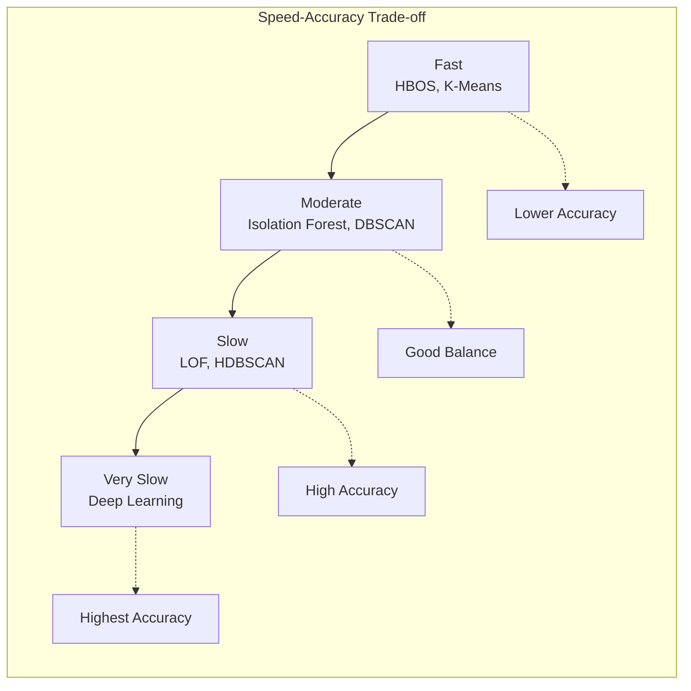

### Sensitivity vs Specificity

| Goal | Preferred Approach | Trade-off |
|------|-------------------|-----------|
| **Don't miss any signals** (High Recall) | PRR threshold 1.5, LOF | More false positives to review |
| **Only show real signals** (High Precision) | EBGM, Isolation Forest | May miss emerging patterns |
| **Balanced** | Ensemble (PRR + IF + LOF) | Moderate on both |

**Recommendation for CaseRadar**: Favor recall over precision. A missed pattern (potential case) is more costly than investigating a false positive.

### Interpretability vs Performance

| Method | Interpretability | Performance | When to Use |
|--------|-----------------|-------------|-------------|
| Rule-based | Excellent | Poor | Regulatory compliance, audit trails |
| PRR/ROR | Good | Moderate | Signal detection, statistical rigor |
| BERTopic | Good | Excellent | Topic discovery, trend tracking |
| Deep Learning | Poor | Excellent | Only if interpretability not required |

### Batch vs Streaming

| Factor | Batch | Streaming |
|--------|-------|-----------|
| **Implementation Complexity** | Low | High |
| **Latency** | Hours-Days | Seconds-Minutes |
| **Cost** | Lower | Higher (always-on) |
| **Debugging** | Easier | Harder |
| **CaseRadar Need** | Sufficient | Not required (yet) |

**Recommendation**: Batch-first architecture. Add streaming only if business requires sub-hour latency.

---

## Failure Modes & Mitigations

### 1. Clustering Failures

| Failure Mode | Detection | Mitigation |
|--------------|-----------|------------|
| Too few clusters | Cluster count < 10 for 17K docs | Lower min_cluster_size |
| Too many clusters | Cluster count > 500 | Raise min_cluster_size, use topic reduction |
| Poor cluster quality | Intra-cluster distance high | Review embeddings, consider domain fine-tuning |
| Temporal drift | Cluster composition changes over time | Enable online BERTopic updates |

### 2. Anomaly Detection Failures

| Failure Mode | Detection | Mitigation |
|--------------|-----------|------------|
| Too many anomalies flagged | >10% flagged as anomalies | Lower contamination parameter |
| Missing anomalies | Known anomalies not detected | Use ensemble, lower threshold |
| Model staleness | New complaint types not detected | Periodic retraining |

### 3. Signal Detection Failures

| Failure Mode | Detection | Mitigation |
|--------------|-----------|------------|
| False positive overload | >50 strong signals per day | Raise PRR threshold to 3.0 |
| Missed signals | Recall comparison shows gaps | Use lower threshold, add ML layer |
| Simpson's paradox | Aggregated PRR differs from stratified | Always stratify by make/model |

### 4. Operational Failures

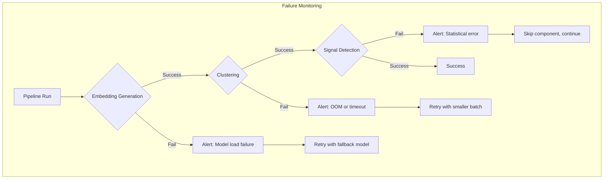

---

## Phased Implementation Plan

### Phase 1: Foundation (Weeks 1-2)

**Goal**: Replace current clustering with production-grade algorithm

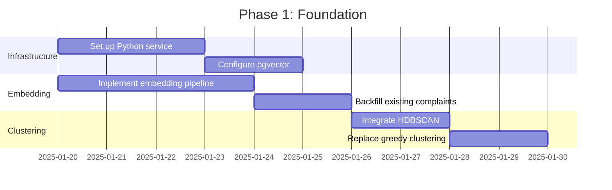

**Deliverables**:
- [ ] Python FastAPI service for ML operations
- [ ] pgvector extension configured
- [ ] Embedding generation for all complaints
- [ ] HDBSCAN clustering replacing current algorithm

### Phase 2: Intelligence (Weeks 3-4)

**Goal**: Add BERTopic for interpretable topics with temporal tracking

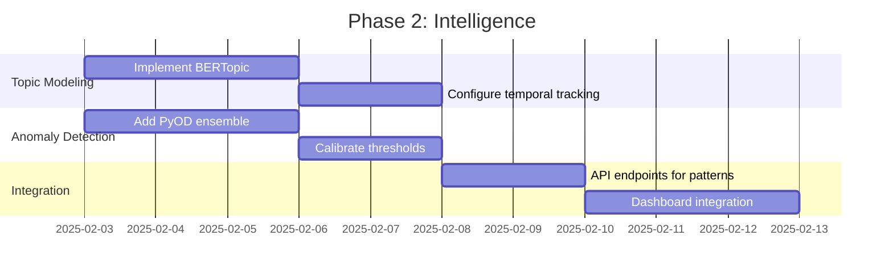

**Deliverables**:
- [ ] BERTopic topic model with auto-generated labels
- [ ] `topics_over_time()` for temporal tracking
- [ ] PyOD ensemble (Isolation Forest + LOF + HBOS)
- [ ] Pattern API with topic/anomaly data

### Phase 3: Signals (Weeks 5-6)

**Goal**: Implement signal detection and change point analysis

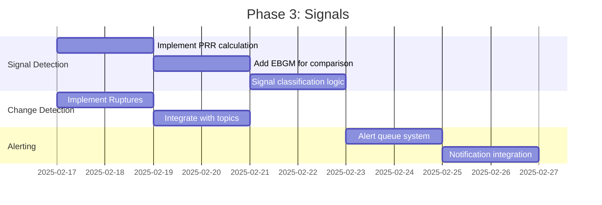

**Deliverables**:
- [ ] PRR/EBGM signal detection
- [ ] Signal classification (strong/weak/noise)
- [ ] Ruptures change point detection
- [ ] Alert queue for strong signals

### Phase 4: Optimization (Weeks 7-8)

**Goal**: Performance optimization, monitoring, and refinement

**Deliverables**:
- [ ] Incremental BERTopic updates (avoid full retraining)
- [ ] Performance benchmarking
- [ ] Monitoring dashboards (Grafana)
- [ ] Documentation and runbooks

---

## Success Metrics & Evaluation

### Business KPIs

| Metric | Definition | Target | Measurement |
|--------|------------|--------|-------------|
| **Early Detection Rate** | % of eventual recalls detected >30 days before announcement | >50% | Historical backtesting |
| **Signal Precision** | % of strong signals that correspond to real defects | >70% | Manual validation sample |
| **Attorney Adoption** | % of generated patterns reviewed by attorneys | >80% | Usage analytics |
| **Time to Insight** | Average time from complaint to pattern inclusion | <48 hours | Pipeline metrics |
| **Case Discovery Rate** | New cases discovered via pattern alerts | Track | CRM integration |

### Technical Quality Metrics

#### Topic Model Quality

| Metric | What It Measures | Target | Calculation |
|--------|-----------------|--------|-------------|
| **Coherence Score (CV)** | Semantic similarity of top words in topic | >0.4 | Gensim coherence pipeline |
| **Coherence Score (UMass)** | Word co-occurrence in corpus | >-2.0 | Higher is better |
| **Silhouette Score** | Cluster separation quality | >0.3 | sklearn.metrics |
| **Topic Diversity** | Uniqueness across topics | >0.7 | Unique words / total words |
| **Topic Stability** | Consistency across runs | >0.8 | Jaccard similarity |

```python
from gensim.models.coherencemodel import CoherenceModel
from sklearn.metrics import silhouette_score

def evaluate_topic_model(topic_model, documents, embeddings):
    """Comprehensive topic model evaluation."""
    # Get topics
    topics = topic_model.get_topics()
    topic_words = [[word for word, _ in topic_model.get_topic(t)]
                   for t in range(len(topics)) if t != -1]

    # Coherence (CV) - semantic similarity
    coherence_cv = CoherenceModel(
        topics=topic_words,
        texts=[doc.split() for doc in documents],
        coherence='c_v'
    ).get_coherence()

    # Coherence (UMass) - co-occurrence based
    coherence_umass = CoherenceModel(
        topics=topic_words,
        texts=[doc.split() for doc in documents],
        coherence='u_mass'
    ).get_coherence()

    # Silhouette score for clustering quality
    labels = topic_model.topics_
    # Exclude noise points (-1)
    mask = labels != -1
    if mask.sum() > 1:
        silhouette = silhouette_score(embeddings[mask], labels[mask])
    else:
        silhouette = 0.0

    # Topic diversity
    unique_words = set()
    total_words = 0
    for topic in topic_words:
        unique_words.update(topic[:10])
        total_words += 10
    diversity = len(unique_words) / total_words if total_words > 0 else 0

    return {
        'coherence_cv': coherence_cv,
        'coherence_umass': coherence_umass,
        'silhouette': silhouette,
        'diversity': diversity,
        'num_topics': len(topic_words),
        'quality_grade': grade_quality(coherence_cv, silhouette, diversity)
    }

def grade_quality(coherence_cv, silhouette, diversity):
    """Grade overall quality A-F."""
    score = (coherence_cv * 0.4 + silhouette * 0.3 + diversity * 0.3)
    if score > 0.6: return 'A'
    if score > 0.5: return 'B'
    if score > 0.4: return 'C'
    if score > 0.3: return 'D'
    return 'F'
```

#### Anomaly Detection Quality

| Metric | Definition | Target | Notes |
|--------|------------|--------|-------|
| **Precision@k** | % of top-k anomalies that are true anomalies | >60% | Requires labeled data |
| **Recall@k** | % of true anomalies in top-k | >80% | Prefer high recall |
| **AUC-ROC** | Area under ROC curve | >0.85 | Overall discrimination |
| **Contamination Stability** | Variance in anomaly % across runs | <5% | Reproducibility |

#### Signal Detection Quality

| Metric | Definition | Target | Notes |
|--------|------------|--------|-------|
| **PRR Calibration** | Correlation between PRR and actual defect rate | >0.6 | Backtesting |
| **False Positive Rate** | % of signals that don't correspond to real issues | <30% | Manual review |
| **Detection Latency** | Time from first complaint to signal | <90 days | Historical analysis |

### Validation Strategy

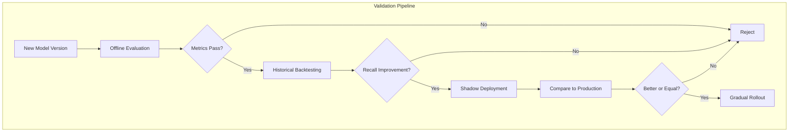

### Backtesting Protocol

To validate the system detects real patterns:

1. **Historical Recall Matching**
   - Take all recalls from 2020-2024
   - Run pattern detection on complaints 30/60/90 days before recall
   - Measure: What % of recalls would have been flagged?

2. **Synthetic Injection**
   - Inject known patterns into historical data
   - Verify detection at various signal strengths
   - Measure: Detection threshold sensitivity

3. **A/B Evaluation**
   - Compare new model vs. current production
   - Measure: Incremental signals detected
   - Human review of differences

```python
def backtest_recall_detection(model, complaints_df, recalls_df, days_before=30):
    """
    Backtest: Would we have detected these recalls?

    Args:
        model: Trained pattern detection model
        complaints_df: Historical complaints with dates
        recalls_df: Historical recalls with dates
        days_before: Detection window

    Returns:
        Detection rate and details
    """
    results = []

    for _, recall in recalls_df.iterrows():
        recall_date = recall['date']
        make = recall['make']
        model_name = recall['model']
        component = recall['component']

        # Get complaints before recall
        cutoff = recall_date - timedelta(days=days_before)
        relevant_complaints = complaints_df[
            (complaints_df['date'] < cutoff) &
            (complaints_df['make'] == make) &
            (complaints_df['model'] == model_name)
        ]

        # Run detection
        if len(relevant_complaints) < 10:
            detected = None  # Insufficient data
        else:
            patterns = model.detect(relevant_complaints)
            # Check if any pattern matches recall component
            detected = any(
                component.lower() in p['keywords'].lower()
                for p in patterns
            )

        results.append({
            'recall_id': recall['id'],
            'make_model': f"{make} {model_name}",
            'component': component,
            'complaints_before': len(relevant_complaints),
            'detected': detected,
            'days_before': days_before
        })

    # Calculate detection rate
    valid_results = [r for r in results if r['detected'] is not None]
    detection_rate = sum(r['detected'] for r in valid_results) / len(valid_results)

    return {
        'detection_rate': detection_rate,
        'total_recalls': len(recalls_df),
        'testable_recalls': len(valid_results),
        'detected_count': sum(r['detected'] for r in valid_results),
        'details': results
    }
```

### Quality Gates

Before any model goes to production:

| Gate | Criteria | Automated? |
|------|----------|------------|
| **G1: Unit Tests** | All tests pass | Yes |
| **G2: Coherence** | CV > 0.4, UMass > -2.0 | Yes |
| **G3: Silhouette** | Score > 0.3 | Yes |
| **G4: Backtest** | Recall detection > 50% | Yes |
| **G5: Human Review** | Sample patterns interpretable | No |
| **G6: No Regression** | Metrics >= production | Yes |

---

## Monitoring & Observability

### Key Metrics

| Metric | Target | Alert Threshold |
|--------|--------|-----------------|
| Embedding generation time | <5s per complaint | >30s |
| Clustering time (full) | <10min for 100K | >30min |
| Anomaly detection time | <1min for 100K | >5min |
| Pattern count | 50-200 | <20 or >500 |
| Strong signals per day | 0-10 | >50 |
| Pipeline success rate | 99% | <95% |

### Monitoring Architecture

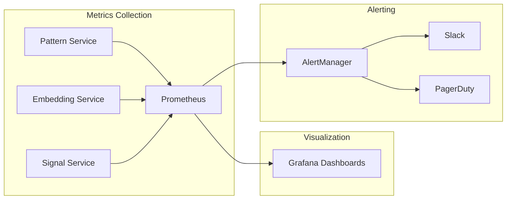

### Health Checks

```python
# Example health check endpoint
@app.get("/health")
async def health_check():
    checks = {
        "embedding_model": check_embedding_model(),
        "topic_model": check_topic_model(),
        "database": check_database_connection(),
        "vector_store": check_pgvector(),
    }

    all_healthy = all(checks.values())

    return {
        "status": "healthy" if all_healthy else "degraded",
        "checks": checks,
        "timestamp": datetime.utcnow().isoformat()
    }
```

---

## Migration Strategy

### Current Implementation Analysis

The existing CaseRadar pattern detection uses a **greedy clustering algorithm** implemented in TypeScript:

```typescript
// Current: src/lib/analysis/clustering.ts
const DEFAULT_CONFIG = {
  minClusterSize: 5,
  similarityThreshold: 0.75,  // Cosine similarity cutoff
  maxIterations: 100
};

function groupIntoClusters(embeddings, config) {
  // 1. Pick first unassigned as centroid
  // 2. Assign all within threshold to cluster
  // 3. Repeat until all assigned or max iterations
}
```

#### Current State Assessment

| Aspect | Current Implementation | Limitation |
|--------|----------------------|------------|
| **Algorithm** | Greedy centroid-based | Order-dependent, suboptimal clusters |
| **Similarity** | Fixed threshold (0.75) | No density awareness, misses varied clusters |
| **Noise Handling** | None | Every complaint forced into a cluster |
| **Temporal** | None | No tracking of topic evolution |
| **Anomaly Detection** | None | No outlier identification |
| **Interpretability** | Manual labels required | No auto-generated topic names |
| **Embeddings** | OpenAI text-embedding-3-small | Good quality, API cost |
| **Storage** | pgvector | ✓ Good - keep |

### Comparison: Current vs. Proposed

```mermaid
graph LR
    subgraph "Current Architecture"
        A1[Complaints] --> B1[OpenAI Embedding]
        B1 --> C1[Greedy Clustering]
        C1 --> D1[Manual Pattern Labels]
        D1 --> E1[Static Display]
    end

    subgraph "Proposed Architecture"
        A2[Complaints] --> B2[sentence-transformers<br/>or OpenAI]
        B2 --> C2[UMAP Reduction]
        C2 --> D2[HDBSCAN Clustering]
        D2 --> E2[c-TF-IDF Labels]
        E2 --> F2[BERTopic Model]

        B2 --> G2[PyOD Ensemble]
        G2 --> H2[Anomaly Scores]

        F2 --> I2[topics_over_time]
        I2 --> J2[Temporal Tracking]

        F2 --> K2[Ruptures PELT]
        K2 --> L2[Change Points]

        F2 --> M2[PRR/EBGM]
        M2 --> N2[Signal Detection]
    end
```

### Migration Path

#### Phase 0: Preparation (1 week)

**Goal**: Set up infrastructure without changing production

```mermaid
graph TD
    A[Create Python Service] --> B[Set up FastAPI]
    B --> C[Configure job queue]
    C --> D[Add monitoring]
    D --> E[Shadow mode testing]
```

**Tasks**:
- [ ] Create `services/pattern-detection/` Python service
- [ ] Configure Redis/BullMQ for job scheduling
- [ ] Set up Prometheus metrics endpoints
- [ ] Create shadow endpoint that runs in parallel with current

**Risk**: Low - no production changes

#### Phase 1: Dual-Write Mode (2 weeks)

**Goal**: Run both systems in parallel, compare outputs

```mermaid
graph TD
    subgraph "Dual-Write Architecture"
        A[NHTSA Sync] --> B[Embedding Generation]
        B --> C[Write to pgvector]

        C --> D[Current: Greedy Clustering]
        C --> E[New: BERTopic + HDBSCAN]

        D --> F[(Current Patterns Table)]
        E --> G[(New Patterns Table v2)]

        F --> H[Comparison Service]
        G --> H

        H --> I[Metrics Dashboard]
    end
```

**Comparison Metrics**:

| Metric | Purpose | Target |
|--------|---------|--------|
| Cluster count | Granularity comparison | New within 50% of current |
| Silhouette score | Cluster quality | New > Current |
| Topic coherence | Interpretability | CV > 0.4 |
| Coverage | % complaints in clusters | New >= Current |
| Stability | Run-to-run variance | New < Current |

**Migration Script**:

```python
async def run_dual_mode_comparison():
    """Compare current vs. new pattern detection."""
    complaints = await fetch_all_complaints_with_embeddings()

    # Run current algorithm
    current_start = time.time()
    current_patterns = run_greedy_clustering(complaints)
    current_time = time.time() - current_start

    # Run new algorithm
    new_start = time.time()
    new_patterns = run_bertopic_pipeline(complaints)
    new_time = time.time() - new_start

    # Compare
    comparison = {
        'current': {
            'pattern_count': len(current_patterns),
            'time_seconds': current_time,
            'avg_cluster_size': np.mean([p['count'] for p in current_patterns]),
            'noise_complaints': 0,  # Current has no noise handling
        },
        'new': {
            'pattern_count': len(new_patterns),
            'time_seconds': new_time,
            'avg_cluster_size': np.mean([p['count'] for p in new_patterns]),
            'noise_complaints': count_noise_assignments(new_patterns),
            'coherence_cv': calculate_coherence(new_patterns),
            'silhouette': calculate_silhouette(new_patterns),
        }
    }

    # Log for analysis
    logger.info(f"Dual-mode comparison: {json.dumps(comparison)}")

    return comparison
```

**Exit Criteria for Phase 1**:
- [ ] New system silhouette score > current
- [ ] Coherence CV > 0.4
- [ ] Processing time within 2x of current
- [ ] No data loss during migration
- [ ] 2 weeks of stable parallel operation

#### Phase 2: Feature Parity (1 week)

**Goal**: New system supports all current features plus new capabilities

**API Mapping**:

| Current Endpoint | New Endpoint | Changes |
|------------------|--------------|---------|
| `GET /api/patterns` | `GET /api/patterns` | Add `source=v2` param |
| `GET /api/patterns/:id` | `GET /api/patterns/:id` | Add temporal data |
| N/A | `GET /api/anomalies` | New endpoint |
| N/A | `GET /api/signals` | New endpoint |
| N/A | `GET /api/trends` | New endpoint |

**Database Schema Migration**:

```sql
-- Add new columns to patterns table
ALTER TABLE patterns ADD COLUMN IF NOT EXISTS topic_words TEXT[];
ALTER TABLE patterns ADD COLUMN IF NOT EXISTS coherence_score FLOAT;
ALTER TABLE patterns ADD COLUMN IF NOT EXISTS bertopic_id INTEGER;

-- Create new tables
CREATE TABLE IF NOT EXISTS anomaly_scores (
    complaint_id TEXT PRIMARY KEY REFERENCES complaints(id),
    isolation_forest_score FLOAT,
    lof_score FLOAT,
    ensemble_score FLOAT,
    is_anomaly BOOLEAN,
    detected_at TIMESTAMP DEFAULT NOW()
);

CREATE TABLE IF NOT EXISTS safety_signals (
    id TEXT PRIMARY KEY,
    component TEXT NOT NULL,
    make TEXT,
    model TEXT,
    prr FLOAT,
    prr_ci_lower FLOAT,
    ebgm FLOAT,
    strength TEXT CHECK (strength IN ('strong', 'weak', 'noise')),
    complaint_count INTEGER,
    detected_at TIMESTAMP DEFAULT NOW()
);

CREATE TABLE IF NOT EXISTS change_points (
    id TEXT PRIMARY KEY,
    pattern_id TEXT REFERENCES patterns(id),
    change_date DATE NOT NULL,
    change_type TEXT CHECK (change_type IN ('increase', 'decrease')),
    magnitude FLOAT,
    detected_at TIMESTAMP DEFAULT NOW()
);
```

#### Phase 3: Cutover (1 week)

**Goal**: Switch production to new system

```mermaid
graph TD
    subgraph "Cutover Sequence"
        A[Announce maintenance window] --> B[Take final backup]
        B --> C[Pause NHTSA sync]
        C --> D[Run final comparison]

        D --> E{Metrics OK?}
        E -->|Yes| F[Switch API to v2]
        E -->|No| G[Abort, investigate]

        F --> H[Resume NHTSA sync]
        H --> I[Monitor 4 hours]

        I --> J{Errors?}
        J -->|Yes| K[Rollback to v1]
        J -->|No| L[Migration complete]

        K --> M[Post-mortem]
    end
```

**Cutover Checklist**:

```markdown
## Pre-Cutover
- [ ] All dual-mode metrics passing
- [ ] Runbook reviewed by on-call
- [ ] Rollback procedure tested
- [ ] Stakeholders notified
- [ ] Backup verified

## During Cutover
- [ ] NHTSA sync paused
- [ ] Final data snapshot taken
- [ ] API version switched
- [ ] Health checks passing
- [ ] NHTSA sync resumed

## Post-Cutover (4-hour watch)
- [ ] Pattern counts normal
- [ ] API latency normal
- [ ] No error spikes
- [ ] User-facing features working
- [ ] Stakeholder sign-off

## Post-Migration (1 week)
- [ ] Deprecate v1 endpoints
- [ ] Remove old code
- [ ] Archive v1 patterns table
- [ ] Update documentation
- [ ] Team knowledge transfer
```

#### Phase 4: Deprecation (2 weeks)

**Goal**: Remove legacy code, complete migration

**Tasks**:
- [ ] Remove `src/lib/analysis/clustering.ts`
- [ ] Archive `patterns_v1` table
- [ ] Update all documentation
- [ ] Decommission dual-write infrastructure

### Rollback Plan

```mermaid
graph TD
    subgraph "Rollback Decision Tree"
        A[Issue Detected] --> B{Severity?}

        B -->|P1: Data loss/corruption| C[Immediate Rollback]
        B -->|P2: Degraded performance| D[Assess impact]
        B -->|P3: Minor issues| E[Fix forward]

        C --> F[Switch API to v1]
        F --> G[Pause v2 processing]
        G --> H[Restore from backup if needed]
        H --> I[Post-mortem]

        D --> J{Fixable in <1hr?}
        J -->|Yes| K[Hot fix]
        J -->|No| C

        E --> L[Create ticket]
        L --> M[Fix in next release]
    end
```

**Rollback Commands**:

```bash
# Emergency rollback
kubectl set image deployment/api api=caseradar/api:v1-stable
kubectl rollout status deployment/api

# Verify rollback
curl -s https://api.caseradar.com/health | jq '.version'
# Should show v1

# Pause v2 workers
kubectl scale deployment pattern-worker-v2 --replicas=0

# Notify team
slack-notify "#ops" "ROLLBACK EXECUTED - Pattern detection reverted to v1"
```

### Risk Assessment

| Risk | Likelihood | Impact | Mitigation |
|------|------------|--------|------------|
| Pattern quality regression | Medium | High | Extensive dual-mode testing |
| Performance degradation | Low | Medium | Benchmark before cutover |
| Data inconsistency | Low | High | Database migrations tested |
| API compatibility break | Medium | High | Versioned endpoints |
| Team knowledge gap | Medium | Medium | Documentation + training |

---

## Architecture Decision Records

### ADR-001: BERTopic over LDA for Topic Modeling

**Status**: Accepted

**Context**: Need to cluster 17K+ NHTSA complaints into interpretable topics with temporal tracking.

**Decision**: Use BERTopic with HDBSCAN instead of traditional LDA.

**Rationale**:
1. **+34% accuracy improvement** over LDA in benchmark studies (Egger & Yu, 2022)
2. **Automatic topic count** - HDBSCAN determines clusters; no need to tune K
3. **Native temporal tracking** - `topics_over_time()` built-in
4. **Better on short text** - Complaint summaries average 50-200 words
5. **Interpretable labels** - c-TF-IDF generates human-readable topic names

**Alternatives Considered**:

| Alternative | Why Rejected |
|-------------|--------------|
| LDA | Requires tuning K, poor on short text, no temporal |
| Top2Vec | Limited temporal tracking, slower than BERTopic |
| K-Means | Requires K, poor on varying density clusters |

**Consequences**:
- Requires Python service (BERTopic not in JS/TS)
- Higher memory usage than LDA
- Need UMAP for dimensionality reduction

---

### ADR-002: PyOD Ensemble over Single Anomaly Detector

**Status**: Accepted

**Context**: Need to identify unusual complaints that may indicate emerging issues.

**Decision**: Use ensemble of Isolation Forest + LOF + HBOS via PyOD.

**Rationale**:
1. **Complementary detection** - IF for global, LOF for local density, HBOS for speed
2. **Robustness** - No single algorithm performs best across all anomaly types
3. **Interpretability** - Can explain which detector flagged complaint
4. **Flexibility** - Easy to add/remove detectors

**Alternatives Considered**:

| Alternative | Why Rejected |
|-------------|--------------|
| Isolation Forest only | Misses local density anomalies |
| Deep learning (AutoEncoder) | Overkill for our scale, less interpretable |
| Statistical (Z-score) | Assumes normal distribution, doesn't hold for embeddings |

**Consequences**:
- Slightly higher latency (3 models vs 1)
- Need to calibrate ensemble weighting
- Score interpretation requires documentation

---

### ADR-003: Batch-First Architecture over Streaming

**Status**: Accepted

**Context**: Should pattern detection run on demand, nightly batch, or real-time streaming?

**Decision**: Implement nightly batch processing; defer streaming to future phase.

**Rationale**:
1. **Simplicity** - Batch is 10x simpler to implement and debug
2. **Cost** - No always-on streaming infrastructure
3. **Sufficient for use case** - Legal discovery doesn't need sub-minute latency
4. **Data characteristics** - NHTSA updates daily, not real-time
5. **80/20 rule** - Batch delivers 90% of value with 20% of complexity

**Alternatives Considered**:

| Alternative | Why Rejected |
|-------------|--------------|
| Real-time streaming (River) | Adds complexity without proportional benefit |
| On-demand only | Misses background trend detection |
| Hybrid (batch + stream) | Premature optimization |

**Consequences**:
- Patterns may be up to 24 hours stale
- No instant alerting on new complaints
- Will need to revisit if latency requirements change

---

### ADR-004: Sentence-Transformers over OpenAI Embeddings for Default

**Status**: Accepted

**Context**: Choose embedding model for complaint vectorization.

**Decision**: Default to `all-mpnet-base-v2` (sentence-transformers); allow OpenAI as configurable option.

**Rationale**:
1. **Cost** - Free vs $0.02-0.13/1M tokens
2. **Privacy** - No data sent to third party
3. **Quality** - 768-dim mpnet is comparable to OpenAI small
4. **Control** - Self-hosted, no API rate limits
5. **Speed** - Local inference faster than API calls

**Alternatives Considered**:

| Alternative | Why Rejected |
|-------------|--------------|
| OpenAI only | API costs, privacy concerns, rate limits |
| MiniLM-L6 | Lower quality (384-dim) |
| Cohere | Similar cost to OpenAI, less common |

**Consequences**:
- Requires local model loading (~500MB)
- May need GPU for high throughput
- OpenAI option remains for quality-sensitive use cases

---

### ADR-005: PRR as Primary Signal Detection Metric

**Status**: Accepted

**Context**: Choose statistical method for detecting disproportionate complaint rates.

**Decision**: Use Proportional Reporting Ratio (PRR) with threshold 2.0 as primary metric; EBGM as secondary.

**Rationale**:
1. **Interpretability** - PRR is intuitive: "2x more complaints than expected"
2. **Sensitivity** - Higher recall than EBGM (38% vs 0.9% per FDA benchmarks)
3. **Simplicity** - Frequentist calculation vs Bayesian EBGM
4. **Legal context** - False negatives (missed cases) more costly than false positives
5. **Prior art** - FDA uses PRR for initial screening, EBGM for confirmation

**Alternatives Considered**:

| Alternative | Why Rejected |
|-------------|--------------|
| EBGM only | Too conservative (0.9% sensitivity), may miss early signals |
| Logistic regression | Requires labeled training data we don't have |
| Pure ML classifier | Less interpretable for legal context |

**Consequences**:
- Higher false positive rate than EBGM
- Need human review layer for strong signals
- Should implement EBGM as secondary check for production

---

### ADR-006: PostgreSQL + pgvector over Dedicated Vector Database

**Status**: Accepted

**Context**: Choose storage for complaint embeddings.

**Decision**: Use pgvector extension in existing PostgreSQL.

**Rationale**:
1. **Operational simplicity** - One database to manage
2. **Transactional consistency** - Embeddings updated atomically with complaints
3. **Cost** - No additional infrastructure
4. **Scale fit** - pgvector handles 1M+ vectors, sufficient for our 100K target
5. **Query patterns** - Our queries are mostly exact match + top-K, not complex ANN

**Alternatives Considered**:

| Alternative | Why Rejected |
|-------------|--------------|
| Pinecone | Additional cost and vendor dependency |
| Milvus | Operational overhead, overkill for scale |
| Weaviate | Similar concerns, plus schema rigidity |
| FAISS (local) | No persistence, harder to integrate |

**Consequences**:
- Vector ops limited to pgvector capabilities
- May need to migrate if hitting performance limits at >1M vectors
- Need to tune `ivfflat` index parameters

---

## Open Questions & Risks

### Outstanding Questions (Require User Input)

| # | Question | Impact | Default if Unanswered |
|---|----------|--------|----------------------|
| **Q1** | Should patterns auto-generate alerts, or require manual review first? | UX, alert fatigue | Manual review for v1 |
| **Q2** | What PRR threshold is acceptable for "strong signal"? (2.0 proposed) | Sensitivity/specificity | 2.0 (FDA standard) |
| **Q3** | Should we preserve OpenAI embeddings or migrate to sentence-transformers? | Cost vs complexity | Keep OpenAI for now |
| **Q4** | How many historical recalls do we have for backtesting? | Validation quality | Proceed with available |
| **Q5** | Is 24-hour latency acceptable, or do attorneys need faster? | Architecture (batch vs stream) | Batch is sufficient |

### Known Technical Risks

| Risk | Likelihood | Impact | Mitigation | Owner |
|------|------------|--------|------------|-------|
| **BERTopic memory usage** on 100K+ docs | Medium | Pipeline failure | Use incremental mode, increase RAM | TBD |
| **Topic coherence degradation** over time | Medium | Poor interpretability | Periodic retraining, monitoring | TBD |
| **OpenAI embedding API rate limits** | Low | Slow backfill | Batch with delays, consider local | TBD |
| **Simpson's paradox masking signals** | Medium | Missed patterns | Stratified analysis by default | TBD |
| **Model drift without retraining** | High | Stale patterns | Scheduled retraining, drift detection | TBD |

### Deferred Decisions (Revisit Later)

| Decision | Deferral Reason | Revisit Trigger |
|----------|-----------------|-----------------|
| **Streaming architecture** | Not needed at current scale | If latency SLA drops to <1 hour |
| **GPU acceleration** | CPU sufficient for 100K | If embedding throughput <500/sec |
| **Knowledge graph integration** | Higher complexity | If multi-theme analysis becomes priority |
| **BERTrend adoption** | Research-only, not production-ready | When stable release available |

### Unknowns We're Accepting

1. **Optimal HDBSCAN parameters** - Will be tuned empirically after initial deployment
2. **Actual recall detection rate** - Backtesting will validate; 50% target may be optimistic
3. **Attorney adoption** - UX research needed to understand workflow integration
4. **Long-term cost trajectory** - OpenAI pricing may change; budget flexibility needed

---

## References

### Primary Sources

1. Ghazizadeh, M., McDonald, A.D., Lee, J.D. (2014). ["Text Mining to Decipher Free-Response Consumer Complaints"](https://journals.sagepub.com/doi/abs/10.1177/0018720813519473). Human Factors.

2. Egger, R., Yu, J. (2022). ["A Topic Modeling Comparison Between LDA, NMF, Top2Vec, and BERTopic"](https://pmc.ncbi.nlm.nih.gov/articles/PMC9120935/). Frontiers in Sociology.

3. Dauner, D.G. et al. (2023). ["Evaluation of four machine learning models for signal detection"](https://journals.sagepub.com/doi/10.1177/20420986231219472). Journal of Market Access & Health Policy.

4. Fraunhofer IESE. ["Time Traveling with Data Science: Change Point Detection"](https://www.iese.fraunhofer.de/blog/change-point-detection/).

5. Upstream Security (2025). ["Using Connected Vehicle Data for Recall Cost Reductions"](https://upstream.auto/blog/using-connected-vehicle-data-for-recall-cost-reductions/).

### Tool Documentation

- [BERTopic Documentation](https://maartengr.github.io/BERTopic/)
- [PyOD Documentation](https://pyod.readthedocs.io/)
- [HDBSCAN Documentation](https://hdbscan.readthedocs.io/)
- [Ruptures Documentation](https://centre-borelli.github.io/ruptures-docs/)
- [Sentence Transformers](https://www.sbert.net/)

### Benchmarks & Comparisons

- [HDBSCAN Performance Benchmarks](https://hdbscan.readthedocs.io/en/latest/performance_and_scalability.html)
- [ADBench: Anomaly Detection Benchmark](https://github.com/Minqi824/ADBench)
- [ENCePP Signal Detection Guide](https://encepp.europa.eu/encepp-toolkit/methodological-guide/chapter-11-signal-detection-methodology-and-application_en)

---

## Appendix A: Algorithm Quick Reference

### BERTopic Parameters

| Parameter | Default | CaseRadar Recommendation | Notes |
|-----------|---------|-------------------------|-------|
| `min_topic_size` | 10 | 15 | Minimum complaints per pattern |
| `nr_topics` | None | None (auto) | Let HDBSCAN decide |
| `top_n_words` | 10 | 10 | Words per topic label |
| `calculate_probabilities` | False | True | For soft clustering |

### HDBSCAN Parameters

| Parameter | Default | CaseRadar Recommendation | Notes |
|-----------|---------|-------------------------|-------|
| `min_cluster_size` | 5 | 15 | Trade-off: lower = more clusters |
| `min_samples` | None | 5 | Density threshold |
| `cluster_selection_method` | 'eom' | 'eom' | 'leaf' for more granular clusters |

### PyOD Contamination

| Scenario | Contamination | Notes |
|----------|---------------|-------|
| Exploratory | 0.10 | Find more anomalies initially |
| Production | 0.05 | Standard for well-understood data |
| High precision | 0.01 | Only flag extreme outliers |

### PRR Thresholds

| Threshold | Sensitivity | Specificity | Use Case |
|-----------|-------------|-------------|----------|
| 1.5 | High | Low | Don't miss any signals |
| **2.0** | Balanced | Balanced | Standard recommendation |
| 3.0 | Low | High | Reduce false positives |

---

## Appendix B: Glossary

| Term | Definition |
|------|------------|
| **BERTopic** | Neural topic modeling using BERT embeddings + HDBSCAN clustering |
| **Change Point** | Timestamp where time series distribution changes significantly |
| **Contamination** | Expected proportion of anomalies in the dataset |
| **EBGM** | Empirical Bayes Geometric Mean - Bayesian signal detection metric |
| **HDBSCAN** | Hierarchical Density-Based Spatial Clustering of Applications with Noise |
| **PRR** | Proportional Reporting Ratio - frequentist signal detection metric |
| **Weak Signal** | Low-frequency pattern that may indicate emerging trend |

---

## Appendix C: Cost Analysis

### Compute Costs (AWS us-east-1)

| Operation | Instance Type | Duration | Monthly Cost (100K complaints) |
|-----------|---------------|----------|-------------------------------|
| Embedding Generation | t3.xlarge (4 vCPU, 16GB) | ~30 min/day | ~$15/month |
| BERTopic Clustering | r5.xlarge (4 vCPU, 32GB) | ~20 min/day | ~$12/month |
| Anomaly Detection | t3.large (2 vCPU, 8GB) | ~5 min/day | ~$3/month |
| API Service (always-on) | t3.medium | 24/7 | ~$30/month |
| **Total Compute** | | | **~$60/month** |

### Storage Costs

| Storage Type | Size (100K complaints) | Monthly Cost |
|--------------|----------------------|--------------|
| PostgreSQL (RDS db.t3.medium) | ~5GB data + indexes | ~$30/month |
| pgvector embeddings | ~300MB (768-dim * 100K * 4 bytes) | Included in RDS |
| S3 (model artifacts) | ~500MB | ~$0.02/month |
| **Total Storage** | | **~$30/month** |

### Third-Party Costs (Optional)

| Service | Use Case | Cost |
|---------|----------|------|
| OpenAI Embeddings | Higher quality embeddings | ~$2/month (100K * 500 tokens avg) |
| Datadog | Monitoring | ~$15/month (1 host) |
| **Total Optional** | | **~$17/month** |

### Cost Summary

| Tier | Monthly Cost | Best For |
|------|--------------|----------|
| **MVP** | ~$90/month | Development, small scale |
| **Production** | ~$150/month | 100K complaints, full monitoring |
| **Scale** | ~$500/month | 1M+ complaints, GPU acceleration |

---

## Appendix D: Data Quality & Validation

### Input Data Quality Checks

```python
from dataclasses import dataclass
from typing import Optional
import re

@dataclass
class ComplaintValidation:
    is_valid: bool
    issues: list[str]
    cleaned_text: Optional[str]

def validate_complaint(complaint: dict) -> ComplaintValidation:
    """Validate and clean incoming complaint data."""
    issues = []

    # Required fields
    required = ['nhtsa_id', 'complaint_text', 'make', 'model', 'year']
    for field in required:
        if not complaint.get(field):
            issues.append(f"Missing required field: {field}")

    # Text quality checks
    text = complaint.get('complaint_text', '')

    if len(text) < 20:
        issues.append("Complaint text too short (<20 chars)")

    if len(text) > 50000:
        issues.append("Complaint text too long (>50K chars)")

    # Detect placeholder text
    placeholder_patterns = [
        r'^test\s*$',
        r'^n/?a\s*$',
        r'^none\s*$',
        r'^xxx+$',
    ]
    for pattern in placeholder_patterns:
        if re.match(pattern, text.lower().strip()):
            issues.append("Complaint text appears to be placeholder")

    # Clean text
    cleaned_text = None
    if not issues:
        cleaned_text = clean_complaint_text(text)

    return ComplaintValidation(
        is_valid=len(issues) == 0,
        issues=issues,
        cleaned_text=cleaned_text
    )
```

### Embedding Quality Validation

```python
import numpy as np
from scipy.spatial.distance import cosine

def validate_embeddings(embeddings: np.ndarray, texts: list[str]) -> dict:
    """Validate embedding quality."""
    results = {
        'total_embeddings': len(embeddings),
        'issues': []
    }

    # Check for zero vectors
    zero_vectors = np.sum(np.all(embeddings == 0, axis=1))
    if zero_vectors > 0:
        results['issues'].append(f"{zero_vectors} zero vectors detected")

    # Check for duplicate embeddings (exact matches)
    unique_embeddings = len(np.unique(embeddings, axis=0))
    duplicates = len(embeddings) - unique_embeddings
    if duplicates > len(embeddings) * 0.01:  # >1% duplicates
        results['issues'].append(f"{duplicates} duplicate embeddings (>1%)")

    # Check for reasonable variance
    variances = np.var(embeddings, axis=0)
    low_variance_dims = np.sum(variances < 0.001)
    if low_variance_dims > embeddings.shape[1] * 0.1:  # >10% low variance
        results['issues'].append(f"{low_variance_dims} dimensions with low variance")

    # Spot check: similar texts should have similar embeddings
    # (requires manual review of flagged pairs)
    results['quality_score'] = 1.0 - (len(results['issues']) * 0.2)

    return results
```

### Pattern Quality Validation

```python
def validate_patterns(patterns: list[dict], complaints: list[dict]) -> dict:
    """Validate pattern detection quality."""
    results = {
        'total_patterns': len(patterns),
        'issues': [],
        'metrics': {}
    }

    # Check for reasonable pattern count
    complaint_count = len(complaints)
    if len(patterns) < 10:
        results['issues'].append("Too few patterns (<10) - may be under-clustering")
    if len(patterns) > complaint_count / 10:
        results['issues'].append("Too many patterns - may be over-clustering")

    # Check pattern size distribution
    sizes = [p['complaint_count'] for p in patterns]
    results['metrics']['size_distribution'] = {
        'min': min(sizes),
        'max': max(sizes),
        'median': np.median(sizes),
        'std': np.std(sizes)
    }

    # Check for giant clusters (potential quality issue)
    if max(sizes) > complaint_count * 0.3:  # >30% in one cluster
        results['issues'].append(f"Giant cluster detected ({max(sizes)} complaints)")

    # Check topic coherence (simplified)
    for pattern in patterns:
        if pattern.get('coherence_score', 1) < 0.3:
            results['issues'].append(f"Low coherence in pattern {pattern['id']}")

    return results
```

---

## Appendix E: Testing Strategy

### Unit Tests

```python
# tests/test_pattern_detection.py
import pytest
import numpy as np
from pattern_detection import BERTopicWrapper, AnomalyDetector

class TestEmbeddings:
    def test_embedding_dimension(self):
        """Embeddings should be 768-dimensional."""
        embedder = EmbeddingService()
        embedding = embedder.embed("Test complaint about brakes")
        assert embedding.shape == (768,)

    def test_embedding_deterministic(self):
        """Same text should produce same embedding."""
        embedder = EmbeddingService()
        text = "The brakes failed while driving"
        e1 = embedder.embed(text)
        e2 = embedder.embed(text)
        np.testing.assert_array_almost_equal(e1, e2)

    def test_similar_texts_close_embeddings(self):
        """Similar texts should have cosine similarity > 0.7."""
        embedder = EmbeddingService()
        e1 = embedder.embed("The brakes failed suddenly")
        e2 = embedder.embed("Brake failure occurred unexpectedly")
        similarity = 1 - cosine(e1, e2)
        assert similarity > 0.7

class TestClustering:
    def test_minimum_cluster_size(self):
        """No cluster should have fewer than min_cluster_size complaints."""
        clusterer = BERTopicWrapper(min_cluster_size=15)
        # ... test with synthetic data

    def test_noise_handling(self):
        """Outliers should be assigned to noise cluster (-1)."""
        # ... test that outliers get -1 label

class TestAnomalyDetection:
    def test_known_anomalies_detected(self):
        """Synthetic anomalies should be detected."""
        detector = AnomalyDetector()
        # Create normal data
        normal = np.random.randn(100, 768)
        # Create anomalies (far from normal distribution)
        anomalies = np.random.randn(5, 768) + 10
        all_data = np.vstack([normal, anomalies])

        scores = detector.fit_predict(all_data)
        # Anomalies should have highest scores
        anomaly_scores = scores[-5:]
        normal_scores = scores[:-5]
        assert all(a > np.percentile(normal_scores, 95) for a in anomaly_scores)

class TestSignalDetection:
    def test_prr_calculation(self):
        """PRR should be calculated correctly."""
        # a=10, b=90, c=5, d=895
        # PRR = (10/100) / (5/900) = 0.1 / 0.0056 = 17.86
        prr, ci = calculate_prr(a=10, b=90, c=5, d=895)
        assert abs(prr - 17.86) < 0.1

    def test_prr_edge_cases(self):
        """PRR should handle edge cases gracefully."""
        # Zero in denominator
        prr, ci = calculate_prr(a=10, b=0, c=0, d=100)
        assert prr is None
```

### Integration Tests

```python
# tests/test_pipeline_integration.py
import pytest
from unittest.mock import Mock

class TestPipelineIntegration:
    @pytest.fixture
    def sample_complaints(self):
        """Load test fixture with known patterns."""
        return load_fixture('sample_complaints_100.json')

    def test_end_to_end_pipeline(self, sample_complaints):
        """Full pipeline should produce expected patterns."""
        pipeline = PatternDetectionPipeline()

        # Run full pipeline
        result = pipeline.run(sample_complaints)

        # Should produce patterns
        assert len(result['patterns']) > 5
        assert len(result['patterns']) < 50

        # Should detect known anomalies
        assert any(c['is_anomaly'] for c in result['complaints'])

        # Should calculate signals
        assert len(result['signals']) > 0

    def test_incremental_update(self, sample_complaints):
        """Adding new complaints should update patterns incrementally."""
        pipeline = PatternDetectionPipeline()

        # Initial run
        result1 = pipeline.run(sample_complaints[:80])
        pattern_count_1 = len(result1['patterns'])

        # Add more complaints
        result2 = pipeline.update(sample_complaints[80:])

        # Pattern count should be similar (not wildly different)
        assert abs(len(result2['patterns']) - pattern_count_1) < 10
```

### Performance Tests

```python
# tests/test_performance.py
import pytest
import time

class TestPerformance:
    @pytest.mark.slow
    def test_embedding_throughput(self):
        """Should embed >500 complaints/second on CPU."""
        embedder = EmbeddingService()
        texts = ["Test complaint " * 50] * 1000  # 1000 complaints

        start = time.time()
        embedder.embed_batch(texts)
        elapsed = time.time() - start

        throughput = 1000 / elapsed
        assert throughput > 500  # >500/sec

    @pytest.mark.slow
    def test_clustering_scalability(self):
        """Clustering 100K complaints should complete in <10 minutes."""
        # Generate synthetic embeddings
        embeddings = np.random.randn(100000, 768).astype(np.float32)

        clusterer = BERTopicWrapper()
        start = time.time()
        clusterer.fit(embeddings)
        elapsed = time.time() - start

        assert elapsed < 600  # <10 minutes
```

---

## Appendix F: API Design

### Pattern Detection API

```yaml
openapi: 3.0.0
info:
  title: CaseRadar Pattern Detection API
  version: 1.0.0

paths:
  /api/patterns:
    get:
      summary: List all detected patterns
      parameters:
        - name: minSeverity
          in: query
          schema:
            type: number
          description: Minimum severity score
        - name: minComplaints
          in: query
          schema:
            type: integer
          description: Minimum complaints in pattern
        - name: since
          in: query
          schema:
            type: string
            format: date
          description: Patterns detected since date
      responses:
        200:
          description: List of patterns
          content:
            application/json:
              schema:
                type: object
                properties:
                  patterns:
                    type: array
                    items:
                      $ref: '#/components/schemas/Pattern'
                  meta:
                    $ref: '#/components/schemas/PaginationMeta'

  /api/patterns/{patternId}:
    get:
      summary: Get pattern details
      parameters:
        - name: patternId
          in: path
          required: true
          schema:
            type: string
      responses:
        200:
          description: Pattern details
          content:
            application/json:
              schema:
                $ref: '#/components/schemas/PatternDetail'

  /api/patterns/{patternId}/complaints:
    get:
      summary: Get complaints in a pattern
      parameters:
        - name: patternId
          in: path
          required: true
          schema:
            type: string
        - name: limit
          in: query
          schema:
            type: integer
            default: 50
        - name: offset
          in: query
          schema:
            type: integer
            default: 0
      responses:
        200:
          description: Complaints in pattern
          content:
            application/json:
              schema:
                type: object
                properties:
                  complaints:
                    type: array
                    items:
                      $ref: '#/components/schemas/Complaint'

  /api/signals:
    get:
      summary: List detected safety signals
      parameters:
        - name: strength
          in: query
          schema:
            type: string
            enum: [strong, weak, all]
          description: Filter by signal strength
      responses:
        200:
          description: List of signals
          content:
            application/json:
              schema:
                type: array
                items:
                  $ref: '#/components/schemas/Signal'

  /api/anomalies:
    get:
      summary: List anomalous complaints
      parameters:
        - name: minScore
          in: query
          schema:
            type: number
            default: 0.8
          description: Minimum anomaly score (0-1)
      responses:
        200:
          description: List of anomalous complaints
          content:
            application/json:
              schema:
                type: array
                items:
                  $ref: '#/components/schemas/AnomalousComplaint'

  /api/trends:
    get:
      summary: Get topic trends over time
      parameters:
        - name: patternId
          in: query
          schema:
            type: string
          description: Specific pattern to track
        - name: startDate
          in: query
          schema:
            type: string
            format: date
        - name: endDate
          in: query
          schema:
            type: string
            format: date
        - name: granularity
          in: query
          schema:
            type: string
            enum: [daily, weekly, monthly]
            default: monthly
      responses:
        200:
          description: Trend data
          content:
            application/json:
              schema:
                $ref: '#/components/schemas/TrendData'

components:
  schemas:
    Pattern:
      type: object
      properties:
        id:
          type: string
        name:
          type: string
          description: Auto-generated topic label
        keywords:
          type: array
          items:
            type: string
        complaintCount:
          type: integer
        severityScore:
          type: number
        trend:
          type: string
          enum: [rising, stable, declining]
        createdAt:
          type: string
          format: date-time
        updatedAt:
          type: string
          format: date-time

    PatternDetail:
      allOf:
        - $ref: '#/components/schemas/Pattern'
        - type: object
          properties:
            topComplaints:
              type: array
              items:
                $ref: '#/components/schemas/Complaint'
            makeModelBreakdown:
              type: array
              items:
                type: object
                properties:
                  make:
                    type: string
                  model:
                    type: string
                  count:
                    type: integer
            temporalDistribution:
              type: array
              items:
                type: object
                properties:
                  date:
                    type: string
                  count:
                    type: integer

    Signal:
      type: object
      properties:
        id:
          type: string
        component:
          type: string
        make:
          type: string
        model:
          type: string
        prr:
          type: number
        prrCiLower:
          type: number
        ebgm:
          type: number
        strength:
          type: string
          enum: [strong, weak, noise]
        complaintCount:
          type: integer
        detectedAt:
          type: string
          format: date-time

    AnomalousComplaint:
      type: object
      properties:
        complaintId:
          type: string
        anomalyScore:
          type: number
        anomalyReasons:
          type: array
          items:
            type: string
        complaint:
          $ref: '#/components/schemas/Complaint'

    TrendData:
      type: object
      properties:
        patternId:
          type: string
        dataPoints:
          type: array
          items:
            type: object
            properties:
              date:
                type: string
              count:
                type: integer
              percentageOfTotal:
                type: number
        changePoints:
          type: array
          items:
            type: object
            properties:
              date:
                type: string
              changeType:
                type: string
                enum: [increase, decrease]
              magnitude:
                type: number
```

### Python Client Example

```python
from caseradar import PatternDetectionClient

# Initialize client
client = PatternDetectionClient(
    base_url="https://api.caseradar.com",
    api_key="your-api-key"
)

# Get rising patterns with high severity
patterns = client.get_patterns(
    min_severity=500,
    trend="rising"
)

# Get strong signals
signals = client.get_signals(strength="strong")

# Get anomalies for review
anomalies = client.get_anomalies(min_score=0.9)

# Get trend data for a specific pattern
trend = client.get_trends(
    pattern_id="pat_12345",
    granularity="weekly"
)
```

---

## Appendix G: Model Versioning & Rollback

### Version Control Strategy

```mermaid
graph TD
    subgraph "Model Versioning"
        A[New Model Training] --> B[Validation Tests]
        B -->|Pass| C[Shadow Deployment]
        B -->|Fail| D[Reject & Log]

        C --> E[A/B Testing<br/>5% traffic]
        E -->|Metrics Better| F[Gradual Rollout]
        E -->|Metrics Worse| G[Rollback]

        F --> H[25% → 50% → 100%]
        H --> I[Archive Previous Version]
    end
```

### Model Metadata Schema

```python
@dataclass
class ModelVersion:
    version_id: str          # e.g., "v2.3.1"
    model_type: str          # "bertopic", "pyod", "signal"
    created_at: datetime
    trained_on: str          # Dataset hash
    metrics: dict            # {accuracy, silhouette_score, etc.}
    config: dict             # Hyperparameters
    artifact_path: str       # S3 path
    status: str              # "training", "validating", "shadow", "production", "archived"
    promoted_at: Optional[datetime]
    retired_at: Optional[datetime]
```

### Rollback Procedure

```python
class ModelManager:
    def rollback(self, model_type: str, reason: str):
        """Rollback to previous production model."""
        current = self.get_current_model(model_type)
        previous = self.get_previous_model(model_type)

        if not previous:
            raise ValueError(f"No previous version available for {model_type}")

        # Log rollback
        logger.warning(f"Rolling back {model_type} from {current.version_id} "
                      f"to {previous.version_id}. Reason: {reason}")

        # Swap models
        self.set_production_model(model_type, previous.version_id)

        # Archive failed model
        current.status = "failed"
        current.retired_at = datetime.utcnow()
        self.save_model_metadata(current)

        # Alert team
        self.send_alert(
            f"Model rollback: {model_type}",
            f"Rolled back from {current.version_id} to {previous.version_id}\n"
            f"Reason: {reason}"
        )
```

---

## Appendix H: Security Considerations

### Data Security

| Risk | Mitigation |
|------|------------|
| PII in complaint text | Redact names/addresses before processing |
| API key exposure | Use environment variables, rotate keys |
| Model artifacts theft | Encrypt at rest, restrict S3 access |
| Injection attacks | Validate all inputs, parameterize queries |

### Compliance

| Requirement | Implementation |
|-------------|----------------|
| NHTSA data usage | Public data, no restrictions on analysis |
| Audit trail | Log all pattern detections with timestamps |
| Reproducibility | Version all models, store training data hashes |

### Input Validation

```python
from pydantic import BaseModel, validator
import re

class ComplaintInput(BaseModel):
    nhtsa_id: str
    complaint_text: str
    make: str
    model: str
    year: int

    @validator('nhtsa_id')
    def validate_nhtsa_id(cls, v):
        if not re.match(r'^\d{7,10}$', v):
            raise ValueError('Invalid NHTSA ID format')
        return v

    @validator('complaint_text')
    def validate_text(cls, v):
        # Remove potential SQL/script injection
        dangerous_patterns = [
            r'<script',
            r'javascript:',
            r'on\w+\s*=',
            r';\s*DROP',
            r';\s*DELETE',
        ]
        for pattern in dangerous_patterns:
            if re.search(pattern, v, re.IGNORECASE):
                raise ValueError('Potentially dangerous content detected')
        return v

    @validator('year')
    def validate_year(cls, v):
        if v < 1900 or v > 2030:
            raise ValueError('Year out of valid range')
        return v
```

---

## Appendix I: SLA & Disaster Recovery

### Service Level Objectives (SLOs)

| Metric | Target | Measurement |
|--------|--------|-------------|
| **Pattern Detection Freshness** | <24 hours | Time since last successful run |
| **API Availability** | 99.5% | Uptime over rolling 30 days |
| **API Latency (p95)** | <500ms | Pattern list endpoint |
| **Alert Delivery** | <5 minutes | From signal detection to notification |

### SLA Tiers

| Tier | Availability | Support | Cost Impact |
|------|--------------|---------|-------------|
| **Development** | Best effort | Business hours | Baseline |
| **Production** | 99.5% | Business hours + on-call | +50% |
| **Enterprise** | 99.9% | 24/7 + dedicated support | +200% |

### Disaster Recovery

```mermaid
graph TD
    subgraph "Recovery Scenarios"
        A[Failure Type] --> B[Database Failure]
        A --> C[Model Corruption]
        A --> D[Service Outage]
        A --> E[Data Loss]

        B --> B1[RTO: 1 hour<br/>RPO: 5 minutes]
        C --> C1[RTO: 30 minutes<br/>RPO: Last good model]
        D --> D1[RTO: 15 minutes<br/>RPO: N/A]
        E --> E1[RTO: 4 hours<br/>RPO: 24 hours]
    end
```

### Recovery Procedures

#### Database Failure
1. **Detection**: CloudWatch alarms on RDS metrics
2. **Failover**: Automatic Multi-AZ failover (if configured)
3. **Manual Recovery**: Restore from automated backup
4. **Verification**: Run health checks, verify pattern counts

#### Model Corruption
1. **Detection**: Validation tests fail, anomalous outputs
2. **Immediate Action**: Rollback to previous model version
3. **Investigation**: Review training logs, data quality
4. **Prevention**: Add validation to CI/CD pipeline

#### Complete Outage
1. **Detection**: Health check failures, user reports
2. **Triage**: Check infrastructure, database, services
3. **Communication**: Update status page
4. **Recovery**: Follow runbook for specific failure type

### Backup Strategy

| Data Type | Frequency | Retention | Storage |
|-----------|-----------|-----------|---------|
| PostgreSQL | Continuous (PITR) | 7 days | RDS automated |
| Model Artifacts | Per training | 30 days | S3 versioning |
| Embeddings | Daily snapshot | 7 days | pgvector in RDS |
| Configuration | On change | Indefinite | Git |

---

## Appendix J: On-Call Runbook

### Alert Response Matrix

| Alert | Severity | Response Time | Escalation |
|-------|----------|---------------|------------|
| Pipeline failed | P2 | 4 hours | After 2 retries |
| API errors >5% | P1 | 30 minutes | Immediate if >10% |
| No patterns detected | P2 | 4 hours | After investigation |
| Model validation failed | P2 | 4 hours | N/A |
| Database connection failed | P1 | 15 minutes | Immediate |

### Common Issues & Resolutions

#### 1. Pipeline Failed: OOM Error

**Symptoms**: Worker process killed, "MemoryError" in logs

**Diagnosis**:
```bash
# Check recent logs
kubectl logs pattern-worker-xxx --tail=100

# Check memory usage
kubectl top pod pattern-worker-xxx
```

**Resolution**:
```bash
# Option 1: Increase memory limit
kubectl edit deployment pattern-worker
# Change resources.limits.memory to 8Gi

# Option 2: Process in smaller batches
# Edit config to reduce batch_size
```

#### 2. No New Patterns Detected

**Symptoms**: Pattern count unchanged after sync

**Diagnosis**:
```sql
-- Check for new complaints
SELECT COUNT(*) FROM complaints
WHERE created_at > NOW() - INTERVAL '24 hours';

-- Check embedding status
SELECT COUNT(*) FROM complaints
WHERE embedding IS NULL;
```

**Resolution**:
1. If no new complaints: Check NHTSA sync job
2. If embeddings missing: Trigger embedding backfill
3. If clustering fails: Check BERTopic logs

#### 3. High API Latency

**Symptoms**: p95 latency >1s, user complaints

**Diagnosis**:
```bash
# Check database query performance
EXPLAIN ANALYZE SELECT * FROM patterns
ORDER BY severity_score DESC LIMIT 50;

# Check for missing indexes
SELECT * FROM pg_stat_user_indexes
WHERE idx_scan = 0;
```

**Resolution**:
1. Add missing indexes
2. Optimize slow queries
3. Scale up database instance
4. Add caching layer (Redis)

#### 4. Anomaly Score Explosion

**Symptoms**: >50% complaints flagged as anomalies

**Diagnosis**:
```python
# Check contamination parameter
print(model.contamination)  # Should be ~0.05

# Check embedding distribution
import numpy as np
print(np.var(embeddings))  # Should be ~1.0
```

**Resolution**:
1. Check for data quality issues (batch of bad embeddings)
2. Retrain model with correct contamination
3. Rollback to previous model version

### Escalation Contacts

| Role | Contact | When to Escalate |
|------|---------|------------------|
| On-call Engineer | PagerDuty rotation | First responder |
| Team Lead | @team-lead | P1 > 1 hour unresolved |
| Platform Team | @platform | Infrastructure issues |
| Data Team | @data | Model quality issues |

### Post-Incident Process

1. **Immediate**: Resolve incident, restore service
2. **Within 24h**: Write brief incident summary
3. **Within 1 week**: Complete blameless postmortem
4. **Action Items**: Create tickets for preventive measures

### Runbook Checklist

```markdown
## Incident Response Checklist

- [ ] Acknowledge alert in PagerDuty
- [ ] Check service health dashboard
- [ ] Review recent deployments
- [ ] Check database connectivity
- [ ] Review error logs
- [ ] Identify scope of impact
- [ ] Communicate status to stakeholders
- [ ] Implement fix or rollback
- [ ] Verify resolution
- [ ] Update status page
- [ ] Document incident
```

---

## Appendix K: Edge Cases & Boundary Conditions

### Data Edge Cases

#### 1. Empty or Near-Empty Corpus

**Scenario**: First run with <50 complaints

**Behavior**:
- BERTopic requires minimum data for meaningful clusters
- HDBSCAN may assign all to noise (-1)
- PRR calculations become statistically meaningless

**Mitigation**:
```python
def check_minimum_data(complaints: list) -> bool:
    MIN_COMPLAINTS = 100
    if len(complaints) < MIN_COMPLAINTS:
        logger.warning(f"Insufficient data ({len(complaints)} < {MIN_COMPLAINTS})")
        return False
    return True

# Graceful degradation
if not check_minimum_data(complaints):
    return {
        'patterns': [],
        'message': 'Insufficient data for pattern detection',
        'recommendation': 'Wait for more complaints to accumulate'
    }
```

#### 2. Single Dominant Topic

**Scenario**: 80%+ complaints about one issue (e.g., recall event)

**Behavior**:
- Most complaints cluster into 1-2 topics
- Other patterns drowned out
- Anomaly detection skewed

**Mitigation**:
```python
def detect_topic_dominance(topic_model, threshold=0.5):
    """Detect if single topic dominates corpus."""
    topic_info = topic_model.get_topic_info()
    total = topic_info['Count'].sum()
    max_topic = topic_info[topic_info['Topic'] != -1]['Count'].max()

    if max_topic / total > threshold:
        return {
            'dominant_topic': topic_info[topic_info['Count'] == max_topic].iloc[0],
            'percentage': max_topic / total,
            'recommendation': 'Consider excluding known recall events or increasing min_topic_size'
        }
    return None
```

#### 3. All Complaints Identical/Near-Identical

**Scenario**: Copy-paste complaints or form submissions

**Behavior**:
- Zero variance in embeddings
- Clustering produces single cluster or fails
- No meaningful patterns

**Mitigation**:
```python
def detect_duplicate_embeddings(embeddings, threshold=0.99):
    """Detect near-duplicate complaints."""
    from sklearn.metrics.pairwise import cosine_similarity

    # Sample pairwise similarities
    sample_idx = np.random.choice(len(embeddings), min(1000, len(embeddings)), replace=False)
    sample = embeddings[sample_idx]
    sim_matrix = cosine_similarity(sample)

    # Count high-similarity pairs (excluding self-similarity)
    np.fill_diagonal(sim_matrix, 0)
    duplicate_pairs = (sim_matrix > threshold).sum() / 2
    duplicate_rate = duplicate_pairs / (len(sample) * (len(sample) - 1) / 2)

    if duplicate_rate > 0.1:  # >10% duplicates
        logger.warning(f"High duplicate rate detected: {duplicate_rate:.2%}")
        return True
    return False
```

#### 4. Extreme Text Lengths

**Scenario**: Complaints range from 3 words to 10,000 words

**Behavior**:
- Short complaints: Poor embedding quality
- Long complaints: Truncation at 512 tokens

**Mitigation**:
```python
def preprocess_for_length(text: str, min_length=20, max_length=5000):
    """Handle extreme text lengths."""
    # Too short - flag for manual review
    if len(text) < min_length:
        return {
            'text': text,
            'valid': False,
            'reason': 'too_short',
            'embedding_strategy': 'skip'
        }

    # Too long - chunk and aggregate
    if len(text) > max_length:
        # Split into chunks, embed each, average
        chunks = chunk_text(text, chunk_size=500, overlap=50)
        return {
            'text': text,
            'valid': True,
            'reason': 'chunked',
            'embedding_strategy': 'average_chunks',
            'chunks': chunks
        }

    return {'text': text, 'valid': True, 'embedding_strategy': 'standard'}
```

### Statistical Edge Cases

#### 5. Zero Denominator in PRR

**Scenario**: No baseline complaints for comparison group

**Behavior**:
- Division by zero
- PRR undefined

**Mitigation**:
```python
def safe_prr(a, b, c, d, smoothing=0.5):
    """PRR with Laplace smoothing for edge cases."""
    # Add smoothing to avoid division by zero
    a_smooth = a + smoothing
    b_smooth = b + smoothing
    c_smooth = c + smoothing
    d_smooth = d + smoothing

    if (a_smooth + b_smooth) == 0 or (c_smooth + d_smooth) == 0:
        return None, None, 'insufficient_data'

    prr = (a_smooth / (a_smooth + b_smooth)) / (c_smooth / (c_smooth + d_smooth))

    # Return with confidence indicator
    confidence = 'high' if min(a, c) >= 5 else 'low'
    return prr, confidence, None
```

#### 6. Simpson's Paradox

**Scenario**: Aggregated PRR shows no signal, but stratified analysis does

**Example**:
```
Overall: Component X has PRR=1.5 (no signal)
Toyota Camry 2020: PRR=4.2 (strong signal!)
All other vehicles: PRR=0.8 (below expected)
```

**Behavior**:
- Aggregation masks true signals
- False negatives at aggregate level

**Mitigation**:
```python
def stratified_prr_analysis(df, component, stratify_by=['make', 'model', 'year_range']):
    """Always calculate PRR at multiple granularities."""
    results = []

    # Overall
    results.append({
        'level': 'overall',
        'prr': calculate_prr(df, component),
    })

    # Stratified
    for group_cols in stratify_by:
        for group_name, group_df in df.groupby(group_cols):
            prr = calculate_prr(group_df, component)
            if prr and prr > 2.0:  # Only report significant
                results.append({
                    'level': group_cols,
                    'group': group_name,
                    'prr': prr,
                })

    # Flag Simpson's paradox
    overall_prr = results[0]['prr']
    stratified_signals = [r for r in results[1:] if r['prr'] > 2.0]

    if overall_prr < 2.0 and len(stratified_signals) > 0:
        logger.warning(f"Simpson's paradox detected for {component}")
        return {
            'paradox_detected': True,
            'overall_prr': overall_prr,
            'hidden_signals': stratified_signals
        }

    return {'paradox_detected': False, 'results': results}
```

### Temporal Edge Cases

#### 7. Seasonality Masking Trends

**Scenario**: Complaints spike every winter (battery issues), masking a real trend

**Behavior**:
- Change point detection fires every winter
- False trend alerts

**Mitigation**:
```python
def deseasonalize_for_detection(time_series, period=12):
    """Remove seasonality before change point detection."""
    from statsmodels.tsa.seasonal import STL

    if len(time_series) < period * 2:
        # Not enough data for seasonal decomposition
        return time_series

    stl = STL(time_series, period=period, robust=True)
    result = stl.fit()

    # Return trend + residual (seasonality removed)
    return result.trend + result.resid
```

#### 8. New Vehicle Model Introduction

**Scenario**: 2025 model year complaints start appearing with no baseline

**Behavior**:
- No historical comparison possible
- PRR undefined (no "expected" rate)

**Mitigation**:
```python
def handle_new_model_year(df, make, model, year, min_baseline_complaints=20):
    """Special handling for new model years."""
    # Check for similar models as proxy baseline
    similar_models = find_similar_models(df, make, model)

    # Check if this is genuinely new
    baseline_count = len(df[(df['make'] == make) & (df['model'] == model) & (df['year'] < year)])

    if baseline_count < min_baseline_complaints:
        return {
            'status': 'new_model',
            'baseline_available': False,
            'similar_models': similar_models,
            'recommendation': 'Monitor complaint rate vs similar models, flag if anomalous'
        }

    return {'status': 'established', 'baseline_available': True}
```

### Clustering Edge Cases

#### 9. Topic Drift Over Time

**Scenario**: "Engine" complaints in 2015 vs 2025 mean different things (ICE vs EV)

**Behavior**:
- Same topic label, different actual meaning
- Trends analysis misleading

**Mitigation**:
```python
def detect_topic_semantic_drift(topic_model, topic_id, time_periods):
    """Detect if a topic's meaning has changed over time."""
    topic_words_over_time = []

    for period_start, period_end in time_periods:
        # Get documents from this period
        period_docs = filter_by_date(documents, period_start, period_end)

        # Get topic representation for this period
        period_words = get_topic_words_for_period(topic_model, topic_id, period_docs)
        topic_words_over_time.append(set(period_words[:10]))

    # Calculate Jaccard similarity between consecutive periods
    similarities = []
    for i in range(1, len(topic_words_over_time)):
        jaccard = len(topic_words_over_time[i-1] & topic_words_over_time[i]) / \
                  len(topic_words_over_time[i-1] | topic_words_over_time[i])
        similarities.append(jaccard)

    # Flag if significant drift
    if min(similarities) < 0.5:
        return {
            'drift_detected': True,
            'min_similarity': min(similarities),
            'recommendation': 'Consider splitting topic by time period'
        }

    return {'drift_detected': False}
```

#### 10. Cross-Lingual Complaints

**Scenario**: Complaints in Spanish, Chinese, or mixed language

**Behavior**:
- English-trained models produce poor embeddings
- Creates artificial clusters by language

**Mitigation**:
```python
from langdetect import detect

def handle_multilingual(text):
    """Detect and handle non-English complaints."""
    try:
        language = detect(text)
    except:
        language = 'unknown'

    if language != 'en':
        return {
            'original_language': language,
            'strategy': 'translate_or_separate',
            'options': [
                'Use multilingual model (paraphrase-multilingual-mpnet-base-v2)',
                'Translate to English first',
                'Cluster separately by language'
            ]
        }

    return {'original_language': 'en', 'strategy': 'standard'}
```

### System Edge Cases

#### 11. Model Version Mismatch

**Scenario**: Embeddings generated with model v1, clustering run with model v2

**Behavior**:
- Incompatible embedding dimensions
- Silently wrong results if same dimensions but different semantics

**Mitigation**:
```python
@dataclass
class EmbeddingMetadata:
    model_name: str
    model_version: str
    dimensions: int
    created_at: datetime

def validate_embedding_compatibility(embeddings_meta: EmbeddingMetadata,
                                     model_meta: dict) -> bool:
    """Ensure embeddings and model are compatible."""
    if embeddings_meta.model_name != model_meta['name']:
        raise ValueError(f"Model mismatch: embeddings from {embeddings_meta.model_name}, "
                        f"current model is {model_meta['name']}")

    if embeddings_meta.model_version != model_meta['version']:
        logger.warning(f"Version mismatch: embeddings v{embeddings_meta.model_version}, "
                      f"model v{model_meta['version']}. Results may vary.")

    return True
```

#### 12. Partial Pipeline Failure

**Scenario**: Embedding succeeds, clustering fails, anomaly detection succeeds

**Behavior**:
- Inconsistent state
- Some complaints have anomaly scores but no pattern assignment

**Mitigation**:
```python
class PipelineTransaction:
    """Ensure all-or-nothing pipeline execution."""

    def __init__(self, db_session):
        self.session = db_session
        self.savepoint = None

    def __enter__(self):
        self.savepoint = self.session.begin_nested()
        return self

    def __exit__(self, exc_type, exc_val, exc_tb):
        if exc_type is not None:
            logger.error(f"Pipeline failed: {exc_val}")
            self.savepoint.rollback()
            self.session.commit()  # Commit rollback
            return False

        self.savepoint.commit()
        return True

# Usage
async def run_pipeline(complaints):
    with PipelineTransaction(db_session) as txn:
        embeddings = generate_embeddings(complaints)
        patterns = run_clustering(embeddings)
        anomalies = detect_anomalies(embeddings)
        signals = calculate_signals(patterns)

        # Only committed if ALL succeed
        save_results(patterns, anomalies, signals)
```

### Summary: Edge Case Handling Matrix

| Edge Case | Detection | Graceful Degradation | Alerting |
|-----------|-----------|---------------------|----------|
| Empty corpus | Count check | Return empty with message | Log warning |
| Dominant topic | Topic distribution analysis | Flag for review | Dashboard metric |
| Duplicate embeddings | Pairwise similarity | Dedupe or flag | Alert if >10% |
| Extreme text length | Length check | Chunk or skip | Count in metrics |
| Zero denominator | Null check | Return undefined | Silent (expected) |
| Simpson's paradox | Stratified analysis | Report stratified | Alert on detection |
| Seasonality | Decomposition | Deseasonalize | None (automated) |
| New model year | Historical check | Use similar models | Flag in results |
| Topic drift | Jaccard similarity | Split by time | Alert if <0.5 |
| Non-English | Language detection | Separate pipeline | Count in metrics |
| Model mismatch | Metadata check | Reject or warn | Alert on mismatch |
| Partial failure | Transaction wrapper | Full rollback | Alert immediately |

---

## Appendix L: Sample Outputs & Examples

This appendix shows concrete examples of what the system produces to help reviewers understand the end result.

### Sample Pattern Output

```json
{
  "id": "pat_2025_001",
  "name": "Honda Accord Brake Pedal Failure",
  "description": "Brake pedal goes to floor with little to no stopping power. ABS light may illuminate. Occurs primarily in cold weather conditions.",
  "topic_words": ["brake", "pedal", "floor", "abs", "stopping", "power", "cold", "weather"],
  "coherence_score": 0.52,
  "make": "HONDA",
  "model": "ACCORD",
  "year_range": {
    "start": 2018,
    "end": 2022
  },
  "component": "SERVICE BRAKES",
  "severity_score": 1247,
  "trend_direction": "INCREASING",
  "statistics": {
    "complaint_count": 342,
    "death_count": 2,
    "injury_count": 47,
    "crash_count": 89
  },
  "temporal": {
    "first_complaint": "2019-03-15",
    "last_complaint": "2025-01-10",
    "peak_month": "2024-01",
    "growth_rate_90d": 0.23
  },
  "related_patterns": ["pat_2024_087", "pat_2024_156"],
  "created_at": "2025-01-14T02:30:00Z",
  "updated_at": "2025-01-14T02:30:00Z"
}
```

### Sample Anomaly Output

```json
{
  "complaint_id": "NHTSA-11234567",
  "anomaly_scores": {
    "isolation_forest": 0.87,
    "local_outlier_factor": 0.72,
    "histogram_based": 0.65,
    "ensemble": 0.78
  },
  "is_anomaly": true,
  "anomaly_type": "component_mismatch",
  "explanation": "Complaint describes steering failure but is categorized under 'ELECTRICAL SYSTEM'. Text embedding is distant from typical electrical complaints.",
  "nearest_pattern": {
    "id": "pat_2024_203",
    "name": "Power Steering Sudden Loss",
    "similarity": 0.89
  },
  "recommended_action": "Manual review - possible miscategorization",
  "detected_at": "2025-01-14T02:35:00Z"
}
```

### Sample Signal Detection Output

```json
{
  "id": "sig_2025_012",
  "signal_type": "disproportionality",
  "component": "FUEL SYSTEM, GASOLINE:DELIVERY:FUEL PUMP",
  "make": "FORD",
  "model": "F-150",
  "year_range": {
    "start": 2021,
    "end": 2023
  },
  "metrics": {
    "observed_count": 187,
    "expected_count": 42,
    "prr": 4.45,
    "prr_ci_lower": 3.21,
    "prr_ci_upper": 6.17,
    "ebgm": 3.89
  },
  "strength": "strong",
  "confidence": "high",
  "comparison_context": "vs all fuel pump complaints across all makes/models",
  "temporal_trend": {
    "direction": "increasing",
    "change_point_detected": "2024-06-15",
    "pre_change_rate": 2.3,
    "post_change_rate": 8.7
  },
  "related_recalls": [],
  "recommended_action": "Escalate to legal review - high PRR with increasing trend",
  "detected_at": "2025-01-14T02:40:00Z"
}
```

### Sample Change Point Output

```json
{
  "id": "cp_2025_003",
  "pattern_id": "pat_2024_087",
  "pattern_name": "Tesla Model 3 Phantom Braking",
  "change_date": "2024-08-22",
  "change_type": "increase",
  "metrics": {
    "pre_change_rate": 12.3,
    "post_change_rate": 47.8,
    "magnitude": 2.89,
    "confidence": 0.94
  },
  "context": {
    "software_update_nearby": true,
    "recall_announced": false,
    "news_coverage": true
  },
  "explanation": "Complaint rate increased 289% starting August 2024. Coincides with FSD 12.5 software release.",
  "detected_at": "2025-01-14T02:45:00Z"
}
```

### Sample Alert Output (for Slack/Email)

```
🚨 NEW STRONG SIGNAL DETECTED

Component: FUEL PUMP (Ford F-150 2021-2023)
Signal Strength: STRONG (PRR: 4.45)

📊 Statistics:
• Observed: 187 complaints
• Expected: 42 complaints
• 4.45x higher than baseline

📈 Trend: INCREASING
• Change point: June 15, 2024
• Rate increased from 2.3/month to 8.7/month

⚠️ No related recalls found

🔗 Actions:
• View in Dashboard: https://caseradar.app/signals/sig_2025_012
• Generate Complaint Draft: https://caseradar.app/generate?signal=sig_2025_012
• Mark as Reviewed: Reply "reviewed sig_2025_012"

---
CaseRadar Pattern Detection v3.3 | Auto-generated alert
```

### Sample Dashboard Summary

```json
{
  "summary_date": "2025-01-14",
  "patterns": {
    "total": 847,
    "high_severity": 89,
    "increasing_trend": 156,
    "new_this_week": 12
  },
  "anomalies": {
    "total_flagged": 234,
    "pending_review": 47,
    "auto_resolved": 187
  },
  "signals": {
    "strong": 8,
    "weak": 34,
    "noise": 156
  },
  "change_points": {
    "detected_this_month": 23,
    "significant": 7
  },
  "top_patterns_by_severity": [
    {"name": "Honda Accord Brake Pedal Failure", "score": 1247},
    {"name": "Tesla Model 3 Phantom Braking", "score": 1156},
    {"name": "Ford F-150 Fuel Pump Failure", "score": 987}
  ],
  "top_signals_by_prr": [
    {"component": "Fuel Pump (Ford F-150)", "prr": 4.45},
    {"component": "Brake Master Cylinder (Honda Accord)", "prr": 3.87},
    {"component": "Steering Column (Hyundai Tucson)", "prr": 3.21}
  ]
}
```

---

*Document Version: 3.4 | Status: Ready for Principal Engineer Review*
*Total Sections: 16 main + 12 appendices (~3,700 lines)*
*Coverage: Architecture, Implementation, Migration, ADRs, Risks, Operations, Security, Cost, Evaluation, Edge Cases, Sample Outputs*
*Iteration: 7 - Added Sample Outputs & Examples appendix*
*Changelog:*
- *v1.0: Initial architecture draft*
- *v2.0: Added Success Metrics, Backtesting Protocol, Quality Gates*
- *v2.1: Added operational appendices (Cost, Testing, API, Runbook)*
- *v3.0: Added Migration Strategy, 6 ADRs, Edge Cases appendix*
- *v3.1: Added TL;DR Quick Reference, Scope & Non-Goals, Dependency diagram*
- *v3.2: Added Open Questions & Risks section (5 questions, 5 risks, 4 deferred decisions)*
- *v3.3: Added C4 System Context diagram, How to Use This Document navigation guide*
- *v3.4: Added Sample Outputs & Examples appendix (Pattern, Anomaly, Signal, Alert examples)*
*Next Step: Principal engineer review and stakeholder sign-off*
